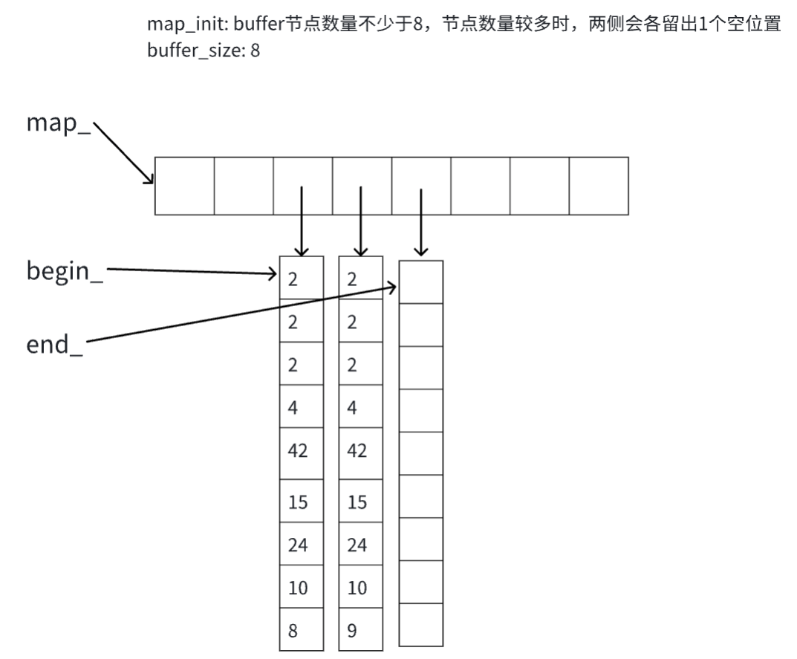

## deque

deque由多段连续缓冲区构成，缓冲区之间不连续。因此它的迭代器需要维护其整体连续的假象，即能够知道自己是否处于某个缓冲区的末尾，并且往后移动时能够跳转到下一个缓冲区的头部

## deque视图



## iterator视图


## struct deque_iterator

```C++
struct deque_iterator : public iterator<random_access_iterator_tag, T> {
       
    // 要注意const_iterator和const iterator
    typedef deque_iterator<T, T &, T *> iterator;
    typedef deque_iterator<T, const T &, const T *> const_iterator;
    
    typedef T *value_pointer;
    typedef T **map_pointer;

    value_pointer cur;      // 指向目前缓冲区的当前元素
    value_pointer first;    // 指向目前缓冲区头部
    value_pointer last;     // 指向目前缓冲区尾部
    map_pointer node;       // 指向map中的某个缓冲区
    
    
    deque_iterator() noexcept
        : cur(nullptr), first(nullptr), last(nullptr), node(nullptr) {}

    deque_iterator(value_pointer v, map_pointer n)
            : cur(v), first(*n), last(*n + buffer_size), node(n) {}
    
    // 拷贝构造
    // 直接把指针拷贝一份，迭代器只起到定位的作用，不回去释放内存
    explicit deque_iterator(const iterator &rhs)
            : cur(rhs.cur), first(rhs.first), last(rhs.last), node(rhs.node) {}
    
    // 移动构造
    explicit deque_iterator(iterator &&rhs) noexcept
            : cur(rhs.cur), first(rhs.first), last(rhs.last), node(rhs.node) {
        rhs.cur = rhs.first = rhs.last = rhs.node = nullptr;
    }

    // 迭代器解引用就是某个元素
    reference operator*() const { return *cur; }
    
    // 如果一个类重载了指针运算符 obj->m等价于(obj.operator->())->m
    pointer operator->() const { return cur; }
    
    typedef deque_iterator self;
    // 迭代器只能通过重载的++,--,+=,-=进行移动。迭代器在不同缓冲区之间移动
    // 通过迭代器使得deque底层对用户透明，用户无法感知到底层的多个缓冲区。
    self &operator++() {
        ++cur;
        if (cur == last) {
            set_node(node + 1);
            cur = first;
        }
        return *this;
    }

    self operator++(int) {
        self tmp = *this;
        ++(*this);
        return tmp;
    }
    
    // 定义+=之后，+,-,-=都可以基于它实现
    self &operator+=(difference_type n) {
        // n可能为负数 假设buffer_size为16
        // 注意：offset=[0,15]定位到当前缓冲区 offset=[-16,-1]定位到上一个缓冲区
        const auto offset = n + (cur - first);
        if (offset >= 0 && offset < static_cast<difference_type>(buffer_size)) {
            cur = first + offset;
        } else {
            const auto step = offset > 0 ?
                              offset / static_cast<difference_type>(buffer_size)
                                         : -static_cast<difference_type>((-offset - 1) / buffer_size) - 1;
            set_node(node + step);
            cur = first + (offset - step * static_cast<difference_type>(buffer_size));
        }
        return *this;
    }
    
    self operator+(difference_type n) {
        self tmp = *this;
        return tmp += n;
    }
    
    self &operator-=(difference_type n) {
        return (*this) += (-n);
    }
    
    reference operator[](difference_type n) const {
        // 返回基于当前位置移动n步后cur指向的元素的引用
        return *(*this + n);
    }
}
```

## const iterator和const_iterator

```C++
typedef deque_iterator<T, T &, T *> iterator;
typedef deque_iterator<T, const T &, const T *> const_iterator;


const iterator it1 = {...}    // it1中的指针不能改变，但是指针指向的内容可以改变
const_iterator cit = {...}    // cit中的指针可以改变，但是指针指向的内容是常量
```

## class deque

```C++
template<class T>
class deque {
public:
    // 引入allocator allocator内部是静态方法
    typedef stl::allocator<T> allocator_type;
    typedef stl::allocator<T> data_allocator;   // 返回T *
    typedef stl::allocator<T *> map_allocator;  // 返回T **
    
    typedef pointer *map_pointer;
    typedef deque_iterator<T, T &, T *> iterator;
    typedef deque_iterator<T, const T &, const T *> const_iterator;
    
private:
    /// 通过以下四个变量来构造一个deque 参考deque视图
    iterator begin_;        // 指向第一个节点
    iterator end_;          // 指向最后一个节点的下一个节点
    map_pointer map_;       /* T** 指向一组连续的数据块，每个数据块类型为T*
                             每个数据块指向一个长为buffer_size的缓冲区 */
    size_type map_size_;    // 数据块的个数
    
public:
    
    // 返回一些迭代器
    iterator begin() noexcept { return begin_; }
    
    const_iterator begin() const noexcept { return begin_; }
    
    const_iterator cbegin() const noexcept { return begin_; }
    
    const_iterator cend() const noexcept { return end_; }
}
```

## 接口剖析/如何抽象的？

构造函数

```C++
// 通过填充n个元素来初始化deque 抽象得到函数fill_init()
deque() {
    fill_init(0, value_type{});
}

explicit deque(size_type n) {
    fill_init(n, value_type{});
}

deque(size_type n, const value_type &value) {
    fill_init(n, value);
}

// 通过迭代器/初始化列表来初始化deque 抽象得到函数copy_init()
template<class IIter, typename std::enable_if<
        stl::is_input_iterator<IIter>::value, int>::type = 0>
deque(IIter first, IIter last) {
    // TODO:测试，使用vector/数组来创建deque
    copy_init(first, last, stl::iterator_category(first));
}

deque(std::initializer_list<value_type> init_list) {
    copy_init(init_list.begin(), init_list.end(), stl::forward_iterator_tag());
}

deque(const deque &rhs) {
    copy_init(rhs.begin(), rhs.end(), stl::forward_iterator_tag());
}

bool empty() const noexcept { return begin_ == end_; }

size_type size() const noexcept { return end_ - begin_; }

size_type max_size() const noexcept { return static_cast<size_type>(-1); }

// 注意这些函数返回的都是引用
reference operator[](size_type n) {
    STL_DEBUG(n < size());
    return begin_[n];
}
reference front() {
    STL_DEBUG(!empty());
    return *begin();
}

// 给const类型的变量使用
const_reference operator[](size_type n) const {
    STL_DEBUG(n < size());
    return begin_[n];
}
const_reference front() const {
    STL_DEBUG(!empty());
    return *begin();
}

// resize缩放容器的大小
void resize(size_type new_size) { return resize(new_size, value_type{}); }
// 如果是变小则 erase 一部分元素，否则 insert 一部分元素
void resize(size_type new_size, const value_type &value);

// 将不在begin_和end_之间的缓冲区释放掉
void shrink_to_fit() noexcept;

// 从begin_开始填充n个元素 如果n<size则删除尾部的元素 否则在尾部再插入一些元素
// 底层调用fill, erase, insert
void assign(size_type n, const value_type &value) {
    fill_assign(n, value);
}
void assign(std::initializer_list<value_type> init_list) {
    copy_assign(init_list.begin(), init_list.end(), stl::forward_iterator_tag{});
}

// 在头部/尾部/某个位置/ 插入一个元素(移动/复制)
template<class ...Args>
void emplace_front(Args &&...args);

template<class ...Args>
void emplace_back(Args &&...args);

template<class ...Args>
iterator emplace(iterator pos, Args &&...args);

// push_front / push_back
void push_front(const value_type &value);

void push_back(const value_type &value);

// pop_back / pop_front
void pop_front();

void pop_back();

// 在某个位置插入 1个/n个/一段 元素
iterator insert(iterator pos, const value_type &value);

iterator insert(iterator pos, value_type &&value);

void insert(iterator pos, size_type n, const value_type &value);

template<class IIter, typename std::enable_if<stl::is_input_iterator<
        IIter>::value, int>::type = 0>
void insert(iterator pos, IIter first, IIter last) {
    insert_dispatch(pos, first, last, input_iterator_tag{});
}

// 删除某个位置的元素/一段元素
iterator erase(iterator pos);

// 删除[first, last)内的元素
iterator erase(iterator first, iterator last);
```

## 关于emplace和push_back

```C++
template<class T>
template<class ...Args>
typename deque<T>::iterator deque<T>::emplace(iterator pos, Args &&...args) {
    if (pos.cur == begin_.cur) {
        emplace_front(stl::forward<Args>(args)...);
        return begin_;
    } else if (pos.cur == end_.cur) {
        emplace_back(stl::forward<Args>(args)...);
        return end_ - 1;
    }
    return insert_aux(pos, stl::forward<Args>(args)...);
}

template<class T>
template<class ...Args>
void deque<T>::emplace_front(Args &&...args) {
    if (begin_.cur != begin_.first) {
        data_allocator::construct(begin_.cur - 1, stl::forward<Args>(args)...);
        --begin_.cur;
    } else {
        require_capacity(1, true);
        try {
            --begin_;
            data_allocator::construct(begin_.cur, stl::forward<Args>(args)...);
        } catch (...) {
            ++begin_;
            throw;
        }
    }
}
```

`Args` 是一个模板参数包（template parameter pack），它表示一组可变数量的模板参数。在函数模板 `emplace` 的定义中，`Args` 表示一系列参数类型。

注意，emplace函数中有这样的结构：

```C++
template<class ...Args>
typename deque<T>::iterator deque<T>::emplace(... , Args &&...args) {
}
```

所以，args是一个万能引用的模板参数包。

模板参数包：我们可以直接传递类型T的构造函数的参数，而不是：先创建`T`的临时对象，在通过insert或push_front插入进去。

举个例子：

```C++
class Person {
public:
    Person(const std::string& name, int age) : name_(name), age_(age) {
        std::cout << "Constructing Person: " << name_ << std::endl;
    }
    
    ~Person() {
        std::cout << "Destructing Person: " << name_ << std::endl;
    }
    
    void PrintInfo() const {
        std::cout << "Name: " << name_ << ", Age: " << age_ << std::endl;
    }
    
private:
    std::string name_;
    int age_;
};

int main() {
    std::deque<Person> myDeque;
    
    myDeque.emplace_back("Alice", 25);
    myDeque.emplace(myDeque.begin(), "Bob", 30);
    
    std::cout << "Deque Contents:" << std::endl;
    for (const Person& person : myDeque) {
        person.PrintInfo();
    }
    
    return 0;
}
```

## 工程实践

### 什么时候用move/forward

```C++
template<class T>
template<class ...Args>
typename deque<T>::iterator deque<T>::emplace(iterator pos, Args &&...args) {
    if (pos.cur == begin_.cur) {
        emplace_front(stl::forward<Args>(args)...);
        return begin_;
    } else if (pos.cur == end_.cur) {
        emplace_back(stl::forward<Args>(args)...);
        return end_ - 1;
    }
    return insert_aux(pos, stl::forward<Args>(args)...);
}
```

首先，明确move和forward的行为差异：move会把传入的参数转化为右值引用；而forward传入左值，得到的还是左值，传入右值，得到的还是右值。

由于args是一个万能引用的模板参数包，所以args中的每一个元素可能是右值，也可能是左值。因此对于这些参数，我们不应该改变他们的类型，并把他们传递给下一个函数，因此这里需要使用forward

### 关于try catch/指针和迭代器的区别

```C++
template<class T>
void deque<T>::push_front(const value_type &value) {
    if (begin_.cur != begin_.first) {
        /// 此处对已存在的内存空间来构造对象，这种情况下如果抛出异常，不需要回滚begin_
        /// 因为传入的是临时变量，所以就不需要catch了，默认会往上抛出
        data_allocator::construct(begin_.cur - 1, value);
        --begin_;
    } else {
        // 此分支需要在头部加入一个缓冲区
        require_capacity(1, true);
        try {
            // 此处不能使用begin_.cur--，因为只有迭代器才可以移动到上一个缓冲区的尾部，指针无法做到
            // 所以这里需要使用try catch回滚，而上面的if分支不需要
            --begin_;
            /// 此处如果构造失败，需要回滚begin_，因此需要先catch，回滚，然后再抛出
            data_allocator::construct(begin_.cur, value);
        } catch (...) {
            ++begin_;
            throw;
        }
    }
}

template<class T>
void deque<T>::push_back(const value_type &value) {
    if (end_.cur != end_.last - 1) {
        data_allocator::construct(end_.cur, value);
        ++end_.cur;
    } else {
        require_capacity(1, false);
        data_allocator::construct(end_.cur, value);
        /// 此处不可以为++end_.cur，因为要往下一个缓冲区走，迭代器可以完成这一操作，
        /// 仅仅是指针自增不可以
        ++end_;
    }
}
```