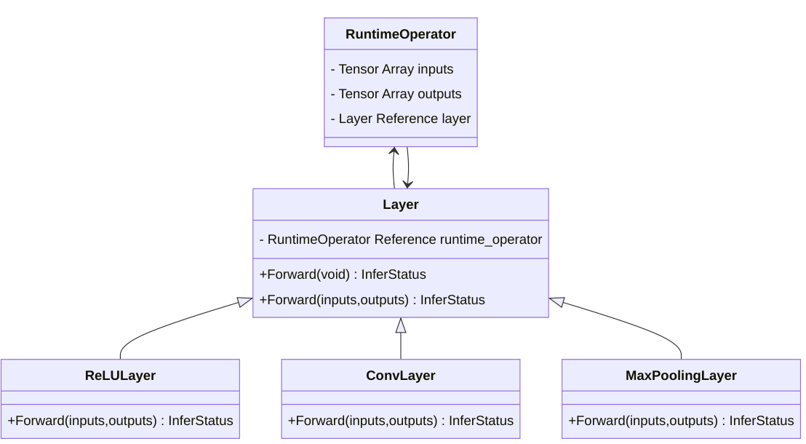
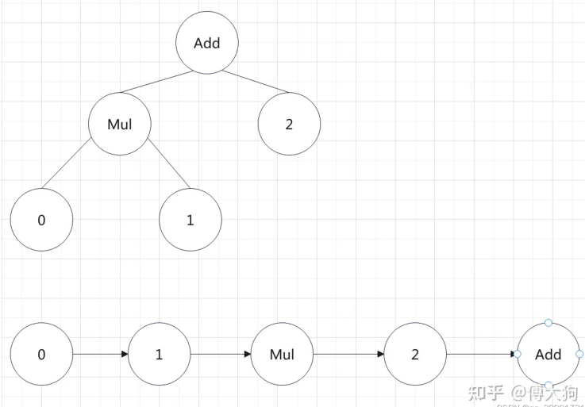

# Layer

## Layer基类

通过访问RuntimeOperator的输⼊数(input_operand)，layer可以获取计算所需的输⼊张量数据，并根据layer各派⽣类别中定义的计算函数(forward)对输⼊张量数据进⾏计算。

```c++
class Layer {
 public:
  explicit Layer(std::string layer_name) : layer_name_(std::move(layer_name)) {}
	
  //------ 在有虚函数的情况下 基类设置虚析构函数
  virtual ~Layer() = default;

  /**
   * Layer的执行函数
   * @param inputs 层的输入
   * @param outputs 层的输出
   * @return 执行的状态
   */
  virtual InferStatus Forward(
      const std::vector<std::shared_ptr<Tensor<float>>>& inputs,
      std::vector<std::shared_ptr<Tensor<float>>>& outputs);

  /**
   * Layer的执行函数
   * @param current_operator 当前的operator
   * @return 执行的状态
   */
  virtual InferStatus Forward();

  // 返回层的权重
  virtual const std::vector<std::shared_ptr<Tensor<float>>>& weights() const;
  // 返回层的偏移量
  virtual const std::vector<std::shared_ptr<Tensor<float>>>& bias() const;
  // 设置Layer的权重
  virtual void set_weights(
      const std::vector<std::shared_ptr<Tensor<float>>>& weights);
  // 设置Layer的偏移量
  virtual void set_bias(
      const std::vector<std::shared_ptr<Tensor<float>>>& bias);
  virtual void set_weights(const std::vector<float>& weights);
  virtual void set_bias(const std::vector<float>& bias);

  // 返回层的名称
  virtual const std::string& layer_name() const { return this->layer_name_; }


  // 设置层的执行算子
  void set_runtime_operator(
      const std::shared_ptr<RuntimeOperator>& runtime_operator);

 protected:
  //------- 使用weak_ptr防止循环引用
  std::weak_ptr<RuntimeOperator> runtime_operator_;
  std::string layer_name_;  /// Layer的名称
};
```

Layer和其他类的关系如下：



RuntimeOperator与该节点对应的 Layer之间是双向关联关系。

Layer中，无参Forward函数负责从计算节点RuntimeOperator中获取相关的输⼊数和输出数，然后调用子类实现的有参Forward函数进行计算。

```c++
InferStatus Layer::Forward() {
  LOG_IF(FATAL, this->runtime_operator_.expired())
      << "Runtime operator is expired or nullptr";
  // 通过lock获得shared_ptr
  const auto& runtime_operator = this->runtime_operator_.lock();
  // 准备节点layer计算所需要的输入
  const std::vector<std::shared_ptr<RuntimeOperand>>& input_operand_datas =
      runtime_operator->input_operands_seq;
  // layer的输入
  std::vector<std::shared_ptr<Tensor<float>>> layer_input_datas;
  for (const auto& input_operand_data : input_operand_datas) {
    for (const auto& input_data : input_operand_data->datas) {
      layer_input_datas.push_back(input_data);
    }
  }

  const std::shared_ptr<RuntimeOperand>& output_operand_datas =
      runtime_operator->output_operands;

  CHECK(!layer_input_datas.empty())
      << runtime_operator->name << " Layer input data is empty";
  CHECK(output_operand_datas != nullptr && !output_operand_datas->datas.empty())
      << "Layer output data is empty";
  // 执行operator当中的layer计算过程
  // layer的计算结果存放在current_op->output_operands->datas中
  InferStatus status = runtime_operator->layer->Forward(
      layer_input_datas, output_operand_datas->datas);
  return status;
}
```

## LayerRegisterer

全局算子注册器`LayerRegisterer`保存一份全局的注册表，注册表通过单例模式保证整个程序只有一个。注册表key是算子类型，value是算子的初始化过程（函数）。

以下是此类提供的（静态函数）接口：

```c++
class LayerRegisterer {
 public:
  typedef ParseParameterAttrStatus (*Creator)(
      const std::shared_ptr<RuntimeOperator> &op,
      std::shared_ptr<Layer> &layer);

  typedef std::map<std::string, Creator> CreateRegistry;
 public:

  // 向注册表注册算子 即插入一对key/value，算子类型和算子的初始化过程
  static void RegistCreator(const std::string &layer_type,
                              const Creator &creator);

  // 根据算子参数op的类型去注册表中找到初始化过程，来初始化Layer 即得到一个实例化后的Layer
  static std::shared_ptr<Layer> CreateLayer(
      const std::shared_ptr<RuntimeOperator> &op);

  // 返回算子的注册表 静态局部变量，保证唯一，线程安全
  static CreateRegistry &Registry();

  // 返回所有已被注册算子的类型
  static std::vector<std::string> layer_types();
};
```

最后对注册过程进行封装，得到

```c++
class LayerRegistererWrapper {
 public:
  LayerRegistererWrapper(const std::string &layer_type,
                         const LayerRegisterer::Creator &creator) {
    LayerRegisterer::RegisterCreator(layer_type, creator);
  }
};
```

## NonParamLayer

```c++
using NonParamLayer = Layer;
```

## ParamLayer

保存Layer中的权重/偏移量信息

```C++
class ParamLayer : public Layer {
 public:
 	// ....
 protected:
  std::vector<std::shared_ptr<Tensor<float>>> weights_;
  std::vector<std::shared_ptr<Tensor<float>>> bias_;
};

```

## MaxPoolingLayer

最大池化算子

```c++
class MaxPoolingLayer : public NonParamLayer {
 public:
  explicit MaxPoolingLayer(uint32_t padding_h, uint32_t padding_w,
                           uint32_t pooling_size_h, uint32_t pooling_size_w,
                           uint32_t stride_h, uint32_t stride_w);

  InferStatus Forward(
      const std::vector<std::shared_ptr<Tensor<float>>>& inputs,
      std::vector<std::shared_ptr<Tensor<float>>>& outputs) override;

  // 判断op中参数是否合法，合法的话使用这些参数创建一个实例
  static ParseParameterAttrStatus GetInstance(
      const std::shared_ptr<RuntimeOperator>& op,
      std::shared_ptr<Layer>& max_layer);

 private:
  uint32_t padding_h_ = 0;
  uint32_t padding_w_ = 0;
  uint32_t pooling_size_h_ = 0;
  uint32_t pooling_size_w_ = 0;
  uint32_t stride_h_ = 1;
  uint32_t stride_w_ = 1;
};
```

## ConvolutionLayer

```c++
class ConvolutionLayer : public ParamLayer {
 public:
  explicit ConvolutionLayer(uint32_t output_channel, uint32_t in_channel,
                            uint32_t kernel_h, uint32_t kernel_w,
                            uint32_t padding_h, uint32_t padding_w,
                            uint32_t stride_h, uint32_t stride_w,
                            uint32_t groups, bool use_bias = true);

  static ParseParameterAttrStatus GetInstance(
      const std::shared_ptr<RuntimeOperator>& op,
      std::shared_ptr<Layer>& conv_layer);

  InferStatus Forward(
      const std::vector<std::shared_ptr<Tensor<float>>>& inputs,
      std::vector<std::shared_ptr<Tensor<float>>>& outputs) override;

  // 初始化kernel的im2col排布
  void InitIm2ColWeight();

 private:
  // GEMM矩阵乘法
  void ConvGemmBias(const arma::fmat& input_matrix, sftensor output_tensor,
                    uint32_t group, uint32_t kernel_index,
                    uint32_t kernel_count_group, const arma::frowvec& kernel,
                    uint32_t output_w, uint32_t output_h) const;
   
  // 将一个batch的input展开为矩阵
  arma::fmat Im2Col(sftensor input, uint32_t kernel_w, uint32_t kernel_h,
                    uint32_t input_w, uint32_t input_h, uint32_t input_c_group,
                    uint32_t group, uint32_t row_len, uint32_t col_len) const;

 private:
  bool use_bias_ = false;
  uint32_t groups_ = 1;
  uint32_t padding_h_ = 0;
  uint32_t padding_w_ = 0;
  uint32_t stride_h_ = 1;
  uint32_t stride_w_ = 1;
  std::vector<arma::frowvec> kernel_matrix_arr_;
};
```


# 表达式

## 词token

```c++
struct Token {
  TokenType token_type = TokenType::TokenUnknown;
  // [start_pos, end_pos)
  int32_t start_pos = 0;  // 词语开始的位置
  int32_t end_pos = 0;    // 词语结束的位置
  Token(TokenType token_type, int32_t start_pos, int32_t end_pos)
      : token_type(token_type), start_pos(start_pos), end_pos(end_pos) {}
};
```

## 语法树Node

```c++
// 语法树的节点
struct TokenNode {
  int32_t num_index = -1;
  std::shared_ptr<TokenNode> left = nullptr;   // 语法树的左节点
  std::shared_ptr<TokenNode> right = nullptr;  // 语法树的右节点
  TokenNode(int32_t num_index, std::shared_ptr<TokenNode> left,
            std::shared_ptr<TokenNode> right);
  TokenNode() = default;
};
```

## 语法解析过程

词法分析得到token序列，通过递归下降得到语法树，对语法树后序遍历得到逆波兰表达式（操作数在前，表达式在后）




