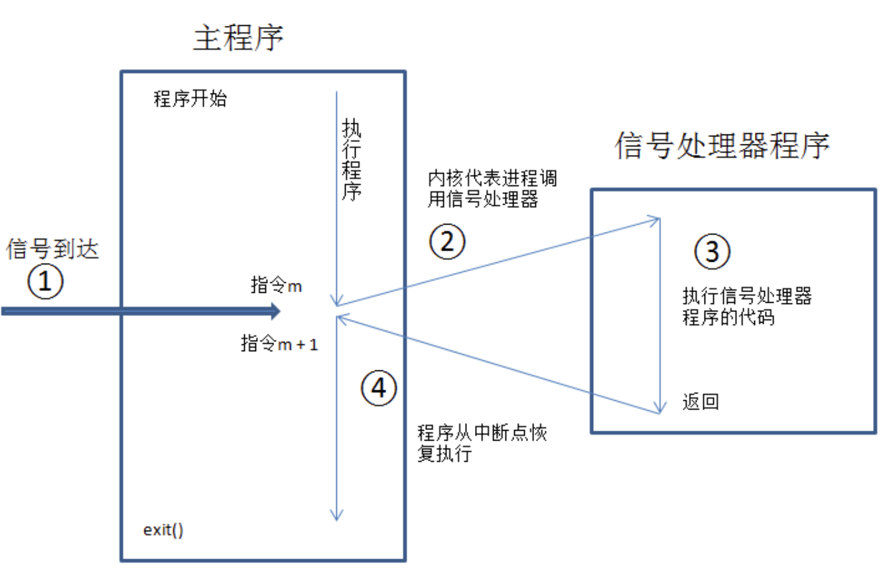

## 信号处理器函数

Unix系统提供了两种方式来改变信号处置：signal() 和 sigaction()。前者可移植性不好，首选后者。

信号处理器程序（也称为信号捕捉器）是当指定信号传递给进程时将会调用的一个函数。

调用信号处理器程序，可能会随时打断主程序流程。内核代表进程来调用处理器程序，当处理器返回时，主程序会在处理器打断的位置恢复执行。



sigaction()	

```c
#include <signal.h>
int sigaction(int sig, const struct sigaction* act, struct sigaction* oldact);
// Returns 0 on success, or -1 on error
```

