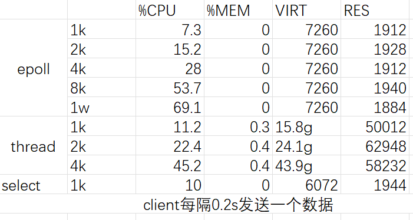

# 基本代码

参考代码：https://github.com/dongchao-cn/socket-server.git

# 阻塞IO


## 代码

```c
// base_server.cpp
/*
    C++ ECHO socket server
*/
#include <cstdio>
#include <cstdlib>
#include <cstring>
#include <unistd.h>
#include "base.h"
using namespace std;

extern const int BUF_SIZE;
extern const char SERVER_IP[];
extern const int SERVER_PORT;
extern const int BACKLOG;

int main(int argc, char *argv[])
{
    // create socket
    int listen_sock = get_listen_socket();
    
    // set reuse
    set_reuse_addr(listen_sock);

    // bind
    listen_socket_bind(listen_sock);
    
    // listen
    listen_socket_listen(listen_sock);

    // start success
    print_start();

    while (1)
    {
        //accept connection from an incoming client
        int client_sock = accept_socket(listen_sock);
        if (client_sock == -1)
        {
            perror("accept failed");
            continue;
        }

        print_conn(client_sock);
        
        //Receive a message from client
        int read_size;
        char message[BUF_SIZE];
        while( (read_size = recv(client_sock, message, BUF_SIZE, 0)) > 0 )
        {
            print_recv(client_sock, message);
            //Send the message back to client
            send(client_sock, message, strlen(message)+1, 0);
            print_send(client_sock, message);
        }
        print_dconn(client_sock);
        close(client_sock);
    }
}
```

## 遇到的问题

base_server.cpp是最基本的服务器代码，接受一个客户端连接之后就会阻塞，无法再接收其他客户端连接。启动之后，命令行没有反应，什么也不输出，

```bash
root@node1:/home/io_model/build# ./base_server 

```

并且在使用client发起连接之后，也没有抓到数据包

```bash
root@node1:/home# tcpdump -nt -i eth0 port 54321

```

通过strace发现程序执行正常

```bash
root@node1:/home/io_model/build# strace ./base_server 
....
brk(NULL)                               = 0x55a312261000
brk(0x55a312282000)                     = 0x55a312282000
socket(AF_INET, SOCK_STREAM, IPPROTO_IP) = 3
setsockopt(3, SOL_SOCKET, SO_REUSEADDR, [0], 4) = 0
bind(3, {sa_family=AF_INET, sin_port=htons(54321), sin_addr=inet_addr("127.0.0.1")}, 16) = 0
listen(3, 3)                            = 0
accept(3, 
```

在另一个bash中启动client来连接，也运行正常

```bash
root@node1:/home/io_model/build# strace ./base_server 
.....
bind(3, {sa_family=AF_INET, sin_port=htons(54321), sin_addr=inet_addr("127.0.0.1")}, 16) = 0
listen(3, 3)                            = 0
accept(3, {sa_family=AF_INET, sin_port=htons(56362), sin_addr=inet_addr("127.0.0.1")}, [16]) = 4
recvfrom(4, "0\0", 1024, 0, NULL, NULL) = 2
sendto(4, "0\0", 2, 0, NULL, 0)         = 2
recvfrom(4, "1\0", 1024, 0, NULL, NULL) = 2
```

所以推断程序的输出应该是被重定向了。

最后发现，printf被替换掉了，base.h中这个宏。

```c++
#ifdef DEBUG
#define print(fmt, arg...) printf(fmt, ##arg)
#else
#define print(fmt, arg...)
#endif
```

而端口捕捉不到数据包，是因为-i eth0指定在网卡`eth0`。`eth0` 是 Linux 系统中网络接口的命名约定。

在 Linux 中,网络接口通常按照以下规则命名:

- `eth0`: 第一块有线以太网网卡
- `eth1`: 第二块有线以太网网卡
- `wlan0`: 第一块无线网卡
- `lo`: 本地回环接口

`eth0` 通常是系统默认的主网络接口,也是最常用的网络接口。

所以，将命令换为

```bash
root@node1:/home# tcpdump -nt -i lo port 54321
```

注意当时使用gdb调试没有任何信息，后来编译时采用-DCMAKE_BUILD_TYPE=Debug，才有了每步的代码

```bash
(gdb) b main
Breakpoint 1 at 0x13a5: file /home/io_model/base_server.cpp, line 17.
(gdb) r
Starting program: /home/io_model/build/base_server 
[Thread debugging using libthread_db enabled]
Using host libthread_db library "/lib/x86_64-linux-gnu/libthread_db.so.1".

Breakpoint 1, main (argc=1, argv=0x7fffffffe4d8) at /home/io_model/base_server.cpp:17
17      {
(gdb) n
19          int listen_sock = get_listen_socket();
(gdb) n
22          set_reuse_addr(listen_sock);
(gdb) n
25          listen_socket_bind(listen_sock);
(gdb) n
28          listen_socket_listen(listen_sock);
(gdb) n
31          print_start();
(gdb) n
Server started success, listen at 127.0.0.1:54321
57          }
```

## 实践

抓包，查看一个来回流量的详情。

```bash
root@node1:/home/io_model/build# ./base_server 
Server started success, listen at 127.0.0.1:54321
[Conn 4] 127.0.0.1:40884
[Recv 4] 127.0.0.1:40884 0
[Send 4] 127.0.0.1:40884 0

root@node1:/home/io_model/build# ./client 
[Send]: 0
[Recv]: 0

root@node1:/home/io_model# tcpdump -nt -i lo port 54321
tcpdump: verbose output suppressed, use -v[v]... for full protocol decode
listening on lo, link-type EN10MB (Ethernet), snapshot length 262144 bytes
# 三次握手
IP 127.0.0.1.40884 > 127.0.0.1.54321: Flags [S], seq 3621503311, win 65495, options [mss 65495,sackOK,TS val 3446912936 ecr 0,nop,wscale 7], length 0
IP 127.0.0.1.54321 > 127.0.0.1.40884: Flags [S.], seq 1604453205, ack 3621503312, win 65483, options [mss 65495,sackOK,TS val 3446912936 ecr 3446912936,nop,wscale 7], length 0
IP 127.0.0.1.40884 > 127.0.0.1.54321: Flags [.], ack 1, win 512, options [nop,nop,TS val 3446912936 ecr 3446912936], length 0

# C->S '0' '\0'
IP 127.0.0.1.40884 > 127.0.0.1.54321: Flags [P.], seq 1:3, ack 1, win 512, options [nop,nop,TS val 3446912936 ecr 3446912936], length 2
IP 127.0.0.1.54321 > 127.0.0.1.40884: Flags [.], ack 3, win 512, options [nop,nop,TS val 3446912936 ecr 3446912936], length 0

# S->C '0' '\0'
IP 127.0.0.1.54321 > 127.0.0.1.40884: Flags [P.], seq 1:3, ack 3, win 512, options [nop,nop,TS val 3446912936 ecr 3446912936], length 2
IP 127.0.0.1.40884 > 127.0.0.1.54321: Flags [.], ack 3, win 512, options [nop,nop,TS val 3446912936 ecr 3446912936], length 0
```

在另外一个窗口再开启一个client

```bash
root@node1:/home/io_model/build# ./client 
[Send]: 0


# 服务器没有任何额外输出
root@node1:/home/io_model/build# ./base_server 
Server started success, listen at 127.0.0.1:54321
[Conn 4] 127.0.0.1:40884
[Recv 4] 127.0.0.1:40884 0
[Send 4] 127.0.0.1:40884 0


root@node1:/home/io_model# tcpdump -nt -i lo port 54321
.....
# 比上面多了以下内容
# 由于listen时设置的监听队列长度为3，所以这个TCP连接顺利建立
# 但是由于服务端在处理第一个client连接，所以无法回复数据。
IP 127.0.0.1.36580 > 127.0.0.1.54321: Flags [S], seq 453397020, win 65495, options [mss 65495,sackOK,TS val 3447540625 ecr 0,nop,wscale 7], length 0
IP 127.0.0.1.54321 > 127.0.0.1.36580: Flags [S.], seq 2365367553, ack 453397021, win 65483, options [mss 65495,sackOK,TS val 3447540625 ecr 3447540625,nop,wscale 7], length 0
IP 127.0.0.1.36580 > 127.0.0.1.54321: Flags [.], ack 1, win 512, options [nop,nop,TS val 3447540625 ecr 3447540625], length 0
# C->S '0' '\0'
IP 127.0.0.1.36580 > 127.0.0.1.54321: Flags [P.], seq 1:3, ack 1, win 512, options [nop,nop,TS val 3447540625 ecr 3447540625], length 2
# Server回复ack，此时缓冲区已经有数据了，但是无法调用read来读取
IP 127.0.0.1.54321 > 127.0.0.1.36580: Flags [.], ack 3, win 512, options [nop,nop,TS val 3447540625 ecr 3447540625], length 0

```

在杀掉服务端进程之后，

```bash
root@node1:/home/io_model/build# ./client 
[Send]: 0
recv failed: Connection reset by peer
```

如果不开启服务端进程，直接使用client程序来发起连接

```bash
# 会回复RST报文
root@node1:/home/io_model# tcpdump -nt -i lo port 54321
tcpdump: verbose output suppressed, use -v[v]... for full protocol decode
listening on lo, link-type EN10MB (Ethernet), snapshot length 262144 bytes
IP 127.0.0.1.35122 > 127.0.0.1.54321: Flags [S], seq 3049172657, win 65495, options [mss 65495,sackOK,TS val 3456108746 ecr 0,nop,wscale 7], length 0
IP 127.0.0.1.54321 > 127.0.0.1.35122: Flags [R.], seq 0, ack 3049172658, win 0, length 0

root@node1:/home/io_model/build# ./client 
connect failed: Connection refused
```

# 阻塞IO 多线程

## 代码


## 实践

可以发起多个连接

```bash
root@node1:/home/io_model/build# ./thread_server 
Server started success, listen at 127.0.0.1:54321
[Conn 4] 127.0.0.1:36268
now_client_num: 1
[Recv 4] 127.0.0.1:36268 0
[Send 4] 127.0.0.1:36268 0
[Conn 5] 127.0.0.1:55676
now_client_num: 2
[Recv 5] 127.0.0.1:55676 0
[Send 5] 127.0.0.1:55676 0

root@node1:/home/io_model/build# ./client 
[Send]: 0
[Recv]: 0

root@node1:/home/io_model/build# ./client 
[Send]: 0
[Recv]: 0


root@node1:/home/io_model# tcpdump -nt -i lo port 54321
tcpdump: verbose output suppressed, use -v[v]... for full protocol decode
listening on lo, link-type EN10MB (Ethernet), snapshot length 262144 bytes
# 连接1
IP 127.0.0.1.36268 > 127.0.0.1.54321: Flags [S], seq 1841463054, win 65495, options [mss 65495,sackOK,TS val 3457283087 ecr 0,nop,wscale 7], length 0
IP 127.0.0.1.54321 > 127.0.0.1.36268: Flags [S.], seq 2589961193, ack 1841463055, win 65483, options [mss 65495,sackOK,TS val 3457283087 ecr 3457283087,nop,wscale 7], length 0
IP 127.0.0.1.36268 > 127.0.0.1.54321: Flags [.], ack 1, win 512, options [nop,nop,TS val 3457283087 ecr 3457283087], length 0
IP 127.0.0.1.36268 > 127.0.0.1.54321: Flags [P.], seq 1:3, ack 1, win 512, options [nop,nop,TS val 3457283087 ecr 3457283087], length 2
IP 127.0.0.1.54321 > 127.0.0.1.36268: Flags [.], ack 3, win 512, options [nop,nop,TS val 3457283087 ecr 3457283087], length 0
IP 127.0.0.1.54321 > 127.0.0.1.36268: Flags [P.], seq 1:3, ack 3, win 512, options [nop,nop,TS val 3457283087 ecr 3457283087], length 2
IP 127.0.0.1.36268 > 127.0.0.1.54321: Flags [.], ack 3, win 512, options [nop,nop,TS val 3457283087 ecr 3457283087], length 0

# 连接2
IP 127.0.0.1.55676 > 127.0.0.1.54321: Flags [S], seq 2581729745, win 65495, options [mss 65495,sackOK,TS val 3457300665 ecr 0,nop,wscale 7], length 0
IP 127.0.0.1.54321 > 127.0.0.1.55676: Flags [S.], seq 3069008247, ack 2581729746, win 65483, options [mss 65495,sackOK,TS val 3457300665 ecr 3457300665,nop,wscale 7], length 0
IP 127.0.0.1.55676 > 127.0.0.1.54321: Flags [.], ack 1, win 512, options [nop,nop,TS val 3457300665 ecr 3457300665], length 0
IP 127.0.0.1.55676 > 127.0.0.1.54321: Flags [P.], seq 1:3, ack 1, win 512, options [nop,nop,TS val 3457300666 ecr 3457300665], length 2
IP 127.0.0.1.54321 > 127.0.0.1.55676: Flags [.], ack 3, win 512, options [nop,nop,TS val 3457300666 ecr 3457300666], length 0
IP 127.0.0.1.54321 > 127.0.0.1.55676: Flags [P.], seq 1:3, ack 3, win 512, options [nop,nop,TS val 3457300666 ecr 3457300666], length 2
IP 127.0.0.1.55676 > 127.0.0.1.54321: Flags [.], ack 3, win 512, options [nop,nop,TS val 3457300666 ecr 3457300666], length 0
```

查看后台进程

```bash
root@node1:/home# ps aux | grep ./client
root     14670 99.6  0.0   2776   980 pts/3    R+   06:16   2:51 ./client
root     14913 99.2  0.0   2776   988 pts/4    R+   06:16   2:33 ./client


root@node1:/home/io_model# ps aux | grep ./thread_server
root     37037  0.0  0.0 153520  1932 pts/2    Sl+  06:51   0:00 ./thread_server

# USER    PID  %CPU  %MEM   VSZ   RSS T TY    STAT   START   TIME COMMAND
```

STAT进程的状态代码

- `R`: 正在运行
- `S`: 睡眠状态
- `D`: 不可中断的睡眠状态
- `T`: 已停止
- `Z`: 僵尸进程
- +：表示进程属于前台进程组。前台进程组中的进程可以接收用户的输入。
- l：表示进程是一个多线程进程。

如果先把服务器程序杀掉，则再次启动时，会出现以下情况：

```bash
[Send 4] 127.0.0.1:46844 13
[Recv 10] 127.0.0.1:46884 13
[Send 10] 127.0.0.1:46884 13
^C
root@node1:/home/io_model/build# ./thread_server 
listen_socket_bind error: Address already in use


# 查看端口状态 此时处于TIME_WAIT
root@node1:/home/io_model/build# netstat
Active Internet connections (w/o servers)
Proto Recv-Q Send-Q Local Address           Foreign Address         State      
tcp        0      0 localhost:50100         localhost:54321         TIME_WAIT  
tcp        0      0 localhost:54321         localhost:41692         TIME_WAIT  
tcp        0      0 localhost:50106         localhost:54321         TIME_WAIT  
tcp        0      0 localhost:54321         localhost:41720         TIME_WAIT  
tcp        0      0 localhost:54321         localhost:41710         TIME_WAIT  
tcp        0      0 localhost:41677         localhost:42636         ESTABLISHED
tcp        0      0 localhost:50126         localhost:54321         TIME_WAIT  
tcp        0      0 localhost:42636         localhost:41677         ESTABLISHED
tcp        0      0 localhost:50090         localhost:54321         TIME_WAIT  
tcp        0      0 localhost:54321         localhost:41674         TIME_WAIT  
tcp        0      0 localhost:50132         localhost:54321         TIME_WAIT  
tcp        0      0 localhost:50112         localhost:54321         TIME_WAIT  
tcp        0      0 localhost:50074         localhost:54321         TIME_WAIT  
tcp        0      0 localhost:42644         localhost:41677         ESTABLISHED
tcp        0      0 localhost:54321         localhost:41672         TIME_WAIT  
tcp        0      0 localhost:54321         localhost:41694         TIME_WAIT  
tcp        0      0 localhost:54321         localhost:41678         TIME_WAIT  
tcp        0      0 localhost:41677         localhost:42644         ESTABLISHED
tcp        0      0 localhost:54321         localhost:41704         TIME_WAIT  
tcp        0      0 localhost:50096         localhost:54321         TIME_WAIT 
```

出现了TIME_WAIT状态，等待一段时间就可以了。	


# IO多路复用 poll

## 问题

poll_server.cpp中，这段代码有明显的逻辑问题。

```c
void del_client(vector<pollfd>::iterator it)
{
    poll_sets.erase(it);
    print_dconn(it->fd);
    close(it->fd);
    printf("now_client_num: %u\n", (unsigned int)poll_sets.size()-1);
}
```

我在client.cpp的while(1)中加入了以下代码用来测试

```c
if (count == 7) break;
```

 当只有一个客户端发起连接，和服务器交换数据时，并不会出错。

因为在调用erase时，it指向poll_sets的最后一个元素，删除的代码如下：

```c++
template<class T>
    typename vector<T>::iterator vector<T>::erase(vector::const_iterator pos) {
        STL_DEBUG(pos >= begin() && pos < end());
        iterator xpos = begin_ + (pos - begin());
        stl::move(xpos + 1, end_, xpos);
        data_allocator::destroy(end_ - 1);
        --end_;
        return xpos;
    }
```

对于pollfd这种pod数据，destroy并不会做任何事情。因此，vector底层的数组并不会改变。此时的迭代器it是不合法的，但是它指向的内存仍然有效，所以不会报错。

但是如果有两个客户端先后发起连接，就会出错。

```bash
get_client_addr error: Socket operation on non-socket
munmap_chunk(): invalid pointer
Aborted
```


# 测试

## 指标

`top` 命令是一个常用的 Linux 命令行工具,用于实时监视系统进程的活动。它提供了大量有用的信息和指标,下面是各个字段的含义:

1. **PID (Process ID)**：进程的唯一标识符。
2. **USER (Username)**：运行该进程的用户。
3. **PR (Priority)**：进程的调度优先级。数值越小,优先级越高。
4. **NI (Nice)**：进程的 nice 值。用于调整进程的优先级。数值越小,优先级越高。
5. **VIRT (Virtual Memory)**：进程使用的虚拟内存总量,包括代码、数据和栈。
6. **RES (Resident Memory)**：进程使用的物理内存（RSS）大小。
7. **SHR (Shared Memory)**：共享内存大小。
8. **S (Process Status)**：进程状态。例如 `R`(运行)、`S`(睡眠)、`D`(不可中断的睡眠)、`T`(被跟踪或已停止)、`Z`(僵尸进程)。
9. **%CPU**：进程占用 CPU 的百分比。
10. **%MEM**：进程占用物理内存的百分比。
11. **TIME+**：进程总的CPU时间,精确到百分之一秒。
12. **COMMAND**：进程名称(命令行)。

## 测试脚本


## 结果

```bash
95132 root      20   0    6072   1944   1768 S  10.0   0.0   0:11.33 select_server                                                                                                     

42607 root      20   0    7260   1912   1736 S   7.3   0.0   0:02.95 epoll_server           50555 root      20   0    7260   1928   1752 S  15.2   0.0   0:04.68 epoll_server           66060 root      20   0    7260   1912   1736 S  28.0   0.0   0:11.41 epoll_server           95750 root      20   0    7260   1940   1768 S  53.7   0.0   0:20.94 epoll_server           19139 root      20   0    7260   1884   1712 R  69.1   0.0   0:40.15 epoll_server                                                                                                                                                                                                   44366 root      20   0   15.8g  50012   2772 S  11.2   0.3   0:04.27 thread_server         44366 root      20   0   24.1g  62948   2772 S  22.4   0.4   0:11.09 thread_server         44366 root      20   0   43.9g  58232   2836 S  45.2   0.4   0:21.83 thread_server
```



