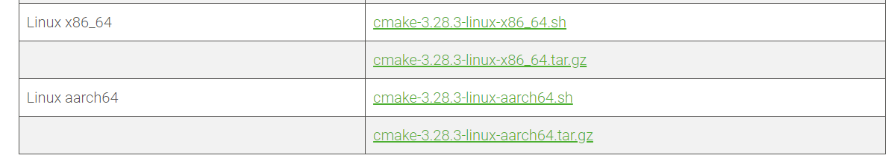

# 安装cmake

linux下直接使用包管理工具安装

```bash
apt update
sudo apt install cmake
```

如果默认安装的版本太低，可以手动去官网下载



下载.sh文件和压缩包都行

.sh运行或者.tar解压之后，得到cmake-3.27.9-linux-x86_64

```bash
cd cmake-3.27.9-linux-x86_64
cd bin
./cmake --version

apt-get remove cmake	# 卸载之前安装的cmake
# 软连接 注意是绝对路径 否则会出错
ln -s /home/cmake-3.27.9-linux-x86_64/bin/cmake /usr/bin/cmake
cd /home
cmake --version	# 验证是否成功
```

# 构建项目

```bash
# CMake 2.x
mkdir build
cd build
cmake .. -DCMAKE_BUILD_TYPE=Release
make -j4
make install
cd ..

# CMake 3.x
cmake -B build -DCMAKE_BUILD_TYPE=Release
cmake --build build --parallel 4
cmake --build build --target install
```


# 常用命令

[使用CMake开发C++工程 | SIRLIS (gitee.io)](https://sirlis.gitee.io/posts/c-cmake-development/#1-引言)

## 版本与编译选项配置

```cmake
# 指定项目名称为 test
project(test)
# 指定 cmake 的最低版本
cmake_minimum_required(VERSION 3.10)
# 设置 cmake 的 C++ 版本为 C++11
set(CMAKE_CXX_STANDARD 11)

set(CMAKE_BUILD_TYPE Release)
```

## 可执行程序配置

```cmake
add_executable(${PROJECT_NAME} function.cpp main.cpp
    function.h include/a.h include/b.h 3rdparty/glm/rotate.h)
```

## 头文件搜索

为了避免繁琐的头文件列写过程，我们可以 `add_executable()` 后，指定其头文件搜索路径

```cmake
# 可以避免在每个源文件中手动指定头文件的完整路径

# 添加 include 目录为头文件搜索路径
target_include_directories(${PROJECT_NAME} PRIVATE include)
# 添加 include/glm 目录为头文件搜索路径
target_include_directories(${PROJECT_NAME} PRIVATE 3rdparty/glm)

```

## 自动导出头文件路径列表

```cmake
add_executable(${PROJECT_NAME} function.cpp main.cpp)
# 从根目录下开始遍历寻找所有头文件，存到 all_h 列表
file(GLOB_RECURSE all_h ./*.h)
foreach(HEADER ${all_h})
# 对于每一个头文件，得到其路径 h_path
get_filename_component(h_path ${HEADER} DIRECTORY)
# 将路径添加到 h_dirs 列表 
list(APPEND h_dirs ${h_path})
endforeach()
# 对 h_dirs 列表去除重复项
list(REMOVE_DUPLICATES h_dirs)
# 将 h_dirs 添加项目 test 的头文件搜索路径
target_include_directories(${PROJECT_NAME} PRIVATE ${h_dirs})
```

## 源文件搜索

```cmake
file(GLOB SOURCES "${PROJECT_SOURCE_DIR}/scr/*.cpp")
add_executable(main ${SOURCES})
```

## 子项目

通过子项目路径下的 `CMakeLists.txt`（path1）文件联合根目录下的 `CMakeLists.txt`（main）进行配置

```cmake
####### CMakeLists.txt (main)
# 添加子项目路径 path1
add_subdirectory(path1)
add_executable(test function.cpp main.cpp function.h ${path1src})

####### CMakeLists.txt (path1)
set(path1src path1/add.cpp path1/add.h)
```

