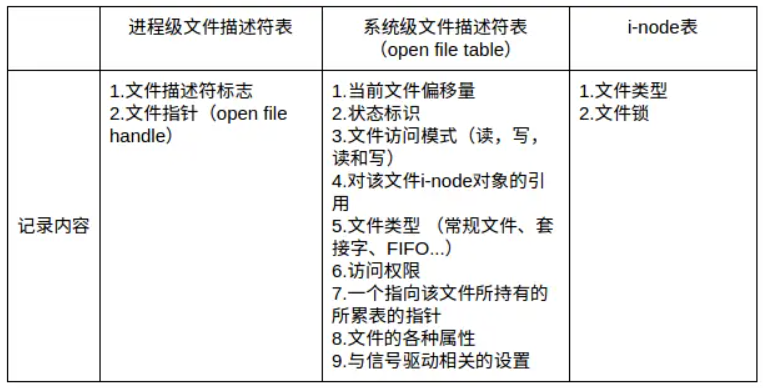
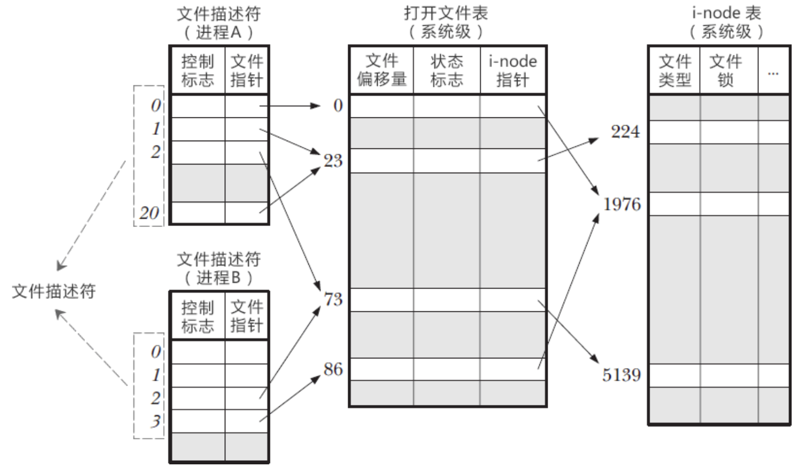
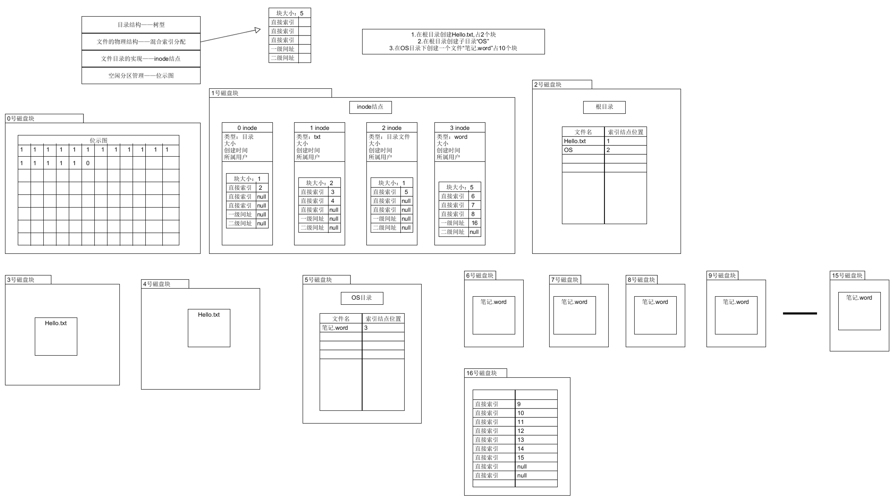

参考链接

[理解inode - 阮一峰的网络日志 (ruanyifeng.com)](https://www.ruanyifeng.com/blog/2011/12/inode.html)

[linux - 文件描述符（File Descriptor）简介 - 落棋不悔 - SegmentFault 思否](https://segmentfault.com/a/1190000009724931)

[转 彻底弄懂 Linux 下的文件描述符（fd） - ljnk - 博客园 (cnblogs.com)](https://www.cnblogs.com/ljnk/articles/18090801)

# 文件描述符

## 简介

文件描述符在形式上是一个非负整数。实际上，它是一个索引值，指向内核为每一个进程所维护的该进程打开文件的记录表。当程序打开一个现有文件或者创建一个新文件时，内核向进程返回一个文件描述符。

所有执行I/O操作的系统调用都通过文件描述符来实现。同时还规定系统刚刚启动的时候，0是标准输入，1是标准输出，2是标准错误。这意味着如果此时去打开一个新的文件，它的文件描述符会是3，再打开一个文件文件描述符就是4。

- 每个文件描述符会与一个打开的文件相对应
- 不同的文件描述符也可能指向同一个文件
- 相同的文件可以被不同的进程打开，也可以在同一个进程被多次打开

## 三个表

一个 Linux 进程启动后，会在内核空间中创建一个 PCB 控制块，PCB 内部有一个文件描述符表（File descriptor table），记录着当前进程所有可用的文件描述符，也即当前进程所有打开的文件。进程级的描述符表的每一条记录了单个进程所使用的文件描述符的相关信息，进程之间相互独立，一个进程使用了文件描述符3，另一个进程也可以用3。

系统为维护文件描述符，建立了三个表

- 进程级的文件描述符表 **保存文件描述符（即当前进程打开的文件）**
- 系统级的文件描述符表 **保存每个打开文件的打开文件句柄**
- 文件系统的i-node表





如上图所示：

- 进程A中，文件描述符1和文件描述符20都指向了同一个打开的文件句柄#23。在进程A中多次打开同一个文件。
- 进程A的文件描述符2和进程B中文件描述符2都指向了同一个打开的文件句柄#73，有几种可能的情况：
  1. A和B可能是父子进程关系
  2. 进程A和进程B打开了同一个文件，且文件描述符相同（低概率事件=_=）
  3. A、B中某个进程通过UNIX域套接字将一个打开的文件描述符传递给另一个进程。
  4. 进程A的描述符0和进程B的描述符3分别指向不同的打开文件句柄，但这些句柄均指向i-node表的相同条目（#1976），换言之，指向同一个文件。

## 实战

```bash
# 查看某个进程的限制
cat /proc/pid/limits

# 查看该进程占用了多少个文件描述符
ll /proc/pid/fd/ | wc -l
ll /proc/pid/fd/

```


# inode

inode是一种抽象，并不是一个实现

## 什么是inode

硬盘的最小存储单位叫做"扇区"（Sector）。每个扇区储存512字节。

操作系统读取硬盘的时候一次性连续读取多个扇区，即一次性读取一个"块"（block）。

这种由多个扇区组成的"块"，是文件存取的最小单位。"块"的大小，最常见的是4KB，即连续八个 sector组成一个 block。

文件数据都储存在"块"中，那么很显然，我们还必须找到一个地方储存文件的元信息，比如文件的创建者、文件的创建日期、文件的大小等等。这种储存文件元信息的区域就叫做inode，中文译名为"索引节点"。

## inode的内容

inode包含文件的元信息，主要如下：

- 文件的字节数
- 文件拥有者的User ID
- 文件的Group ID
- 文件的读、写、执行权限
- 文件的时间戳，共有三个：ctime指inode上一次变动的时间，mtime指文件内容上一次变动的时间，atime指文件上一次打开的时间。
- 链接数，即有多少文件名指向这个inode
- 文件数据block的位置

除了文件名以外的所有文件信息，都存在inode之中。

stat可以查看某个文件的inode信息

```bash
stat test.txt	
```

## inode大小

硬盘格式化的时候，操作系统自动将硬盘分成两个区域。一个是数据区，存放文件数据；另一个是inode区（inode table），存放inode所包含的信息。

```bash
# 每个硬盘分区的inode总数和已经使用的数量
df -i

# 查看每个inode节点的大小
dumpe2fs -h /dev/hda | grep "Inode size"
```

由于每个文件都必须有一个inode，因此有可能发生inode已经用光，但是硬盘还未存满的情况。这时，就无法在硬盘上创建新文件。

## inode标识

每个inode都有一个号码，操作系统用inode号码来识别不同的文件。

Unix/Linux系统内部不使用文件名，而使用inode号码来识别文件。对于系统来说，文件名只是inode号码便于识别的别称或者绰号。

表面上，用户通过文件名，打开文件。实际上，系统内部这个过程分成三步：首先，系统找到这个文件名对应的inode号码；其次，通过inode号码，获取inode信息；最后，根据inode信息，找到文件数据所在的block，读出数据。

```bash
# 查看文件的inode号码
ls -i example.txt
```

## 目录文件

Unix/Linux系统中，目录（directory）也是一种文件。打开目录，实际上就是打开目录文件。

目录文件的结构非常简单，就是一系列目录项（dirent）的列表。每个目录项，由两部分组成：所包含文件的文件名，以及该文件名对应的inode号码。

目录文件的读权限（r）和写权限（w），都是针对目录文件本身。由于目录文件内只有文件名和inode号码，所以如果只有读权限，只能获取文件名，无法获取其他信息，因为其他信息都储存在inode节点中，而读取inode节点内的信息需要目录文件的执行权限

## 硬链接

Unix/Linux系统允许，多个文件名指向同一个inode号码。

这意味着，可以用不同的文件名访问同样的内容；对文件内容进行修改，会影响到所有文件名；但是，删除一个文件名，不影响另一个文件名的访问。这种情况就被称为"硬链接"（hard link）。

```bash
ln 源文件 目标文件
```

运行上面这条命令以后，源文件与目标文件的inode号码相同，都指向同一个inode。inode信息中有一项叫做"链接数"，记录指向该inode的文件名总数，这时就会增加1。

反过来，删除一个文件名，就会使得inode节点中的"链接数"减1。当这个值减到0，表明没有文件名指向这个inode，系统就会回收这个inode号码，以及其所对应block区域。

## 软连接

文件A和文件B的inode号码虽然不一样，**但是文件A的内容是文件B的路径**。读取文件A时，系统会自动将访问者导向文件B。因此，无论打开哪一个文件，最终读取的都是文件B。这时，文件A就称为文件B的"软链接"（soft link）或者"符号链接（symbolic link）。

```bash
ln -s 源文文件或目录 目标文件或目录
```

文件A依赖于文件B而存在，如果删除了文件B，打开文件A就会报错："No such file or directory"。这是软链接与硬链接最大的不同：文件A指向文件B的文件名，而不是文件B的inode号码，文件B的inode"链接数"不会因此发生变化。



