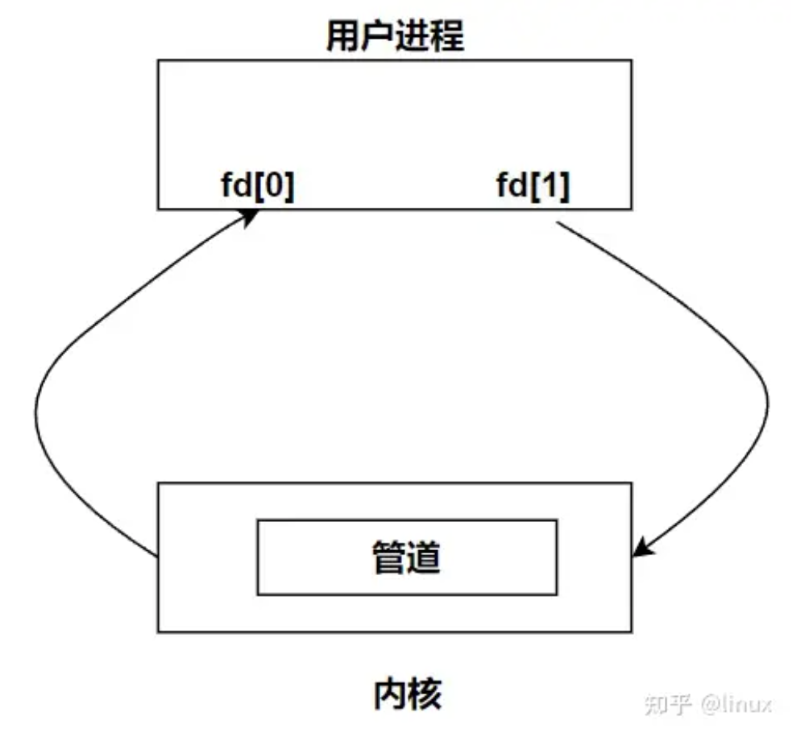
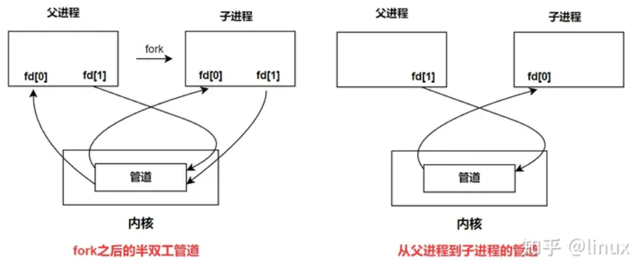
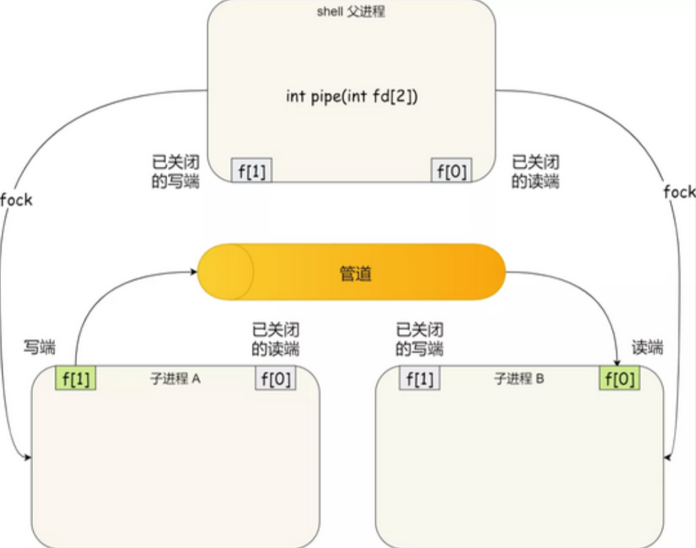
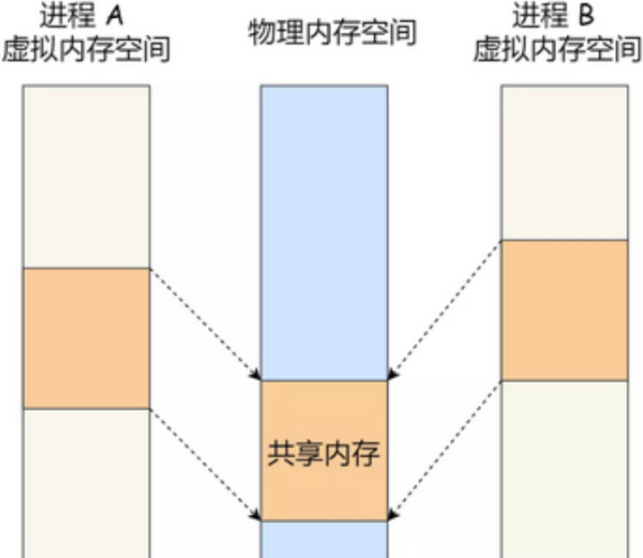

# Linux进程间通信

每个进程的用户地址空间都是独立的，一般而言是不能互相访问的，但内核空间是每个进程都共享的，所以进程之间要通信必须通过内核。

Linux 内核提供了不少进程间通信的机制：管道（包括匿名管道和命名管道）、消息队列、信号量、共享内存、Socket（套接字）等。

其中 Socket和支持不同主机上的两个进程通信。

## 管道

管道是单向传输（半双工），只能用于具有亲缘关系的进程之间的通信（父子进程/兄弟进程），是一种特殊的文件（存在于内存中，不属于任何文件系统）。其实，所谓的管道，就是内核里面的一串缓存。

```bash
# 匿名管道
ps auxf | grep mysql

# 创建命名管道 一些皆文件
mkfifo myPipe
ls -l

# 将数据写进管道 停住了 ...
echo "hello" > myPipe  

# 这是因为管道里的内容没有被读取，只有当管道里的数据被读完后，命令才可以正常退出。
# 读取管道里的数据
cat < myPipe
hello
```

创建管道

```c
#include <stdio.h>
int pipe(int fd[2]);  // 返回值：若成功返回0，失败返回-1；
```

fd[0]为读而打开，fd[1]为写而打开。



单个进程中的管道几乎没有任何用处。所以，通常调用 pipe 的进程接着调用 fork，这样就创建了父进程与子进程之间的通信通道。若要数据流从父进程流向子进程，则关闭父进程的读端（fd[0]）与子进程的写端（fd[1]）；反之，则可以使数据流从子进程流向父进程（不关闭会造成混乱）。所以说如果需要双向通信，则应该创建两个管道。



在shell中，执行 A | B命令的时候，A 进程和 B 进程都是 shell 创建出来的子进程，A 和 B 之间不存在父子关系，它俩的父进程都是 shell。



对于`匿名管道，它的通信范围是存在父子关系的进程`。

对于`命名管道，它可以在不相关的进程间也能相互通信`。因为命令管道，提前创建了一个类型为管道的设备文件，在进程里只要使用这个设备文件，就可以相互通信。

## 消息队列

消息队列生命周期随内核，如果没有释放消息队列或者没有关闭操作系统，消息队列会一直存在，而前面提到的匿名管道的生命周期，是随进程的创建而建立，随进程的结束而销毁。

消息队列不适合比较大数据的传输

## 信号量

信号量用于进程间同步，若要在进程间传递数据需要结合共享内存。信号量基于操作系统的 PV 操作，程序对信号量的操作都是原子操作。


## 共享内存

共享内存的机制，就是拿出一块虚拟地址空间来，映射到相同的物理内存中。两个或多个进程共享一个给定的存储区。

- 进程直接对内存进行存取，非常快
- 多个进程可以同时操作，所以需要进行同步

所以信号量+共享内存通常结合在一起使用，信号量用来同步对共享内存的访问。



## socket