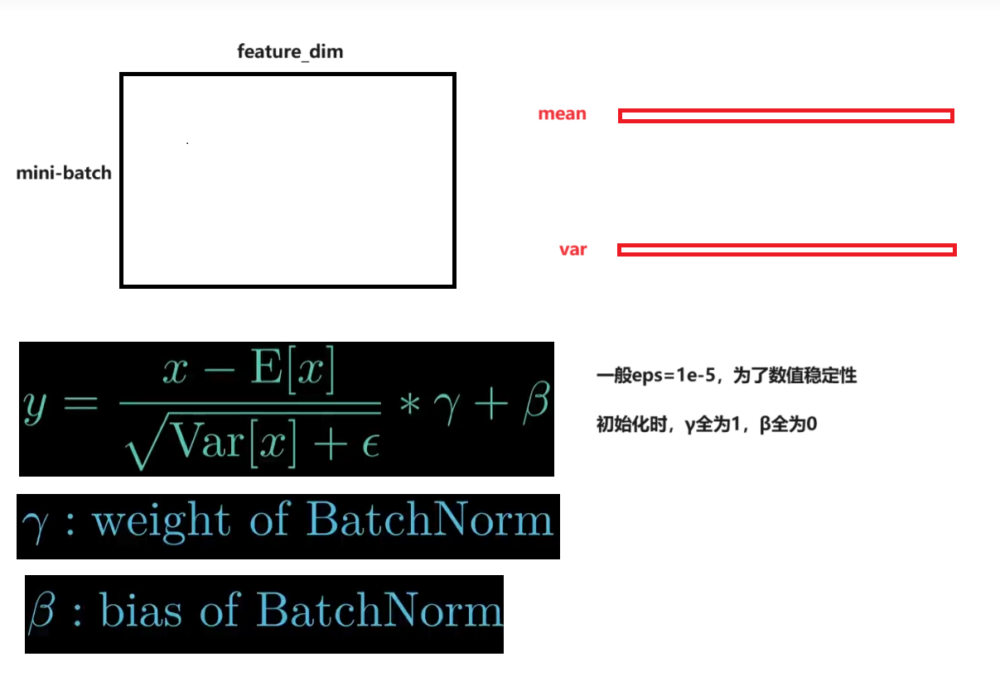
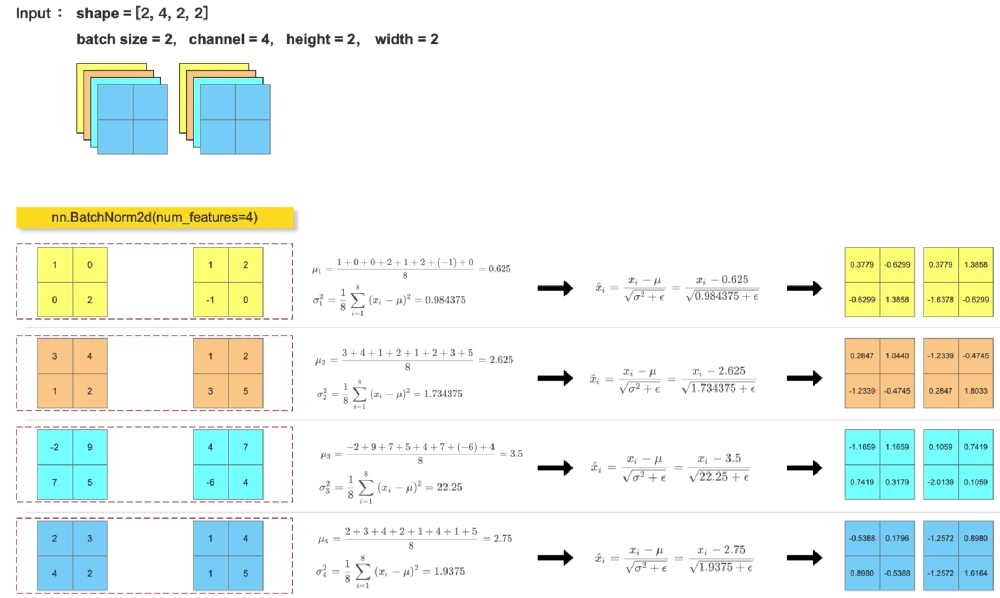

## 2D数据

BatchNorm是在一个mini-batch里面，将每一列（即每一个特征）的均值变为0，方差变为1，即将数据标准化，防止梯度消失和爆炸。做法如下：

对于ND的数据，feature_dim是一条数据的维度，然后求出一个batch中数据的均值和方差，然后进行归一化。



## 4D数据

对于NCHW的数据，计算得到的均值/方差维度为`C`，可以理解为对每个平面`HxW`（即每一个特征）进行求和，一共有N个平面，最后平均得到均值，方差也是一样。细节如下：



## 测试代码

```python
feature_array = np.array(
        [
            [[[1, 0], [0, 2]], [[3, 4], [1, 2]], [[3, 4], [-2, 9]], [[7, 5], [2, 3]]],
            [[[1, 2], [-1, 0]], [[1, 2], [3, 5]], [[4, 7], [-6, 4]], [[1, 4], [1, 5]]],
        ],
        dtype=np.float32,
    )
    # 调用 nn.BatchNorm2d
    feature_tensor = torch.tensor(feature_array.copy(), dtype=torch.float32)
    bn_out = nn.BatchNorm2d(num_features=4, eps=1e-5)(feature_tensor)
    print(bn_out)
    # 手动计算 Batch Normalization
    for i in range(feature_array.shape[1]):
        channel = feature_array[:, i, :, :]
        mean = feature_array[:, i, :, :].mean()
        var = feature_array[:, i, :, :].var()
        # print(mean)
        # print(var)
        feature_array[:, i, :, :] = (feature_array[:, i, :, :] - mean) / np.sqrt(
            var + 1e-5
        )
    print(feature_array)
```

