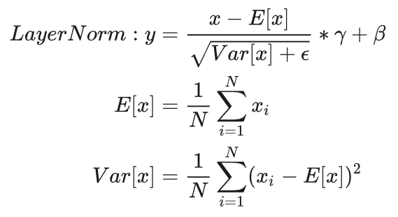

- 标准化的目的是将数据的统计特性(平均值和标准差)调整为0和1。
- 归一化的目的是将数据缩放到一个固定的范围内,通常是[0, 1]。

# LayerNorm

对特征张量按照**某一维度或某几个维度**进行0均值，1方差的标准化操作。

LayerNorm 是一种标准化方法，它计算**一个样本**的均值和方差，然后使用这些来对样本进行归一化。这种方法是**独立于批量大小**的，使得模型更加稳定。

在batch维度上，对每一个词做归一化

# RMSNorm

RMSNorm是对LayerNorm的一个改进，没有做re-center操作（移除了其中的均值项）

使用平方根的均值来归一化。简化了LayerNorm，加快了计算效率。

`gi`是可学习的参数

两者对比：

# BatchNorm与LayerNorm的异同

- 对于二维矩阵来说，行为batch-size，列为样本特征。那么BatchNorm就是竖着归一化，LayerNorm就是横着归一化。
- 对于三维矩阵来说，BatchNorm是对除了channel维的所有参数做归一化，LayerNorm是对除了batch维的所有参数做归一化

