Attention is all you need

## 图示

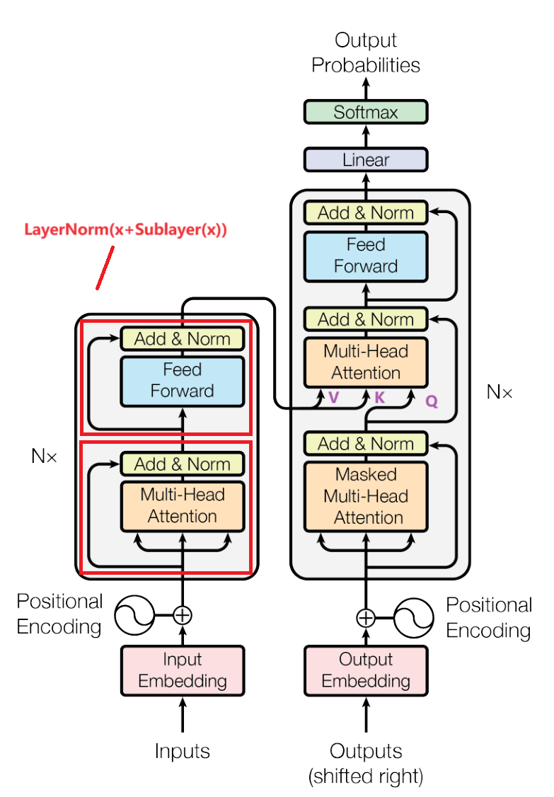

## LayerNorm和BatchNorm

BatchNorm是在一个mini-batch里面，将每一列（即每一个特征）的均值变为0，方差变为1，即将数据标准化，防止梯度消失和爆炸。做法如下：

对于ND的数据，feature_dim是一条数据的维度，然后求出一个batch中数据的均值和方差，然后进行归一化。

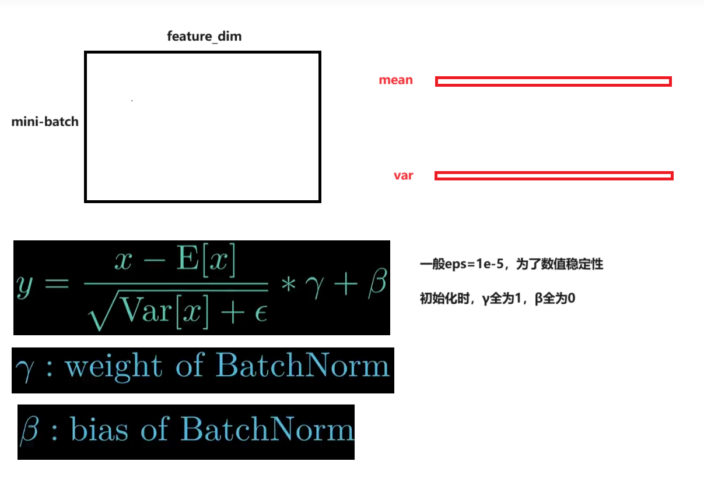

在预测阶段，会对所有训练过的数据计算均值和方差。然后`γ`和`β`保持不变。对于训练好的模型，BN层都保留下了每一个batch算出来的均值和方差。

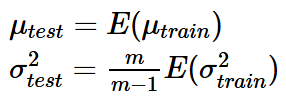

对于LayerNorm其实是将每一行的均值变为0，方差变为1。左侧为batchnorm，右侧为layernorm

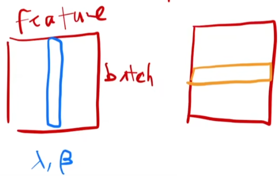

在NLP中，输入数据通常是三维的，batch中的每条数据都是一句话（序列）。

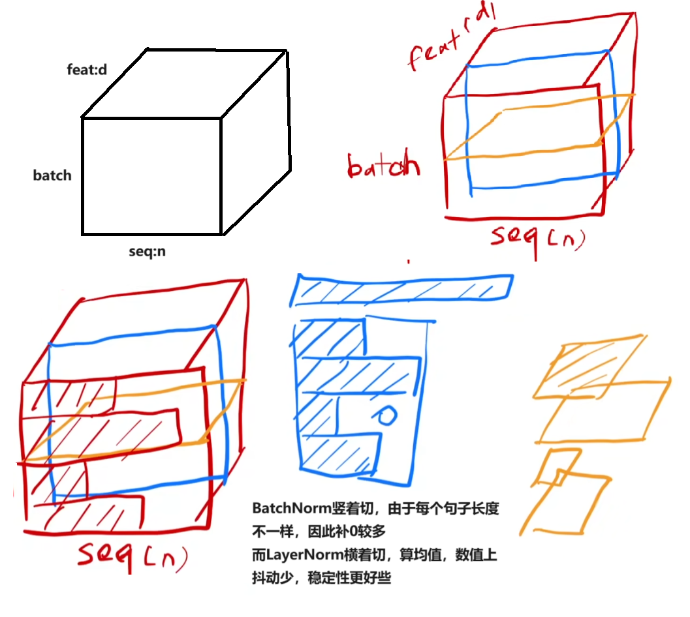

## Multi Head Attention

对于一个输入来说，即batch_size=1

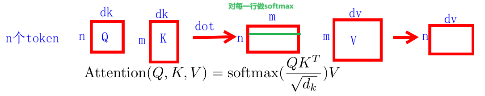

如果dk较大，在做完点乘之后得到的值可能会很大。即在得到的相似度矩阵的某一行中，会有某个元素很大，在softmax之后，元素值进一步被放大，反向传播时梯度会特别小，训练不动。所以除以dk来缩放。

每个词嵌入之后的长度为512，即d_model

如果是多头注意力，会对输入做一个投影。d_model=512，num_head=8，因此dk=64

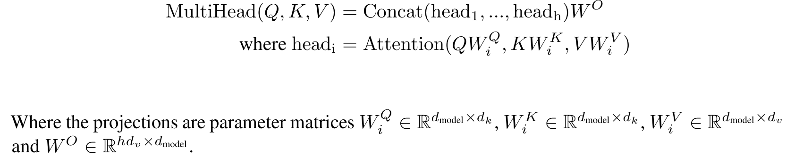

## Feed Forward:MLP

在做完attention之后，通过MLP对所有头的信息做汇聚。因为之前做多头注意力时，每个头是独立的。

具体做法是先对于x投影到2048，然后再投影到512（因为后面有残差连接）。

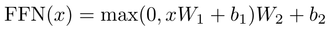

## 整体流程

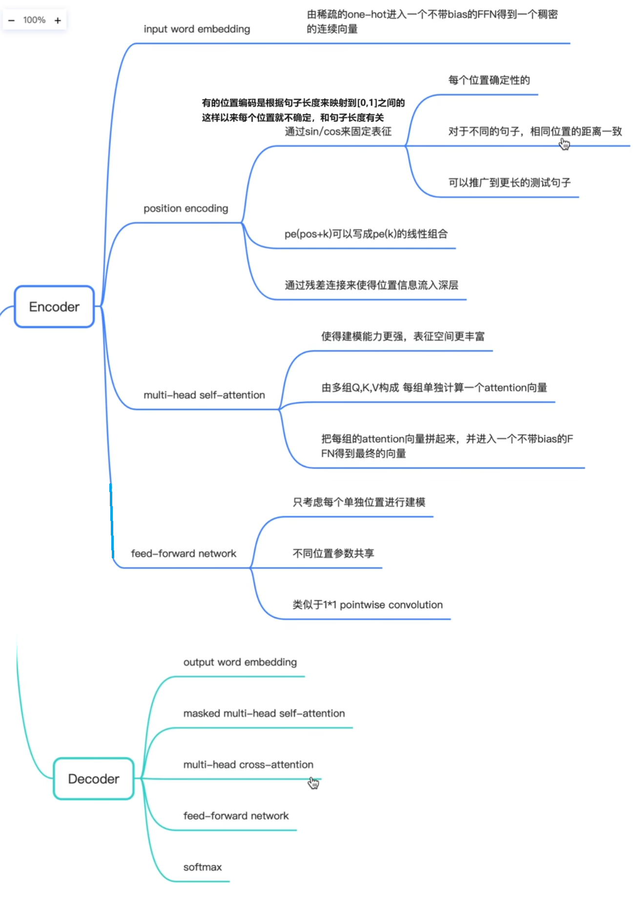


## 源码分析

```python
class TransformerEncoderLayer(Module):
    def __init__() -> None:
        self.self_attn = MultiheadAttention(d_model, nhead, dropout=dropout,
            bias=bias, batch_first=batch_first, **factory_kwargs)
        # Implementation of Feedforward model
        self.linear1 = Linear(d_model, dim_feedforward, bias=bias, **factory_kwargs)
        self.dropout = Dropout(dropout)
        self.linear2 = Linear(dim_feedforward, d_model, bias=bias, **factory_kwargs)

        self.norm_first = norm_first
        self.norm1 = LayerNorm(d_model, eps=layer_norm_eps, bias=bias, **factory_kwargs)
        self.norm2 = LayerNorm(d_model, eps=layer_norm_eps, bias=bias, **factory_kwargs)
        self.dropout1 = Dropout(dropout)
        self.dropout2 = Dropout(dropout)
    def forward():
        x = self.norm1(x + self._sa_block(x, src_mask, src_key_padding_mask))
        x = self.norm2(x + self._ff_block(x))
        return x
     # self-attention block
    def _sa_block() -> Tensor:
        x = self.self_attn(x, x, x,
                           attn_mask=attn_mask,
                           key_padding_mask=key_padding_mask,
                           need_weights=False, is_causal=is_causal)[0]
        return self.dropout1(x)

    # feed forward block
    def _ff_block(self, x: Tensor) -> Tensor:
        x = self.linear2(self.dropout(self.activation(self.linear1(x))))
        return self.dropout2(x)


```


## 和其他模型对比

CNN

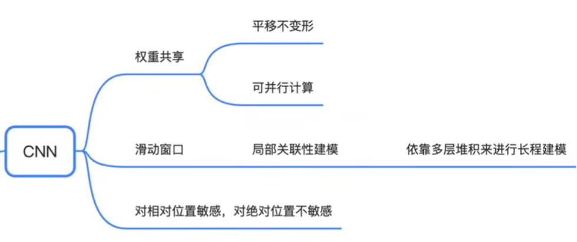

RNN

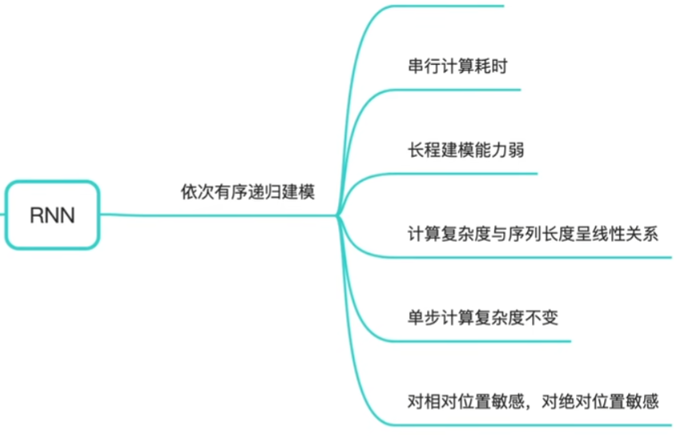

Transformer

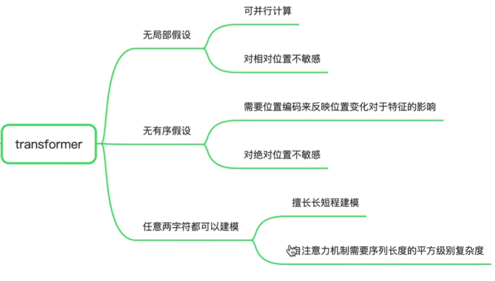

## 复杂度对比

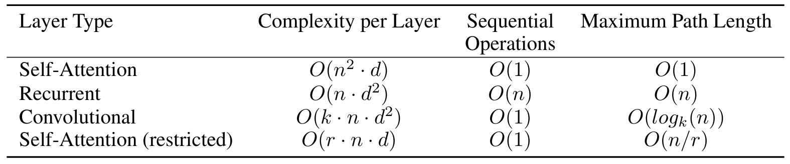 