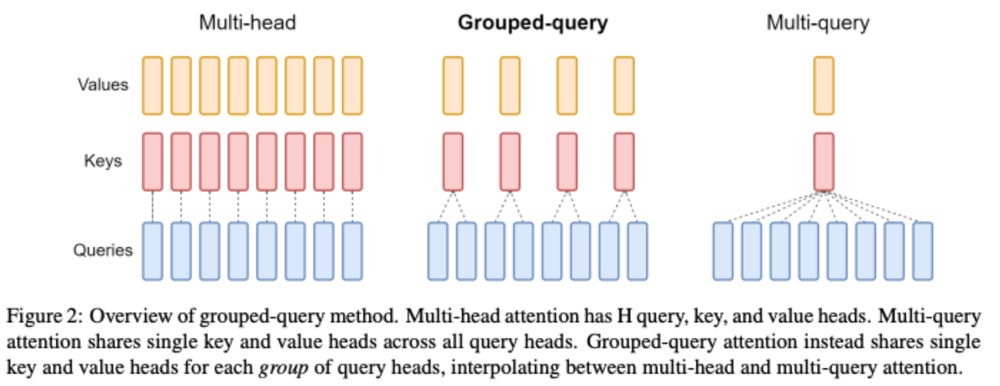

# KV Cache带来的问题

以Llama 7B模型为例，hidden_size为4096，也就说每个K,V有4096 个数据，假设是半精度浮点数据float16，一个Transformer Block中就有 4096* 2 *2 = 16KB的单序列 K,V缓存空间，而Llama 2一共32个Transformer Block，所以单序列整个模型需要16 * 32 = 512KB的缓存空间，那多序列呢？如果此时句子长度为1024 ，那是不是就得512MB 的缓存空间了。

而现在英伟达最好的卡 H100 的 SRAM 缓存大概是 50MB，而 A100 则是 40MB. 而 7B 模型都这样，175B 模型就更不用说了。

既然SRAM 放不下，我们放到DRAM(GPU显存)行不行呢？答案是可以，但要牺牲性能。我们学过CUDA编程，我们知道全局内存(GPU)的读写速度要要远低于共享内存和寄存器，由此便会导致一个问题: **Memory Wall（内存墙）**。所谓内存墙简单点说就是你处理器ALU太快，但是你内存读写速度太慢跟不上，这就会导致ALU算晚之后在那等着你数据搬运过来，进而影响性能。

针对这个问题LLaMA2使用GQA，从软件层面解决。

# MQA

原始的 MHA（Multi-Head Attention），**Q、K、V 三部分有相同数量的头，且一一对应**。每次做 Attention，head1 的 Q、K、V 就做好自己运算就可以，输出时各个头加起来就行。

而 MQA 则是，让 **Q 仍然保持原来的头数**，但 **K 和 V 共享一个头**，相当于 **所有的 Q 头共享一组 K 和 V 头**，所以叫做 Multi-Query 了。

实现改变了会不会影响效果呢？确实会影响但相对它能带来的收益，性能的些微降低是可以接受的。能带来多大的收益呢，**实验发现一般能提高 30%-40% 的吞吐**。

收益主要就是由降低了 KV cache 带来的。**实际上 MQA 运算量和 MHA 是差不多的**，可理解为读取一组 KV 头之后，给所有 Q 头用，但因为之前提到的内存和计算的不对称，所以是有利的。

# GQA

GQA 是 MHA 和 MQA 的 **折衷方案**，既不想损失性能太多，又想获得 MQA 带来的推理加速好处。具体思想是，不是所有 Q 头共享一组 K、V，而是**分组一定头数 Q 共享一组 K、V**，比如上面图片就是两组 Q 共享一组 K、V。

# 总结

MQA 和 GQA 形式在推理加速方面，主要是通过两方面来完成：

- 降低了从内存中读取的数据量，所以也就减少了计算单元等待时间，**提高了计算利用率**；
  - 在一定程度上避免了内存墙
- KV cache 变小了 head_num 倍，也就是显存中需要保存的 tensor 变小了，**空出来空间就可以加大 batch size，从而又能提高利用率**。

如果要用 MQA 和 GQA，可以是 **从头训练的时候就加上**，也可以像 GQA 论文里面一样，用已有的开源模型，**挑一些头取个 mean 用来初始化** MQA 或 GQA 继续训练一段时间。