# 代码讲解

[通俗易懂-大模型的关键技术之一:旋转位置编码rope （3）_哔哩哔哩_bilibili](https://www.bilibili.com/video/BV1Mj421R7JQ/?p=6&spm_id_from=pageDriver)

# 快速理解

https://zhuanlan.zhihu.com/p/642884818

https://cloud.tencent.com/developer/article/2327751

## 公式推导

约定一下符号：

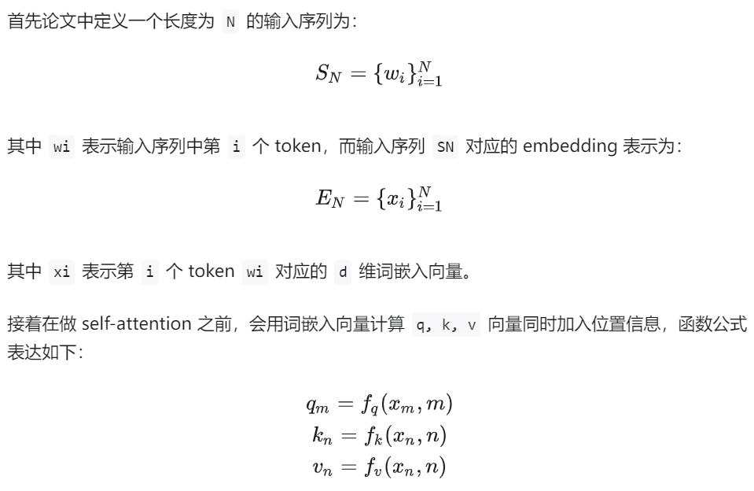

RoPE的终极目标即：

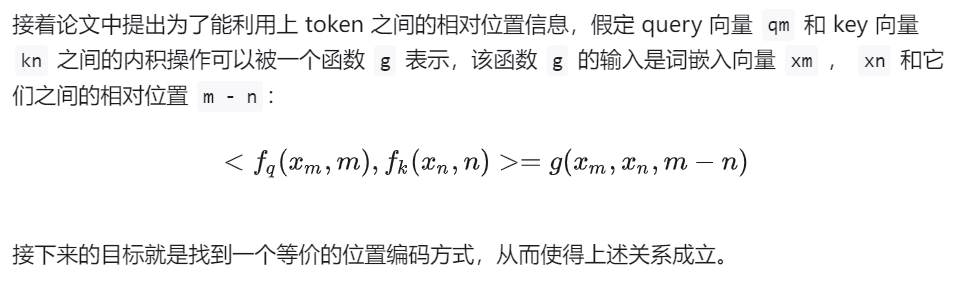

在二维情况下，推导得到如下，即对q进行变换，然后对k进行变换，最后做矩阵乘法

进一步推导得到函数`g`如下：

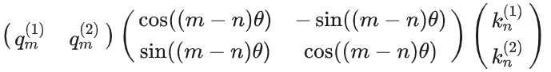

多维情况下：

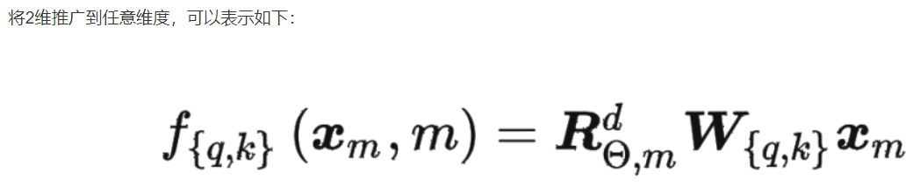

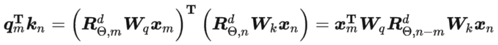

其中矩阵R如下：

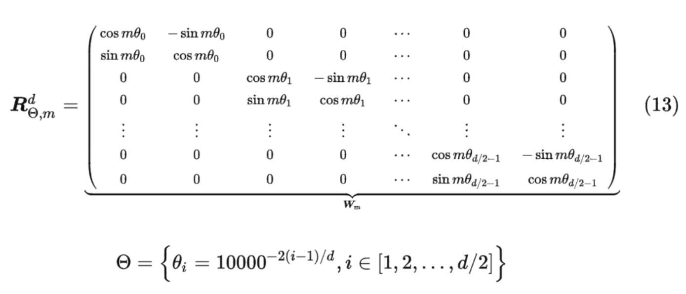

## 代码实现

但是，由于矩阵R是一个稀疏矩阵，直接用矩阵乘法实现会很浪费算力。一般采用加法的方式将相对位置信息加入到q和k中：

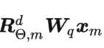

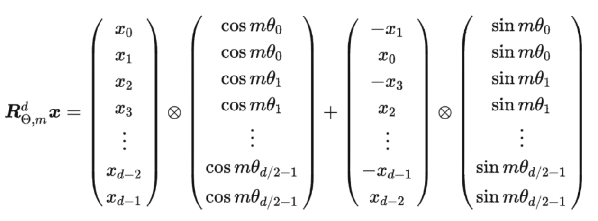

# 长文本外推

RoPE有着较弱的长度外推性，

当模型的输入长度超出训练长度时，模型的性能会急剧下降，具体表现为困惑度的急剧上升。

https://zhuanlan.zhihu.com/p/670280576

## RoPE理解

RoPE的行为，最终可以归结为：

对token的hidden_dim两两分组，每组视为一个二维向量，然后进行旋转，旋转角度和

1. 当前词在序列中所处的**位置m**有关
2. hidden_dim中分组的**组号i**有关

旋转之后，即对词向量添加了绝对位置信息m

具体旋转角度表示为：

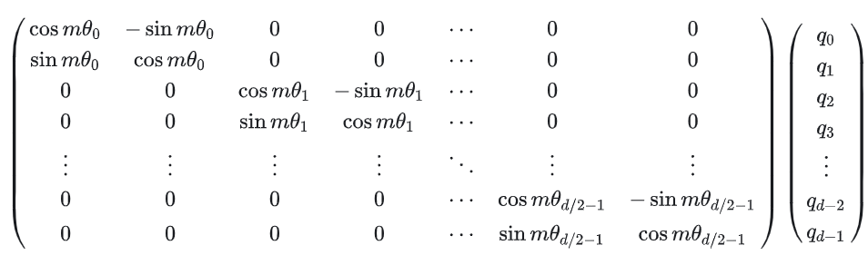

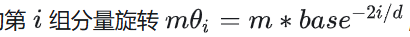

上图中，**需要记住，任意词向量q位于位置m时，它的第i组分量的旋转弧度为**
$$
m\theta_i = m*base^{-2i/d}
$$
llama中base=10000。后续讨论的所有长度扩展方法，本质上都是通过缩小旋转弧度 mθi ，以达到长度扩展的目的。

### 周期性

对于每组分量，它的旋转弧度随着位置索引的增加而线性增加。**每组分量的旋转都具有周期性**，因为旋转一圈的弧度是 2π ，所以RoPE中的向量旋转就像时钟一样，具有周期性。并且我们发现越靠后的分组，它的旋转速度越慢。例如当向量位于位置500时，它的第0组分量已经旋转了500弧度，但第8组分量的旋转弧度仅为158左右。

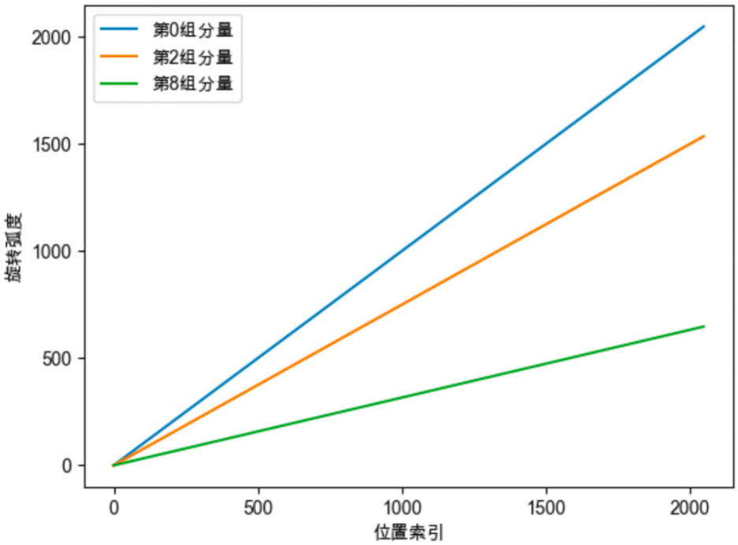

同时，从上图可以看出，靠后的分组旋转速度慢，m=500和m=1000的靠后分组之间的差值较小，说明靠后分组的旋转角度更加拥挤，差异更小。

### 衰减性

RoPE具有远程衰减性。**对于两个词向量，若它们之间的距离越近，则它们的内积分数越高，反之则越低**。随机初始化两个向量q和k，将q固定在位置0上，k的位置从0开始逐步变大，依次计算q和k之间的内积。

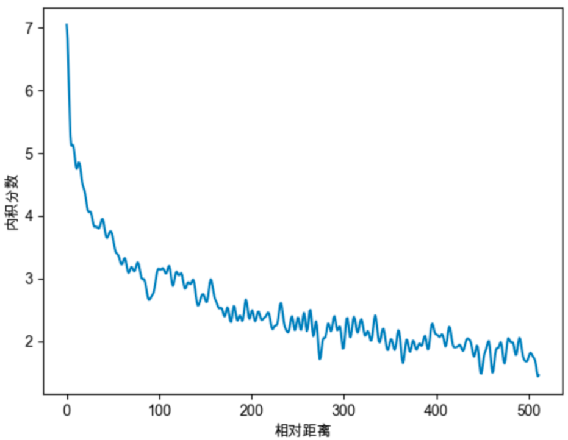

## 线性内插Position Interpolation

在RoPE中，每个位置 m 都对应一个旋转弧度 mθi ，当模型的训练长度为 L 时，位置0到位置 L−1 对应的旋转弧度范围为 [0,(L−1)θi] 。

**模型在训练时，只见过 [0,(L−1)θi] 范围内的旋转弧度，未见过大于 (L−1)θi 的旋转弧度，所以当推理长度大于 L 时，模型难以理解新的旋转弧度，无法正确注入位置信息，导致模型性能下降。**

我们举个例子，LLaMA的训练长度为2048，如下图所示，对于第0组分量，训练时模型见过的旋转弧度范围为 [0,2047] ，当LLaMA在4096的长度上进行推理时，由于它在训练时未见过 [2048,4095] 的旋转弧度，所以难以理解，造成模型的性能下降

Position Interpolation的做法简单且直观：**缩小每个位置的旋转弧度，让向量旋转得慢一些，每个位置的旋转弧度变为原来的 L/L′ ，长度扩大几倍，则旋转弧度缩小几倍**。最终，经过调整后，位置的旋转弧度如下公式所示：

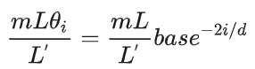

举个例子，我们设 L=2048,L′=4096 ，也就是将模型的长度从2048扩展至4096，Position Interpolation将每个位置的旋转弧度均变为原来的一半，原来 [0,2047] 的旋转弧度范围就可以用来表示4096的长度范围。

但是，靠后的分组旋转速度本来就很慢，进行缩放之后变得十分拥挤，往往需要微调，使模型适应拥挤的映射关系。旋转速度快的分量被放慢，高频信息缺失（正弦余弦）。

## NTK-Aware Interpolation

NTK-Aware Interpolation以NTK（神经正切核）作为理论支撑，或者说灵感来源。**作者认为高频信息对于神经网络非常重要，而Position Interpolation对于向量的所有分组不加区分地缩小旋转弧度，降低旋转速度（进一步体现为对其正弦函数进行拉伸），会导致模型的高频信息缺失，从而影响模型的性能**。

前面提到，**位置越靠前的向量分组，旋转速度越快，频率越高，作者希望保留这些高频信息**。在NTK-Aware插值中，经过调整后，位置 m 的旋转弧度如下公式所示，其中LLaMA中的 base 为10000， α 表示的缩放因子：

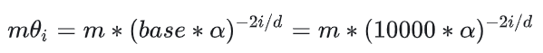

对于某个位置m的词向量q，横轴为向量分组，纵轴为旋转角度：

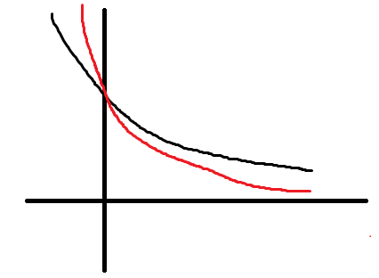

越靠后的分组，旋转弧度缩小的倍数越大。其中第0分组的旋转弧度保持不变，最后一个分组的旋转弧度变为原来的1/100。可以将NTK-Aware Interpolation的思想总结为：**保留高频信息；高频分量旋转速度降幅低，低频分量旋转速度降幅高；在高频部分进行外推，低频部分进行内插**。

评测结果表明，在不进行finetune的时候，NTK-Aware插值的效果比线性插值更优。

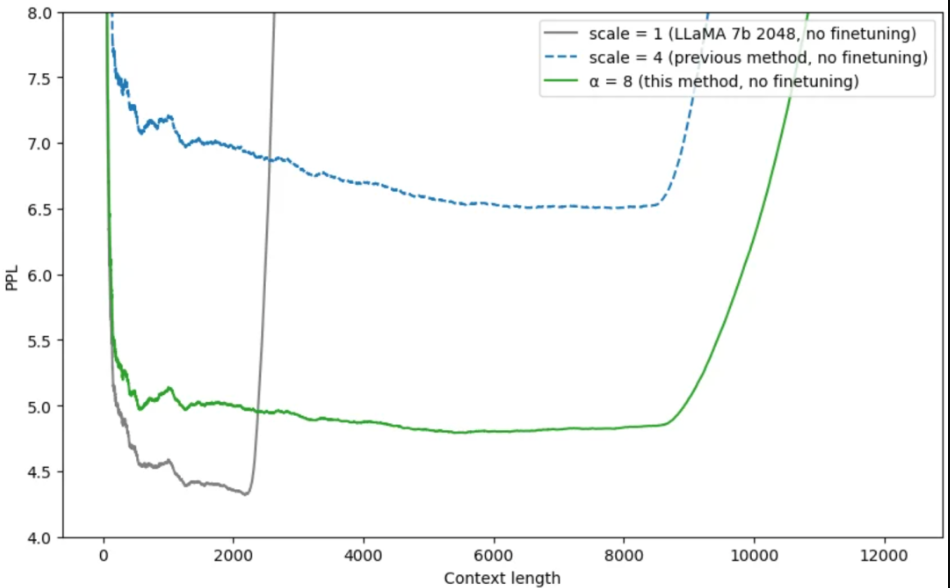

为什么NTK-Aware Interpolation能够奏效？作者以NTK的理论进行解释。但我们认为从旋转周期的角度也许可以进行更加直观且合理的解释。前文中我们介绍过，位置越靠后的分组的旋转速度越慢，频率越低，周期越长。对于第0组分量，仅在位置7时，就已经旋转一周。但对于第64组分量，当位置为2047时，其旋转弧度约为0.2047，甚至仍未完成1/4周旋转。

我们可以将NTK-Aware Interpolation奏效的原因按照如下方式进行解释：

1. **靠前的分组，在训练中见过非常多完整的旋转周期，位置信息得到了充分的训练，所以具有较强的外推能力。**
2. **靠后的分组，在训练中无法见到完整的旋转周期，或者见到的旋转周期非常少，训练不够充分，外推性能弱，需要进行位置插值。**

## NTK-by-parts Interpolation

NTK-by-parts Interpolation则是基于NTK-Aware Interpolation进行优化，其核心思想是：**不改变高频部分，仅缩小低频部分的旋转弧度**。也就是不改变靠前分组的旋转弧度，仅减小靠后分组的旋转弧度，这就是by-patrs的含义。

## Dynamic NTK Interpolation

当超出训练长度时，上述插值方法都比原模型直接外推的效果更好，但是它们都有一个共同的缺点，在训练长度内，推理表现都比原模型差。如下图，灰色表示LLaMA直接外推的表现，在2048长度内，原始模型的困惑度显著低于各种插值方法。

Dynamic NTK Interpolation是一种动态插值的方法，思路也很简单：**推理长度小于等于训练长度时，不进行插值；推理长度大于训练长度时，每一步都通过NTK-Aware Interpolation动态放大base。**

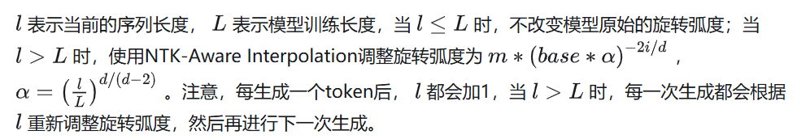

## 总结

一句话总结各种方法的特点：

1. Position Interpolation：目标长度是原来的n倍，则旋转弧度减小至原来的1/n。
2. NTK-Aware Interpolation：增大RoPE的base，保留高频信息；高频分量旋转速度降幅低，低频分量旋转速度降幅高；在高频部分进行外推，低频部分进行内插。
3. NTK-by-parts Interpolation：不改变高频部分，仅缩小低频部分的旋转弧度。
4. Dynamic NTK Interpolation：推理长度小于等于训练长度时，不进行插值；推理长度大于训练长度时，每一步都通过NTK-Aware插值动态放大base。
5. YaRN：NTK-by-parts Interpolation与注意力分布修正策略的结合，通过温度系数修正注意力分布。

