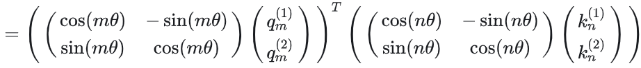

# 代码讲解

[通俗易懂-大模型的关键技术之一:旋转位置编码rope （3）_哔哩哔哩_bilibili](https://www.bilibili.com/video/BV1Mj421R7JQ/?p=6&spm_id_from=pageDriver)

# 快速理解

https://zhuanlan.zhihu.com/p/642884818

https://cloud.tencent.com/developer/article/2327751

## 公式推导

约定一下符号：

RoPE的终极目标即：

在二维情况下，推导得到如下，即对q进行变换，然后对k进行变换，最后做矩阵乘法

进一步推导得到函数`g`如下：

多维情况下：

其中矩阵R如下：

## 代码实现

但是，由于矩阵R是一个稀疏矩阵，直接用矩阵乘法实现会很浪费算力。一般采用加法的方式将相对位置信息加入到q和k中：

