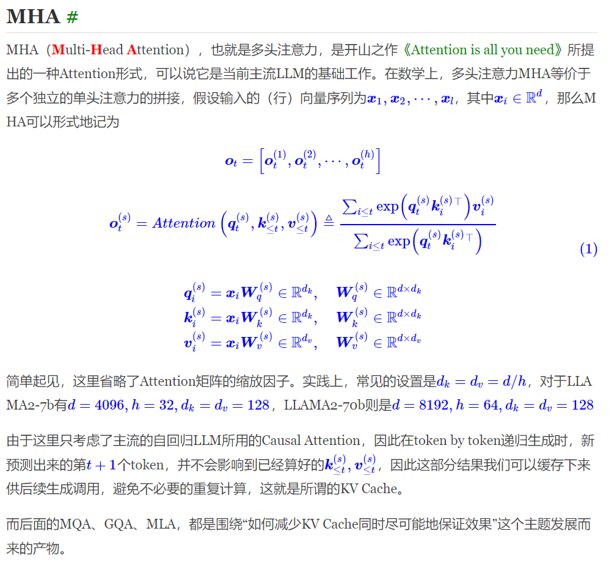
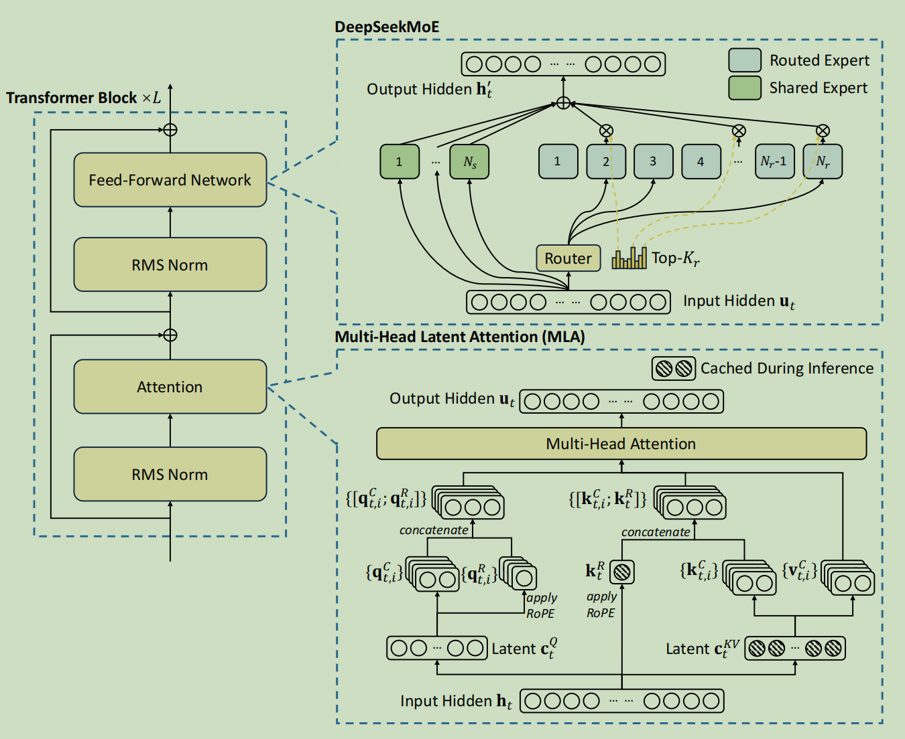
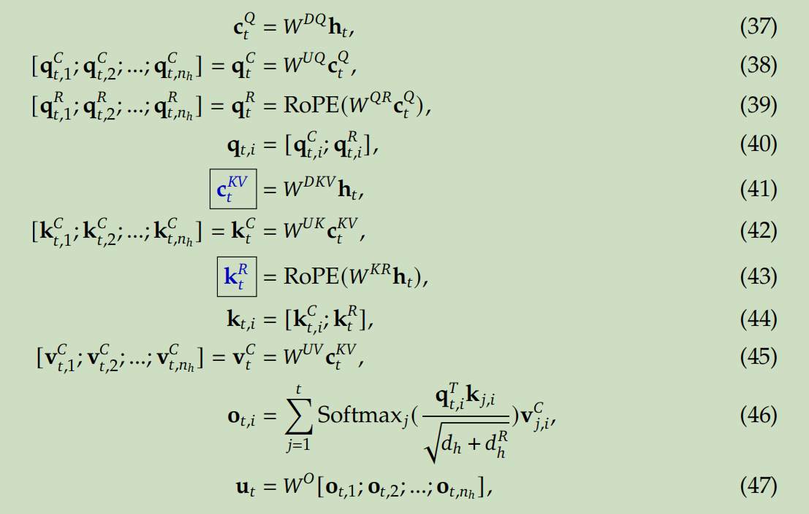

# MHA

# MLA

先看下面文章

https://kexue.fm/archives/10091

然后就能理解下面的图片

q其实没必要用LoRA，但是注意力头数是128，Wq会特别大，使用低秩可以节省显存。

k和v必须用LoRA因为要得到中间状态

还可以再看一遍原论文 DeepSeek-V2

最后跟代码：

https://zhuanlan.zhihu.com/p/700214123 是对下面huggingface代码的解读

https://huggingface.co/deepseek-ai/DeepSeek-V2/blob/main/modeling_deepseek.py

https://bruceyuan.com/post/hands-on-deepseek-mla.html