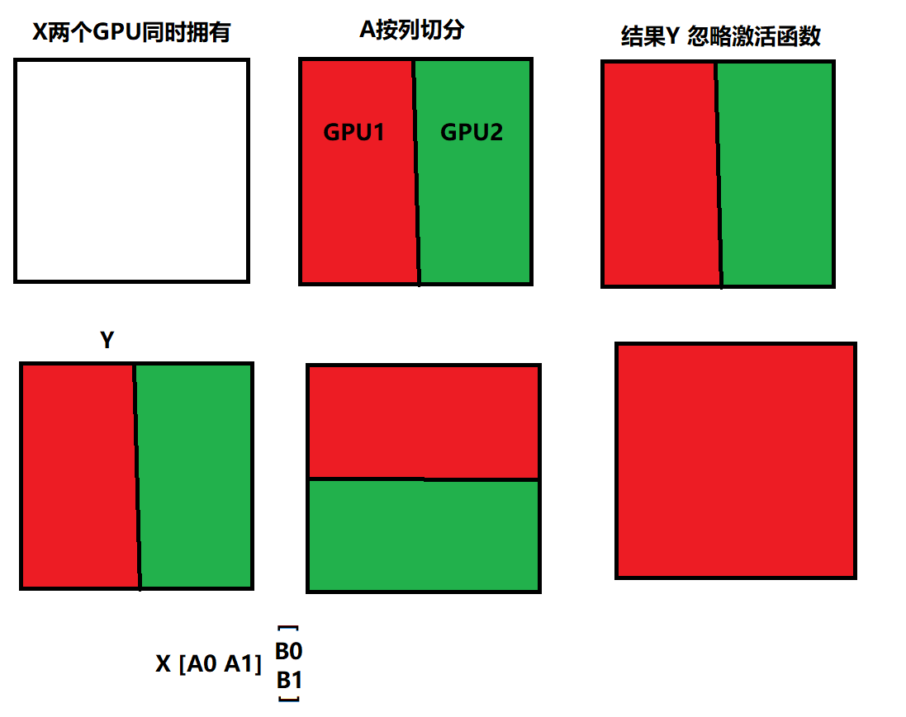

# dp tp pp zero关系

训练过程中GPU内存开销主要包含以下几个方面：

- 模型状态内存（Model State Memory）：

- - 梯度
  - 模型参数
  - **优化器状态：当使用像Adam这样的优化器时，优化器的状态会成为GPU内存开销的大头。前面介绍的DP，TP， PP算法并没有考虑这个问题。**

- **激活内存（Activation Memory）：在优化了模型状态内存之后，人们发现激活函数也会导致瓶颈。激活函数计算位于前向传播之中，用于支持后向传播。**

- 碎片内存（Fragmented Memory）：深度学习模型的低效有时是由于内存碎片所导致的。在模型之中，每个张量的生命周期不同，由于不同张量寿命的变化而会导致一些内存碎片。由于这些碎片的存在，会导致即使有足够的可用内存，也会因为缺少连续内存而使得内存分配失败。ZeRO 根据张量的不同寿命主动管理内存，防止内存碎片。

https://zhuanlan.zhihu.com/p/581677880

# 张量并行

# Deepspeed

## ZeRO1/2/3

-  [分布式训练：了解Deepspeed中的ZeRO1/2/3](https://zerolovesea.github.io/2024/05/12/%E5%88%86%E5%B8%83%E5%BC%8F%E8%AE%AD%E7%BB%83%EF%BC%9A%E4%BA%86%E8%A7%A3Deepspeed%E4%B8%AD%E7%9A%84ZeRO1-2-3/)。ZeRO切分模型等之后如何进行forward和backward

- [DeepSpeed之ZeRO系列：将显存优化进行到底](https://basicv8vc.github.io/posts/zero/)。 模型显存占用公式分析和分布式通信
- [详解 DeepSpeed Zero 的各个 Stage 状态及日常使用](https://ckblogs.cn/posts/dl/DeepSpeed.html#%E5%BC%95%E8%A8%80)。显存分析和代码

# 通信

集群通信

all-reduce

https://zhuanlan.zhihu.com/p/504957661