to do

RMSNorm

RoPE

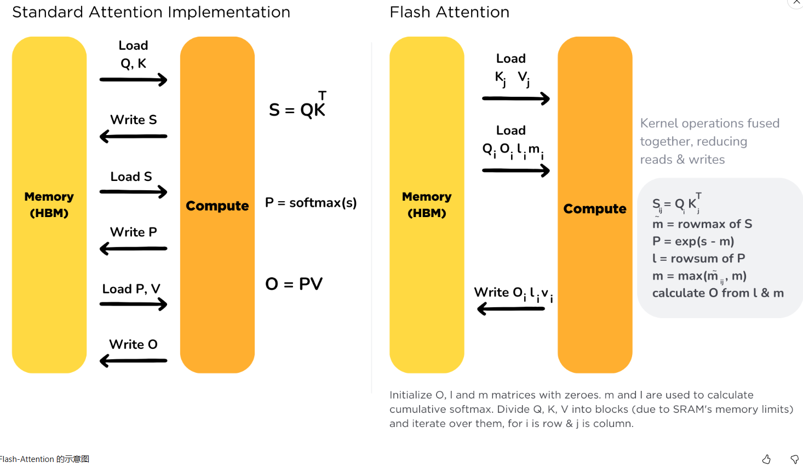

在不损失精度的情况下，通过软硬件协同的方式加速attention。

# 简单说

- **背景1**。通过对attention进行分析，发现matmul花费的时间没有那么多，更多的时间是在softmax，mask操作上。为什么呢？原因是GPU的读写速度跟不上计算速度，而这些操作存在反复的读写操作，比如读QK，然后计算得到S，将其写回显存，然后在加载S，计算softmax，得到P，在将P写回显存......。总之，读写操作花费了大量时间。
- **背景2**。在f16下，训练时数据可能会溢出，需要求出S矩阵每行的最大值，然后减去这个值防止溢出。提出了online softmax，实现分块计算softmax。

如此依赖，对于attention的操作，就可以将其融合fused kernel，减少大量的读写时间。

具体在空间复杂度上，多出每行要存储的max和sum，O(N)，时间换空间。

空间复杂度，

# Motivation

注意力机制的时间/空间复杂度是O(n^2*d)，增大上下文长度会使得计算时间急剧增大。

多年来，GPU的计算能力（FLOPS）的增长速度比增加内存吞吐量（TB/s）更快。

如果没有数据需要处理，那么额外的TFLOPS的计算能力是没有意义的。这两者需要紧密配合，但自从硬件失去了这种平衡，我们必须通过软件来进行补偿。因此需要算法能够感知IO(IO-aware)。根据计算和内存访问的比例，一个操作可以分为：

- 计算受限型(比如矩阵乘法)
- 内存受限型(比如activation, dropout, masking等**element-wise操作**和softmax, layer norm, sum等**reduction操作**。)

element-wise的操作在计算时**只依赖**当前值，比如把每个元素都乘以2。

reduction**依赖所有的值**(比如整个矩阵或者矩阵的行)，比如softmax。

而Attention的计算是内存受限的，因为它的大部分操作都是element-wise的。我们可以看一下论文中测试的实际Attention的运行情况：

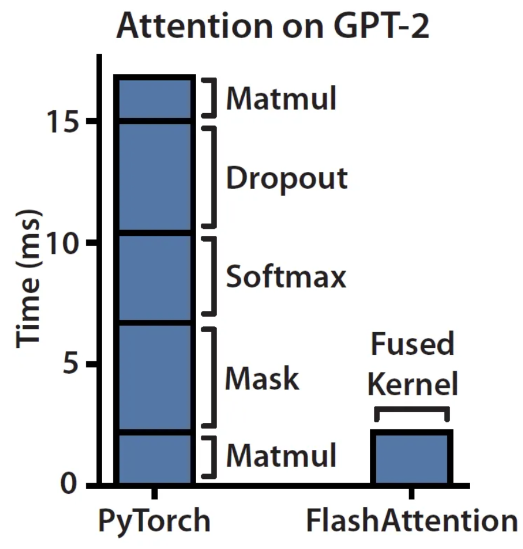

在左侧栏上看到，masking、softmax和dropout操作占用了大部分时间，尽管大部分FLOPS都用在矩阵乘法中，但它们的时间却花的不多。内存不是一个单一的构件，它在本质上是分层的，一般的规则是：内存速度越快，成本越高，容量越小。在计算机体系结构里，存储都是分层的：

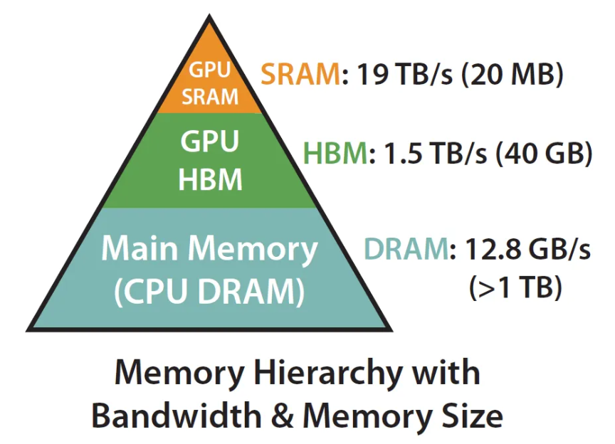

原始attention流程：

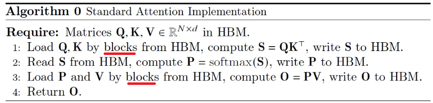

可以看出，每次做计算时都需要把数据从HBM读入SRAM，计算完毕又将数据写回。因此最容易相对的优化方法就是避免这种来回的数据移动。这就是那些编译器优化中的kernel fusion。

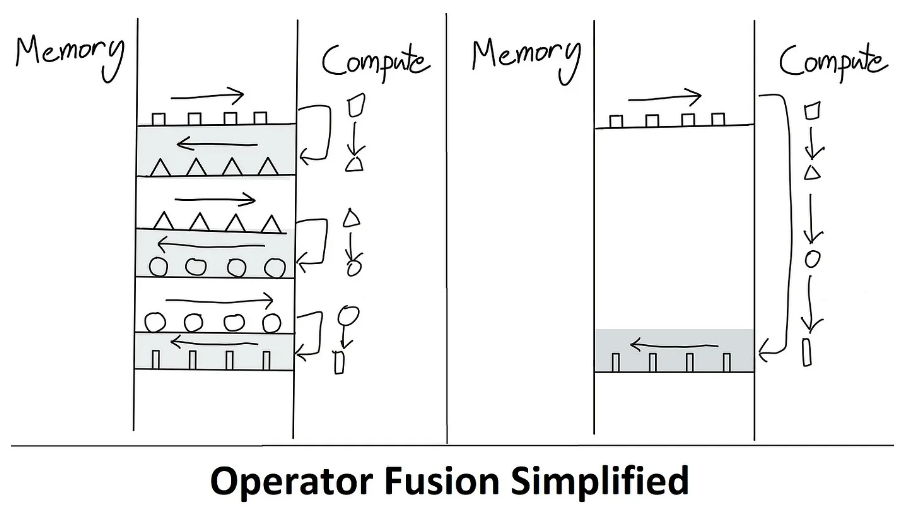

算子融合可以大大提升计算效率。

注意力分数矩阵S和P都是`NxN`的，即空间复杂度是O(N^2)，这正是FlashAttention需要解决的瓶颈，它将内存复杂度降低到O(N)。

FlashAttention基本上归结为两个主要思想：

- Tiling（在前向和后向传递中使用）- 简单讲就是将NxN的softmax/分数矩阵划分为块。
- 重新计算（仅在后向传递中使用 - 如果您熟悉activation/gradient checkpointing，这将很容易理解）。

# Online softmax

attention最核心的三部（忽略scaling和mask）：

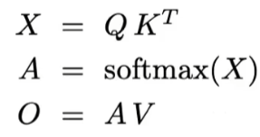

`X`为`NxN`，`Q`为`Nxd`

在fp16的条件下，如果`x>=11`， `e^x`就会溢出。导致训练出问题。

于是研究者提出**safe-softmax**，`xj`是`X`行向量中的最大值。

 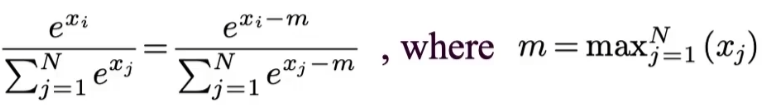

计算流程如下：

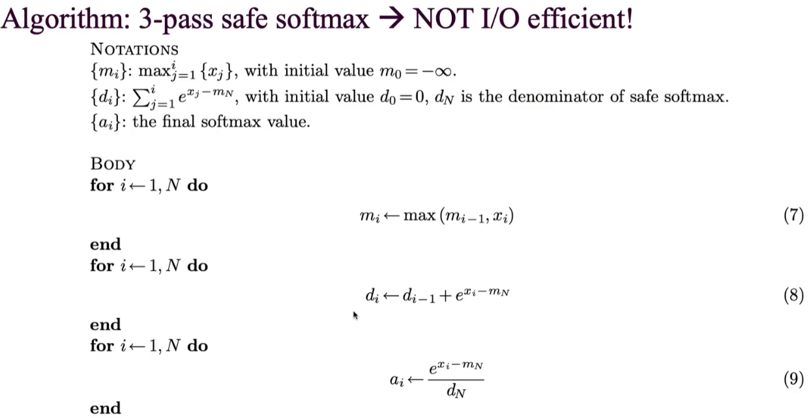

三次循环效率低下，于是做出改进：

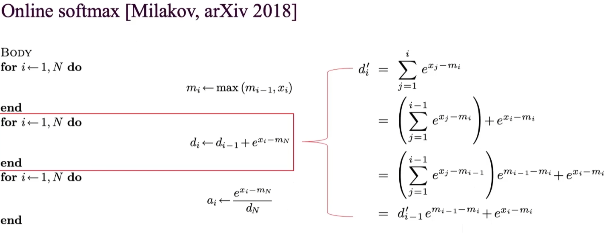

得到新的计算方式：

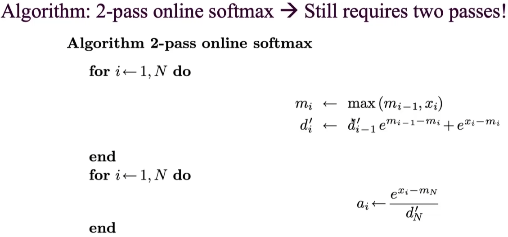

# 分块softmax

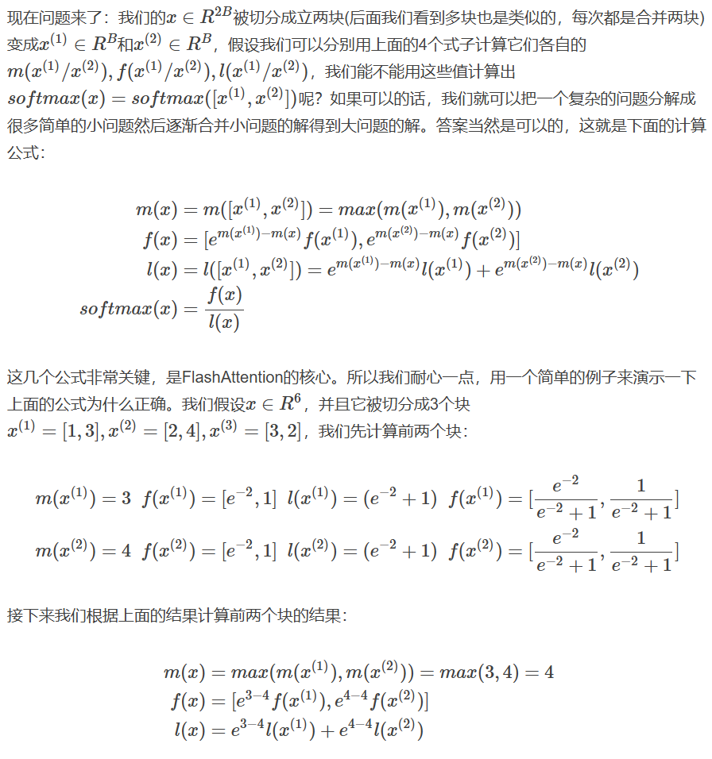

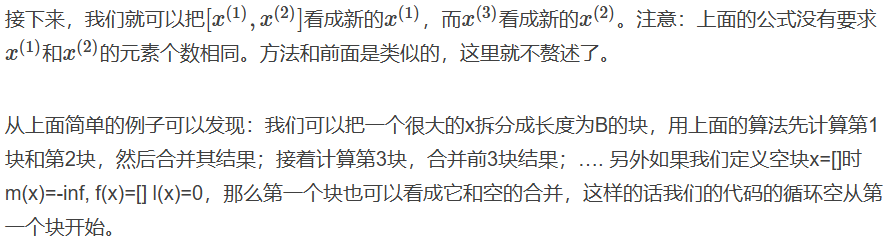

# 算法流程

https://fancyerii.github.io/2023/10/23/flashattention/

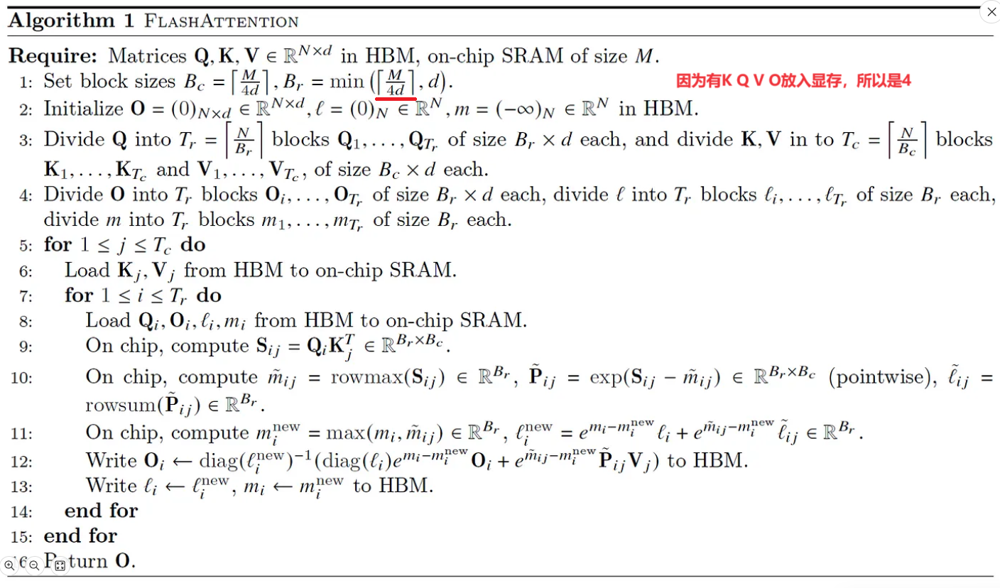

其中，5和7的两层循环，图示如下：

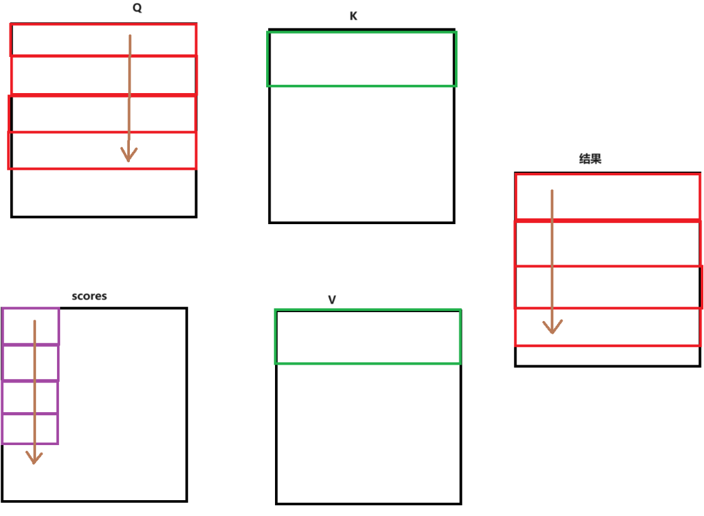

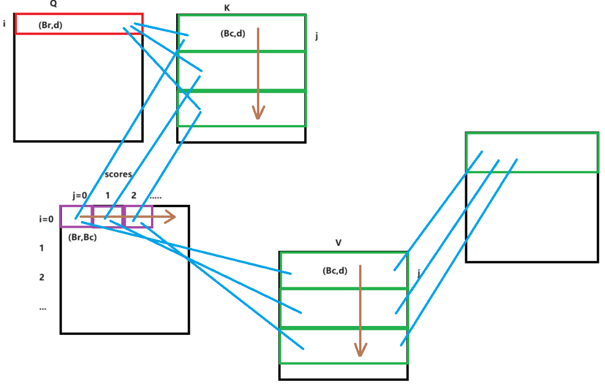

我们具体以i=2 j=3的块来作为示例，对应算法中的10，假设每块大小为`5x5`：

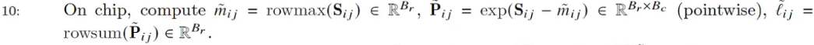

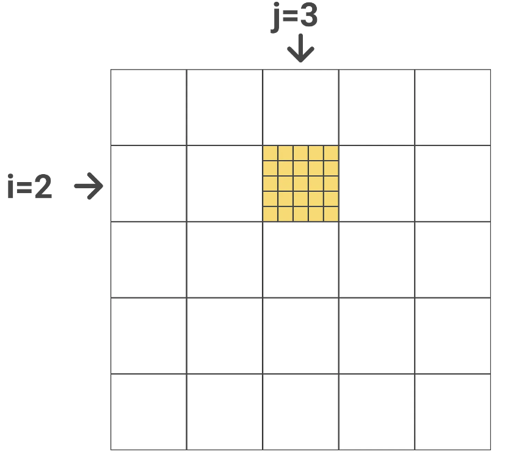

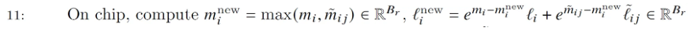

`mi`包含了在当前块(j=3)之前所有块的最大值(按行)，比如上面的例子，`mi`保存了j=1和j=2(图中的绿色块)块第6~10行的最大值。而`mij~`是上一步10得到的当前块(黄色)的最大值。因此取它们两者的最大值就得到前3个块(绿色加黄色块共15列)的最大值。`li^new`的计算也是类似的，只不过求和前需要用当前的`e^{-mi^new}`修正。

基于上一轮的`li`和`mi`得到新的`li^new`和`mi^new`之后，我们还需要修正之前算出来的注意力分数P。但是上一轮的P已经不在了，而我们有上一轮的`Oi`，所以我们可以直接对`Oi`进行修正（**O_i=P_ij * V_j**）。即12步：

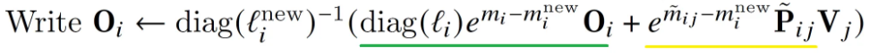

绿色部分：

将`Oi`乘以`diag(li)`，因为上一轮算`Oi`时，除以了局部sum，然后分子乘以`e^{mi-mi^{new}}`，来修正分子，再除以`diag(li^{new})`，得到`j<3`时的修正值。

黄色部分：

算当前`j=3`的值，也通过修正，得到目前的正确结果。

`diag`的作用是让矩阵的每行都能和`li`相乘

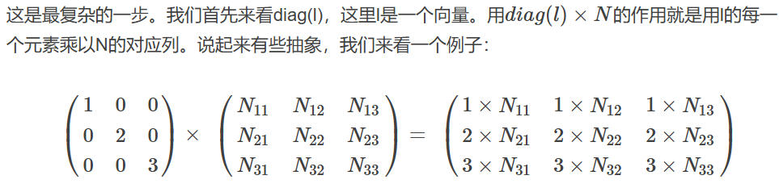

13步，将新的`li`和`lj`写回HBM。

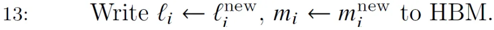

# 复杂度分析

## 访存

假设序列长度为N，head的维度为d，SRAM的大小是M，并且我们假设d≤M≤Nd。标准的Attention算法需要O(Nd+N2)的HBM 访问，而FlashAttention算法需要Θ(N2d2M−1)的HBM访问。

# V2版本

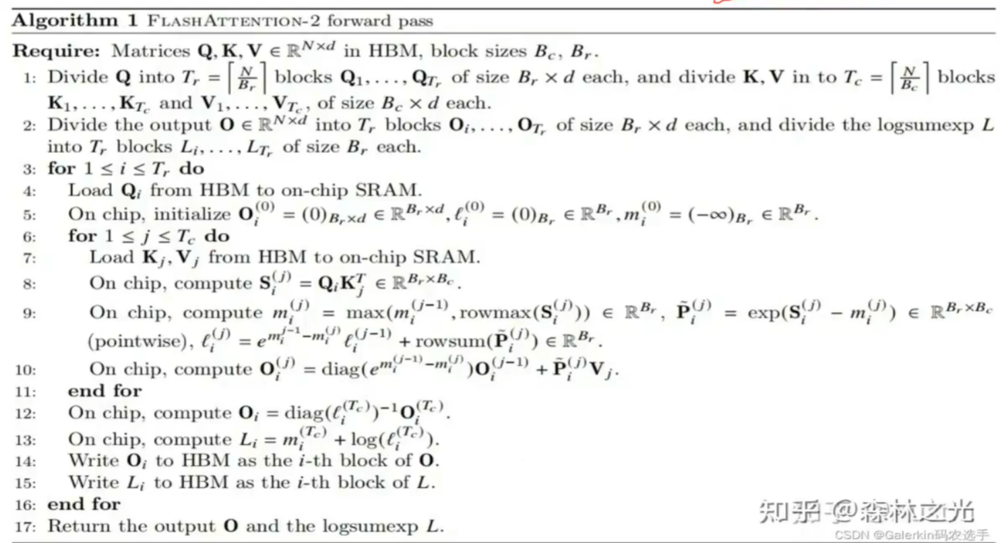

主要是将两个循环颠倒了一下，即外层对Q循环，内层对KV循环。

也可以用数学符号来表示

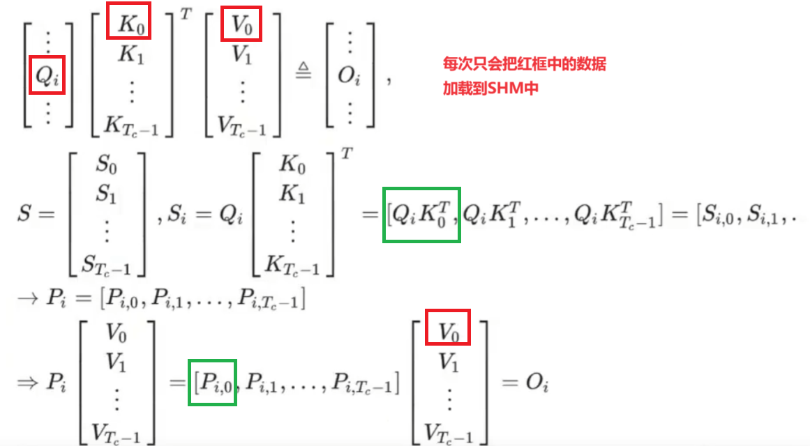

# Flash Attention

进一步地，在attention整体的流程中，可以进一步优化，变成一个循环。循环少了意味着访存次数就少了。

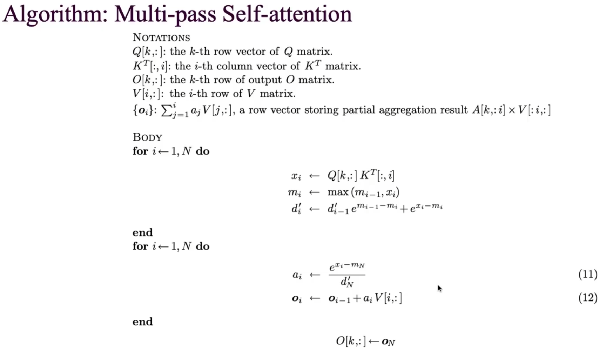

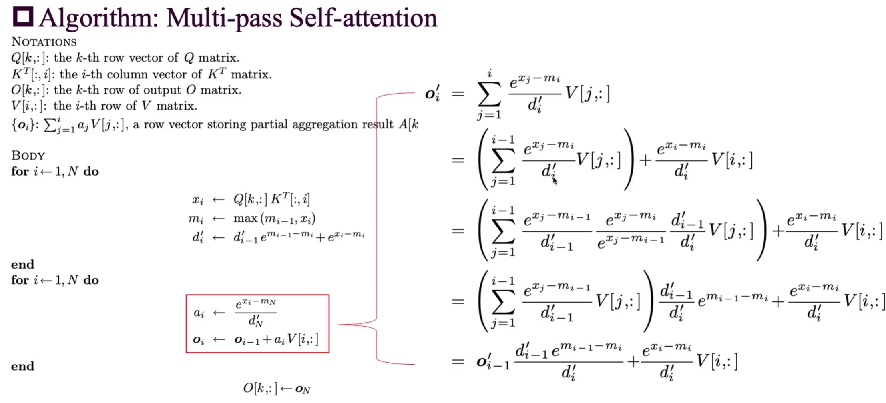

