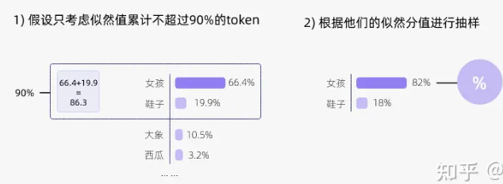
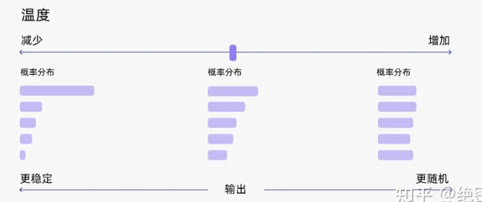

# 解码策略

https://www.zhihu.com/tardis/zm/art/647813179?source_id=1005

模型每次推理都会给出一个概率分布，表示它对下一个单词的预测。

那么，我们应该如何从这个概率分布中选择下一个单词呢？以下是几种常用的方法：

- **贪心解码**（Greedy Decoding）：直接选择概率最高的单词。这种方法简单高效，但是可能会导致生成的文本过于单调和重复。
- **随机采样**（Random Sampling）：按照概率分布随机选择一个单词。这种方法可以增加生成的多样性，但是可能会导致生成的文本不连贯和无意义。
- 温度采样
- **Beam Search**：维护一个大小为 k 的候选序列集合，每一步从每个候选序列的概率分布中选择概率最高的 k 个单词，然后保留总概率最高的 k 个候选序列。这种方法可以平衡生成的质量和多样性，但是可能会导致生成的文本过于保守和不自然。

以上方法都有各自的问题，而 **top-k** 采样和 **top-p** 采样是介于贪心解码和随机采样之间的方法，也是目前大模型解码策略中常用的方法。

## top-k

Top-k 采样是对前面“贪心策略”的优化，它从排名前 k 的 token 中进行抽样，允许其他分数或概率较高的token 也有机会被选中。

## top-p

top-k 有一个缺陷，那就是“k 值取多少是最优的？”非常难确定。于是出现了动态设置 token 候选列表大小策略——即核采样（Nucleus Sampling）。

在每一步，只从累积概率不超过某个阈值 p 的最小单词集合中进行随机采样，而不考虑其他低概率的单词。

如果 k 和 p 同时启用，则 p 在 k 之后起作用。

## 温度采样

温度调整单词的概率分布，通过将 logits 除以温度来实现温度采样，然后将其输入 Softmax 并获得采样概率。

**在较低的温度下，我们的模型更具确定性，而在较高的温度下，则不那么确定**。

## 联合采样

通常我们是将 top-k、top-p、Temperature 联合起来使用。使用的先后顺序是 top-k->top-p->Temperature。

首先我们设置 top-k = 3，表示保留概率最高的3个 token。这样就会保留女孩、鞋子、大象这3个 token。

- 女孩：0.664
- 鞋子：0.199
- 大象：0.105

接下来，我们可以使用 top-p 的方法，保留概率的累计和达到 0.9 的单词，也就是选取女孩和鞋子这两个 token。接着我们使用 Temperature = 0.7 进行归一化，变成：

- 女孩：0.660
- 鞋子：0.340

接着，我们可以从上述分布中进行随机采样，选取一个单词作为最终的生成结果。