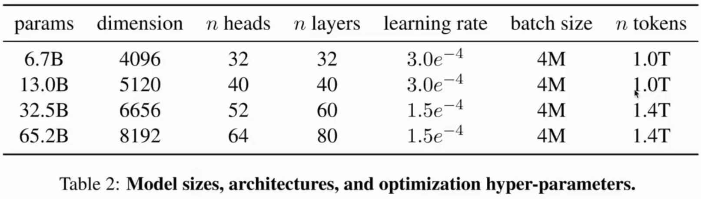
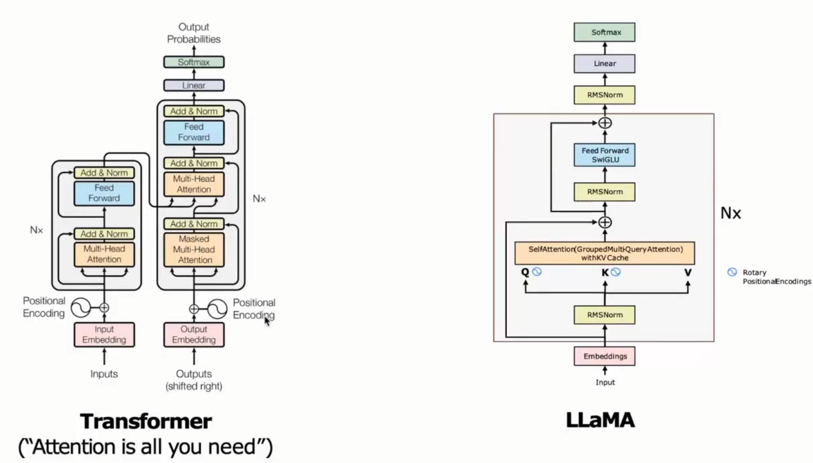
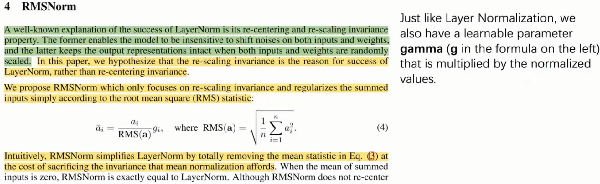
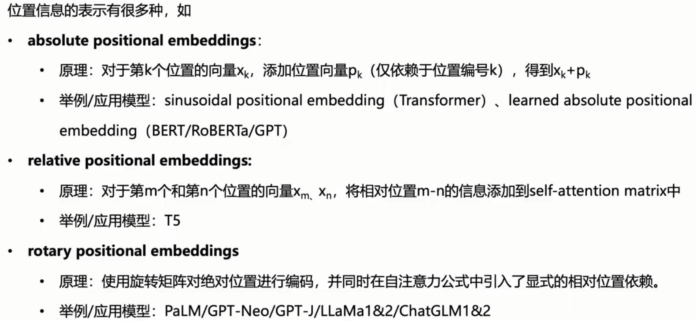
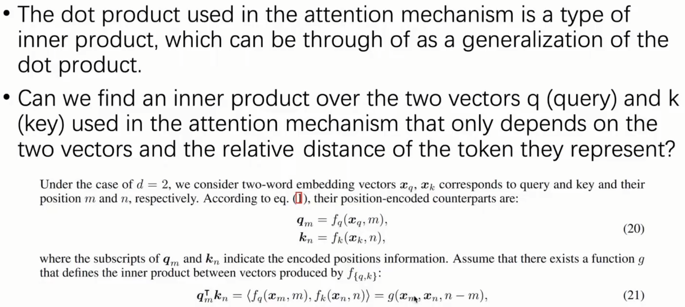
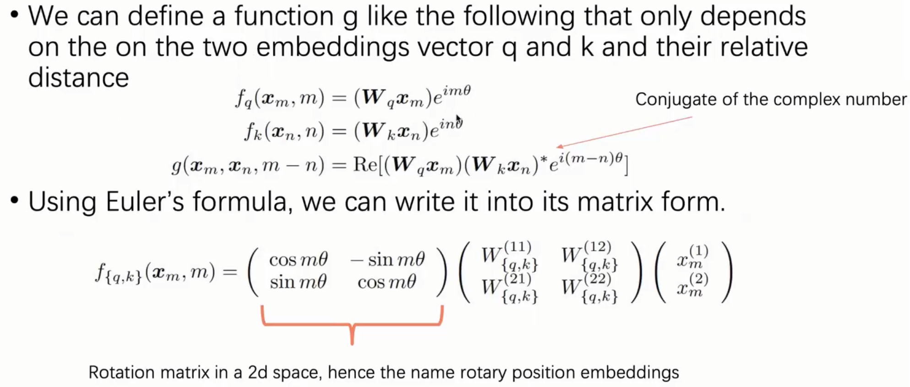
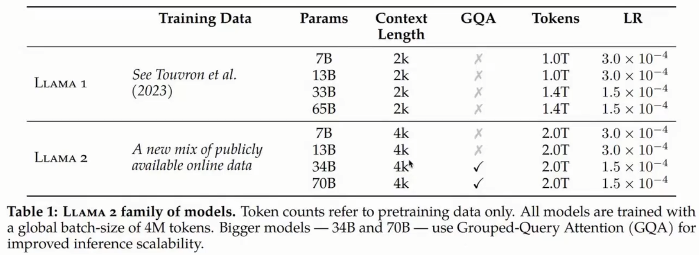
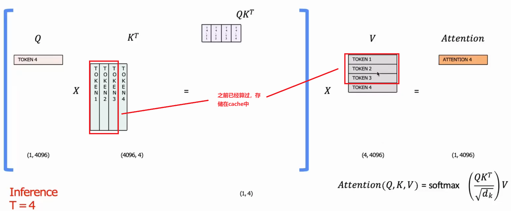
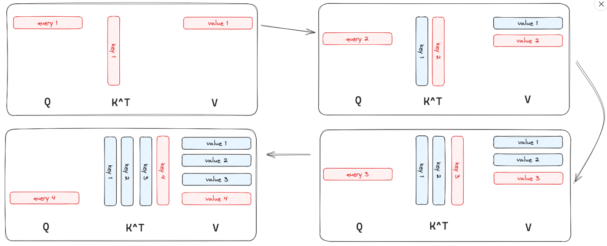

llama的下游任务就是将基础模型输出的hidden_states放入一个相信层，同时使用了不同的损失函数。


# LLaMA1

LLaMA1的参数量




LLaMA和Transformer的对比

pre-RMSNorm

Q和K的RoPE

KVCache

SwiGLU




## RMSNorm

简化了计算，使得训练/推理更快。



## PE



RoPE





# LLaMA2

LLaMA2相比于1

- 扩大了模型上下文长度，即一次能够输入的token个数。
- 对于34B和70B模型加入Grouped-Query Attention
- 加入更多的训练数据（重要）



## KV-Cache

在推理时，会有重复计算。T=4时，计算token1，2，3，4之间的分数，但是token1，2，3之间的分数在T=3时已经计算过了。


因此T=4时，只需要计算token4和token1，2，3，4的分数就可以了。



详细一点，T=1到T=4的流程如下，其中蓝色表示KV Cache缓存的值



采用了 KV Cache 的话 LLM 的推理过程可以看成 **2 个阶段**

1. 第一次迭代的时候，此时 KV Cache 为空，所有的输入的 token 都需要为其计算 key, value, query 向量，其中 key 和 value 会被缓存起来
2. 后续的每一次迭代，**只需要为新的 token 计算 key、value、query**，并更新 KV Cache

KV Cache 加速推理的代价是显存占用会变高，所以它是**空间换时间**的办法。关于开不开 KV Cache 的显存占用的对比可以总结为：

- 用 KV Cache - `2 * hidden_size * num_layers * decoder_length`
- 不用 KV Cache - `2 * hidden_size * 1 * decoder_length`


[LLM 推理加速 - KV Cache - MartinLwx's Blog](https://martinlwx.github.io/zh-cn/llm-inference-optimization-kv-cache/)

[Generate: using k-v cache is faster but no difference to memory usage - 🤗Transformers - Hugging Face Forums](https://discuss.huggingface.co/t/generate-using-k-v-cache-is-faster-but-no-difference-to-memory-usage/31272)

## Grouped Multi-Query Attention

Fast Transformer Decoding: One Write-Head is All You Need

Q还是多个head，但是K和V变成一个head。

```bash
# 原始
Q ()

# 当前
```

