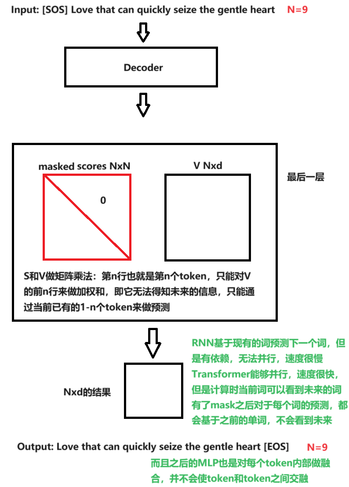
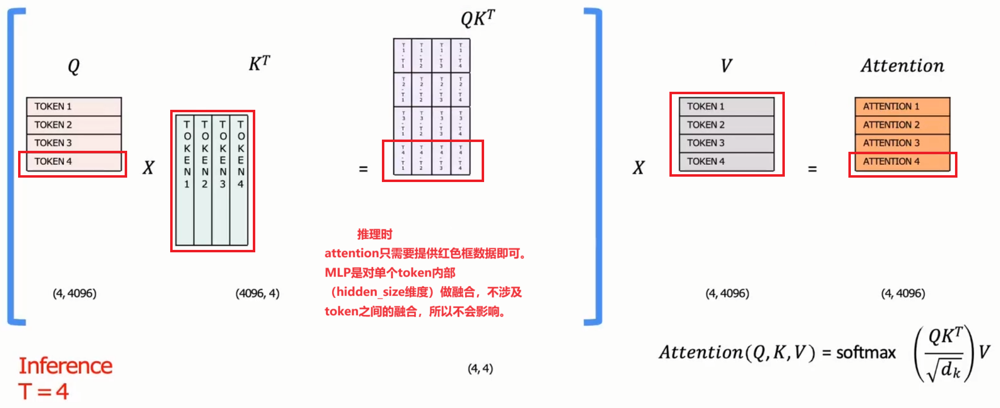

# Train

训练时固定上下文长度，静态shape，提前裁剪/padding

原始文本前端补充`[SOS]`，末端补充`[EOS]`，然后去`tokens[:-1]`作为输入，`tokens[1:]`作为预测值。举个例子

 ```bash
src: [SOS] Love that can quickly seize the gentle heart [EOS]

Input: [SOS] Love that can quickly seize the gentle heart

Output: Love that can quickly seize the gentle heart [EOS]
 ```

## 关于mask



# Inference

一个典型的大模型生成式推断包含了两个阶段：

1. 预填充（Prefill）阶段：输入一个 **prompt 序列**，为每个 transformer 层生成 key cache 和 value cache（KV cache）。
   - 此时，KV Cache 是空的
   - 存在大量的 gemm 操作，推理速度慢
   - **一串输入生成一个 token**
2. 解码（Generate）阶段：使用并更新 KV cache，一个接一个地生成词，当前生成的词依赖于之前已经生成的词。这样不断反复，直到遇到终止符才停止（或者超过最大的生成长度）。
   - gemm 变为 gemv 操作，推理速度相对较快
   - **一个 token 生成一个 token**


## 关于解码阶段

预测时，每次只得到一个词。举个例子：

```bash
T=1	Input [SOS]				 	Output Love

T=2	Input [SOS] love			Output Love that

T=3	Input [SOS] Love that 		 Output Love that can

....
```

观察T=2和T=3的输入，只差了一个单词`that`，因此在T=3阶段，能够决定输出的关键是`that`，所以预测next token时，只需要输入新得到的单词即可。



在每一步推理时，我们仅仅对最后一个词感兴趣，因为之前的词已经得到过了。但是每次都需要重复将之前的词输入网络（因为它们构成上下文），非常浪费计算资源。

通过KVCache可以使得模型减少这部分的计算量。

## 关于预填充阶段

在解码阶段，输入一个词，生成一个词。但是在预填充阶段，输入一个prompt序列，为什么也只生成一个token呢？可以看下面GPT2的代码，输入prompt序列，也会得到一个长序列，我们只取最后一个token。

```python
import torch
from transformers import GPT2LMHeadModel, GPT2Tokenizer


model = GPT2LMHeadModel.from_pretrained("/WORK/Test/gpt", torchscript=True).eval()

# tokenizer
tokenizer = GPT2Tokenizer.from_pretrained("/WORK/Test/gpt")
in_text = "Lionel Messi is a"
in_tokens = torch.tensor(tokenizer.encode(in_text))	# 分词，然后得到每个词在词表中的Index

# inference
token_eos = torch.tensor([198]) # line break symbol
out_token = None
i = 0
with torch.no_grad():
    while out_token != token_eos:
        logits, _ = model(in_tokens) # logits是一组词（序列），其中包含每个词在词表中的概率 二维
        out_token = torch.argmax(logits[-1, :], dim=0, keepdim=True) # 取最后一个词 并选择最大概率的词下标 即得到一个index
        in_tokens = torch.cat((in_tokens, out_token), 0) # 将之前的词和新的到的词拼接作为下一次的输入
        text = tokenizer.decode(in_tokens)
        print(f'step {i} input: {text}', flush=True)
        i += 1

out_text = tokenizer.decode(in_tokens)
print(f' Input: {in_text}')
print(f'Output: {out_text}')
```

[KV Cache：LLM 推理加速 — Bookstall](https://bookstall.github.io/2023/12/17/kv-cache/#生成式-llm-的推理过程)