# 概述

大模型第一定律

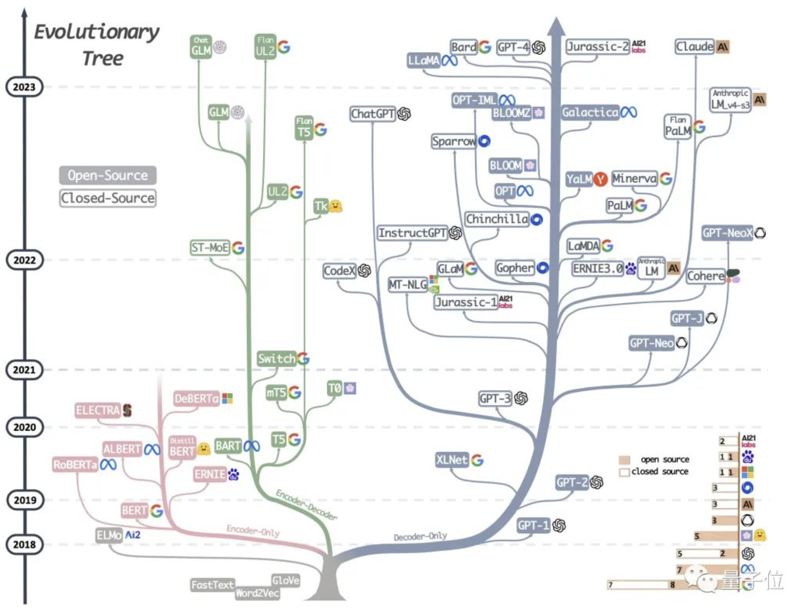

- transformer的encoder结构取出来，即BERT系列模型
- decoder结构取出来，即GPT系列模型。专注于做生成任务

## LLM创新

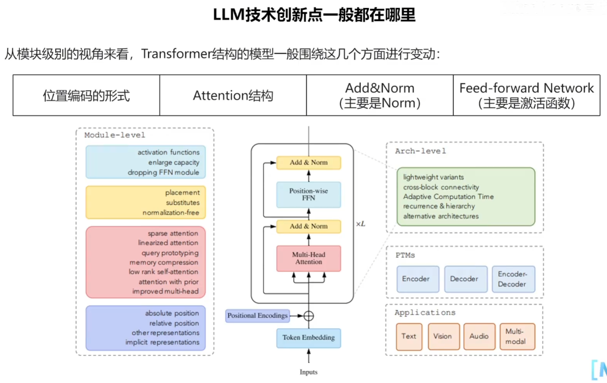

# LLaMA

[第十五课：LLaMA_哔哩哔哩_bilibili](https://www.bilibili.com/video/BV1nN41157a9/?spm_id_from=333.337.top_right_bar_window_history.content.click&vd_source=b9f75d9bc23add3c1afdb0c760a8431b)

 LLaMA-13B > GPT-3-175B

LLaMA的优点

- 单GPU可运行
- 开源公开数据集训练
- 开源

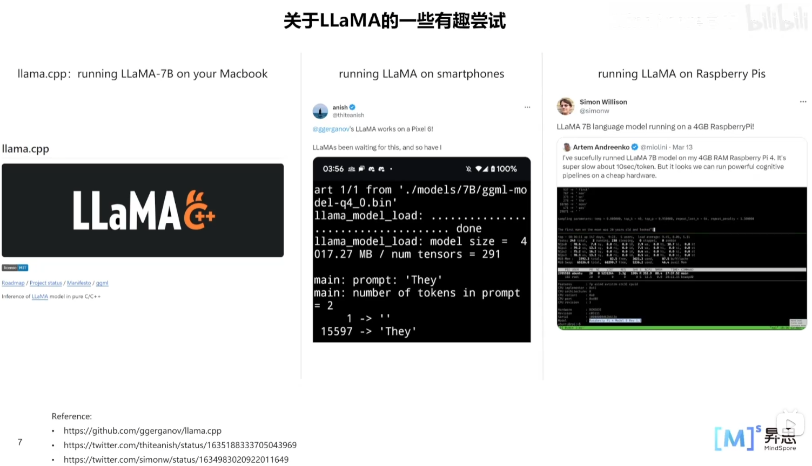

LLaMA的家族树

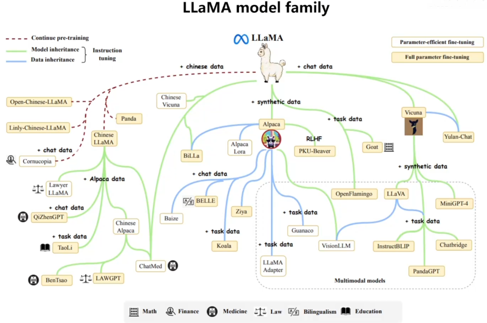

## PositionEncoding

RoPE旋转位置编码 相对和绝对信息的融合 用绝对位置编码表征相对位置编码

LLM如何处理超长序列？一般训练时会固定上下文长度，例如1024个token。但有时需要模型生成很长的数据，例如一篇小说等。这涉及到模型的外推能力。

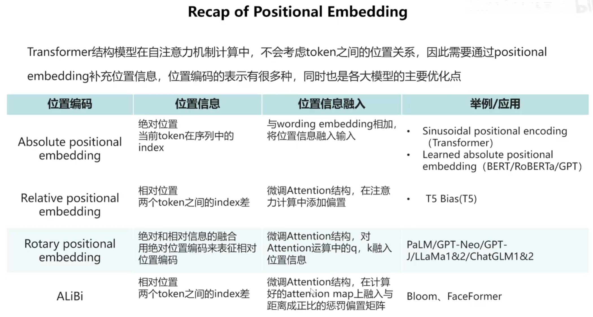

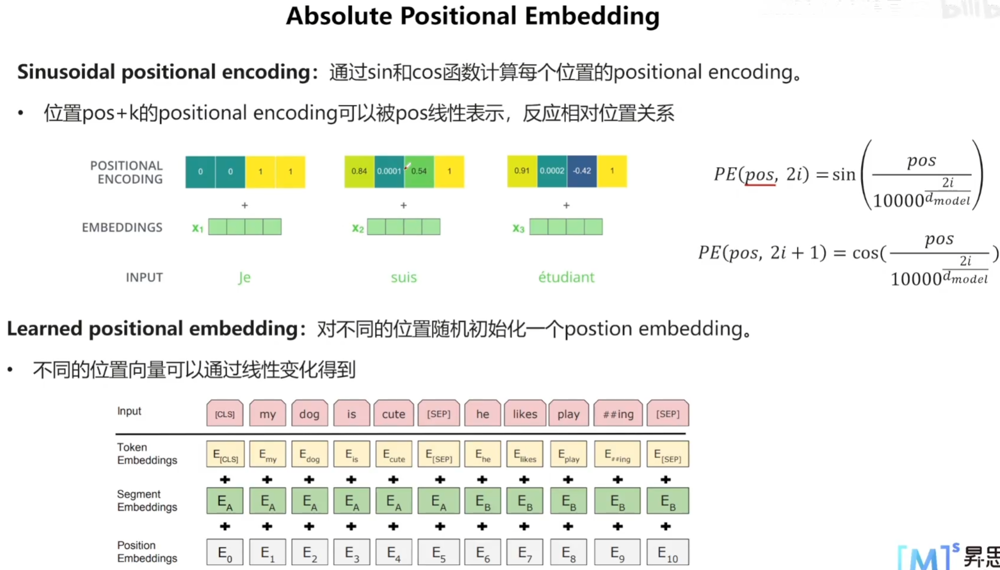

第m个token和第n个token做点积时，结果只和(m-n)有关

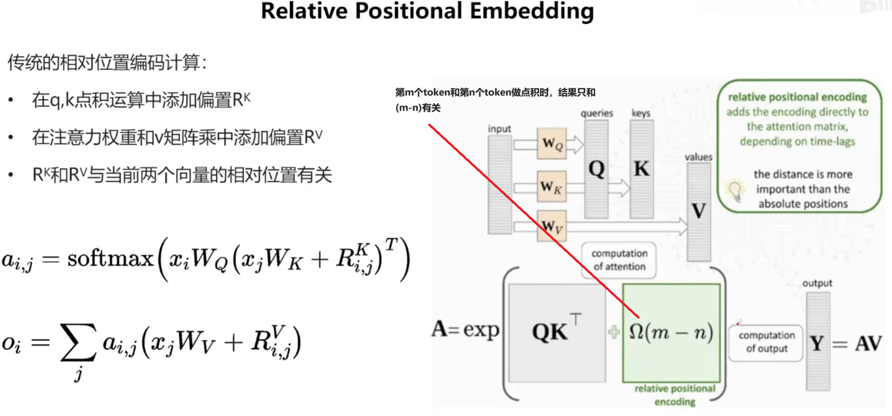

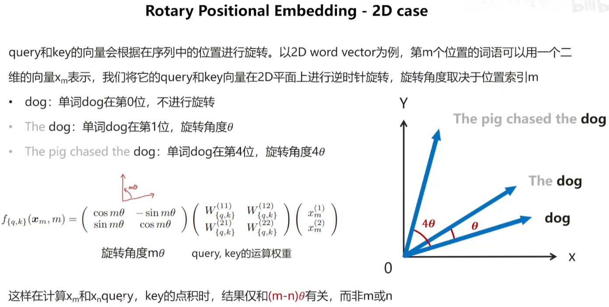

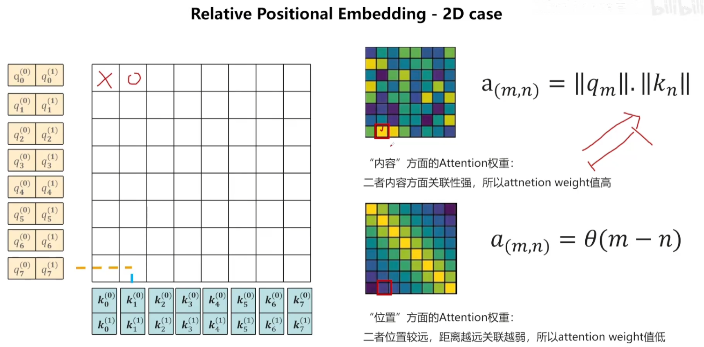

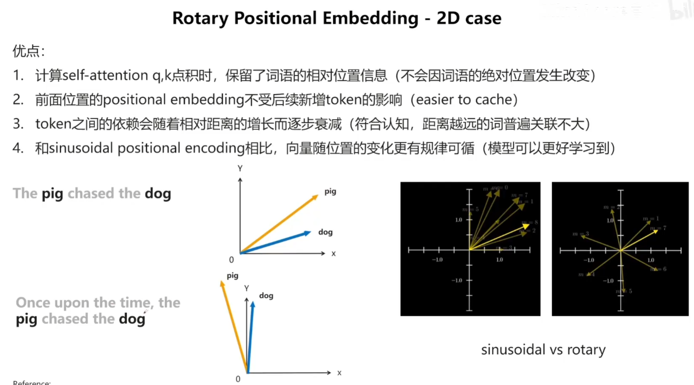

## Attention

## Norm

- Norm的位置发生变化

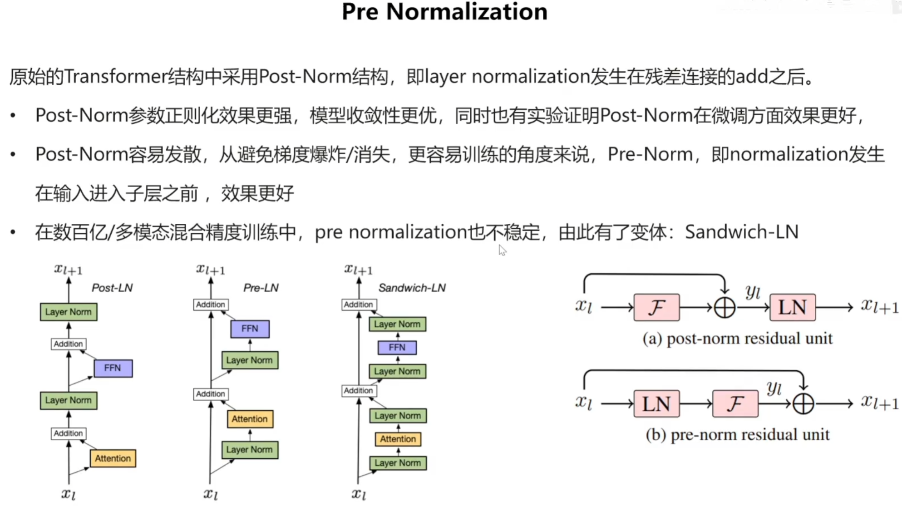

- 采用RMSNorm

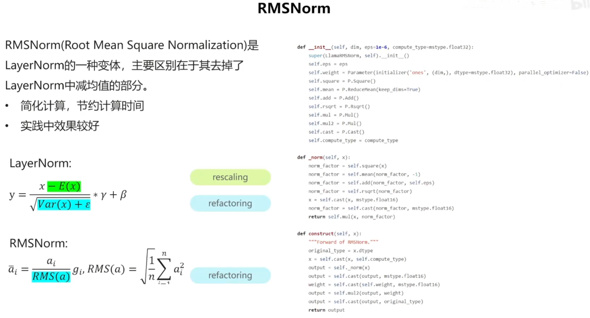

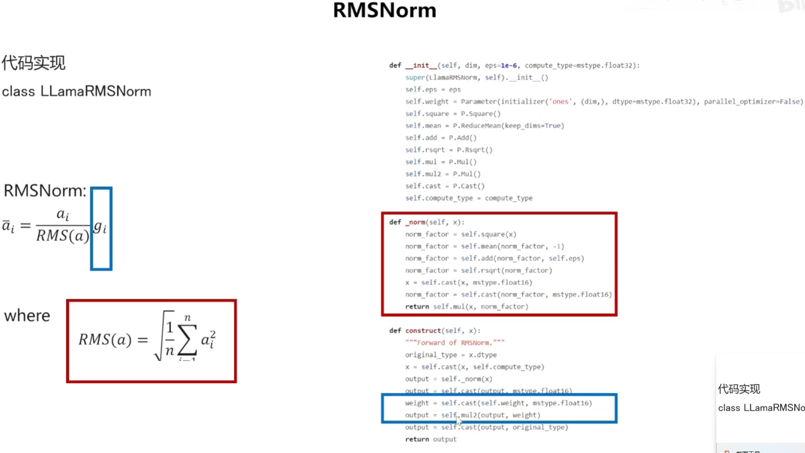

## FFN

激活函数改为SwiGLU

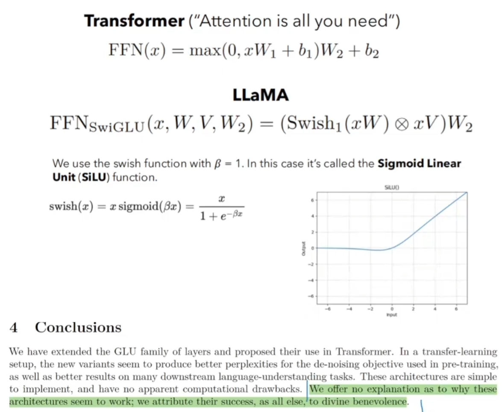