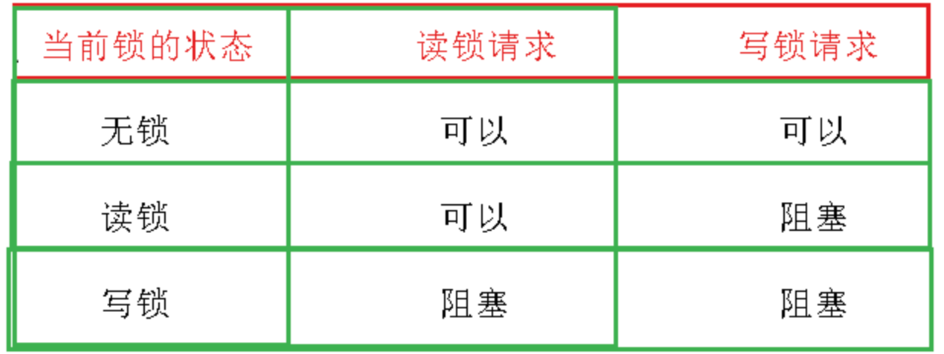
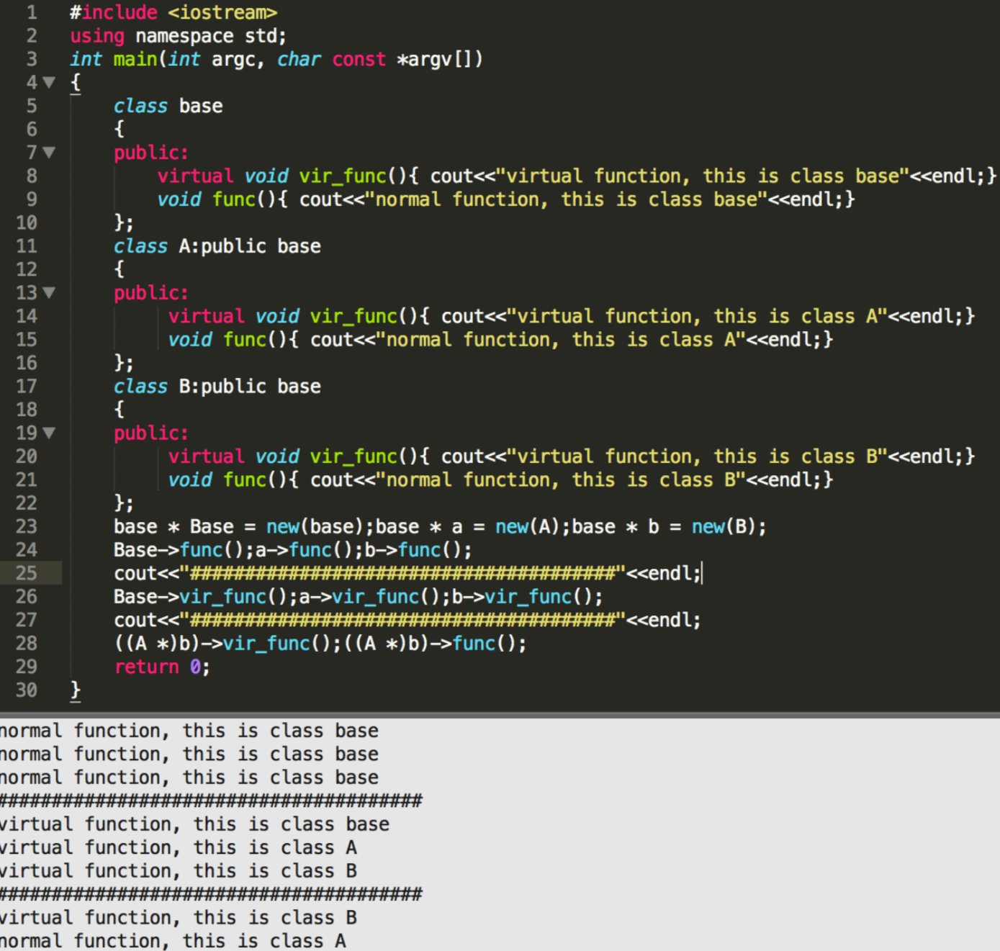
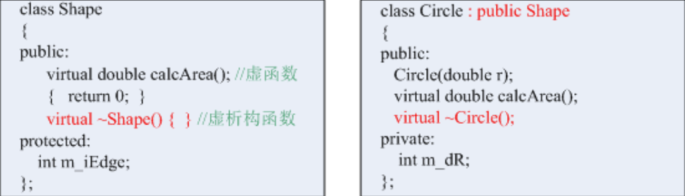
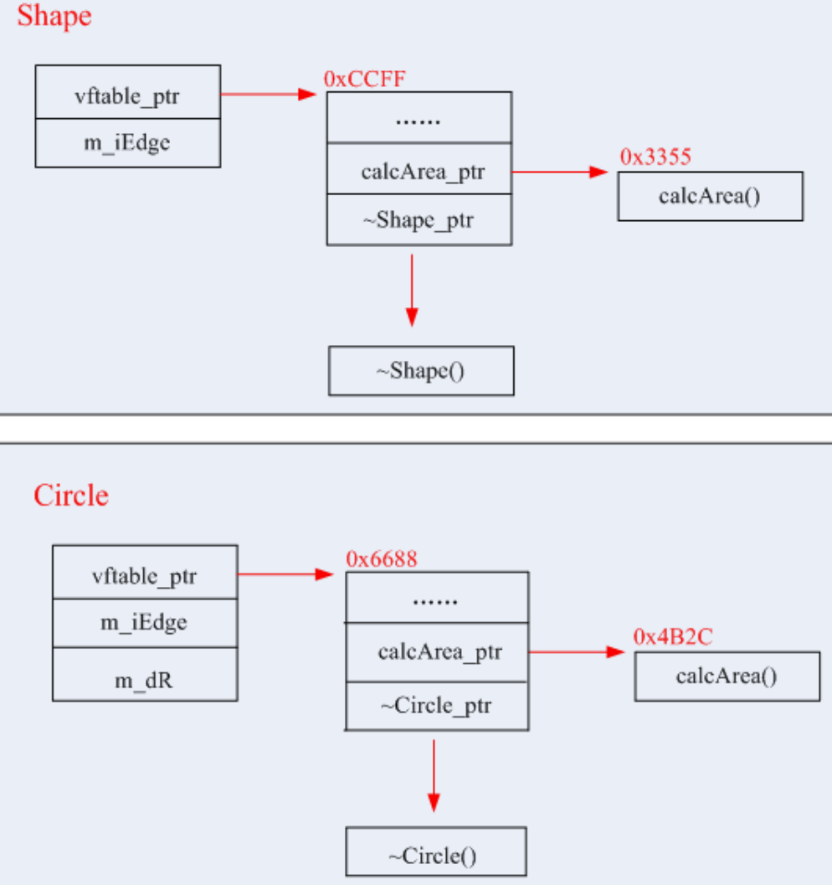
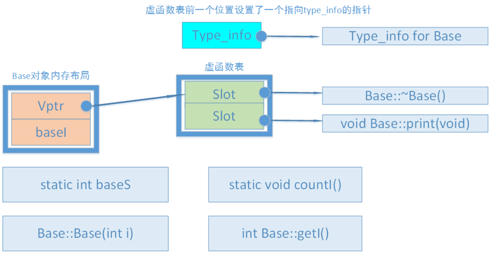

# C++语言特性

## 空基类优化EBO

空类的大小为1，即

```c++
class Empty{

};
sizeof(Empty);	// 1 
```

那么在使用时，为了字节对齐会浪费空间。即：

```c++
class NotEBO{
	int i;
    Empty e;
};

sizeof(NotEBO);	// 8
```

既然这个类是空类（只有成员方法），那么采用继承也可以达到同样的目的，而且还节省了空间

在STL中，各种容器在添加对象时都会使用内存管理器（allocator）

```c++
std::allocator<_Tp>	// 实际就是new_allocator
__gnu_cxx::bitmap_allocator<_Tp>
__gnu_cxx::bitmap_allocator<_Tp>
__gnu_cxx::__mt_alloc<_Tp>
__gnu_cxx::__pool_alloc<_Tp>
__gnu_cxx::malloc_allocator<_Tp>
```

它们都是空类

```c++
void print() {
    cout<<sizeof(std::allocator<int>)<<" "<<sizeof(std::allocator<int>::rebind<int>::other)<<endl;
    cout<<sizeof(__gnu_cxx::bitmap_allocator<int>)<<" "<<sizeof(__gnu_cxx::bitmap_allocator<int>::rebind<int>::other)<<endl;
    cout<<sizeof(__gnu_cxx::new_allocator<int>)<<" "<<sizeof(__gnu_cxx::new_allocator<int>::rebind<int>::other)<<endl;
    cout<<sizeof(__gnu_cxx::__mt_alloc<int>)<<" "<<sizeof(__gnu_cxx::__mt_alloc<int>::rebind<int>::other)<<endl;
    cout<<sizeof(__gnu_cxx::__pool_alloc<int>)<<" "<<sizeof(__gnu_cxx::__pool_alloc<int>::rebind<int>::other)<<endl;
    cout<<sizeof(__gnu_cxx::malloc_allocator<int>)<<" "<<sizeof(__gnu_cxx::malloc_allocator<int>::rebind<int>::other)<<endl;
}
```

所以STL的容器都会继承这些内存管理器，而不是组合，从而实现了空基类优化，例如红黑树：

```c++
class _Rb_tree {
    typedef typename __gnu_cxx::__alloc_traits<_Alloc>::template
    		rebind<_Rb_tree_node<_Val> >::other _Node_allocator;
    struct _Rb_tree_impl
        : public _Node_allocator
            , public _Rb_tree_key_compare<_Key_compare>
            , public _Rb_tree_header {...}
    _Rb_tree_impl<_Compare> _M_impl;
    ... }
```

## dynamic_cast和RTTI

RTTI 运行时类型识别

c++是静态类型语言，通常在编译时类型就已确定。但在多态的情况下，C++中的指针或引用(Reference)本身的类型，可能与它实际代表(指向或引用)的类型并不一致。和Java相比，C++要想获得运行时类型信息，只能通过RTTI机制，并且C++最终生成的代码是直接与机器相关的。

Java中任何一个类都可以通过反射机制来获取类的基本信息，而且Java中还提供了一个关键字，可以在运行时判断一个类是不是另一个类的子类或者是该类的对象。

RTTI提供了两个非常有用的操作符：typeid和dynamic_cast。

- typeid操作符，返回对象的实际类型。该函数反回一个对type_info类对象的引用。
- dynamic_cast操作符。

### staic_cast的缺点

```c++
static_cast <type_name> (expression)    
```

以下条件只要满足任一条,则转换合法:

- type_name可被隐式转换为expression所属的类型 
- expression可被隐式转换为type_name所属的类型. 

因此下面的两个转换都是可以通过编译的。

```c++
class Base {
public:
    Base() : b(1) {}

    virtual void virtual_fun() {
        cout << "base" << endl;
    }

    void fun1() {
        cout << "b:" << b << endl;
    }

    int b;
};

class Derived : public Base {
public:
    Derived() : d(2) {}

    void virtual_fun() override {
        cout << "derived" << endl;
    }

    void fun2() {
        cout << "d:" << d << endl;
    }

    int d;
};

// basePtr1指向子类对象 1
Derived *derivedPtr2 = static_cast<Derived *>(basePtr1);
// basePtr2指向父类对象 2
Derived *derivedPtr4 = static_cast<Derived *>(basePtr2);

/// 不报错是因为函数寻址是通过指针的类型
derivedPtr4->fun2();            /// 输出的d是错误值
derivedPtr4->virtual_fun();     /// 调用base版本的函数 因为虚指针没有改变
```

但是，在一般情况下，子类对象可以转换为父类对象，而父类对象不能转换为子类对象。所以2是不允许的，然而static_cast运行成功了，其中子类多出的成员变量的值是不确定的，而且虚函数指针vptr也是不正确的。

总结如下：

1. 在类层次间进行上行转换时，dynamic_cast 和 static_cast 的效果是一样的。（在C++中，当类对象在向上转型时，对象中的虚表指针vptr不会被改变。）
2. 在类层次间进行下行转换时，dynamic_cast 具有类型检查的功能，比static_cast 更安全。因为dynamic_cast会做运行时的检查

**dynamic_cast转换符只能用于含有虚函数的类**。当我们进行dynamic_cast时，编译器会帮我们进行语法检查。如果指针的静态类型和目标类型相同，那么就什么事情都不做。如果转换无法进行，对于指针转换，它返回 `nullptr`；对于引用转换，它抛出一个 `std::bad_cast` 异常。

# C++11 新特性

## 并发支持

- 新的内存模型，定义了多线程并发环境下对共享数据的访问和修改行为。
- 提供原子类型和无锁编程的支持
- 提供了thread库，支持线程创建，管理，同步。mutex锁，条件变量。
- 异步编程。future和promise机制。

## 类型推导和初始化

- auto关键字，自动类型推导。
- 初始化列表{}。

## 智能指针和内存管理

- unique_ptr/shared_ptr/weak_ptr

## lambda表达式

- 匿名的函数对象（闭包）。可以捕获外部作用域中的变量。

## 新的语法和特性

- range-based for循环。跟方便地遍历容器。
- 引入空指针nullptr。

## 类和模板的改进

- 类的改进。删除成员函数delete。类中默认的函数（六个）。final。override
- 右值引用，移动语义

## STL扩展

- unordered_map/set。
- 新的算法，迭代器。

## 原子操作

不可中断，线程安全。相对于mutex开销低。


## C++11初始化  区分{}()

1. 大括号初始化可以适用于几乎任何场合

```c++
int x(0);
int y = 0;
int z{0};

// 大括号和等号可以为类内非静态成员指定默认初始化
class A{
	int x{10};
	int y = 10;
	int z(0);	// 不可以
}

// 大括号和小括号——不可复制的对象
std::atomic<int> a1{0};
std::atomic<int> a1(0);
std::atomic<int> a1 = 0;	// 不可以行
```

2. 禁止内建类型之间进行隐式narrow conversion

3. 免疫解析语法。

C++规定，任何能够解析为声明的都要解析为声明。

```c++
// 声明了一个函数
Widget w2();

Widget w2{};
```

4. 创建容器时可以逐个指定值 

存在的问题：

在构造函数重载决议期间，只要有任何可能，大括号初始化就会优先与带有std::initializer_list类型的形参相匹配，即使其他重载版本有着貌似更加匹配的形参表。

```c++
std::vector<int> v1(1,2);	// 1个2
std::vector<int> v2{1,2};	// 1和2
```

模板中也会有类似的情况：

```c++
template <typename T, typename... Ts>
void doSomeWork(Ts &&... params){
	T localObj(std::forward<Ts>(params)...);	// 10个20
	T localObj{std::forward<Ts>(params)...};	// 10和20
	// 所以这里代码到底怎么写呢？因为无法知道调用者的意图。
}

doSomeWord<std::vector<int>>(10, 20);
```

但如果使用空的大括号{}来构造一个对象，而该对象即支持默认构造函数，也支持带有std::initializer_list类型形参的构造函数，语言规定会执行默认构造函数。即空{}表示没有实参，而不是空的std::initializer_list。

```c++
class Widget{
public:
	Widget();
	Widget(std::initializer_list<int> il);
}

Widget w1;	// 调用默认构造函数
Widget w2{};  // 调用默认构造函数
Widget w3(); /// 函数声明

int fun(){
    Widget w4();	// 非函数声明
}

Widget w5{{}};
```


## 右值引用

右值是表达式的中间结果/函数返回值，是将亡值，相比于左值它不能取地址。右值引用只能引用右值，延长了右值的生命周期。右值引用本身却是左值。

引入右值引用，其实是为了移动语义，减少拷贝。std::move就是将左值转为右值引用。

## move

move输入参数类型是万能引用，既可以接收左值，也可以接收右值。这涉及到C++的**型别推导**和**引用折叠**。

```c++
template <typename T>
typename remove_reference<T>::type&& move(T&& t)
{
    return static_cast<typename remove_reference<T>::type&&>(t);
}
```

move什么也移动不了，唯一功能是把左值/右值强制类型转换为右值，让右值引用可以指向左值。

有了移动语义之后，STL和自定义类中就可以定义移动构造函数，移动赋值函数，从而避免拷贝，提升程序性能。

## forward完美转发

允许模板函数在转发参数时保留参数的左值和右值属性，以及相关的const/volatile限定符。

通过万能引用来实现。而万能引用通过引用折叠的规则来确保参数的原始值类别得以保留。

一般搭配模板，从而实现万能转发。

## C++ 多线程


## C++ 读写锁（共享独占锁）

如果线程A只是想读取变量i，但不确定有没有线程去写i，所以还是要加锁。此时又有一个线程B也想读取变量i，发现被锁定了，只能等待。但两个读操作本质上是非独占的。不加区分使用互斥量显然很浪费

STL(C++14)和Boost都提供了shared_mutex

所谓读写锁，就是同时可以被多个读者拥有，但只能被一个写者拥有的锁。**而所谓「多个读者、单个写者」，并非指程序中只有一个写者（线程），而是说不能有多个写者同时去写。**



一个简单的计数器例子：

```c++
class Counter {
public:
  Counter() : value_(0) {
  }

  // Multiple threads/readers can read the counter's value at the same time.
  std::size_t Get() const {
    std::shared_lock<std::shared_mutex> lock(mutex_);
    return value_;
  }

  // Only one thread/writer can increment/write the counter's value.
  void Increase() {
    // You can also use lock_guard here.
    std::unique_lock<std::shared_mutex> lock(mutex_);
    value_++;
  }

  // Only one thread/writer can reset/write the counter's value.
  void Reset() {
    std::unique_lock<std::shared_mutex> lock(mutex_);
    value_ = 0;
  }

private:
  mutable std::shared_mutex mutex_;
  std::size_t value_;
};
```

## 

## RAII

RAII 资源获取是初始化。对C++资源（内存，文件句柄，网络连接）的一种管理策略。

它将资源的生命周期和对象的生命周期绑定在一起。资源的获取和释放都通过对象的构造函数/析构函数来管理。从而确保资源在对象生命周期结束时自动释放。

## C++智能指针

自动管理动态分配的内存。

### unique_ptr

独占所有权。不能拷贝，只能移动。

### shared_ptr

共享所有权

shared_ptr多个指针指向相同的对象。shared_ptr使用引用计数，每一个shared_ptr的拷贝都指向相同的内存。每使用他一次，内部的引用计数加1，每析构一次，内部的引用计数减1，减为0时，自动删除所指向的堆内存。shared_ptr内部的引用计数是线程安全的，但是对象的读取需要加锁

make_shared可以一次性创建对象和控制块，性能更好，符合RAII。

### weak_ptr

不拥有所有权。

`shared_ptr`的一个最大的陷阱是循环引用，循环引用会导致堆内存无法正确释放，导致内存泄漏。

```c++
#include <iostream>
#include <memory>

class Parent;  // Parent类的前置声明

class Child {
public:
    Child() { std::cout << "hello child" << std::endl; }
    ~Child() { std::cout << "bye child" << std::endl; }

    std::shared_ptr<Parent> father;
};

class Parent {
public:
    Parent() { std::cout << "hello Parent" << std::endl; }
    ~Parent() { std::cout << "bye parent" << std::endl; }

    std::shared_ptr<Child> son;
};

void testParentAndChild() {

}

int main() {
    std::shared_ptr<Parent> parent(new Parent());  // 1  资源A
    std::shared_ptr<Child> child(new Child());  // 2   资源B
    parent->son = child;     // 3   child.use_count() == 2 and parent.use_count() == 1 
    child->father = parent;  // 4   child.use_count() == 2 and parent.use_count() == 2

    return 0;
}

/*
输出：
hello Parent
hello child
*/
```

要想解决上面循环引用的问题，只能引入新的智能指针`std::weak_ptr`。`std::weak_ptr`有什么特点呢？与`std::shared_ptr`最大的差别是在赋值的时候，不会引起智能指针计数增加。

- `weak_ptr`被设计为与`shared_ptr`共同工作，可以从一个`shared_ptr`或者另一个`weak_ptr`对象构造，获得资源的观测权。
- 同样，在`weak_ptr`析构时也不会导致引用计数的减少，它只是一个静静地观察者。`weak_ptr`没有重载`operator*`和`->`，这是特意的，因为它不共享指针，不能操作资源，这是它弱的原因。
- 如要操作资源，则必须使用一个非常重要的成员函数`lock()`从被观测的`shared_ptr`获得一个可用的`shared_ptr`对象，从而操作资源。
- `weak_ptr`提供了expired()允许检测所指向的对象是否仍然存在。
- 


使用智能指针虽然能够解决内存泄漏问题，但是也付出了一定的代价。以`shared_ptr`举例：

- `shared_ptr`的大小是原始指针的两倍，因为它的内部有一个原始指针指向资源，同时有个指针指向引用计数。
- 引用计数的内存必须动态分配。虽然一点可以使用`make_shared()`来避免，但也存在一些情况下不能够使用`make_shared()`。
- 增加和减小引用计数必须是原子操作，因为可能会有读写操作在不同的线程中同时发生。比如在一个线程里有一个指向一块资源的`shared_ptr`可能调用了析构（因此所指向的资源的引用计数减一），同时，在另一线程里，指向相同对象的一个`shared_ptr`可能执行了拷贝操作（因此，引用计数加一）。原子操作一般会比非原子操作慢。但是为了线程安全，又不得不这么做，这就给单线程使用环境带来了不必要的困扰。

# 

# C++ 编译

## 编译过程-预编译

1. 预处理阶段。预处理器根据以#开头的预编译指令，修改原始程序。主要规则如下：
   - 将所有#define删除，并展开所有的宏定义
   - 处理所有条件预编译指令。比如#if #ifdef #endif
   - 处理#include预编译指令，将被包含的文件插入预编译指令的位置，这个过程是递归进行的
   - 删除所有注释
   - 添加行号和文件名标识。便于编译器产生调试用的行号，显示编译错误和警告的行号
   - 保留所有#pragma编译器指令。因为编译器要使用。
2. 编译阶段。编译器`ccl/cclplus`将.i文件编译成.s文件，得到汇编语言程序。（gcc只是这些后台程序的包装）。主要做词法分析，语法分析，语义分析以及优化后生成相应的汇编代码文件。
3. 汇编阶段。汇编器`as`将.s文件翻译为机器指令，把这些机器指令打包为**可重定位目标程序**，生成.o文件。
4. 链接阶段。将多个目标文件/库文件进行捆绑打包，最终得到可执行文件。主要包含了地址和空间分配。符号决议/绑定，重定位。

## 目标文件的格式

ELF(Executable Linkable Format)文件类型：

1. 可重定位文件。.o文件/静态链接库
2. 可执行文件。
3. 共享目标文件。动态链接库
4. 核心转储文件。core dump文件，包含进程地址空间的内容及终止时的一些其他信息。

目标文件中包含编译后的机器指令代码，数据。还有链接时要用的符号表，调试信息。

## 静态链接

对相对地址进行修改。编译产生的所有目标文件都使用相对地址，从0开始。

变换外部调用符号。把每个目标文件中所用到的外部调用符号也都变换为相对地址。

一些通用的库会被重复打包到程序中，浪费空间。

## 动态链接


# C++关键字

## mutable

用于类中定义的成员变量，并且表示这个成员变量可以在const成员函数中被修改。

对于const对象，编译器默认执行按位常量性，即每一个字节都不可以改变。如果某个成员变量修改并不影响对象的逻辑常量性，那么可以设置为mutable。

```c++
class A{
muteble int counter;
public:
	void constMemberFunc() const {counter++;}
}
```

## const

修饰符：修饰变量

限制符：限制成员函数，此时this指针是const T*，即this是一个指向常量的指针，不能修改类的非静态成员变量，也不能调用其他非const成员函数。const对象可以调用这类成员函数

## volatile

它是被设计用来修饰被不同线程访问和修改的变量。如果没有volatile，基本上会导致这样的结果：要么无法编写多线程程序，要么编译器失去大量优化的机会。

volatile提醒编译器它后面所定义的变量随时都有可能改变，因此程序每次需要存储或读取这个变量的时候不做优化，都会直接从变量内存地址中读取数据，从而可以提供对特殊地址的稳定访问。

如果没有volatile关键字，则编译器可能优化读取和存储，可能暂时使用寄存器中的值，如果这个变量由别的程序更新了的话，将出现不一致的现象。


## static

用来控制变量的存储方式和可见性。

https://www.bilibili.com/list/watchlater?oid=1504162053&bvid=BV19D421K7hv&spm_id_from=333.999.top_right_bar_window_view_later.content.click

修饰五种变量/函数：

```c++
struct Test{
	static int sta_member;		// 1 静态成员变量
	static void sta_method();	// 2 静态成员函数
};

static int sta_global_val;		// 3 静态全局变量
static int sta_func();		 	// 4 静态普通函数

void Demo(){
    static int sta_local_val;	 // 5 静态局部变量
}
```

五种场景包含了三种语义。

### 第一种语义 1和2

一个类只包含一份，没有this指针，因此只能访问类的静态数据和静态成员函数，和对象无关。

静态成员函数不能是虚函数

```c++
Test a;
using f_t = std::function<void()>;
f_t f1 = std::bind(&Test::sta_method);
f_t f2 = std::bind(&Test::method, &a);	// 非静态函数还需要传入一个对象
```

### 第二种语义 3和4

static -> inner 限定在当前文件内访问

### 第三种语义 5


### 生命周期

### 存储位置

初始化的static全局/局部变量/全局变量存储在.data段

未初始化的static全局/局部变量/全局变量存储在.bss段。默认初始化为0。

### 初始化

**non-local static对象（函数外）**

C++规定，non-local static 对象的初始化发生在main函数执行之前，也即main函数之前的单线程启动阶段，所以不存在线程安全问题。但C++没有规定多个non-local static 对象的初始化顺序，尤其是来自多个编译单元的non-local static对象，他们的初始化顺序（谁先谁后）是随机的。所以它们之间最好没有依赖。

**local static 对象（函数内）**

对于local static 对象，其初始化发生在控制流第一次执行到该对象的初始化语句时。多个线程的控制流可能同时到达其初始化语句。

在C++11之前，在多线程环境下local static对象的初始化并不是线程安全的。具体表现就是：如果一个线程正在执行local static对象的初始化语句但还没有完成初始化，此时若其它线程也执行到该语句，那么这个线程会认为自己是第一次执行该语句并进入该local static对象的构造函数中。这会造成这个local static对象的重复构造，进而产生**内存泄露**问题。所以，local static对象在多线程环境下的重复构造问题是需要解决的。

而C++11则在语言规范中解决了这个问题。C++11规定，在一个线程开始local static 对象的初始化后到完成初始化前，其他线程执行到这个local static对象的初始化语句就会等待，直到该local static 对象初始化完成。


# C++ STL

## C++的六大组件

- 容器。封装了各种数据结构。vector，array，list，deque，set，map。都是类模板。

- 算法。各种常用算法，例如容器初始化，搜索，排序等操作。 通过迭代器和容器（数据结构）解耦合。

- 迭代器。泛型指针，用于遍历容器的元素，扮演算法和容器之间的胶合剂。每个容器都会定义自己的迭代器，迭代器重载了一些运算符，例如自增，自减，随机访问（下标），指向，解引用运算符。这些运算符表明了当前容器的特性，同时也隐藏了容器的实现细节。

- 仿函数（函数对象）。是一种重载了operator()的类模板。作为算法的某种策略（例如升序，降序）

- 分配器。内存管理器，负责内存的分配，释放等操作。内置内存池。

- 适配器。一种用来修饰容器或者仿函数或迭代器接口的东西。例如 STL 提供的 queue 和 stack，就是一种空间配接器，因为它们的底部完全借助于 deque。

  

## vector的动态扩容，为何是1.5倍或者是2倍

[面试题：C++vector的动态扩容，为何是1.5倍或者是2倍_vector扩容1.5倍,2倍区别-CSDN博客](https://blog.csdn.net/qq_44918090/article/details/120583540)

当size=capacity时，会触发扩容机制，每次扩容的空间不能太大/太小，否则会造成空间浪费/频繁扩容，效率低下。

经过摊还分析，发现：

- 以等长方式扩容，push_back的平均时间复杂度是O(n)
- 以倍数方式扩容，push_back的平均时间复杂度是O(1)

## vector reserve和resize

reserve避免多次不必要的扩容。reserve作用是更改vector的容量（capacity）。为容器预留空间，这些空间没有被初始化（没有真正创建元素对象），不可以被访问。

resize改变size。改变容器大小，且创建对象。

## STL 多线程

STL对多线程的支持只有两点：

1. 多个读取者是安全的。多个线程调用不涉及写操作的接口。	
2. 多个线程对不同容器的同时写入合法。

STL容器不是线程安全的。

单线程写，多线程并发读，会有潜在的内存重新分配和对象赋值问题，导致读线程的迭代器失效。

多个写方，并发的push_back()也会导致core dump

### 解法1

加锁。即使用std::mutex。

多读少写的场景可以使用读写锁（共享独占锁）

### 解法2

多线程情况下，线程A先vector中push_back，BCDEF在读vector，A在做完push_back之后，BCDEF中的iterator可能失效了。

通过固定vector的大小，避免动态扩容（无push_back）来实现lock-free。

通过resize提前给容器设置好大小，避免内存重新申请以及容器内对象的拷贝。


# C++内存

## 内存布局

https://learn.microsoft.com/zh-cn/cpp/cpp/trivial-standard-layout-and-pod-types?view=msvc-170

术语“布局”是指类、结构或联合类型的对象的成员在内存中的排列方式。 在某些情况下，布局由语言规范明确定义。 但是，当类或结构包含某些 C++ 语言功能（如虚拟基类、虚拟函数、具有不同访问控制的成员）时，**编译器可以自由选择布局**。 该布局可能会基于正在执行的优化而有所不同，并且在许多情况下，该对象甚至可能不会占用连续内存区域。 例如，如果某个类具有虚拟函数，则该类的所有实例可能会共享单个虚拟函数表。 此类型非常有用，但它们也有限制。 由于布局未定义，因此无法将其传递到使用其他语言（例如 C）编写的程序，并且由于它们可能是非连续的，因此无法使用快速低级函数（例如 `memcopy`）对其进行可靠复制，或者通过网络对其进行序列化。

为使编译器以及 C++ 程序和元程序能够推断出任何给定类型对于依赖于特定内存布局的操作的适用性，C++14 引入了三种类别的简单类和结构：普通、标准布局和 POD（或简单旧数据）。 标准库具有函数模板 `is_trivial`、`is_standard_layout` 和 `is_pod`，这些模板可以确定某一给定类型是否属于某一给定类别。

### 普通类型

当 C++ 中的类或结构具有编译器提供的或显式默认设置的特殊成员函数时，该类或结构为普通类型。 它占用连续内存区域。 它可以具有含不同访问说明符的成员。 在 C++ 中，编译器可以自由选择在此情况下对成员排序的方式。 因此，你可以在内存中复制此类对象，但不能从 C 程序中可靠地使用它们。 **可以将普通类型 T 复制到 char 或无符号 char 数组，并安全地复制回 T 变量。** 请注意，由于对齐要求，类型成员之间可能存在填充字节。

**普通类型具有普通默认构造函数、普通复制构造函数、普通复制赋值运算符和普通析构函数**。 在各种情况下，**“普通”意味着构造函数/运算符/析构函数并非用户提供**，并且属于存在以下情况的类

- 没有虚拟函数或虚拟基类，
- 没有具有相应非普通构造函数/运算符/析构函数的基类
- 没有具有相应非普通构造函数/运算符/析构函数的类类型的数据成员

以下示例演示普通类型。 在 Trivial2 中，`Trivial2(int a, int b)` 构造函数的存在要求提供默认构造函数。 对于符合普通资格的类型，必须显式默认设置该构造函数。

```c++
struct Trivial
{
   int i;
private:
   int j;
};

struct Trivial2
{
   int i;
   Trivial2(int a, int b) : i(a), j(b) {}
   Trivial2() = default;	// 必须要有默认构造函数
private:
   int j;   // Different access control
};
```

### 标准布局类型

当类或结构不包含某些 C++ 语言功能（例如无法在 C 语言中找到的虚拟函数），并且所有成员都具有相同的访问控制时，该类或结构为标准布局类型。 **可以在内存中对其进行复制，并且布局已经过充分定义，可以由 C 程序使用。** 标准布局类型可以具有用户定义的特殊成员函数。 此外，标准布局类型还具有以下特征：

- 没有虚拟函数或虚拟基类
- 所有非静态数据成员都具有相同的访问控制
- 类类型的所有非静态成员均为标准布局
- 所有基类都为标准布局
- 没有与第一个非静态数据成员类型相同的基类。
- 满足以下条件之一：
  - 最底层派生类中没有非静态数据成员，并且具有非静态数据成员的基类不超过一个，或者
  - 没有含非静态数据成员的基类

以下代码演示标准布局类型的一个示例

```c++
struct SL
{
   // All members have same access:
   int i;
   int j;
   SL(int a, int b) : i(a), j(b) {} // User-defined constructor OK
};
```

可能使用代码能够更好地说明最后两个要求。 在下一个示例中，即使 Base 是标准布局，`Derived` 也不是标准布局，因为它（最底层派生类）和 `Base` 都具有非静态数据成员：

```c++
struct Base
{
   int i;
   int j;
};

// std::is_standard_layout<Derived> == false!
struct Derived : public Base
{
   int x;
   int y;
};
```

在此示例中，`Derived` 是标准布局，因为 `Base` 没有非静态数据成员：

```c++
struct Base
{
   void Foo() {}
};

// std::is_standard_layout<Derived> == true
struct Derived : public Base
{
   int x;
   int y;
};
```

### POD类型

**当某一类或结构同时为普通和标准布局时，该类或结构为 POD（简单旧数据）类型。 因此，POD 类型的内存布局是连续的，并且每个成员的地址都比在其之前声明的成员要高，以便可以对这些类型执行逐字节复制和二进制 I/O。** 标量类型（例如 int）也是 POD 类型。 作为类的 POD 类型只能具有作为非静态数据成员的 POD 类型。

以下示例演示普通、标准布局和 POD 类型之间的区别：

```c++
#include <type_traits>
#include <iostream>

using namespace std;

struct B
{
protected:
   virtual void Foo() {}
};

// Neither trivial nor standard-layout
struct A : B
{
   int a;
   int b;
   void Foo() override {} // Virtual function
};

// Trivial but not standard-layout
struct C
{
   int a;
private:
   int b;   // Different access control
};

// Standard-layout but not trivial
struct D
{
   int a;
   int b;
   D() {} //User-defined constructor
};

struct POD
{
   int a;
   int b;
};

int main()
{
   cout << boolalpha;
   cout << "A is trivial is " << is_trivial<A>() << endl; // false
   cout << "A is standard-layout is " << is_standard_layout<A>() << endl;  // false

   cout << "C is trivial is " << is_trivial<C>() << endl; // true
   cout << "C is standard-layout is " << is_standard_layout<C>() << endl;  // false

   cout << "D is trivial is " << is_trivial<D>() << endl;  // false
   cout << "D is standard-layout is " << is_standard_layout<D>() << endl; // true

   cout << "POD is trivial is " << is_trivial<POD>() << endl; // true
   cout << "POD is standard-layout is " << is_standard_layout<POD>() << endl; // true

   return 0;
}
```


## new

new底层调用operator new，然后调用malloc。如果malloc返回空，会调用全局的“new-handler”函数`_callnewh()`，`new-handler` 是一个用户定义的函数，当 `operator new` 无法分配内存时会被调用。这个机制允许程序在内存分配失败时采取一些自定义的恢复措施，比如释放一些不太重要的内存或记录日志等。

如果 `new-handler` 无法处理内存不足的情况，则 `_callnewh(size)` 返回 `0`，`operator new` 抛出 `std::bad_alloc` 异常。

如果请求的大小为 `SIZE_MAX`，抛出 `std::bad_array_new_length` 异常。

```c++
_CRT_SECURITYCRITICAL_ATTRIBUTE
void* __CRTDECL operator new(size_t const size)
{
    for (;;)
    {
        if (void* const block = malloc(size))
        {
            return block;
        }

        if (_callnewh(size) == 0)
        {
            if (size == SIZE_MAX)
            {
                __scrt_throw_std_bad_array_new_length();
            }
            else
            {
                __scrt_throw_std_bad_alloc();
            }
        }

        // The new handler was successful; try to allocate again...
    }
}
```

new的过程如下：

```c++
complex<int> *p1 = new complex<int>(1, 2);
delete p1;

// ------------------------------
// 等价于 ==>
// 分配内存
complex<int> *p2 = static_cast<complex<int> *> (::operator new(sizeof(complex<int>)));  
// 调用构造函数
new(p2)complex<int>(1, 2);   


// gcc11不能通过 msvc14可以通过
//        p2->complex<int>::complex(1, 2);

// 析构函数都可以被直接调用
p2->complex<int>::~complex();        // 调用析构函数
//    p2->~complex<int>();    // 这样写也可
//    p2->~complex();    // 这样写也可

::operator delete(p2);      // 收回内存
```

new可以被重载

```c++
 class Foo {
    public:

        int x;

        Foo() : x(1) {
            cout << "Foo::Foo() ctor. this=" << this << endl;
        }

        explicit Foo(int a) : x(a) {
            cout << "Foo::Foo(int a) ctor. a=" << a << " this=" << this << endl;
        }

        ~Foo() {
            cout << "Foo d ctor. x=" << x << endl;
        }

        // 类内重载new，可以自定义内存分配 一定得是静态函数，所以你不写编译器也会帮你加上
        // 函数内可以调用::operator new（全局），也可以直接使用malloc
        static inline void *operator new(size_t size) {
            cout << "Foo::operator new" << endl;
            return ::operator new(size);
        }

        static inline void operator delete(void *ptr) {
            cout << "Foo::operator delete" << endl;
            ::operator delete(ptr);
        }
};

// 调用类内重载的operator new，分配内存之后会自动调用构造函数
Foo *p2 = new Foo();
assert(p2->x == 1);
delete p2;
```

因此就可以设计内存池。


## 被free回收的内存是否会立即还给OS？

不会，被free回收的内存会首先被ptmalloc使用双链表保存起来，当用户下一次申请内存的时候，会尝试从这些内存中寻找合适的返回。这样就避免了频繁的系统调用。同时ptmalloc也会尝试对小块内存进行合并。

## 内存泄漏如何检测/避免？

[windows下C/C++的内存泄露检测 - lsgxeva - 博客园 (cnblogs.com)](https://www.cnblogs.com/lsgxeva/p/12841132.html)

检测工具：

- Valgrind（仅限于Linux和macOS）：Valgrind是一个功能强大的内存管理分析工具，可以检测内存泄露、未初始化的内存访问、数组越界等问题。使用Valgrind分析程序时，只需在命令行中输入valgrind --leak-check=yes your_program即可。
- Visual Studio中的CRT（C Runtime）调试功能：Visual Studio提供了一些用于检测内存泄露的C Runtime库调试功能。例如，_CrtDumpMemoryLeaks函数可以在程序结束时报告内存泄露。
- AddressSanitizer: AddressSanitizer是一个用于检测内存错误的编译器插件，适用于GCC和Clang。要启用AddressSanitizer，只需在编译时添加-fsanitize=address选项

如何避免：

1. 使用智能指针（C++）：在C++中，可以使用智能指针（如std::unique_ptr和std::shared_ptr）来自动管理内存。这些智能指针在作用域结束时会自动释放所指向的内存，从而降低忘记释放内存或者程序异常导致内存泄露的风险。
2. 异常安全：在C++中，如果程序抛出异常，需要确保在异常处理过程中正确释放已分配的内存。使用try-catch块来捕获异常并在适当的位置释放内存。 或者使用RAII（Resource Acquisition Is Initialization）技术的管理与对象的生命周期绑定。

# C++面向对象

## 组合和继承

组合-has a

继承-is a

继承缺点：

1. 子类和父类耦合度高，父类的变更可能影响子类。
2. 增加代码复杂度，难以维护和理解。特别是多层继承。

## 三大特性

封装，将数据和方法组合在一个类中，封装能够隐藏类内部的实现细节，只暴露出一些接口，通过public，private，protected来实现。

继承，一个类从另一个类获取其属性和方法的过程，减少代码重复，提高代码复用性。

多态，允许不同类的对象使用相同的接口名字，但具有不同的实现特性。主要通过虚函数和抽象基类（含有纯虚函数，不能被实例化）实现。虚函数允许派生类重写基类方法。

## 类访问修饰符

https://learn.microsoft.com/zh-cn/cpp/cpp/member-access-control-cpp?view=msvc-170

**修饰成员变量/成员函数/嵌套类/枚举**

| 访问类型                                                     | 含义                                                         |
| :----------------------------------------------------------- | :----------------------------------------------------------- |
| [`private`](https://learn.microsoft.com/zh-cn/cpp/cpp/private-cpp?view=msvc-170) | 声明为 **`private`** 的类成员只能由类的成员函数和友元（类或函数）使用。 |
| [`protected`](https://learn.microsoft.com/zh-cn/cpp/cpp/protected-cpp?view=msvc-170) | 声明为 **`protected`** 的类成员可由类的成员函数和友元（类或函数）使用。也可以在其派生类中访问。 |
| [`public`](https://learn.microsoft.com/zh-cn/cpp/cpp/public-cpp?view=msvc-170) | 声明为 **`public`** 的类成员可由任意函数使用。               |

**继承**

protected 继承：基类 public 成员，protected 成员，private 成员的访问属性在派生类中分别变成：protected, protected, private

可以声明派生类而不使用基类访问说明符。 在这种情况下，如果派生类声明使用 **`class`** 关键字，则将派生视为 **`private`**。 如果派生类声明使用 **`struct`** 关键字，则将派生视为 **`public`**。

```c++
class Derived : Base
...
// 等价于
class Derived : private Base
...
```

### 访问控制和静态成员

在将基类指定为 **`private`** 时，它只影响非静态成员。 在派生类中，公共静态成员仍是可访问的。 但是，使用指针、引用或对象访问基类的成员需要转换，此时将再次应用访问控制。

### 对虚函数的访问


## 为什么拷贝构造函数参数必须是const引用？

1. 引用。如果没有引用，那么形参other初始化时，就需要创建临时的对象，即调用拷贝构造函数来创建other，导致无限递归。

   ```c++
   class Person{
   public:
   	Person(const Person& other);
   }
   ```

2. const。首先不会去修改形参。**同时const引用可以同时接收左值和右值**。

## C++初始化列表

1. 更高效，如果按以前在构造函数体内赋值，会先初始化（非对象数据初始化为垃圾值，对象会调用他的无参构造函数，如果没有就会报错），然后使用目标值来进行赋值
2. 可以初始化引用和const类成员

## C++编译器为什么会帮你生成默认构造函数?

为了兼容C语言

## 虚析构函数

一般来说基类的析构函数建议使用虚函数，避免资源泄漏。

当基类指针指向派生类对象时（多态），使用delete释放时，可能导致程序不正确。

```c++
#include <iostream>
using namespace std;
class CShape  //基类
{
public:
    ~CShape() { cout << "CShape::destrutor" << endl; }
};
class CRectangle : public CShape  //派生类
{
public:
    int w, h;  //宽度和高度
    ~CRectangle() { cout << "CRectangle::destrutor" << endl; }
};
int main()
{
    CShape* p = new CRectangle;
    delete p;
    CRectangle rec;
    return 0;
}

// 程序输出如下：
// CShape::destrutor
// CRectangle::destrutor
// CShape::destrutor
```

输出结果说明，`delete p;`只引发了 CShape 类的析构函数被调用，没有引发 CRectangle 类的析构函数被调用。

这是因为该语句是静态联编的，编译器编译到此时，不可能知道此时 p 到底指向哪个类型的对象，它只根据 p 的类型是 CShape * 来决定应该调用 CShape 类的析构函数。

人们希望`delete p;`这样的语句能够聪明地根据 p 所指向的对象执行相应的析构函数。实际上，这也是多态。为了在这种情况下实现多态，[C++](https://c.biancheng.net/cplus/) 规定，需要将基类的析构函数声明为虚函数，即虚析构函数。

将上面程序修改以下：

```c++
class CShape{
public:
    virtual ~CShape() { cout << "CShape::destrutor" << endl; }
};
// 则程序的输出变为：
// CRectangle::destrutor
// CShape::destrutor
```

只要基类的析构函数是虚函数，那么派生类的析构函数不论是否用virtual关键字声明，都自动成为虚析构函数。

一般来说，一个类如果定义了虚函数，则最好将析构函数也定义成虚函数。

析构函数可以是虚函数，但是构造函数不能是虚函数。因为在执行构造函数前对象尚未完成创建，虚函数表还不存在。

## 浅拷贝/深拷贝

主要涉及对象的复制。主要区别在于对象中含有指针成员变量。

### 浅拷贝

逐bit的拷贝，对于指针只拷贝指针的值，并不拷贝其指向的内存地址。

编译器默认实现的拷贝构造和拷贝赋值就是浅拷贝。

一般适用于POD数据类。

### 深拷贝

深拷贝不仅复制对象的基本类型成员和指针的值，还复制指针指向的内存地址。

深拷贝需要手动实现拷贝构造和拷贝赋值函数。


## C++多态的实现方式

多态是指，同一个函数/方法在不同对象上具有不同的表现形式。

静态多态：模板函数，编译时决定调用哪个

动态多态：虚函数，纯虚函数。运行时决定调用哪个

### 动态多态

虚函数是指在基类中声明的函数，可以在派生类中重写。

实现多态时，必须通过基类指针/引用调用虚函数。

### 静态多态

模板函数可以根据传递参数的不同类型，自动生成相应类型的函数代码

## this指针

是指向当前对象的指针，在类的成员函数中访问成员变量/成员函数时，编译器会隐式地将当前对象地地址作为this指针传给成员函数。

this指针也可以作为当前对象的引用（函数返回值）。


## static成员变量

也受访问符控制。

类内是声明，静态成员变量需要在类外进行定义和初始化，因为静态成员变量属于整个类，而不是类的特定实例，所以不能在构造函数中初始化（否则会导致每次实例化都会初始化一次）。

如果类外没有定义+初始化，那么就会报错。

```c++
class Foo {
...
static allocator alloc;
...
}

// undefined reference to `version3::Foo::alloc'
allocator Foo::alloc = xxx;	// 不加static，以免与一半静态变量混淆
```

static成员变量存储在类的静态存储区

但是static const成员变量可以在类内定义并初始化

三类成员函数

- non-virtual fun：不希望子类重新定义它（override），可以继承到子类。
- virtual fun：希望子类重新定义，而且如果不定义也有默认的定义。
- pure virtual fun：希望子类一定重新定义，因为没有默认定义。


## 为什么构造函数不能是虚函数？

构造函数完成之前，vptr是空的，也就无法通过vptr找到虚函数表。

## 虚函数的调用

**当使用类的指针调用成员函数时，普通函数由指针类型决定，而虚函数由指针指向的实际类型决定**




# C++对象模型

[图说C++对象模型：对象内存布局详解 - melonstreet - 博客园 (cnblogs.com)](https://www.cnblogs.com/QG-whz/p/4909359.html)

C++对象模型的底层实现机制并未标准化，不同的编译器实现细节不一样。

## 虚析构函数的函数表

构造函数和析构函数是不可以被继承的。但是父类在进行构造时，会自动调用基类的构造函数和析构函数。

但是虚析构函数可以被重写，也应该被重写。

https://www.cnblogs.com/kkdd-2013/p/5565190.html

假设两个类：



在代码中，我们使用父类指针指向子类的对象：

```c++
int main(){
	Shape *shape = new Circle(10.0);
	delete shape;
    return 0;
}
```

如果析构函数不是虚函数，那么在delete时，系统会根据指针的类型来调用析构函数，即只调用了析构函数Shape，因为系统无法得知此时父类指针shape指向的对象的类型（即Circle），那么就找不到该类型的析构函数。

如果是虚析构函数，那么这个虚析构函数和虚函数一样，都保存在虚函数表中，那么在delete时，可以通过虚函数表来找到子类的析构函数`~Circle()`，从而使得子类的析构函数得以执行。**子类的析构函数执行完毕之后，系统就会自动执行父类的析构函数**，这个就是虚析构函数的实现原理。。



## 虚函数表

### 多态与虚表

多态，是指在继承层次中，父类的指针可以具有多种形态——当它指向某个子类对象时，通过它能够调用到子类的函数，而非父类函数。

```c++
class Base {     virtual void print(void);    }
class Drive1 :public Base{    virtual void print(void);    }
class Drive2 :public Base{    virtual void print(void);    }
// 如果更规范一些的话，需要加上override，防止写错

Base * ptr1 = new Base; 
Base * ptr2 = new Drive1;  
Base * ptr3 = new Drive2;

ptr1->print(); //调用Base::print()
prt2->print();//调用Drive1::print()
prt3->print();//调用Drive2::print()

```

这是运行时多态，即父指针在程序运行时才能知道所指的真正类型是什么。这种运行时决议，是通过虚函数表来实现的。

### 使用指针访问虚表

一个类定义了虚函数或者其父类有虚函数时，为了支持多态机制，编译器将为该类添加一个虚函数指针（vptr）。vptr一般都放在对象内存布局的第一个位置上。为了保证在多层继承情况下最快得到虚函数表。

```c++
Base b(1000);
int * vptrAdree = (int *)(&b);  
cout << "虚函数指针（vprt）的地址是：\t"<<vptrAdree << endl;
```

vptr指向虚函数表，虚函数表中存储的是一系列虚函数的地址。这些地址的顺序和类中声明的顺序一致。下面代码可以得到虚函数表中第一个虚函数的地址：

```c++
typedef void(*Fun)(void);
Fun vfunc = (Fun)*( (int *)*(int*)(&b));
cout << "第一个虚函数的地址是：" << (int *)*(int*)(&b) << endl;
cout << "通过地址，调用虚函数Base::print()：";
vfunc();
```

## 对象模型概述

在C++中，有两种数据成员：static 和nonstatic,以及三种类成员函数:static、nonstatic和virtual。

### 非继承下的C++对象模型

nonstatic数据成员放在每个对象中，static数据成员和函数都放在类对象之外，而虚函数，通过虚函数表+虚指针来支持。

- 每个类都有一个虚函数表vtbl，虚表中的指针指向该类的每一个虚函数。虚函数表的前面还设置了一个指向type_info的指针，用于支持RTTI（Run Time Type Identification）。
- 每个类对象都拥有一个虚表指针vptr，由编译器来生成。vptr的设定与重置都由类的复制操作来完成。



```c++
void testBase( Base&p)
{
    cout << "对象的内存起始地址：" << &p << endl;
    cout << "type_info信息:" << endl;
    RTTICompleteObjectLocator str = *((RTTICompleteObjectLocator*)*((int*)*(int*)(&p) - 1));
 
 
    string classname(str.pTypeDescriptor->name);
    classname = classname.substr(4, classname.find("@@") - 4);
    cout <<  "根据type_info信息输出类名:"<< classname << endl;
 
    cout << "虚函数表地址:" << (int *)(&p) << endl;
 
    //验证虚表
    cout << "虚函数表第一个函数的地址：" << (int *)*((int*)(&p)) << endl;
    cout << "析构函数的地址:" << (int* )*(int *)*((int*)(&p)) << endl;
    cout << "虚函数表中，第二个虚函数即print（）的地址：" << ((int*)*(int*)(&p) + 1) << endl;
 
    //通过地址调用虚函数print（）
    typedef void(*Fun)(void);
    Fun IsPrint=(Fun)* ((int*)*(int*)(&p) + 1);
    cout << endl;
    cout<<"调用了虚函数"；
    IsPrint(); //若地址正确，则调用了Base类的虚函数print（）
    cout << endl;
 
    //输入static函数的地址
    p.countI();//先调用函数以产生一个实例
    cout << "static函数countI()的地址：" << p.countI << endl;
 
    //验证nonstatic数据成员
    cout << "推测nonstatic数据成员baseI的地址：" << (int *)(&p) + 1 << endl;
    cout << "根据推测出的地址，输出该地址的值：" << *((int *)(&p) + 1) << endl;
    cout << "Base::getI():" << p.getI() << endl;
 
}

```

## 继承下的C++对象模型

### 单继承

