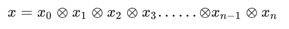

reduce 算法可以描述为

其中 ⊗ 可表示为求 sum，min，max，avg 等操作，最后获得的输出相比于输入一般维度上会递减。

在GPU中，reduce采用了一种树形的计算方式，例如下面的求和问题：

由于GPU没有针对global数据的同步操作，只能针对block的数据进行同步。所以，一般而言将reduce分为两个阶段。

假设给定一个长度为N的数组，需要计算该数组的所有元素之和。首先需要将数组分为m个小份。而后，在第一阶段中，开启m个block计算出m个小份的reduce值。最后，在第二阶段中，使用一个block将m个小份再次进行reduce，得到最终的结果。