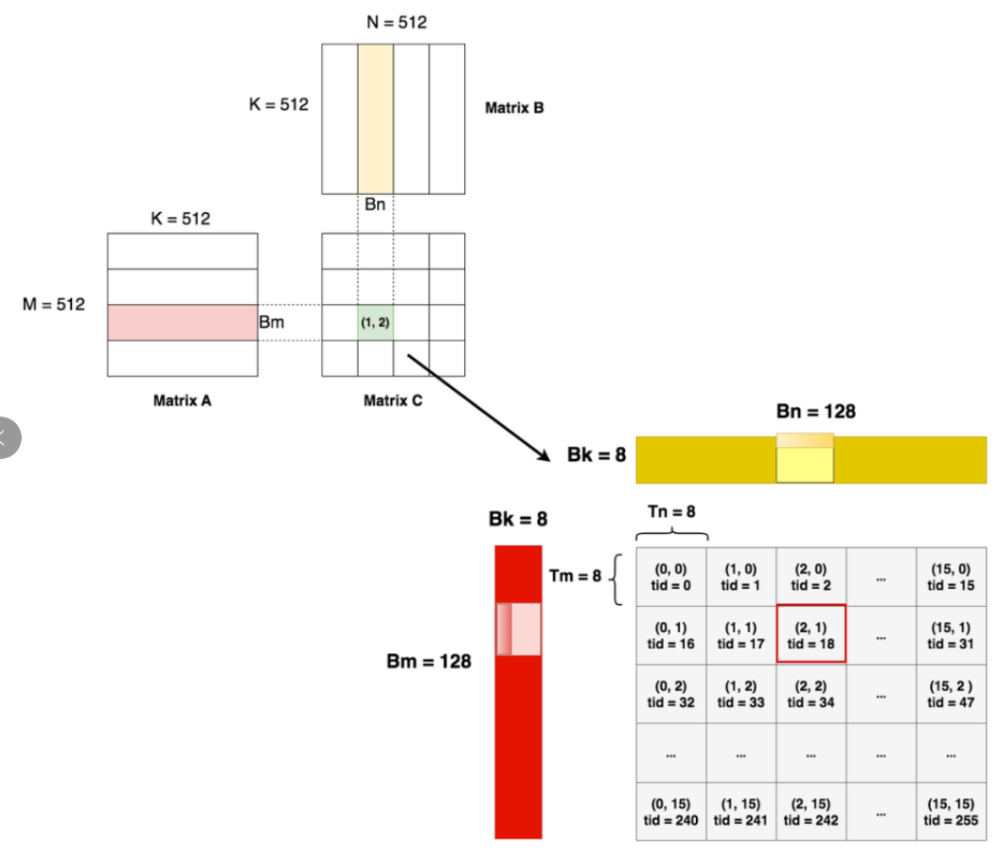

## CUDA编程基础

典型的CUDA程序的执行流程如下：

1. 分配host内存，并进行数据初始化；
2. 分配device内存，并从host将数据拷贝到device上；
3. 调用CUDA的核函数在device上完成指定的运算；
4. 将device上的运算结果拷贝到host上；
5. 释放device和host上分配的内存。

kernel是在device上线程中并行执行的函数，核函数用`__global__`符号声明，在调用时需要用`<<>>`来指定kernel要执行的线程数量。在CUDA中，每一个线程都要执行核函数，并且每个线程会分配一个唯一的线程号thread ID，这个ID值可以通过核函数的内置变量`threadIdx`来获得。

在CUDA中是通过函数类型限定词开区别host和device上的函数，主要的三个函数类型限定词如下：

- `__global__`：在device上执行，从host中调用（一些特定的GPU也可以从device上调用），返回类型必须是`void`，不支持可变参数参数，不能成为类成员函数。注意用`__global__`定义的kernel是**异步**的，这意味着host不会等待kernel执行完就执行下一步。
- `__device__`：在device上执行，单仅可以从device中调用，不可以和`__global__`同时用。
- `__host__`：在host上执行，仅可以从host上调用，一般省略不写，不可以和`__global__`同时用，但可和`__device__`，此时函数会在device和host都编译

GPU上很多并行化的轻量级线程，每一个线程都要执行核函数。

一个kernel所启动的所有线程称为一个**网格**（grid），同一个网格上的线程共享相同的全局内存空间，而网格又可以分为很多**线程块**（block），一个线程块里面包含很多线程。

一个线程块上的线程是放在同一个流式多处理器（SM)上的，但是单个SM的资源有限，这导致线程块中的线程数是有限制的，现代GPUs的线程块可支持的线程数可达1024个。

### cuda的内存模型

GPU存储可分为**物理内存（硬件真实存在的）**和**逻辑内存（由cuda做抽象的）**。

为什么要这么分呢？因为各个GPU的物理内存架构可能有所不同，如果你写代码时还要考虑每个GPU的独特性，那可太痛苦了。所以cuda在这里帮了大忙：它对内存架构做了一层抽象，你只要按照它抽象后的框架写代码就可以。实际计算时，再由cuda在背后帮你在物理内存上读/写数据。

每个线程有自己的私有本地内存（Local Memory），而每个线程块有包含共享内存（Shared Memory）,可以被线程块中所有线程共享，其生命周期与线程块一致。此外，所有的线程都可以访问全局内存（Global Memory）。还可以访问一些只读内存块：常量内存（Constant Memory）和纹理内存（Texture Memory）。


一个kernel实际上会启动很多线程，这些线程是逻辑上并行的，但是在物理层却并不一定。GPU硬件的一个核心组件是SM。SM的核心组件包括CUDA核心，共享内存，寄存器等，SM可以并发地执行数百个线程，并发能力就取决于SM所拥有的资源数。

当一个kernel被执行时，它的gird中的线程块被分配到SM上，一个线程块只能在一个SM上被调度。SM一般可以调度多个线程块，这要看SM本身的能力。那么有可能一个kernel的各个线程块被分配多个SM，所以grid只是逻辑层，而SM才是执行的物理层。当线程块被划分到某个SM上时，它将进一步划分为多个线程束，因为这才是SM的基本执行单元，但是一个SM同时并发的线程束数是有限的。这是因为资源限制，SM要为每个线程块分配共享内存，而也要为每个线程束中的线程分配独立的寄存器。所以SM的配置会影响其所支持的线程块和线程束并发数量。

SM采用的是[SIMT](https://link.zhihu.com/?target=http%3A//docs.nvidia.com/cuda/cuda-c-programming-guide/index.html%23simt-architecture) (Single-Instruction, Multiple-Thread，单指令多线程)架构，基本的执行单元是线程束（warps)，线程束包含32个线程，这些线程同时执行相同的指令，但是每个线程都包含自己的指令地址计数器和寄存器状态，也有自己独立的执行路径。所以尽管线程束中的线程同时从同一程序地址执行，但是可能具有不同的行为，比如遇到了分支结构，一些线程可能进入这个分支，但是另外一些有可能不执行，它们只能死等，因为GPU规定线程束中所有线程在同一周期执行相同的指令，线程束分化会导致性能下降。

总之，就是网格和线程块只是逻辑划分，一个kernel的所有线程其实在物理层是不一定同时并发的。所以kernel的grid和block的配置不同，性能会出现差异，这点是要特别注意的。还有，由于SM的基本执行单元是包含32个线程的线程束，所以block大小一般要设置为32的倍数。


on-chip内存例如，NVIDIA GPU 中的 register、shared memory、L1/L2 cache 等。


CUDA 6.0引入统一内存。统一内存使用一个托管内存来共同管理host和device中的内存，并且自动在host和device中进行数据传输。CUDA中使用cudaMallocManaged函数分配托管内存：

```c++
// 以向量加法为例

// --------------旧
// 申请host内存
float *x, *y, *z;
x = (float*)malloc(nBytes);
y = (float*)malloc(nBytes);
z = (float*)malloc(nBytes);

// 初始化数据
for (int i = 0; i < N; ++i)
{
    x[i] = 10.0;
    y[i] = 20.0;
}

// 申请device内存
float *d_x, *d_y, *d_z;
cudaMalloc((void**)&d_x, nBytes);
cudaMalloc((void**)&d_y, nBytes);
cudaMalloc((void**)&d_z, nBytes);

// 将host数据拷贝到device
cudaMemcpy((void*)d_x, (void*)x, nBytes, cudaMemcpyHostToDevice);
cudaMemcpy((void*)d_y, (void*)y, nBytes, cudaMemcpyHostToDevice);

// ----------------新
// 申请托管内存
float *x, *y, *z;
cudaMallocManaged((void**)&x, nBytes);
cudaMallocManaged((void**)&y, nBytes);
cudaMallocManaged((void**)&z, nBytes);

// 初始化数据
for (int i = 0; i < N; ++i)
{
    x[i] = 10.0;
    y[i] = 20.0;
}
// 执行计算 ....

// 同步device 保证结果能正确访问
cudaDeviceSynchronize();
```


## grid/block/thread

一张图表明三者的关系


## grid-stride loop

```c++
// 两个向量加法kernel，grid和block均为一维
__global__ void add(float* x, float * y, float* z, int n)
{
    // 获取全局索引
    int index = threadIdx.x + blockIdx.x * blockDim.x;
    // 步长
    int stride = blockDim.x * gridDim.x;
    for (int i = index; i < n; i += stride)
    {
        z[i] = x[i] + y[i];
    }
}
```


cuda几乎完全兼容C++，包括C++17

# GEMM

## Naive GEMM


**每个thread负责读取A矩阵的一行和B矩阵的一列，去计算C矩阵的一个元素**。则一共需要`M*N`个thread。

**矩阵A和矩阵B都存储在global memory，每个thread直接从global memory上进行读数**，完成计算：

- 为了计算出C中的某个元素，每个thread每次都需要从global memory上读取A矩阵的一行（K个元素），B矩阵的一列（K个元素），则每个thread从global memory上的读取次数为`2K`。
- C中共有`M*N`个thread，则为了计算出C，对global memory的总读取次数为`2KMN`。

这里及之后的分析中，我们不考虑把结果矩阵C写回global memory需要的次数，只考虑“读”。

Naive GEMM的代码见下（完整代码见 https://github.com/ifromeast/cuda_learning/blob/main/03_gemm/sgemm_naive.cu）：

- blockDim：`(32, 32)`，因为一个block内最多1024个thread
- gridDim：`(16, 16)`

```c++
// 将二维数组的行列索引转成一维数组的行列索引，这样可以更高效访问数据
// row, col：二维数组实际的行列索引，ld表示该数组实际的列数
// 例：二维数组实际的行列索引为(1, 3)，即第二行第四个元素，二维数据的总列数 = 5
// 返回的一位数组形式的索引为: 1*5 + 3 = 8
#define OFFSET(row, col, ld) ((row) * (ld) + (col))

// 定义naive gemm的kernel函数
__global__ void naiveSgemm(
    float * __restrict__ a, float * __restrict__ b, float * __restrict__ c,
    const int M, const int N, const int K) {
    
    // 当前thread在C矩阵中的row
    int m = blockIdx.y * blockDim.y + threadIdx.y;
    // 当前thread在C矩阵中的col
    int n = blockIdx.x * blockDim.x + threadIdx.x;
    if (m < M && n < N) {
        float psum = 0.0;
        // 告知编译器自动展开循环体，这样可以减少循环控制的开销（循环次数小的时候可以这么做）
        #pragma unroll
        // 取出A[row]和B[col]，然后逐个元素相乘累加，得到最终结果
        for (int k = 0; k < K; k++) {
            // a[OFFSET(m, k, K)]: 获取A[m][k]
            // b[OFFSET(k, n, N)]: 获取B[k][n]
            psum += a[OFFSET(m, k, K)] * b[OFFSET(k, n, N)];
        }
        c[OFFSET(m, n, N)] = psum;
    }
}

const int BM = 32, BN = 32;
const int M = 512, N = 512, K = 512;
dim3 blockDim(BN, BM);
dim3 gridDim((N + BN - 1) / BN, (M + BM - 1) / BM);
```

可想而知，由于这种办法要重复从global memory上读取数据，所以读取数据上消耗了大量时间，它肯定没有办法充足利用起GPU的算力。

## GEMM优化：矩阵分块，从global memory到SMEM

**on-chip内存的带宽要比off-chip内存的带宽大得多**。把矩阵A和B都搬运到on-chip的SMEM上，然后采用和naive GEMM一样的计算方法，那么尽管还是会在SMEM上发生重复读数据的情况（也即总的读写次数和naive一样，只不过现在不是从global memory读取，是从SMEM上读取），可是因为带宽变大了，总体来说数据读取时间肯定减少了。

**但是问题是，SMEM的存储要比global memory小很多，当矩阵比较大时，根本没办法把完整的矩阵搬运到SMEM上**。**如果搬运不了完整的矩阵，对矩阵切切块，搬运它的一部分**


- 把A矩阵横着切分成四块，每块大小为`(128, 512)`
- 把B矩阵纵着切分成四块，每块大小为`(512, 128)`

这里我们共有4*4 = 16个block，每个block负责计算C矩阵中大小为`128x128`的部分（图中绿色块）。

那么现在只需要把A的分块（红色）与B的分块（黄色）从global memory搬运到SMEM上，然后再从SMEM做一系列读取操作去计算C。**如此循环，直到所有的C分块都计算出来为止。**

**如果SMEM还是装不下红色和黄色块，那怎么办？**

继续切块。


上图中A矩阵的高亮红块`(128, 8)`，B矩阵中的高亮黄块`(8, 128)`，就是我们再切割的结果。

按照现在的划分，我们再来理一下**一个block**内做的事情：

- 每次取A矩阵的一个分块，取B矩阵的一个分块，将两者相乘得到分块矩阵C
- 对A矩阵，向右找到下一个分块；对B矩阵，向下找到下一个分块，然后再相乘得到分块矩阵C，累加到上一个分块矩阵C上。
- 如此循环，当我们遍历完所有的A分块和B分块后，就可以得到最终的分块矩阵C了。也就是我们图中的高亮绿块。

## GEMM再优化：从SMEM到Register


**为了更好利用SMEM，减少从global memory读数据，做了以下事情。**

**Global memory**

- 在global memory上，存放着用于计算的矩阵A，B；和结果矩阵C（初始化状态，还没被算出来）
- 我们不想从低带宽的global memory上一个个读数据，我们想多利用高带宽的SMEM。**因此我们设计了16个可以独立计算的block（绿色），每个block处理一块A（浅红色）与一块B（浅黄色）**。理想情况下，每个block计算时，它会将浅红和浅黄加载到SMEM上，然后做计算。
- 但是，浅红和浅黄，可能对于SMEM来说还是太大了。所以，我们选择再次切割，每个block做计算时，加载高亮红和高亮黄去SMEM上。

**SMEM**

- **单个block在做计算时，会有若干次循环**
- **在每次循环内，block会从global memory上加载一块高亮红和高亮黄到SMEM上**（每个thread加载这块高亮红和高亮黄的一部分），然后计算得到单次循环结果。所有循环结果累加，即得到这块block的最终结果（**split-by-k**）

以上两部分是对上文内容的总结，现在我们来看从SMEM -> Register的步骤

**Register**

- 单个block做单次循环时，实际负责计算的是它当中的threads，如上图，每个threads负责计算这个block内(Tm, Tn)大小的矩阵。
- 这个矩阵由上图右侧的浅红色块和浅黄色块加载而来，而这两个色块在SMEM上，也就是thread会从SMEM上逐一取数。
- 在on-chip的memory上，register是比SMEM带宽更高，存储更小的数据。
- 所以比起一次次从SMEM上读数，不如类比于global memory -> SMEM的思路，把数据切块后，加载到register中，再做计算。
- 所以，**单个block的单次循环下，单个thread也存在若干次循环。每次循环内，该thread从SMEM上读取渐变红和渐变黄色块到register，然后再做计算**，thread所有循环的结果相加，即得到该thread的最终结果（**split-by-k**）。

我们马上进入代码实践讲解，在此之前我们先比对上图，把矩阵的各个维度再明确下：

- M = N = K = 512
- Bm = Bn = 128
- Bk = 8
- Tm = Tn = 8

在单个block的单次循环内，计算某对高亮红和高亮黄时，block内线程的排布如下：




##  Function Execution Space Specifiers