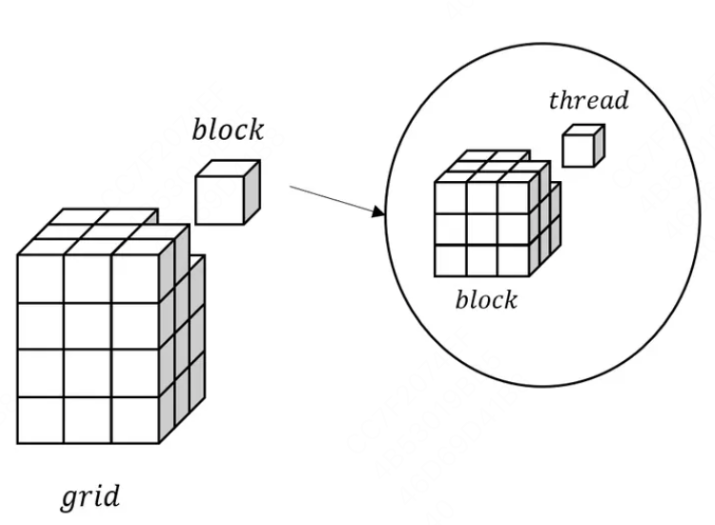
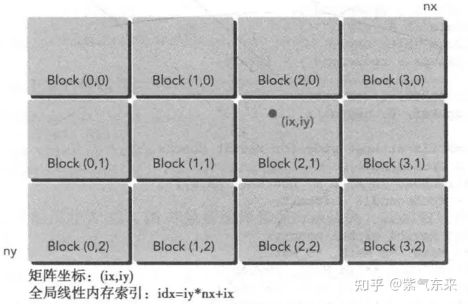
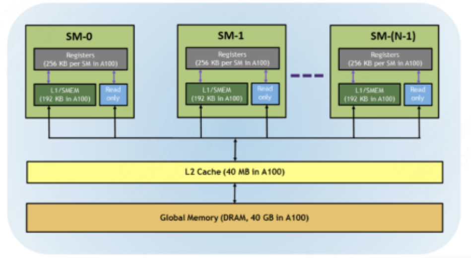
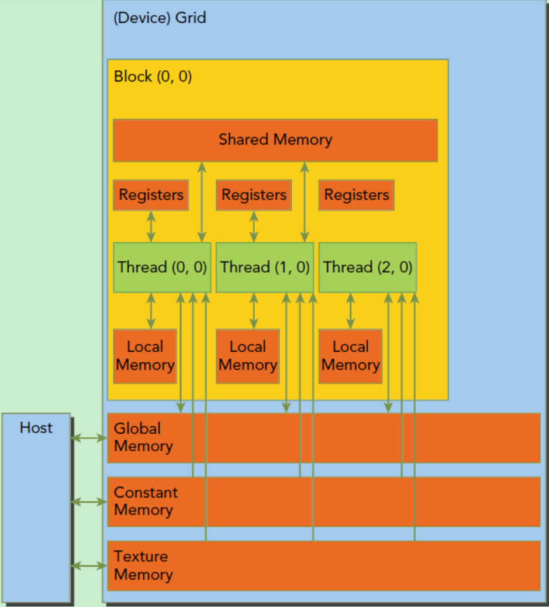
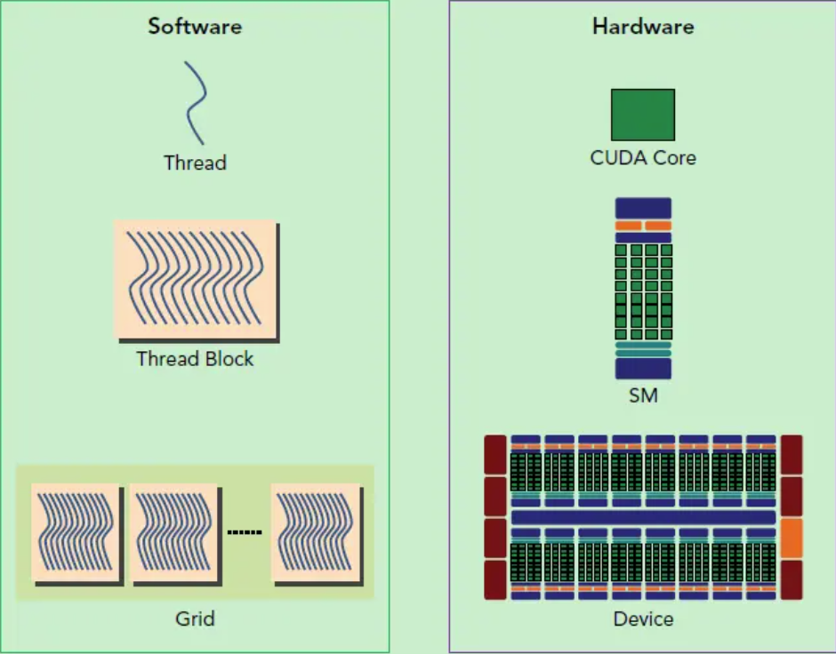
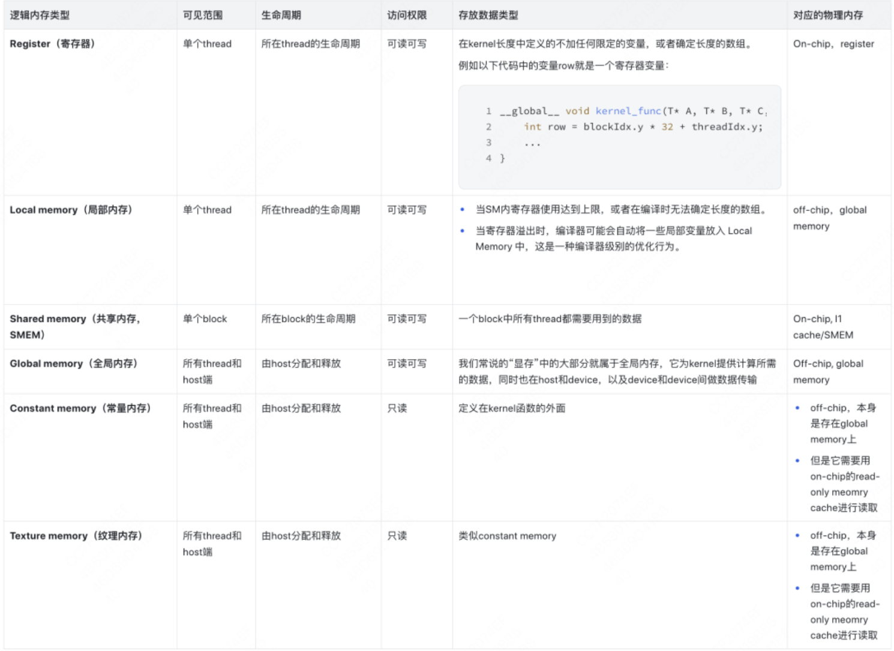
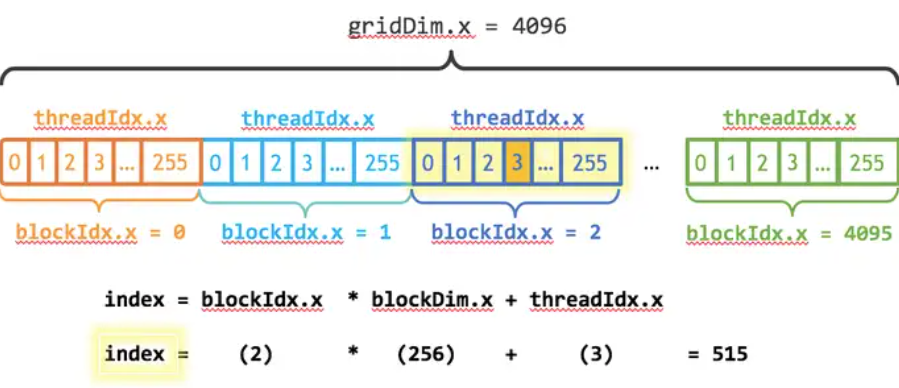

# GPU

下表列举了当前几款主流的GPU产品的数据	

| GPU                     | V100          | A100          | H100          | L40S         |
| ----------------------- | ------------- | ------------- | ------------- | ------------ |
| GPU Architecture        | Volta         | Ampere        | Hopper        | Ada Lovelace |
| Memory Interface        | 4096-bit HBM2 | 5120-bit HBM2 | 5120-bit HBM3 | GDDR6        |
| Memory Size             | 32 GB / 16 GB | 40 GB         | 80 GB         | 48 GB        |
| Memory Bandwidth        | 900 GB/sec    | 1555 GB/sec   | 3000 GB/sec   | 864 GB/s     |
| SMs                     | 80            | 108           | 132           | 142          |
| Texture Units           | 320           | 432           | 528           | 576          |
| L2 Cache Size           | 6144 KB       | 40 MB         | 50 MB         | 96MB         |
| Shared Memory Size / SM | up to 96 KB   | up to 164 KB  | up to 228 KB  | up to 128 KB |
| Register File Size / SM | 256 KB        | 256 KB        | 256 KB        | 256 KB       |
| Peak FP16 TFLOPS        | 31.4          | 78            | 120           | 90.52        |

- CUBLAS是基础线性代数子程序库，用于优化矩阵计算；CUDNN是深度学习加速库，用于优化深度学习任务。CUBLAS是CUDA平台中较早的加速库之一。
- CUBLAS主要用于科学计算和机器学习中的矩阵运算；CUDNN主要用于深度学习框架中的卷积、池化等深度学习函数。
- CUTLASS是通用GPU计算库，可以用于各种类型的GPU计算任务，包括矩阵运算和深度学习任务。CUTLA S是NVIDIA推出的新一代加速库。

# CUDA编程基础

## 基础知识

 GPU适合的场景：

1. 计算密集：数值计算的比例要远大于内存操作，因此内存访问的延时可以被计算掩盖。
2. 数据并行：大任务可以拆解为执行相同指令的小任务，因此对复杂流程控制的需求较低。

典型的CUDA程序的执行流程如下：

1. 分配host内存，并进行数据初始化；
2. 分配device内存，并从host将数据拷贝到device上；
3. 调用CUDA的核函数在device上完成指定的运算；
4. 将device上的运算结果拷贝到host上；
5. 释放device和host上分配的内存。

## kernel func

kernel是在device上线程中并行执行的函数，核函数用`__global__`符号声明，在调用时需要用`<<>>`来指定kernel要执行的线程数量。在CUDA中，每一个线程都要执行核函数，并且每个线程会分配一个唯一的线程号thread ID，这个ID值可以通过核函数的内置变量`threadIdx`来获得。

在CUDA中是通过函数类型限定词开区别host和device上的函数，主要的三个函数类型限定词如下：

- `__global__`：在device上执行，从host中调用（一些特定的GPU也可以从device上调用），返回类型必须是`void`，不支持可变参数参数，不能成为类成员函数。注意用`__global__`定义的kernel是**异步**的，这意味着host不会等待kernel执行完就执行下一步。需要使用`cudaDeviceSynchronize()`进行同步。
- `__device__`：在device上执行，单仅可以从device中调用，不可以和`__global__`同时用。
- `__host__`：在host上执行，仅可以从host上调用，一般省略不写，不可以和`__global__`同时用，但可和`__device__`，此时函数会在device和host都编译

GPU上很多并行化的轻量级线程，每一个线程都要执行核函数。

一个kernel所启动的所有线程称为一个**网格**（grid），同一个网格上的线程共享相同的全局内存空间，而网格又可以分为很多**线程块**（block），一个线程块里面包含很多线程。

一个线程块上的线程是放在同一个流式多处理器（SM)上的，但是单个SM的资源有限，这导致线程块中的线程数是有限制的，现代GPUs的线程块可支持的线程数可达1024个。

## grid/block/thread

一张图表明三者的关系



线程的索引和线程 ID 之间的关系非常简单：对于一维块，它们是相同的；对于大小为 (𝐷𝑥,𝐷𝑦) 的二维块，索引为 (𝑥,𝑦) 的线程的线程ID为 (𝑥+𝑦∗𝐷𝑥) ； 对于大小为 (𝐷𝑥,𝐷𝑦,𝐷𝑧) 的三维块，索引为 (𝑥,𝑦,𝑧) 的线程的线程 ID 为 (𝑥+𝑦∗𝐷𝑥+𝑧∗𝐷𝑥∗𝐷𝑦) 。



# CUDA的内存模型

GPU存储可分为**物理内存（硬件真实存在的）**和**逻辑内存（由cuda做抽象的）**。

## 硬件角度

从硬件的角度来讲，CUDA 内存模型的最基本的单位就是 **SP (线程处理器)**。每个线程处理器 (SP) 都用自己的 **registers (寄存器)** 和 **local memory (局部内存)**。寄存器和局部内存只能被自己访问，不同的线程处理器之间是彼此独立的。

由多个线程处理器 (SP) 和一块共享内存所构成的就是 **SM (多核处理器)** 。多核处理器里边的多个线程处理器是互相并行的，是不互相影响的。每个多核处理器 (SM) 内都有自己的 shared memory (共享内存)，shared memory 可以被线程块内所有线程访问。

再往上，由这个 SM (多核处理器) 和一块全局内存，就构成了 GPU。一个 GPU 的所有 SM 共有一块 global memory (全局内存)，不同线程块的线程都可使用。

如下图所示：



## 软件角度

从软件的角度来讲：

1. 线程处理器 (SP) 对应线程 (thread)。
2. 多核处理器 (SM) 对应线程块 (thread block)。
3. 设备端 (device) 对应线程块组合体 (grid)。

还可以访问一些只读内存块：常量内存（Constant Memory）和纹理内存（Texture Memory）。



线程块内存模型在软件侧的一个最基本的执行单位，所以我们从这里开始梳理。线程块就是线程的组合体，它具有如下这些特点：

- 块内的线程通过共享内存、原子操作和屏障同步进行协作 (shared memory, atomic operations and barrier synchronization)
- 不同块中的线程不能协作。

## 对应关系

为什么要这么分呢？因为各个GPU的物理内存架构可能有所不同，如果你写代码时还要考虑每个GPU的独特性，那可太痛苦了。所以cuda在这里帮了大忙：它对内存架构做了一层抽象，你只要按照它抽象后的框架写代码就可以。实际计算时，再由cuda在背后帮你在物理内存上读/写数据。

一个kernel实际上会启动很多线程，这些线程是逻辑上并行的，但是在物理层却并不一定。GPU硬件的一个核心组件是SM。SM的核心组件包括CUDA核心，共享内存，寄存器等，SM可以并发地执行数百个线程，并发能力就取决于SM所拥有的资源数。

当一个kernel被执行时，它的gird中的线程块被分配到SM上，**一个线程块只能在一个SM上被调度。SM一般可以调度多个线程块**，这要看SM本身的能力。那么有可能一个kernel的各个线程块被分配多个SM，所以grid只是逻辑层，而SM才是执行的物理层。当线程块被划分到某个SM上时，它将进一步划分为多个线程束，因为这才是SM的基本执行单元，但是一个SM同时并发的线程束数是有限的。这是因为资源限制，SM要为每个线程块分配共享内存，而也要为每个线程束中的线程分配独立的寄存器。所以SM的配置会影响其所支持的线程块和线程束并发数量。

SM采用的是[SIMT](https://link.zhihu.com/?target=http%3A//docs.nvidia.com/cuda/cuda-c-programming-guide/index.html%23simt-architecture) (Single-Instruction, Multiple-Thread，单指令多线程)架构，基本的执行单元是线程束（warps)，线程束包含32个线程，这些线程同时执行相同的指令，但是每个线程都包含自己的指令地址计数器和寄存器状态，也有自己独立的执行路径。所以尽管线程束中的线程同时从同一程序地址执行，但是可能具有不同的行为，比如遇到了分支结构，一些线程可能进入这个分支，但是另外一些有可能不执行，它们只能死等，因为GPU规定线程束中所有线程在同一周期执行相同的指令，线程束分化会导致性能下降。

总之，就是网格和线程块只是逻辑划分，一个kernel的所有线程其实在物理层是不一定同时并发的。所以kernel的grid和block的配置不同，性能会出现差异，这点是要特别注意的。还有，由于SM的基本执行单元是包含32个线程的线程束，所以block大小一般要设置为32的倍数。



on-chip内存例如，NVIDIA GPU 中的 register、shared memory、L1/L2 cache 等。



CUDA 6.0引入统一内存。统一内存使用一个托管内存来共同管理host和device中的内存，并且自动在host和device中进行数据传输。CUDA中使用cudaMallocManaged函数分配托管内存：

```c++
// 以向量加法为例

// --------------旧
// 申请host内存
float *x, *y, *z;
x = (float*)malloc(nBytes);
y = (float*)malloc(nBytes);
z = (float*)malloc(nBytes);

// 初始化数据
for (int i = 0; i < N; ++i)
{
    x[i] = 10.0;
    y[i] = 20.0;
}

// 申请device内存
float *d_x, *d_y, *d_z;
cudaMalloc((void**)&d_x, nBytes);
cudaMalloc((void**)&d_y, nBytes);
cudaMalloc((void**)&d_z, nBytes);

// 将host数据拷贝到device
cudaMemcpy((void*)d_x, (void*)x, nBytes, cudaMemcpyHostToDevice);
cudaMemcpy((void*)d_y, (void*)y, nBytes, cudaMemcpyHostToDevice);

// ----------------新
// 申请托管内存
float *x, *y, *z;
cudaMallocManaged((void**)&x, nBytes);
cudaMallocManaged((void**)&y, nBytes);
cudaMallocManaged((void**)&z, nBytes);

// 初始化数据
for (int i = 0; i < N; ++i)
{
    x[i] = 10.0;
    y[i] = 20.0;
}
// 执行计算 ....

// 同步device 保证结果能正确访问
cudaDeviceSynchronize();
```

## grid-stride loop

无论调用者指定了多少个线程，都能自动根据给定的区间`[0,n)`来循环。不会越界，也不会漏掉几个元素

```c++
// 两个向量加法kernel，grid和block均为一维
__global__ void add(float* x, float * y, float* z, int n)
{
    // 获取全局索引
    int index = threadIdx.x + blockIdx.x * blockDim.x;
    // 步长
    int stride = blockDim.x * gridDim.x;
    for (int i = index; i < n; i += stride)
    {
        z[i] = x[i] + y[i];
    }
}
```




cuda几乎完全兼容C++，包括C++17

## 共享内存

https://w-jin.github.io/tech/cuda5/

在CUDA中，共享内存可以静态或动态地分配。共享内存可以在核函数内部声明为局部的，也可以在核函数外部声明成全局的。CUDA支持一维、二维和三维共享内存数组的声明。

静态声明一块共享内存的语法为：

```c++
__shared__ float cache[32][32];
```

静态声明的共享内存其长度在编译时必须已知，也就是和c++的静态数组规定一致。动态声明时不指定内存的长度，在运行时指定长度，和c++中的动态数组类似，其语法为：

```c++
__global__ void kernel( /* ... */ ) {
    extern __shared__ float cache[];
    // ...
}

kernel<<<grid, block, m * sizeof(float)>>>( /* ... */ );
```

在执行核函数时必须指定核函数内部动态分配的共享内存的字节数，它作为核函数启动语句的<<<>>>的第三个参数传入。此处所说的字节数是一个线程块所需要的字节数，不是整个线程网格需要的字节数，所以上面代码中的m一般是和block相关的一个数。注意，**动态声明的共享内存只能是一维的。**

共享内存声明于核函数内部时，其生命周期与核函数启动的线程块的生命周期相同，如果声明于核函数外部则与程序的生命周期相同，全局的共享内存只能静态声明。全局的共享内存很少使用，此节不再过多介绍。

局部声明的共享内存无论是动态的还是静态的，它们的生命周期都和线程块相同，线程块被调度到一相SM上时为它分配共享内存，执行结束时回收为它分配的共享内存。如果SM上剩余的共享内存数量不能满足线程块的要求，则线程块不会被调度到这个SM上。


