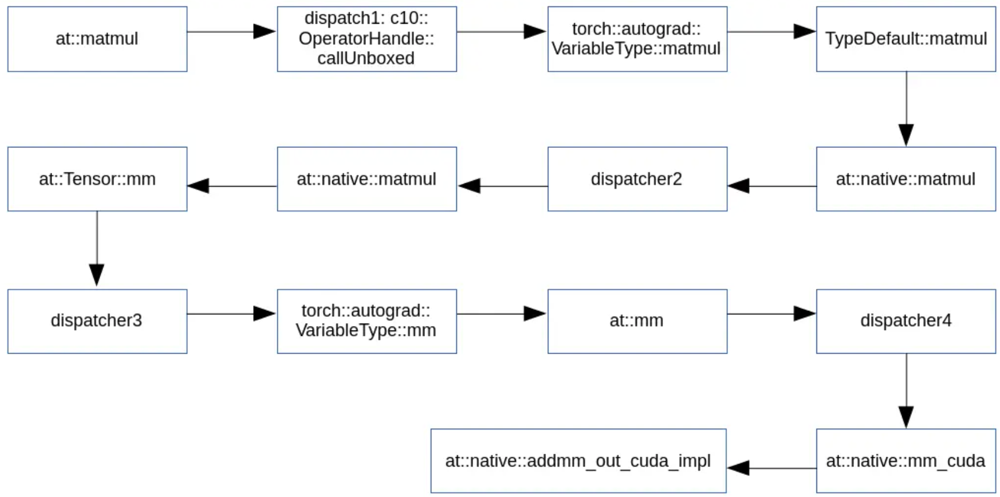
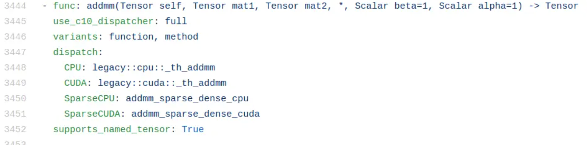

[深入浅出PyTorch（算子篇） - A君来了 - 博客园 (cnblogs.com)](https://www.cnblogs.com/huangshuang/p/13179494.html)

PyTorch所有的Operator都定义在Declarations.cwrap和native_functions.yaml这两个文件中，前者定义了从Torch那继承来的legacy operator（aten/src/TH），后者定义的是native operator，是PyTorch的operator。

相比于用C++开发的native code，legacy code是在PyTorch编译时由gen.py根据Declarations.cwrap的内容动态生成的。因此，如果你想要trace这些code，需要先编译PyTorch。

matmul的调用链

torch.matmul()在ATen中的function flow。可以看到，这个flow可不短，这主要是因为不同类型的tensor（2d or Nd, batched gemm or not，with or without bias，cuda or cpu）的操作也不尽相同。

at::matmul()主要负责将Tensor转换成cuBLAS需要的格式。前面说过，Tensor可以是N维矩阵，如果tensor A是3d矩阵，tensor B是2d矩阵，就需要先将3d转成2d；如果它们都是>=3d的矩阵，就要考虑batched matmul的情况；如果bias=True，后续就应该交给at::addmm()来处理；总之，matmul要考虑的事情比想象中要多。

除此之外，不同的dtype、device和layout需要调用不同的操作函数，这部分工作交由c10::dispatcher来完成。

dispatcher主要用于动态调用dtype、device以及layout等方法函数。用过numpy的都知道，np.array()的数据类型有：float32, float16，int8，int32，.... 如果你了解C++就会知道，这类程序最适合用模板（template）来实现。

很遗憾，由于ATen有一部分operator是用C语言写的（从Torch继承过来），不支持模板功能，因此，就需要dispatcher这样的动态调度器。

类似地，PyTorch的tensor不仅可以运行在GPU上，还可以跑在CPU、mkldnn和xla等设备，Figure 1中的dispatcher4就根据tensor的device调用了mm的GPU实现。

layout是指tensor中元素的排布。一般来说，矩阵的排布都是紧凑型的，也就是strided layout。而那些有着大量0的稀疏矩阵，相应地就是sparse layout。

除了dtype、device、layout之外，dispatcher还可以用来调用legacy operator。比如说addmm这个operator，它的GPU实现就是通过dispatcher来跳转到legacy::cuda::_th_addmm。

