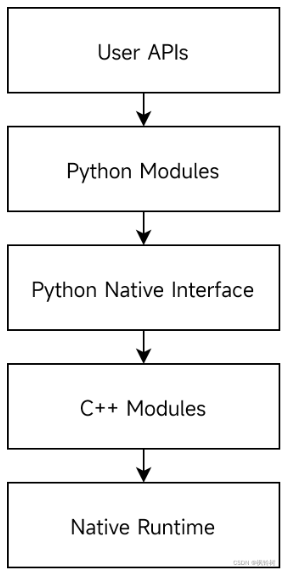
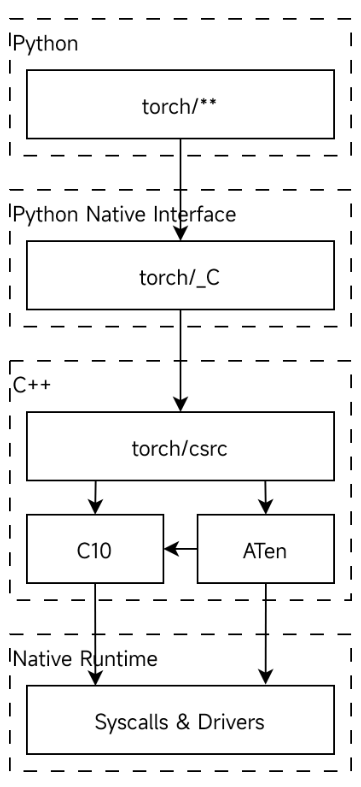

# PyTorch的功能

# PyTorch层次结构

[PyTorch C10 CUDA 模块源码结构解读（参考版本：PyTorch 2.0.0 RC1）_cuda算子的源码-CSDN博客](https://blog.csdn.net/m0_62405272/article/details/130124736)

使用C++完成对CUDA等底层硬件的对接，并十分高效地实现基础组件和部分算法；借助Python原生调用能力，将用C++实现的模块封装成接口，提供给Python代码调用。



PyTorch的跨语言环境接口主要有两大部分：C++与原生运行环境的对接、Python与C++的对接。

C++与原生运行环境的对接全部在ATen和C10内实现。如，C10的CUDAFunctions模块完成对NVIDIA CUDA Runtime API的二次封装，以支持上层更定制化的操作。

Python与C++的对接层为torch/_C模块。该部分接口在编译期自动生成，为Python代码提供支持。

## PyTorch整体模块依赖关系



ATen代表A Tensor Library，是PyTorch最原始的Tensor基础库。

C10是一个仍处于开发阶段的库，逐步代替ATen的地位。我们可以注意到，ATen内的很多实现已经改为直接包含C10内的同类实现。如，Tensor的实现已经完全迁移到C10内。因此，我们可以观察到，ATen对C10呈现出依赖关系。

ATen和C10封装了含CUDA在内的底层操作。基于ATen和C10的能力，PyTorch的开发者们在csrc（代表C Source）模块内使用C和C++实现autograd等更高级的功能。

如Java一样，Python具有原生调用接口的功能。PyTorch的原生接口层为_C模块，其中暴露的所有原生功能皆由csrc模块提供。

PyTorch的更高层功能使用Python编写，并在部分功能处通过_C调用原生代码，获得更好的性能和对CUDA等高级硬件的操控能力。

## C10 CUDA模块及子模块

C10库的CUDA模块直接覆盖在CUDA运行环境上，为外层开发者提供基础资源管理服务。

该模块由多个子模块组成，含实现了GC和类Arena的GPU内存管理器和CUDA执行流管理器。它们通过封装思路较为奇特的CUDA Runtime API，为外层提供更友好的接口，提供更优的支持；通过对资源的复用，减少对底层API的频繁访问，提供更好的性能。

# PyTorch源码结构

比较重要的目录有aten，c10，torch

```bash
$ tree -d -L 1
.
├── android
├── aten
├── benchmarks
├── binaries
├── build
├── c10
├── caffe2
├── cmake
├── docs
├── functorch
├── ios
├── modules
├── mypy_plugins
├── scripts
├── test
├── third_party
├── tools
├── torch
├── torch.egg-info
└── torchgen
```

接下来分别介绍这些目录

1. torch，即PyTorch前端代码。其中包含前端的Python代码，也包括高性能的C++底层实现。`import torch`就是加载里面的模块。
   - csrc目录下都是C/C++源码，Python绑定C++的相关code都在这个目录里面，同时也包含了对PyTorch核心库的一些封装。
   - _C，C扩展torch模块，里面的pyi定义了python可以使用的接口。为实现Python和c++模块的打通，这里使用了pybind作为胶水。
2. aten是**a ten**sor library 的缩写，主要为tensor服务，不支持autograd。
   - src/Aten/core，aten的核心基础库。目前这个库里面的代码正在逐渐地迁移到c10目录下面。
   - src/Aten/native/cpu，PyTorch的算子库，这个目录下面的算子都是CPU的算子。对于一些专门CPU指令优化的算子会在子目录里面。
   - src/Aten/native/cuda，cuda算子实现。
3. c10是PyTorch的核心库，支持服务端和移动端。PyTorch1.0完整移植了caffe2的源码，将两个项目进行了合并。引入caffe的原因是Pytorch本身拥有良好的前端，caffe2拥有良好的后端，二者在开发过程中拥有大量共享代码和库。例如在PyTorch中，c10::Device和at::Device是等价的。
4. tools，PyTorch中很多相似源码都是脚本通过模板自动生成的，这个文件夹下面就放着自动生成代码的脚本。例如autograd根据配置文件实现反向求导OP的映射。
5. cmake，cmake脚本。


# 编译并且调试PyTorch

[使用Vscode调试PyTorch(c++)代码 - 李理的博客 (fancyerii.github.io)](http://fancyerii.github.io/2024/03/21/debug-pytorch/#modules)

# PyTorch接口是如何导出的？

[PyTorch源码解析（1）- 整体预览 - Hurray's InfoShare (hurray0.com)](https://hurray0.com/menu/151/)

# pytorch设计准则

1. 可用性大于性能。首要目标是可用性，第二个目标是合理的性能。

   没有使用静态shape

2. 显式优于隐式；简单优于复杂。

   每个tensor都绑定到一个device，用户需要显式地将tensor跨设备移动。跨设备的张量运算会发生错误。

3. Python首先具有同类最佳语言互操作性。

PyTorch多年来需要处理的一件事是Python开销:我们首先用c++重写了autograd引擎，然后重写了大多数运算符定义，然后开发了TorchScript和c++前端。

尽管如此，使用Python为我们的用户提供了最好的体验:它灵活、熟悉，也许最重要的是，它有一个庞大的科学计算库和扩展生态系统可供使用。这一事实激发了我们最近的一些贡献，它们试图达到接近Python可用性曲线末端的帕累托最优点:

- TorchDynamo，一个Python框架评估工具，能够以最少的用户干预加速现有的eager模式PyTorch程序。
- torch_function和torch_dispatch扩展点，它们使python优先的功能能够构建在c++内部的基础上，比如torch.fx tracer和functorch。


# Autograd mechanics

pytorch autograd如何工作？如何记录运算？理解他可以帮助我们编写更高效，更简洁的程序，并有助于调试。

## How autograd encodes the history

autograd是一个反向自动微分系统。从概念上讲，autograd记录了一个graph，这个graph记录了 在运行时 创建数据的所有operations。给定一个有向无环图，叶子是输入张量，roots是输出张量。通过从根到叶追踪这个图，我们可以通过链式法则自动计算梯度。

在内部，autograd中的graph由Function object表示，通过`apply()`函数来计算结果。当计算前向传递时，autograd会构建一个 表示计算梯度的函数的图。当正向传递完成后，我们在反向传递中评估该图以计算梯度。

需要注意的是，每次迭代时，graph会重新创建。因此每次迭代时可以改变图的形状和大小。

### Saved tensors

一些operations为了能执行反向传播，需要在前向传播时保存中间结果。例如，函数`x -> x^2`需要保存输入的`x`来计算梯度。

当自定义一个 Python [Function](https://pytorch.org/docs/stable/autograd.html#torch.autograd.Function) 时，我们可以使用`save_for_backward()`在前向传播中保存张量，并使用`saved_tensors`在向后传递期间检索它们。

对于pytorch中定义的operations，例如`torch.pow()`，tensor在需要时会自动保存。我们可以查找以前缀_saved开头的属性来探索某个grad_fn保存了哪些张量。

# cuda backend内存管理

pytorch 支持自定义内存管理器。

https://pytorch.org/docs/stable/notes/cuda.html#memory-management

https://pytorch.org/docs/stable/torch_cuda_memory.html#torch-cuda-memory