pytorch关于编译的尝试

- Torch FX
- TorchScript
- Lazy Tensor
- TorchDynamo

# PyTorch获取计算图的方式

PyTorch一开始没有计算图的概念，是一个动态图，即在eager mode下，pytorch每编译解析一行代码，系统就会在GPU上执行对应的算子。

获取计算图的两种方式

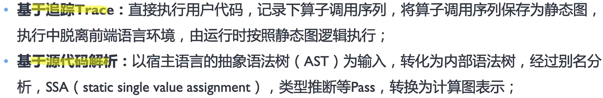

基于Trace的优缺点：

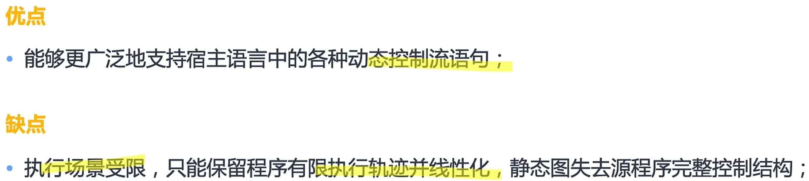

基于源码解析的优缺点：

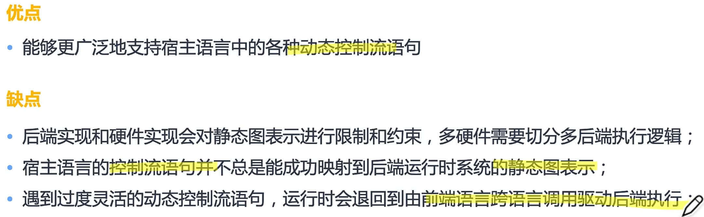

PyTorch关于编译的尝试，四种获取静态图的方式 ： 

- Torch FX
- TorchScript
- Lazy Tensor
- TorchDynamo

# TrochScript

pytorch提供了两种方式将eager mode转化为script mode。即把pytorch的动态图转化为静态图。

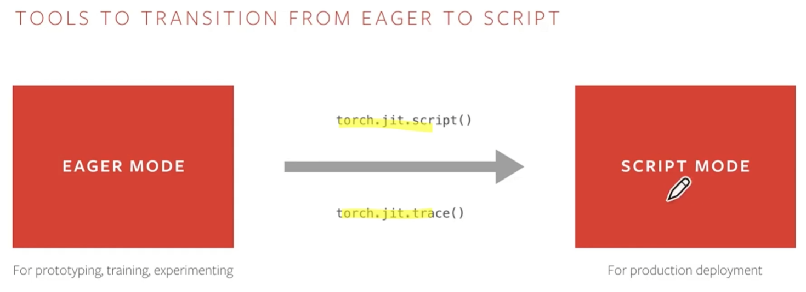

其中，`torch.jit.trace()`使用example input运行代码，依次记录执行的张量运算节点，但是无法表达控制流。

而`torch.jit.script()`可以保留控制流，其中的print语句可以用作debug。

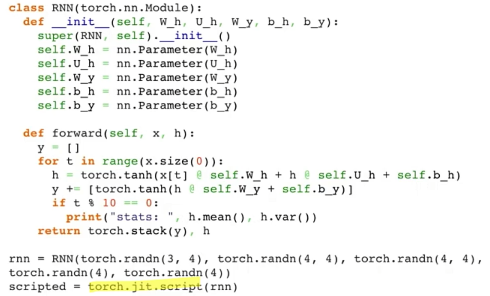

script mode模型下的model可以方便地嵌入在不同的语言中。

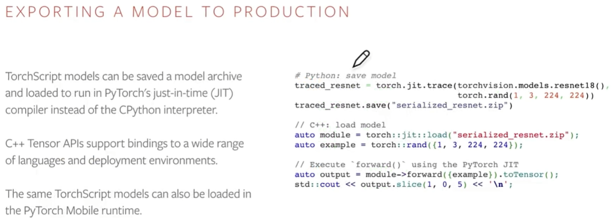

TorchScript IR的特点

- 静态类型
- 结构化的控制流
- 默认使用函数式的表达

在将pytorch动态图转化为静态图之后，就可以交给`torch.jit`运行forward，即真正的优化编译。主要分为以下几个步骤：

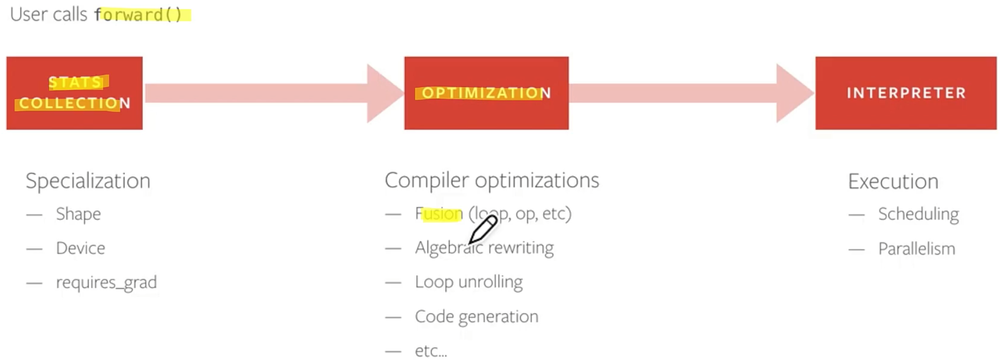

TorchScript的优点：

- 能够把动态图转化为静态图（trace和script两种方式），对静态图进行编译优化和执行。
- 是pytorch关于静态图的第一次尝试

缺点：

- 静态图只能表达正向图，不能够处理反向图和动态shape，使用场景有限。
- 静态图IR复杂，难学，对于想修改或者增加优化Pass的开发者来说成本高。

反向图？动态shape？

# Torch.Fx

下面是torch.fx的例子，他也是基于trace的原理来做图的转换。所以不能够很好地支持含有if-else等控制流的场景。

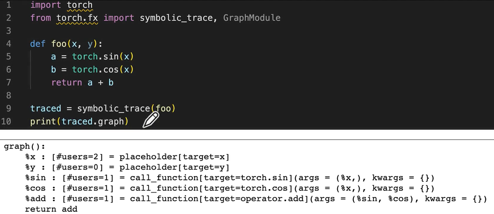

torch.fx的优缺点

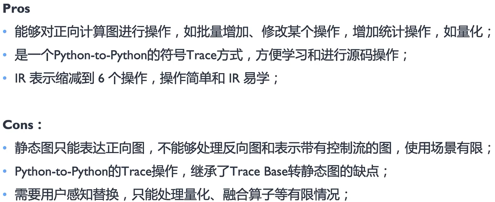

# LazyTensor

优缺点：

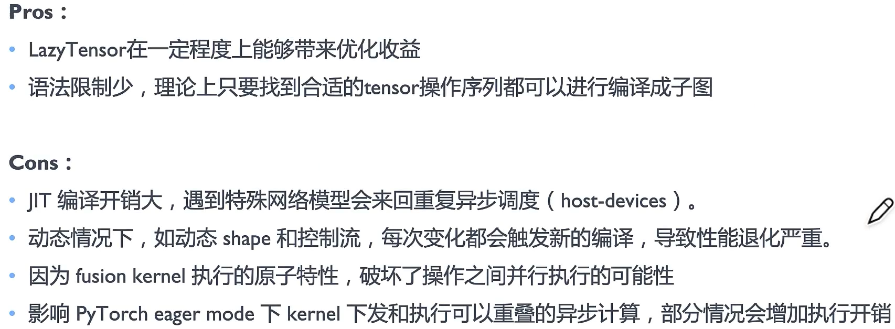

# TorchDynamo

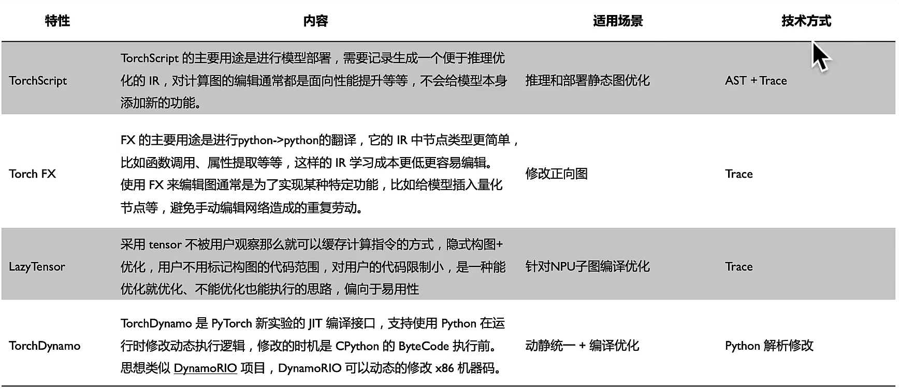