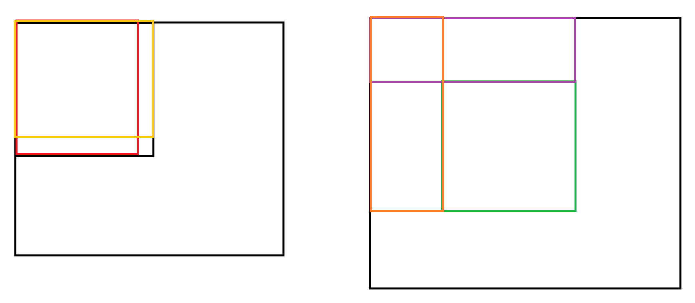
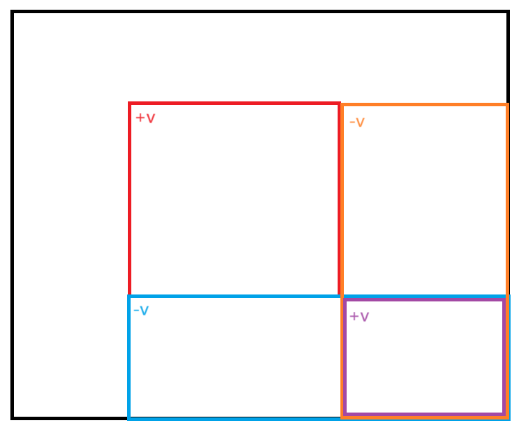

# 输入输出

## 不定长输入

```c++
vector<int> nums;
int num;
while(cin >> num) {
	nums.push_back(num);
	// 读到换行符，终止循环
	if(getchar() == '\n') {
		break;
	}
}
```

# 排序

## 堆排序

```c++
void down(int t){
    int u = t;
    if (u*2 <= n && heap[u*2] < heap[u]) t = u*2;
    if (u*2+1 <= n && heap[u*2+1] < heap[t]) t = u*2+1;
    if (t != u){
        swap(heap[t], heap[u]);
        down(t);
    }
}

int main(){

    cin >> n >> m;

    for(int i = 1;i<=n;i++)
        scanf("%d ", &heap[i]);

    for(int i = n/2;i>0;i--) down(i);

    while(m--){
        cout << heap[1] << " ";
        heap[1] = heap[n];
        n--;
        down(1);
    }
}
```

## 归并排序

平均时间复杂度 O(nlgn)

空间复杂度 O(n)

```c++
void merge_sort(int l, int r, vector<int> &arr, vector<int> &tmp) {
    if (l>=r) return ;
    
    int mid = (l+r)>>1;
    merge_sort(l, mid, arr, tmp);
    merge_sort(mid+1, r, arr, tmp);
    
    int i = l, j = mid+1, k = 0;
    while(i<=mid && j<=r) {
        if (arr[i] < arr[j]) tmp[k++] = arr[i++];
        else tmp[k++] = arr[j++];
    }
    
    while(i<=mid) tmp[k++] = arr[i++];
    while(j<=r) tmp[k++] = arr[j++];
    
    int t = 0;
    while(l<=r) {
        arr[l++] = tmp[t++];
    }
}
```

## 快速排序

平均时间复杂度 O(nlgn)

空间复杂度 O(lgn) 递归栈

```c++
void quick_sort(int l, int r, vector<int> &arr) {
    if (l>=r) return ;
    
    int x = arr[(l+r)>>1], i = l-1, j = r+1;
    while(i<j) {
        do i++; while(arr[i] < x);
        do j--; while(arr[j] > x);
        if (i<j) swap(arr[i], arr[j]);
    }
    
    quick_sort(l, j, arr);
    quick_sort(j+1, r, arr);
}
```

注意：

```c++
 do i++; while(arr[i] <= x);
 do j--; while(arr[j] >= x);
// 此处如果取等号 诸如[2,2,2,2]这样的数据就会死循环

int x = arr[r];	// 如果这里改为r
quick_sort(l, j, arr);	// 会导致此处死循环 诸如[1,2]的数据
quick_sort(j+1, r, arr);
```

## topk

```c++

int quick_sort(int arr[], int l, int r, int k){
    if (l==r) return arr[l];

    int x = arr[(l+r)/2], i = l-1, j = r+1;
    while(i<j){
        do i++; while(arr[i] < x);
        do j--; while(arr[j] > x);

        if (i<j) swap(arr[i], arr[j]);
    }

    int sl = j-l+1;
    if (sl>=k) return quick_sort(arr, l, j, k);
    return quick_sort(arr, j+1, r, k-sl);
}
```

## 希尔排序

```c++
#include <iostream>
#include <vector>

using namespace std;


void insert_sort(int start, int d, vector<int> &arr) {
    int n = arr.size();
    int tmp = 0, i = 1;
    while(i*d + start < n) {
        tmp = arr[i*d + start];
        int j = 0;
        while(j<i) {
            if (arr[j*d + start] > tmp) {   // 找到了插入位置
                // 将插入位置的元素后移
                int k = i;
                while(k > j) {
                    arr[k*d + start] = arr[(k-1)*d + start];
                    --k;
                }
                arr[k*d + start] = tmp;
                break;
            }
            ++j;
        }
        ++i;
    }
    
}

// 会超时
// void shell_sort(int d, vector<int> &arr) {
//     int n = arr.size();
//     while(d!=0) {
//         int i = 0;
//         while(i<d) {
//             insert_sort(i, d, arr);
//             ++i;
//         }
//         d = d/2;
//     }
// }

void shell_sort(int d, vector<int> &arr) {
    int n = arr.size(), tmp;
    while(d!=0) {
        for (int i = d;i<n;++i) {
            if (arr[i] < arr[i-d]) {
                tmp = arr[i];
                int j = 0;
                for (j = i-d;j>=0&&arr[j]>tmp;j-=d) {
                    arr[j+d] = arr[j];
                }
                arr[j+d] = tmp;
            }
        }
        
        d = d/2;
    }
}

int main(){
    
    int n;
    cin >> n;
    
    vector<int> arr(n, 0);

    for (int i = 0;i<n;++i) {
        cin >> arr[i];
    }
    
    shell_sort(n/2, arr);
    
    for (int i = 0;i<n; ++i) {
        cout << arr[i] << " ";
    }
    
   
    return 0;
}
```


# 前缀和

## 二维



下标从1开始，第一行和第一列均为0

```c++
#include <iostream>
#include <vector>

using namespace std;

int main(){
    
    int n, m, q;
    cin >> n >> m >> q;
    
    vector<vector<int>> mat(n+1, vector<int>(m+1, 0));

    for (int i = 1;i<=n;++i) {
        for (int j = 1;j<=m;++j) {
            cin >> mat[i][j];
            mat[i][j] += mat[i-1][j] + mat[i][j-1] - mat[i-1][j-1];
        }
    }
    
    
    int x1, x2, y1, y2;
    while(q--) {
        
        cin >> x1 >> y1 >> x2 >> y2;
        
        // 注意这里是x1-1, y1-1
        cout << mat[x2][y2] - mat[x1-1][y2] - mat[x2][y1-1] + mat[x1-1][y1-1] << endl;
        
    }
    
    
    return 0;
}
```

# 差分

## 一维差分

```c++
#include <iostream>
#include <vector>

using namespace std;

void insert(int l, int r, int v, vector<int> &arr) {
    arr[l] += v;
    arr[r+1] -= v;
}

int main(){
    
    int n,m;
    cin >> n >> m;
    
    // vector至少要为n+2，防止insert中arr[r+1]越界
    vector<int> arr(n+2, 0);
    int tmp;
    for (int i = 1;i<=n;++i) {
        cin >> tmp;
        insert(i, i, tmp, arr); // 初始化
    }
    
    int l, r, v;
    while(m--) {
        cin >> l >> r >> v;
        insert(l, r, v, arr);
    }
    
    for (int i = 1;i<=n;++i){
        arr[i] += arr[i-1];     // 求和别忘了
        cout << arr[i] << " ";
    }
    return 0;
}
```

## 二维差分



```c++
#include <iostream>
#include <vector>

using namespace std;

void insert(int x1, int y1, int x2, int y2, int v, vector<vector<int>> &mat){
    mat[x1][y1] += v;
    mat[x2+1][y1] -= v;
    mat[x1][y2+1] -= v;
    mat[x2+1][y2+1] += v;
}

int main(){
    
    int n,m,q;
    cin >> n >> m >> q;
    
    vector<vector<int>> mat(n+2, vector<int>(m+2, 0));

    int tmp;    
    for (int i = 1;i<=n;++i) {
        for (int j = 1;j<=m;++j) {
            cin >> tmp;
            insert(i, j, i, j, tmp, mat);   // 初始化
        }
    }
    
    int x1,x2,y1,y2,v;
    while(q--) {
        cin >> x1 >> y1 >> x2 >> y2 >> v;
        insert(x1, y1, x2, y2, v, mat);
    }
    
    for (int i = 1;i<=n;++i) {
        for (int j = 1;j<=m;++j) {
            mat[i][j] = mat[i][j] + mat[i-1][j] + mat[i][j-1] - mat[i-1][j-1];  // 别忘了求和
            cout << mat[i][j] << " ";
        }
        cout << endl;
    }
    
    return 0;
}
```

