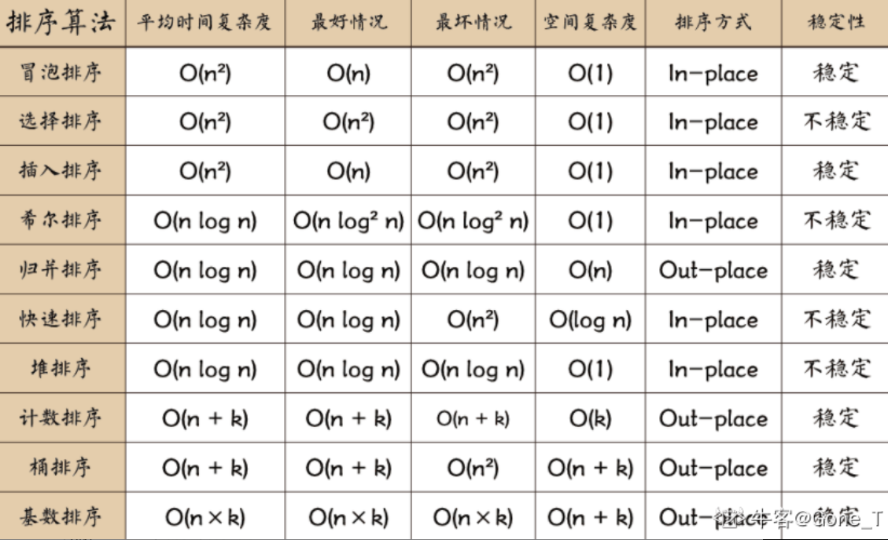
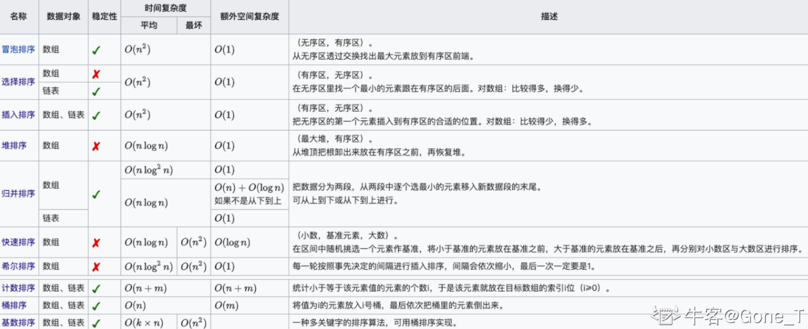

## 排序

插入排序插入时如果遇到相等元素，则插入在其后面，所以是稳定的。

## 背包问题

### 普通背包

1. 二维数组实现时，**两重循环可以颠倒**
2. 一维数组实现时，**两重循环不可以颠倒**（第二重循环是倒着走）

### 完全背包

一维数组实现，**两重循环可以颠倒**，第二重循环正着走。

**如果求组合数就是外层for循环遍历物品，内层for遍历背包**。

**如果求排列数就是外层for遍历背包，内层for循环遍历物品**。

