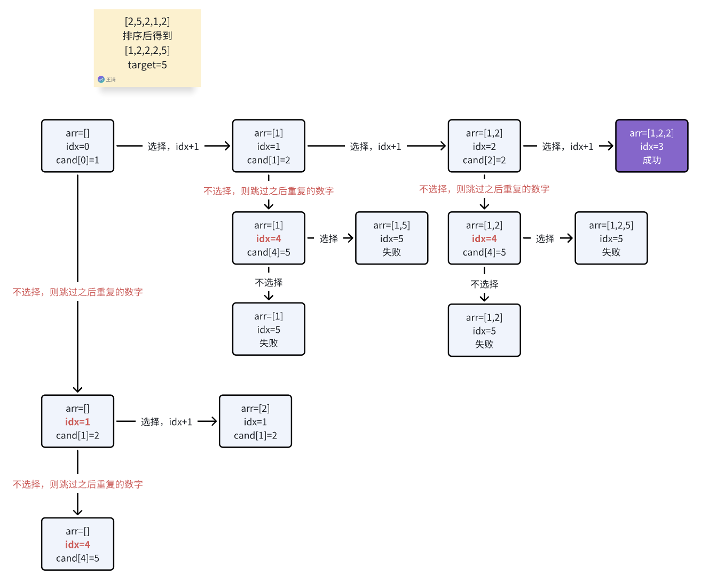

# 回溯/DFS

# [40. 组合总和 II](https://leetcode.cn/problems/combination-sum-ii/)

数组元素可以重复，需要先对数组排序，跳过重复的数字



# [93. 复原 IP 地址](https://leetcode.cn/problems/restore-ip-addresses/)

# [78. 子集](https://leetcode.cn/problems/subsets/)

- DFS搜索
- 二进制枚举

# [90. 子集 II](https://leetcode.cn/problems/subsets-ii/)

- DFS搜索 和 组合总和II 思路一样
- 二进制枚举

# [491. 非递减子序列](https://leetcode.cn/problems/non-decreasing-subsequences/)

难

- 只有当前数字大于等于前一个已选数字才可以选
- 只有相邻数字不等才可以不选
- 相比组合总和II又多了一个条件

# [51. N 皇后](https://leetcode.cn/problems/n-queens/)

# [52. N 皇后 II](https://leetcode.cn/problems/n-queens-ii/)

# [37. 解数独](https://leetcode.cn/problems/sudoku-solver/)

注意递归时要更新状态，回溯时要将状态复原。

如果每一层有多个递归方向（树状递归，有for循环），再找到答案回溯时，要在for循环中及时return防止找到答案后继续递归。

# [332. 重新安排行程](https://leetcode.cn/problems/reconstruct-itinerary/)

- DFS搜索+回溯
- Hierholzer——寻找欧拉回路

# [131. 分割回文串](https://leetcode.cn/problems/palindrome-partitioning/)

提前解析出s[i:j]是否为回文串

# [698. 划分为k个相等的子集](https://leetcode.cn/problems/partition-to-k-equal-sum-subsets/)

```C++
// 注意
state>>i&1
state&(
```

- DFS 超时
- DFS+剪枝 https://leetcode.cn/problems/partition-to-k-equal-sum-subsets/solutions/1500432/hua-fen-zi-ji-wen-ti-by-pedantic-mcleanb-vi1h/
- 记忆化搜索+状态压缩 https://leetcode.cn/problems/partition-to-k-equal-sum-subsets/solutions/1835705/by-lcbin-92ll/

类似题目：

## [473. 火柴拼正方形](https://leetcode.cn/problems/matchsticks-to-square/) √

## [1723. 完成所有工作的最短时间](https://leetcode.cn/problems/find-minimum-time-to-finish-all-jobs/)

## [2305. 公平分发饼干](https://leetcode.cn/problems/fair-distribution-of-cookies/)

# [46. 全排列](https://leetcode.cn/problems/permutations/)

# [47. 全排列 II](https://leetcode.cn/problems/permutations-ii/)

# [31. 下一个排列](https://leetcode.cn/problems/next-permutation/)

# [365. 水壶问题](https://leetcode.cn/problems/water-and-jug-problem/)

DFS+哈希去重

```c++
stack<PII> stk;
auto hash_f = [](const PII&p) {return hash<int>()(p.first) ^ hash<int>()(p.second);};
        unordered_set<PII, decltype(hash_f)> st(0, hash_f); // 注意初始化方式
// template<typename... _Args> emplace(_Args&&... __args)
        stk.emplace(0, 0);  // 注意emplace添加pair时不能加{}
```

# 括号生成

https://www.nowcoder.com/practice/c9addb265cdf4cdd92c092c655d164ca?tpId=196&tqId=37082&rp=1&ru=/exam/company&qru=/exam/company&sourceUrl=%2Fexam%2Fcompany&difficulty=undefined&judgeStatus=undefined&tags=&title=

中等