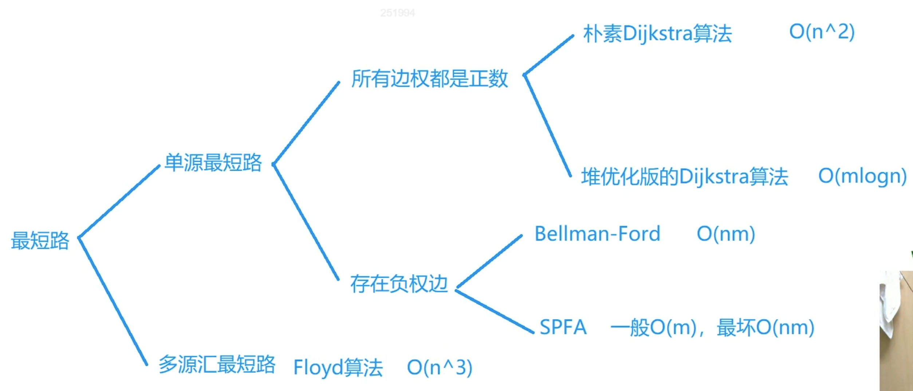

# 图论



# [1020. 飞地的数量](https://leetcode.cn/problems/number-of-enclaves/)

# [1976. 到达目的地的方案数](https://leetcode.cn/problems/number-of-ways-to-arrive-at-destination/)

最短路径+动态规划

朴素版dijkstra

```c++
#include <iostream>
#include <vector>


using namespace std;

// using PII = pair<int, int>;

int main(){
    
    int n, m;
    cin >> n >> m;
    
    vector<vector<int>> arc(n+1, vector<int>(n+1, 0x3f3f3f3f));
    
    int v1, v2, w;
    for (int i = 0;i<m;++i){
        cin >> v1 >> v2 >> w;
        arc[v1][v2] = min(arc[v1][v2], w);  // 防止有重边
        // arc[v2][v1] = w;
    }
    
    vector<int> dist(n+1, 0x3f3f3f3f);
    vector<bool> st(n+1, false);
    dist[1] = 0;
    
    for (int i = 0;i<n;++i) {   // 循环n次
        
        int t = -1;
        for (int j = 1;j<=n;++j) {   // 循环n次 找出不在最短路径集合中的最近的点
            if (!st[j] && (t == -1 || dist[j] < dist[t]))
                t = j;
        }
        
        st[t] = true;
        
        for (int j = 1;j<=n;++j) {
            dist[j] = min(dist[j], dist[t] + arc[t][j]);
        }        
        
    }
    
    if (dist[n] == 0x3f3f3f3f) cout << -1 << endl;
    else cout << dist[n] << endl;
    
    
    return 0;
}
```

堆优化版dijkstra

```c++
#include <iostream>
#include <vector>
#include <algorithm>
#include <queue>

using namespace std;

using PII = pair<int, int>;

int main(){
    
    int n,m;
    cin >> n >> m;
    
    vector<vector<PII>> adj(n+1, vector<PII>());
    vector<int> dist(n+1, 0x3f3f3f3f);
    vector<bool> st(n+1, false);
    priority_queue<PII, vector<PII>, greater<PII>> heap;
    
    int a, b, c;
    for (int i = 0;i<m;++i) {
        cin >> a >> b >> c;
        adj[a].push_back({b, c});
    }
    
    dist[1] = 0;
    heap.push({0, 1});
    
    while(heap.size()) {
        auto t = heap.top();
        heap.pop();
        
        int ver = t.second;
        if (st[ver]) continue;
        st[ver] = true;
        
        int sz = adj[ver].size();
        for (int i = 0;i<sz;++i) {
            int j = adj[ver][i].first, d = adj[ver][i].second;
            if (dist[j] > dist[ver] + d) {
                dist[j] = dist[ver] + d;
                heap.push({dist[j], j});
            }
        }
    }
    
    if (dist[n] == 0x3f3f3f3f) cout << -1;
    else cout << dist[n];
    
    return 0;
}
```

# [934. 最短的桥](https://leetcode.cn/problems/shortest-bridge/)

注意从一个点开始扩散完毕后，需要break

```c++
// DFS将grid中等于1的网格设置为2，只把一大块1设为2，而不是全部
for (int i = 0;i<n;++i) {
    int j = 0;
    for (;j<n;++j) {
        if (grid[i][j] == 1) {
            reset(i, j, 1, 2, grid);
            break;
        }
    }
    if (j < n) break;
}
```

