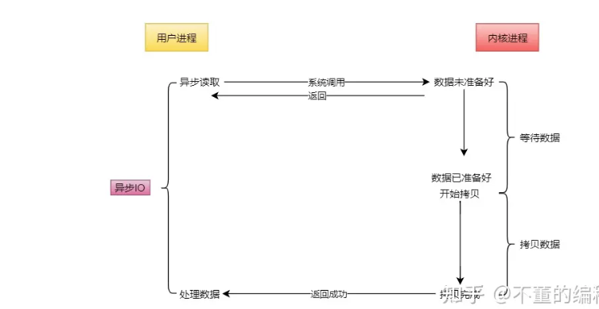

## 背景

应用程序通常需要处理来自多条事件流中的事件，比如我现在用的电脑，需要同时处理键盘鼠标的输入、中断信号等等事件，再比如web服务器如nginx，需要同时处理来来自N个客户端的事件（数据）。

在计算机系统中，我们用线程或者进程来表示一条执行流，通过不同的线程或进程在操作系统内部的调度，来做到对CPU处理的时分复用。这样多个事件流就可以并发进行，不需要一个等待另一个太久，在用户看起来他们似乎就是并行在做一样。

但是，多线程/进程是有成本的：

1. 线程/进程创建成本
2. CPU切换不同线程/进程成本 [Context Switch](https://link.zhihu.com/?target=https%3A//en.wikipedia.org/wiki/Context_switch)
3. 多线程的资源竞争

有没有一种可以在单线程/进程中处理多个事件流的方法呢？一种答案就是IO多路复用。

一句话解释：单线程或单进程同时监测若干个文件描述符是否可以执行IO操作的能力。因此IO多路复用解决的本质问题是在**用更少的资源完成更多的事**。

## linux的IO模型

目前Linux系统中提供了5种IO处理模型

1. 阻塞IO 
2. 非阻塞IO
3. IO多路复用
4. 信号驱动IO
5. 异步IO

### 阻塞IO

这是最常用的简单的IO模型。阻塞IO意味着当我们发起一次IO操作后一直等待成功或失败之后才返回，`在这期间程序不能做其它的事情`。阻塞IO操作只能对单个文件描述符进行操作

以下为chatgpt给出的例子：

在C++中，使用阻塞IO方式从套接字接收数据通常可以使用两个函数：`recv()` 和 `read()`。

`recv()` 函数是一个更通用的函数，可以用于接收来自套接字的数据，并提供更多的选项和功能。

```c++
ssize_t recv(int sockfd, void *buf, size_t len, int flags);
```

`read()` 函数是一个更低级别的函数，可以从文件描述符（包括套接字）读取数据。

```c++
ssize_t read(int fd, void *buf, size_t count);
```

`recv()` 函数在底层通常会调用 `read()` 函数来实际执行数据接收操作。在大多数UNIX-like系统中，包括Linux和BSD，`recv()` 函数是基于 `read()` 函数实现的。

```c++
#include <iostream>
#include <sys/socket.h>
#include <arpa/inet.h>
#include <unistd.h>
#include <thread>
#include <vector>

void handleClient(int clientSocket) {
    char buffer[1024];
    ssize_t bytesRead;
	
    // 采用recv阻塞来读取客户端socket的数据 flag=0 阻塞方式
    while ((bytesRead = recv(clientSocket, buffer, sizeof(buffer), 0)) > 0) {	
        std::cout << "Received message from client: " << std::string(buffer, bytesRead) << std::endl;

        // Echo back the received message
        send(clientSocket, buffer, bytesRead, 0);
    }

    if (bytesRead == 0) {
        std::cout << "Client disconnected." << std::endl;
    } else {
        std::cerr << "Error in receiving data from client." << std::endl;
    }

    close(clientSocket);
}

int main() {
    int serverSocket = socket(AF_INET, SOCK_STREAM, 0);
    if (serverSocket == -1) {
        std::cerr << "Failed to create socket." << std::endl;
        return 1;
    }

    sockaddr_in serverAddress{};
    serverAddress.sin_family = AF_INET;
    serverAddress.sin_addr.s_addr = INADDR_ANY;
    serverAddress.sin_port = htons(8080);

    if (bind(serverSocket, reinterpret_cast<sockaddr*>(&serverAddress), sizeof(serverAddress)) == -1) {
        std::cerr << "Failed to bind socket." << std::endl;
        close(serverSocket);
        return 1;
    }

    if (listen(serverSocket, SOMAXCONN) == -1) {
        std::cerr << "Failed to listen on socket." << std::endl;
        close(serverSocket);
        return 1;
    }

    std::vector<std::thread> clientThreads;

    while (true) {
        sockaddr_in clientAddress{};
        socklen_t clientAddressSize = sizeof(clientAddress);
        int clientSocket = accept(serverSocket, reinterpret_cast<sockaddr*>(&clientAddress), &clientAddressSize);
        if (clientSocket == -1) {
            std::cerr << "Failed to accept client connection." << std::endl;
            continue;
        }

        std::cout << "New client connected." << std::endl;

        // Create a new thread to handle the client
        std::thread thread(handleClient, clientSocket);
        clientThreads.push_back(std::move(thread));
    }

    for (auto& thread : clientThreads) {
        thread.join();
    }

    close(serverSocket);

    return 0;
}
```

### 非阻塞IO

我们在发起IO时，通过对文件描述符设置O_NONBLOCK flag来指定该文件描述符的IO操作为非阻塞。非阻塞IO通常发生在一个for循环当中，因为每次进行IO操作时要么IO操作成功，要么当IO操作会阻塞时返回错误EWOULDBLOCK/EAGAIN，然后再根据需要进行下一次的for循环操作，这种类似轮询的方式会浪费很多不必要的CPU资源，是一种糟糕的设计。和阻塞IO一样，非阻塞IO也是通过调用[read](https://link.zhihu.com/?target=http%3A//man7.org/linux/man-pages/man2/read.2.html)或[write](https://link.zhihu.com/?target=http%3A//man7.org/linux/man-pages/man2/write.2.html)来进行操作的，也只能对单个描述符进行操作。

### 多路复用IO

IO多路复用在Linux下包括了三种，[select](https://link.zhihu.com/?target=http%3A//man7.org/linux/man-pages/man2/select.2.html)、[poll](https://link.zhihu.com/?target=http%3A//man7.org/linux/man-pages/man2/poll.2.html)、[epoll](https://link.zhihu.com/?target=http%3A//man7.org/linux/man-pages/man7/epoll.7.html)，抽象来看，他们功能是类似的，但具体细节各有不同。IO多路复用都可以关注多个文件描述符，但对于这三种机制而言，不同数量级文件描述符对性能的影响是不同的。

Windows/Solaris: [IOCP](https://link.zhihu.com/?target=https%3A//en.wikipedia.org/wiki/Input/output_completion_port)

MacOS/FreeBSD: kqueue

### 信号量驱动IO

信号量驱动IO是一种非阻塞IO模型，它使用信号量机制来通知应用程序何时可以进行IO操作。在这种模型中，应用程序发起IO操作后，它不会被阻塞等待操作完成，而是继续执行后续代码。应用程序可以使用信号量或事件机制来等待IO操作完成的通知。当IO操作完成时，操作系统会发送信号或触发事件，`通知应用程序可以读取或写入数据`。这样，应用程序可以在等待IO操作期间执行其他任务，而无需一直停在IO操作处。

### 异步IO

异步IO和信号驱动IO差不多，但它比信号驱动IO可以多做一步：相比信号驱动IO需要在程序中完成数据从用户态到内核态(或反方向)的拷贝，异步IO可以把拷贝这一步也帮我们完成之后才通知应用程序。



## 常见软件的IO多路复用方案

redis: Linux下 epoll(level-triggered)，没有epoll用select

nginx: Linux下 epoll(edge-triggered)，没有epoll用select