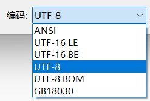

# URL编码

RFC1738规定，只有字母和数字[0-9a-zA-Z]、一些特殊符号"$-_.+!*'(),"[不包括双引号]、以及某些保留字，才可以不经过编码直接用于URL。

URL中如果有汉字，就必须编码后使用。

但RFC1738没有规定具体的编码方法，导致浏览器编码方法不一样。

## 1 网址路径中包含汉字

`http://zh.wikipedia.org/wiki/春节`会被编码为`http://zh.wikipedia.org/wiki/%E6%98%A5%E8%8A%82`，"春"和"节"的utf-8编码分别是"E6 98 A5"和"E8 8A 82"，因此，"%E6%98%A5%E8%8A%82"就是按照顺序，在每个字节前加上%而得到的。

## 2 查询字符串包含汉字

https://cn.bing.com/search?q=%E6%98%A5%E8%8A%82+%20-site:csdn.net


# 编码

https://utf8everywhere.org/zh-cn

微软经常误把“Unicode”和“宽字符”作为“UCS-2”和“UTF-16”的代名词。

在 Linux 和 Web 世界，大家默许了 Unicode 的最佳编码是 UTF-8。即使它的主要优点在于比起其他文本更能简短地表示英语和计算机语言（如 C++、HTML、XML 等），它在各种常用字符集上的表现也都几乎不逊色于 UTF-16。

## 一些编码概念

**码位 (Code point)**

Unicode 编码空间的任何数值。[§3.4, D10] 例如：U+3243F。

**编码单元 (Code unit)**

可以表示一段已编码文本的最小比特组合。[§3.9, D77] 例如，UTF-8、UTF-16 和 UTF-32 分别使用 8 比特、16 比特和 32 比特编码单元。上述码位可以编码成四个 UTF-8 编码单元“`f0 b2 90 bf`”，两个 UTF-16 编码单元“`d889 dc3f`”，一个 UTF-32 编码单元“`0003243f`”。请注意，这仅仅是*一组比特*序列；它们存储在面向字节的媒体上的方式取决于特定编码的端序。当存储上述 UTF-16 码位时，UTF-16BE 会转换为“`d8 89 dc 3f`”，UTF-16LE 会转换为“`89 d8 3f dc`”。

宽字符w_char的编码单元为两个字节。

## Unicode和UTF-8

Unicode 只是一个符号集，它只规定了符号的二进制代码，却没有规定这个二进制代码应该如何存储。（几个字节存储？）

UTF-8 就是在互联网上使用最广的一种 Unicode 的实现方式。其他实现方式还包括 UTF-16（字符用两个字节或四个字节表示）和 UTF-32（字符用四个字节表示），不过在互联网上基本不用。

UTF8是Unicode的实现方式之一。UTF-8 最大的一个特点，就是它是一种变长的编码方式。它可以使用1~4个字节表示一个符号，根据不同的符号而变化字节长度。（节约存储空间）

UTF-8 的编码规则很简单，只有二条：

1. 对于单字节的符号，字节的第一位设为`0`，后面7位为这个符号的 Unicode 码。因此对于英语字母，UTF-8 编码和 ASCII 码是相同的。
2. 对于`n`字节的符号（`n > 1`），第一个字节的前`n`位都设为`1`，第`n + 1`位设为`0`，后面字节的前两位一律设为`10`。剩下的没有提及的二进制位，全部为这个符号的 Unicode 码。

下表总结了编码规则，字母`x`表示可用编码的位。

```
Unicode符号范围     |        UTF-8编码方式
(十六进制)        |              （二进制）
----------------------+---------------------------------------------
0000 0000-0000 007F | 0xxxxxxx
0000 0080-0000 07FF | 110xxxxx 10xxxxxx
0000 0800-0000 FFFF | 1110xxxx 10xxxxxx 10xxxxxx
0001 0000-0010 FFFF | 11110xxx 10xxxxxx 10xxxxxx 10xxxxxx
```

跟据上表，解读 UTF-8 编码非常简单。如果一个字节的第一位是`0`，则这个字节单独就是一个字符；如果第一位是`1`，则连续有多少个`1`，就表示当前字符占用多少个字节。

`严`的 Unicode 是`4E25`（`100111000100101`），根据上表，可以发现`4E25`处在第三行的范围内（`0000 0800 - 0000 FFFF`），因此`严`的 UTF-8 编码需要三个字节，即格式是`1110xxxx 10xxxxxx 10xxxxxx`。然后，从`严`的最后一个二进制位开始，依次从后向前填入格式中的`x`，多出的位补`0`。这样就得到了，`严`的 UTF-8 编码是`1110|0100 10|111000 10|100101`，转换成十六进制就是`E4B8A5`。



`ANSI`是默认的编码方式。对于英文文件是`ASCII`编码，对于简体中文文件是`GB2312`编码（只针对 Windows 简体中文版，如果是繁体中文版会采用 Big5 码）。

## UTF16


## UTF8和UTF16对比

- 在 UTF-8 和 UTF-16 编码里，一个码位最多都要占 4 个字节。
- UTF-8 与端序无关。UTF-16 有两种端序：UTF-16LE 和 UTF-16BE（分别是小端序和大端序）。在这里我们统称为 UTF-16
- UTF-8 可以高效表示英文字母和其他 ASCII 字符（每字符一个字节），而 UTF-16 只对一部分亚洲字符集有利（只需 2 字节，UTF-8 需要 3 字节）。这也是为什么 Web 世界最喜好 UTF-8 的原因。
- UTF-16 在今天仍然流行，即使是在 Windows 世界以外。 Qt、Java、C#、Python（CPython 参考实现 3.3 版本之前，[见下文](https://utf8everywhere.org/zh-cn#faq.python)）以及 [ICU](http://en.wikipedia.org/wiki/International_Components_for_Unicode)，内部都使用 UTF-16 来表示字符串。
- UTF-8 的优势是：它以单字节为单位用 1~4 个字节来表示一个字符，兼容了 ASCII，在数据传输和存储过程中节省了空间，其二是UTF-8 不需要考虑大小端问题。这两点都是 UTF-16 的劣势。
- 不过对于中文字符，用 UTF-8 就要用3个字节，而 UTF-16 只需2个字节。而UTF-16 的优点是在计算字符串长度，执行索引操作时速度会很快。Java 内部使用 UTF-16 编码方案。而 Python3 使用 UTF-8。UTF-8 编码在互联网领域应用更加广泛。