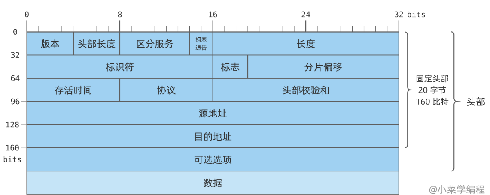
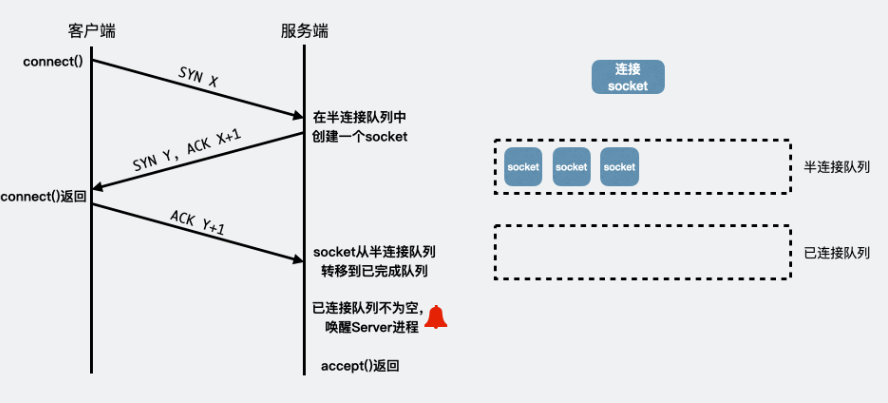
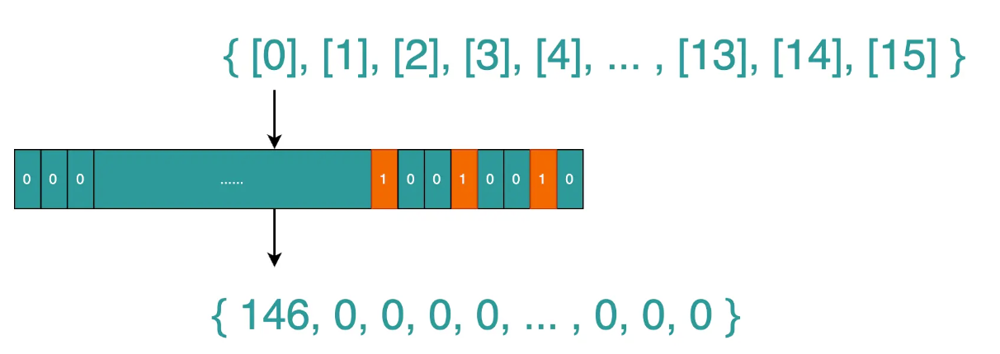
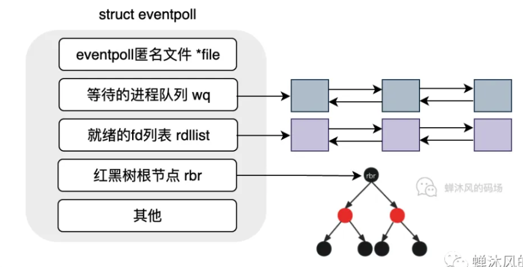
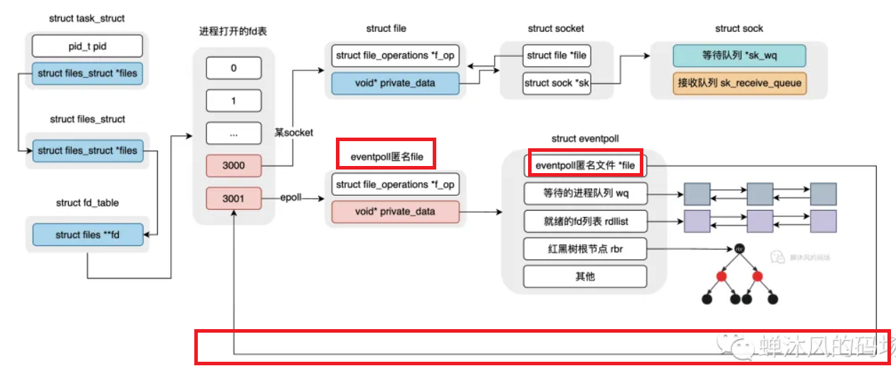
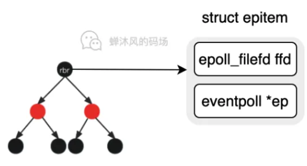

## 机器配置

两台机器，在同一网段内。

| 机器ID | IP地址        | MAC地址           |
| ------ | ------------- | ----------------- |
| node1  | 192.168.10.30 | 02:42:c0:a8:0a:1e |
| node2  | 192.168.10.31 | 02:42:c0:a8:0a:1f |

## ARP协议抓包

ARP会维护一个高速缓存，包含经常/最近访问的机器IP地址到MAC地址的映射。linux可以使用ARP命令查看和修改ARP高速缓存。（在node1上观察）

```bash
arp -a

node2 (192.168.10.31) at 02:42:c0:a8:0a:1f [ether] on eth0
? (192.168.0.1) at 02:42:75:b8:75:ae [ether] on eth0
? (192.168.65.7) at <incomplete> on eth0
```

为了观察ARP协议通信过程，先清除node1的ARP缓存

```
arp -d 192.168.10.31
```

然后使用tcpdump抓包

```bash
root@node1:/home# tcpdump -i eth0 -ent '(dst 192.168.10.31 and src 192.168.10.30) or (dst 192.168.10.30 and src 192.168.10.31)'
tcpdump: verbose output suppressed, use -v[v]... for full protocol decode
listening on eth0, link-type EN10MB (Ethernet), snapshot length 262144 bytes
02:42:c0:a8:0a:1e > ff:ff:ff:ff:ff:ff, ethertype ARP (0x0806), length 42: Request who-has 192.168.10.31 tell 192.168.10.30, length 28
02:42:c0:a8:0a:1e > ff:ff:ff:ff:ff:ff, ethertype ARP (0x0806), length 42: Request who-has 192.168.10.31 tell 192.168.10.30, length 28
02:42:c0:a8:0a:1f > 02:42:c0:a8:0a:1e, ethertype ARP (0x0806), length 42: Reply 192.168.10.31 is-at 02:42:c0:a8:0a:1f, length 28
02:42:c0:a8:0a:1e > 02:42:c0:a8:0a:1f, ethertype IPv4 (0x0800), length 98: 192.168.10.30 > 192.168.10.31: ICMP echo request, id 2, seq 1, length 64
02:42:c0:a8:0a:1f > 02:42:c0:a8:0a:1e, ethertype IPv4 (0x0800), length 98: 192.168.10.31 > 192.168.10.30: ICMP echo reply, id 2, seq 1, length 64
02:42:c0:a8:0a:1e > 02:42:c0:a8:0a:1f, ethertype IPv4 (0x0800), length 98: 192.168.10.30 > 192.168.10.31: ICMP echo request, id 2, seq 2, length 64
02:42:c0:a8:0a:1f > 02:42:c0:a8:0a:1e, ethertype IPv4 (0x0800), length 98: 192.168.10.31 > 192.168.10.30: ICMP echo reply, id 2, seq 2, length 64
02:42:c0:a8:0a:1e > 02:42:c0:a8:0a:1f, ethertype IPv4 (0x0800), length 98: 192.168.10.30 > 192.168.10.31: ICMP echo request, id 2, seq 3, length 64
02:42:c0:a8:0a:1f > 02:42:c0:a8:0a:1e, ethertype IPv4 (0x0800), length 98: 192.168.10.31 > 192.168.10.30: ICMP echo reply, id 2, seq 3, length 64
02:42:c0:a8:0a:1e > 02:42:c0:a8:0a:1f, ethertype IPv4 (0x0800), length 98: 192.168.10.30 > 192.168.10.31: ICMP echo request, id 2, seq 4, length 64
02:42:c0:a8:0a:1f > 02:42:c0:a8:0a:1e, ethertype IPv4 (0x0800), length 98: 192.168.10.31 > 192.168.10.30: ICMP echo reply, id 2, seq 4, length 64
02:42:c0:a8:0a:1e > 02:42:c0:a8:0a:1f, ethertype IPv4 (0x0800), length 98: 192.168.10.30 > 192.168.10.31: ICMP echo request, id 2, seq 5, length 64
02:42:c0:a8:0a:1f > 02:42:c0:a8:0a:1e, ethertype IPv4 (0x0800), length 98: 192.168.10.31 > 192.168.10.30: ICMP echo reply, id 2, seq 5, length 64
02:42:c0:a8:0a:1f > 02:42:c0:a8:0a:1e, ethertype ARP (0x0806), length 42: Request who-has 192.168.10.30 tell 192.168.10.31, length 28
02:42:c0:a8:0a:1e > 02:42:c0:a8:0a:1f, ethertype ARP (0x0806), length 42: Reply 192.168.10.30 is-at 02:42:c0:a8:0a:1e, length 28
02:42:c0:a8:0a:1e > 02:42:c0:a8:0a:1f, ethertype IPv4 (0x0800), length 98: 192.168.10.30 > 192.168.10.31: ICMP echo request, id 2, seq 6, length 64
02:42:c0:a8:0a:1f > 02:42:c0:a8:0a:1e, ethertype IPv4 (0x0800), length 98: 192.168.10.31 > 192.168.10.30: ICMP echo reply, id 2, seq 6, length 64

# 另一个终端
root@node1:/home# ping 192.168.10.31                                                           
PING 192.168.10.31 (192.168.10.31) 56(84) bytes of data.
64 bytes from 192.168.10.31: icmp_seq=1 ttl=64 time=0.193 ms
64 bytes from 192.168.10.31: icmp_seq=2 ttl=64 time=0.046 ms
64 bytes from 192.168.10.31: icmp_seq=3 ttl=64 time=0.042 ms
64 bytes from 192.168.10.31: icmp_seq=4 ttl=64 time=0.055 ms
64 bytes from 192.168.10.31: icmp_seq=5 ttl=64 time=0.049 ms
64 bytes from 192.168.10.31: icmp_seq=6 ttl=64 time=0.051 ms
```

我们只关注前两行ARP协议的通信：

```bash
02:42:c0:a8:0a:1e > ff:ff:ff:ff:ff:ff, ethertype ARP (0x0806), length 42: Request who-has 192.168.10.31 tell 192.168.10.30, length 28
02:42:c0:a8:0a:1f > 02:42:c0:a8:0a:1e, ethertype ARP (0x0806), length 42: Reply 192.168.10.31 is-at 02:42:c0:a8:0a:1f, length 28
```

`ff:ff:ff:ff:ff:ff`是以太网的广播地址，用于表示整个LAN，该LAN上的所有机器都会收到并处理这样的帧。

28是ARP请求/应答报文的长度，42是以太网帧的长度（其实是46，没统计以太网帧尾部4字节的CRC字段）

## DNS协议抓包

第一个数据包，60293表示DNS查询报文的标识值，53表示DNS服务使用的端口。`+`表示开启递归查询标志，`A?`表示使用A类型的查询方式。31表示DNS报文长度。

第二个数据包，`3/0/0`表示报文包含3个应答资源记录，0个授权资源记录，0个额外信息记录。CNAME表示机器的别名。

```bash
root@node1:/home# tcpdump -i eth0 -nt -s 500 port domain
tcpdump: verbose output suppressed, use -v[v]... for full protocol decode
listening on eth0, link-type EN10MB (Ethernet), snapshot length 500 bytes
IP 192.168.10.30.48641 > 8.8.8.8.53: 60293+ A? www.baidu.com. (31)
IP 8.8.8.8.53 > 192.168.10.30.48641: 60293 3/0/0 CNAME www.a.shifen.com., A 153.3.238.102, A 153.3.238.110 (90)


# 另一个终端
root@node1:/home# host -t A www.baidu.com
www.baidu.com is an alias for www.a.shifen.com.
www.a.shifen.com has address 153.3.238.102
www.a.shifen.com has address 153.3.238.110
```

## socket和TCP/IP协议族的关系

数据链路层，网络层，传输层协议是在内核中实现的，OS提供了一组系统调用，使应用程序能够访问这些协议提供的服务，socket就是这组系统调用提供的API。主要有两点功能：

1. 将应用程序数据从用户缓冲区复制到TCP/UDP内核发送缓冲区，交付给内核来发送数据。或从内核TCP/UDP接收缓冲区复制数据到用户缓冲区，读取数据。
2. 应用程序可以通过它们来修改内核中各层协议的某些头部信息或其他数据结构，从而精细地控制底层通信的行为。


# IP协议详解

IP协议为上层提供无状态，无连接，不可靠的服务。

无状态使得IP协议简单高效，每次传输无需携带状态数据，无需为保持通信状态而分配一些内核资源。

不可靠，尽最大努力交付（best effort）。比如某个中转路由器发现IP数据报在网络上存活时间太长（根据TTL判断），那么将丢弃，返回一个ICMP错误消息（超时错误）给发送端。发送端的IP模块一旦检测到IP数据报发送失败，就通知上层协议，不会试图重传。

## IPV4头部结构



标识符唯一标识主机发送的每一个数据报，初始值由系统随机生成，每发送一个数据报就+1。如果分片，则同一个数据报的所有分片具有相同的标识符。

三个标志位。第一位保留，第二位表示禁止分片，

各个字段意义见P19

```
cat /etc/services
cat /etc/protocols
```

观察IPv4头部结构

```bash
root@node1:/home# tcpdump -ntx -i lo
IP 127.0.0.1.42133 > 127.0.0.1.37782: Flags [P.], seq 265368:284955, ack 3133, win 512, options [nop,nop,TS val 1453047600 ecr 1453047593], length 19587
        0x0000:  4500 4cb7 7980 4000 4006 76be 7f00 0001
        0x0010:  7f00 0001
```

## IP分片

MTU=1500字节，限制了数据链路层以太网帧的长度。IP头部20个字节，所以数据部分最多1480个字节。我们可以传输一个1481字节的ICMP报文。ICMP报文头部8个字节，数据部分是1473字节。这个报文会被分片。

id表示IP分片的标识值，两个分片标识值一样，说明属于同一个IP数据包。

第一个分片的`flag+`表示MF被设置为1，偏移为0，第二个分片偏移为1480，`flag[none]`表示是最后一个分片

```bash
root@node1:/home# tcpdump -ntv -i eth0 icmp
tcpdump: listening on eth0, link-type EN10MB (Ethernet), snapshot length 262144 bytes
IP (tos 0x0, ttl 64, id 18882, offset 0, flags [+], proto ICMP (1), length 1500)
    192.168.10.30 > 192.168.10.31: ICMP echo request, id 5, seq 1, length 1480
IP (tos 0x0, ttl 64, id 18882, offset 1480, flags [none], proto ICMP (1), length 21)
    192.168.10.30 > 192.168.10.31: ip-proto-1
IP (tos 0x0, ttl 64, id 22107, offset 0, flags [+], proto ICMP (1), length 1500)
    192.168.10.31 > 192.168.10.30: ICMP echo reply, id 5, seq 1, length 1480
IP (tos 0x0, ttl 64, id 22107, offset 1480, flags [none], proto ICMP (1), length 21)
    192.168.10.31 > 192.168.10.30: ip-proto-1
   
# 另一个终端
root@node1:/home# ping 192.168.10.31 -s 1473
PING 192.168.10.31 (192.168.10.31) 1473(1501) bytes of data.
1481 bytes from 192.168.10.31: icmp_seq=1 ttl=64 time=0.130 ms
1481 bytes from 192.168.10.31: icmp_seq=2 ttl=64 time=0.071 ms
```

## IP路由


# TCP协议

面向连接，可靠的，字节流服务

全双工，一对一的连接。必须先建立连接。采用发送应答机制，超时重传机制，

## TCP固定头部结构


端口号，客户端使用系统自动选择的临时端口号，而服务器则使用知名服务端口号。

16位校验和包含了对TCP头部和数据部分的校验，通过CRC算法来进行校验。

## TCP头部选项

见P33

## TCP建立和连接

```
tcpdump -i eth0 -nt '(dst 192.168.10.31 and src 192.168.10.30) or (dst 192.168.10.30 and src 192.168.10.31)'
```

TCP是全双工，允许两个方向的数据传输被独立关闭。当某一方发送数据完毕，可以关闭单向的连接，这样称为半关闭状态。

服务端和客户端应用程序判断对方是否已经关闭连接的方法是，read系统调用返回0

## TCP状态转移

TIME_WAIT状态

客户端收到服务器结束报文后，进入TIME_WAIT状态。客户端连接还要等待2MSL的时间，才能完全关闭。MSL是TCP报文段在网络中的最大生存时间。RFC 1122建议为2min。

主要有两个原因：

1. 可靠地终止TCP连接
2. 保证让迟来的TCP报文有足够的时间被识别并丢弃。

在linux上，一个TCP端口不能被同时打开多次。当一个TCP连接在TIME_WAIT状态，如果有新的客户端发起连接（发送SYN），服务端会发送RST报文给客户端。

## 复位报文段 RST

复位报文段，通知对方关闭连接或重新建立连接。主要有三种情况。

1 访问不存在的端口/或者该端口处于TIME_WAIT状态。使用telnet登录一个不存在的端口：

```bash
root@node1:/home# tcpdump -i eth0 -nt '(dst 192.168.10.31 and src 192.168.10.30) or (dst 192.168.10.30 and src 192.168.10.31)'
tcpdump: verbose output suppressed, use -v[v]... for full protocol decode
listening on eth0, link-type EN10MB (Ethernet), snapshot length 262144 bytes
IP 192.168.10.30.57398 > 192.168.10.31.132: Flags [S], seq 1233619064, win 64240, options [mss 1460,sackOK,TS val 1149511919 ecr 0,nop,wscale 7], length 0
IP 192.168.10.31.132 > 192.168.10.30.57398: Flags [R.], seq 0, ack 1233619065, win 0, length 0

root@node1:/home# telnet 192.168.10.31 132
Trying 192.168.10.31...
telnet: Unable to connect to remote host: Connection refused
```

node2回复了复位报文。复位报文段中窗口大小为0，所以收到RST报文的一方应该关闭或重新连接，而不能回应这个复位报文。   

2 异常终止连接。

3 处理半打开连接。如果服务器关闭/异常终止了连接，而对方没有收到结束报文，此时客户端还维持着原来的连接，而服务器已经没有该连接的任何信息了。这种连接叫做半打开连接，如果客户端/服务器往一个半打开连接写入数据，则对方会回复一个复位报文。

## TCP交互数据流

交互数据流仅包含很少的字节，使用交互数据的应用程序对实时性要求很高。比如ssh，telnet。

使用telnet登录node2

```bash
root@node1:/home# tcpdump -i eth0 -nt '(dst 192.168.10.31 and src 192.168.10.30) or (dst 192.168.10.30 and src 192.168.10.31)'
...
# 输入ls命令，服务器分别会回显l和s两个字符  6c即为'l' 73为's'
IP 192.168.10.30.46352 > 192.168.10.31.23: Flags [P.], seq 99:100, ack 627, win 501, options [nop,nop,TS val 35172241 ecr 261666180], length 1
        0x0000:  4510 0035 9168 4000 4006 13bd c0a8 0a1e
        0x0010:  c0a8 0a1f b510 0017 c807 7891 c507 2463
        0x0020:  8018 01f5 95b5 0000 0101 080a 0218 af91
        0x0030:  0f98 b584 6c
IP 192.168.10.31.23 > 192.168.10.30.46352: Flags [P.], seq 627:628, ack 100, win 509, options [nop,nop,TS val 261667513 ecr 35172241], length 1
        0x0000:  4510 0035 2078 4000 4006 84ad c0a8 0a1f
        0x0010:  c0a8 0a1e 0017 b510 c507 2463 c807 7892
        0x0020:  8018 01fd 95b5 0000 0101 080a 0f98 bab9
        0x0030:  0218 af91 6c
IP 192.168.10.30.46352 > 192.168.10.31.23: Flags [.], ack 628, win 501, options [nop,nop,TS val 35172241 ecr 261667513], length 0
        0x0000:  4510 0034 9169 4000 4006 13bd c0a8 0a1e
        0x0010:  c0a8 0a1f b510 0017 c807 7892 c507 2464
        0x0020:  8010 01f5 95b4 0000 0101 080a 0218 af91
        0x0030:  0f98 bab9
IP 192.168.10.30.46352 > 192.168.10.31.23: Flags [P.], seq 100:101, ack 628, win 501, options [nop,nop,TS val 35593676 ecr 261667513], length 1
        0x0000:  4510 0035 916a 4000 4006 13bb c0a8 0a1e
        0x0010:  c0a8 0a1f b510 0017 c807 7892 c507 2464
        0x0020:  8018 01f5 95b5 0000 0101 080a 021f 1dcc
        0x0030:  0f98 bab9 73
IP 192.168.10.31.23 > 192.168.10.30.46352: Flags [P.], seq 628:629, ack 101, win 509, options [nop,nop,TS val 262088949 ecr 35593676], length 1
        0x0000:  4510 0035 2079 4000 4006 84ac c0a8 0a1f
        0x0010:  c0a8 0a1e 0017 b510 c507 2464 c807 7893
        0x0020:  8018 01fd 95b5 0000 0101 080a 0f9f 28f5
        0x0030:  021f 1dcc 73
IP 192.168.10.30.46352 > 192.168.10.31.23: Flags [.], ack 629, win 501, options [nop,nop,TS val 35593677 ecr 262088949], length 0
        0x0000:  4510 0034 916b 4000 4006 13bb c0a8 0a1e
        0x0010:  c0a8 0a1f b510 0017 c807 7893 c507 2465
        0x0020:  8010 01f5 95b4 0000 0101 080a 021f 1dcd
        0x0030:  0f9f 28f5

# 然后输入回车 会发送Od00 0d即为回车 00表示字符串结束（流结束符） 
# 服务器回显0x00
IP 192.168.10.30.46352 > 192.168.10.31.23: Flags [P.], seq 101:103, ack 629, win 501, options [nop,nop,TS val 35658343 ecr 262088949], length 2
        0x0000:  4510 0036 916c 4000 4006 13b8 c0a8 0a1e
        0x0010:  c0a8 0a1f b510 0017 c807 7893 c507 2465
        0x0020:  8018 01f5 95b6 0000 0101 080a 0220 1a67
        0x0030:  0f9f 28f5 0d00
IP 192.168.10.31.23 > 192.168.10.30.46352: Flags [P.], seq 629:641, ack 103, win 509, options [nop,nop,TS val 262153615 ecr 35658343], length 12
        0x0000:  4510 0040 207a 4000 4006 84a0 c0a8 0a1f
        0x0010:  c0a8 0a1e 0017 b510 c507 2465 c807 7895
        0x0020:  8018 01fd 95c0 0000 0101 080a 0fa0 258f
        0x0030:  0220 1a67 0d0a 1b5b 3f32 3030 346c 0d00
IP 192.168.10.30.46352 > 192.168.10.31.23: Flags [.], ack 641, win 501, options [nop,nop,TS val 35658343 ecr 262153615], length 0
        0x0000:  4510 0034 916d 4000 4006 13b9 c0a8 0a1e
        0x0010:  c0a8 0a1f b510 0017 c807 7895 c507 2471
        0x0020:  8010 01f5 95b4 0000 0101 080a 0220 1a67
        0x0030:  0fa0 258f

# 接着服务器又发送了test.txt 即7465 7374 2e74 7874 0d0a
IP 192.168.10.31.23 > 192.168.10.30.46352: Flags [P.], seq 641:651, ack 103, win 509, options [nop,nop,TS val 262153616 ecr 35658343], length 10
        0x0000:  4510 003e 207b 4000 4006 84a1 c0a8 0a1f
        0x0010:  c0a8 0a1e 0017 b510 c507 2471 c807 7895
        0x0020:  8018 01fd 95be 0000 0101 080a 0fa0 2590
        0x0030:  0220 1a67 7465 7374 2e74 7874 0d0a
IP 192.168.10.30.46352 > 192.168.10.31.23: Flags [.], ack 651, win 501, options [nop,nop,TS val 35658344 ecr 262153616], length 0
        0x0000:  4510 0034 916e 4000 4006 13b8 c0a8 0a1e
        0x0010:  c0a8 0a1f b510 0017 c807 7895 c507 247b
        0x0020:  8010 01f5 95b4 0000 0101 080a 0220 1a68
        0x0030:  0fa0 2590
IP 192.168.10.31.23 > 192.168.10.30.46352: Flags [P.], seq 651:691, ack 103, win 509, options [nop,nop,TS val 262153616 ecr 35658344], length 40
        0x0000:  4510 005c 207c 4000 4006 8482 c0a8 0a1f
        0x0010:  c0a8 0a1e 0017 b510 c507 247b c807 7895
        0x0020:  8018 01fd 95dc 0000 0101 080a 0fa0 2590
        0x0030:  0220 1a68 1b5b 3f32 3030 3468 1b5d 303b
        0x0040:  726f 6f74 406e 6f64 6532 3a20 7e07 726f
        0x0050:  6f74 406e 6f64 6532 3a7e 2320
IP 192.168.10.30.46352 > 192.168.10.31.23: Flags [.], ack 691, win 501, options [nop,nop,TS val 35658344 ecr 262153616], length 0
        0x0000:  4510 0034 916f 4000 4006 13b7 c0a8 0a1e
        0x0010:  c0a8 0a1f b510 0017 c807 7895 c507 24a3
        0x0020:  8010 01f5 95b4 0000 0101 080a 0220 1a68
        0x0030:  0fa0 2590
```

这些报文中都有P这个字段，告知对方尽快读取数据。

可以发现，客户端针对服务器的回复的ACK都不携带任何数据，而服务器回复的ACK包都包含了应用程序数据。这种行为称为延迟确认，即不马上确认上次收到的数据，而是延迟一段时间后查看本端是否有数据需要发送，如果有，和ACK一块发出。

服务器对客户请求处理地很快，所以它发送ACK时总是有数据一起发送。而由于用户输入速度慢于客户端程序处理速度，所以客户端的ACK总是不携带任何数据。

延迟确认可以减少发送TCP段的数量。


成块数据的长度通常为TCP报文段允许的最大数据长度。使用成块数据的应用程序对传输效率要求高。比如ftp。

# TCP/IP通信案例


# linux网络编程基础API

socket的一些头文件在/usr/include/下面

```bash
root@node1:/home/socket# find /usr/include/ -name socket.h
/usr/include/x86_64-linux-gnu/sys/socket.h
/usr/include/x86_64-linux-gnu/bits/socket.h
/usr/include/x86_64-linux-gnu/asm/socket.h
/usr/include/linux/socket.h
/usr/include/asm-generic/socket.h
root@node1:/home/socket# find /usr/include/ -name un.h    
/usr/include/x86_64-linux-gnu/sys/un.h
/usr/include/linux/un.h
root@node1:/home/socket# find /usr/include/ -name in.h
/usr/include/x86_64-linux-gnu/bits/in.h
/usr/include/netinet/in.h
/usr/include/linux/in.h
```

socket地址结构体和一些协议宏：

```c
// bits/socket.h
struct sockaddr
  {
    __SOCKADDR_COMMON (sa_);	/* Common data: address family and length.  */
    char sa_data[14];		/* Address data.  */
  };

/* Protocol families.  */
#define PF_UNSPEC	0	/* Unspecified.  */
#define PF_LOCAL	1	/* Local to host (pipes and file-domain).  */
#define PF_UNIX		PF_LOCAL /* POSIX name for PF_LOCAL.  */
#define PF_INET		2	/* IP protocol family.  */
#define PF_INET6	10	/* IP version 6.  */


// bits/sockaddr.h

/* POSIX.1g specifies this type name for the `sa_family' member.  */
typedef unsigned short int sa_family_t;

/* This macro is used to declare the initial common members
   of the data types used for socket addresses, `struct sockaddr',
   `struct sockaddr_in', `struct sockaddr_un', etc.  */

#define	__SOCKADDR_COMMON(sa_prefix) \
  sa_family_t sa_prefix##family

```

字节序转换 将数据转换为大端字节序（网络字节序）

```c
/* Functions to convert between host and network byte order.

   Please note that these functions normally take `unsigned long int' or
   `unsigned short int' values as arguments and also return them.  But
   this was a short-sighted decision since on different systems the types
   may have different representations but the values are always the same.  */

extern uint32_t ntohl (uint32_t __netlong) __THROW __attribute__ ((__const__));
extern uint16_t ntohs (uint16_t __netshort)
     __THROW __attribute__ ((__const__));
extern uint32_t htonl (uint32_t __hostlong)
     __THROW __attribute__ ((__const__));
extern uint16_t htons (uint16_t __hostshort)
     __THROW __attribute__ ((__const__));
```

## socket

```c
/* Create a new socket of type TYPE in domain DOMAIN, using
   protocol PROTOCOL.  If PROTOCOL is zero, one is chosen automatically.
   Returns a file descriptor for the new socket, or -1 for errors.  */
extern int socket (int __domain, int __type, int __protocol) __THROW;
```

domain设置底层使用哪个协议簇，例如PF_INET（即使用TCP/IP协议族）
type指定服务类型，SOCK_STREAM流服务，SOCK_UGRAM数据报服务。对于TCP/IP协议族而言，前者在传输层使用TCP，后者使用UDP

protocol是在前两个参数构成协议集合下，再选一个具体的协议，一般前两个参数已经决定了协议，所以几乎所有情况下都设置为0，表示使用默认协议。

创建成功时返回一个socket文件描述符，失败则返回-1

## bind

创建socket后，还需要为其指定socket地址。服务器通常要指定socket地址，而客户端不需要，采用匿名方式，即 使用操作系统自动分配的socket地址。

```c
/* Give the socket FD the local address ADDR (which is LEN bytes long).  */
extern int bind (int __fd, const struct sockaddr * __addr, socklen_t __len)
     __THROW;
```

len指定socket地址的长度。成功时返回0，失败返回-1。

## listen

socket被创建出来的时候都默认是一个**主动socket**，也就说，内核会认为这个socket之后某个时候会调用`connect()`主动向别的设备发起连接。这个默认对客户端socket来说很合理，但是监听socket可不行，它只能等着客户端连接自己，因此我们需要调用`listen()`将监听socket从主动设置为被动，明确告诉内核：你要接受指向这个监听socket的连接请求！

绑定地址之后，还不能立即接收客户连接。**需要通过listen创建一个监听队列以存放待处理的客户连接。**

内核为每一个监听socket都维护了两个队列：

- 半连接队列（未完成连接的队列）。这里存放着暂未彻底完成3次握手的socket（为了防止半连接攻击，这里存放的其实是占用内存极小的request _sock，但是我们直接理解成socket就行了），这些socket的状态称为`SYN_RCVD`。
- 已完成连接队列。每个已完成TCP3次握手的客户端连接对应的socket就放在这里，这些socket的状态为`ESTABLISHED`。



```c
/* Prepare to accept connections on socket FD.
   N connection requests will be queued before further requests are refused.
   Returns 0 on success, -1 for errors.  */
extern int listen (int __fd, int __n) __THROW;
```

n指定内核监听队列的最大长度。若超过n，服务器将不受理新的客户连接，客户端会收到ECONNREFUSED。2.2内核版本之后，n表示处于完全连接状态（ESTABLISH）的socket的上限。

```c
#include <sys/socket.h>
#include <netinet/in.h>
#include <arpa/inet.h>
#include <signal.h>
#include <unistd.h>
#include <stdlib.h>
#include <assert.h>
#include <stdio.h>
#include <string.h>

static bool stop = false;
static void handle_term( int sig )
{
    stop = true;
}

int main( int argc, char* argv[] )
{
    signal( SIGTERM, handle_term );

    if( argc <= 3 )
    {
        printf( "usage: %s ip_address port_number backlog\n", basename( argv[0] ) );
        return 1;
    }
    const char* ip = argv[1];
    int port = atoi( argv[2] );
    int backlog = atoi( argv[3] );

    int sock = socket( PF_INET, SOCK_STREAM, 0 );
    assert( sock >= 0 );

    struct sockaddr_in address;
    bzero( &address, sizeof( address ) );
    address.sin_family = AF_INET;
    inet_pton( AF_INET, ip, &address.sin_addr );
    address.sin_port = htons( port );

    int ret = bind( sock, ( struct sockaddr* )&address, sizeof( address ) );
    assert( ret != -1 );

    ret = listen( sock, backlog );
    assert( ret != -1 );
    printf("listen ret=%d\n", ret);

    while ( ! stop )
    {
        printf("stop=%d\n", stop);
        sleep( 1 );
    }

    close( sock );
    return 0;
}
```

该程序接收3个参数，IP地址，端口号，backlog值。在node2启动该程序，backlog设置1时：

```bash
root@node2:/home/linux_server# ./a.out  192.168.10.31 12345 1

root@node1:/home# telnet 192.168.10.31 12345
root@node1:/home# telnet 192.168.10.31 12345
root@node1:/home# telnet 192.168.10.31 12345
```

node1开启四个telnet终端，然后观察端口状态

```bash
root@node1:/home# netstat  -nt | grep 12345
tcp        0      0 192.168.10.30:33984     192.168.10.31:12345     ESTABLISHED
tcp        0      0 192.168.10.30:58042     192.168.10.31:12345     ESTABLISHED
tcp        0      1 192.168.10.30:58052     192.168.10.31:12345     SYN_SENT 
```

说明完整连接最多有(backlog+1)个。当关闭其中一个telnet连接之后，会有：

```bash
root@node1:/home# netstat  -nt | grep 12345
tcp        0      0 192.168.10.30:33984     192.168.10.31:12345     ESTABLISHED
tcp        0      0 192.168.10.30:58042     192.168.10.31:12345     FIN_WAIT2  
tcp        0      1 192.168.10.30:58052     192.168.10.31:12345     SYN_SENT  
```

可以看出这个连接从ESTABLISHED变成了FIN_WAIT2，为什么呢？在客户端退出时，会发送FIN给服务器，服务器回复ACK，但是因为服务端程序卡在while循环了，如果服务器不对socket函数执行close操作，那么就不能从CLOSE_WAIT状态转移到LAST_ACK，与此对应客户端的TCP连接就无法从FIN_WAIT2转移到TIME_WAIT。

```
root@node2:/home# netstat  -nt | grep 12345
tcp        0      0 192.168.10.31:12345     192.168.10.30:33984     ESTABLISHED
tcp        8      0 192.168.10.31:12345     192.168.10.30:58042     CLOSE_WAIT 
```

听一段时间之后，它们就会被操作系统释放。

## accept

从listen队列中接收一个连接socket

```c
int accept(int sockfd, struct sockaddr *addr, socklen_t *addrlen);
```

- sockfd是执行过listen系统调用的监听socket（把执行过listen调用，处于LISTEN状态的socket称为监听socket，而所有处于ESTABLISHED状态的socket称为连接socket）
- addr用来获取被接收连接的远端socket的地址

accept成功时返回一个新的连接socket

`accept()`函数是由服务端调用的，用于从已连接队列中返回一个socket描述符；如果socket为阻塞式的，那么如果已连接队列为空，`accept()`进程就会被睡眠。BIO（Blocking IO）恰好就是这个样子。

## connect

服务器通过listen来被动接收连接，客户端通过connect来主动与服务器建立连接。

```c
extern int connect (int __fd, const struct sockaddr * __addr, socklen_t __len);
```

将创建好的socket传入进去，成功时返回0，之后fd就唯一标识了这个连接，客户端就可以通过读写这个fd来与服务器通信。

## close

关闭一个连接实际上就是关闭该连接对应的socket。可以通过关闭普通文件描述符的系统调用来完成

```c
int close(int fd);
```

close并非总是立即关闭一个连接，而是将fd引用计数减一。只有当引用计数为0时，才真正关闭连接。

如果无论如何都要立即终止连接，可以使用专门为网络编程设计的shutdown系统调用

```bash
int shutdown(int sockfd, int howto);
```

 howto可以取

1. SHUT_RD 不能再对socket文件描述符来读，该socket接收缓冲区的数据会被丢弃
2. SHUT_WR 不能再对socket文件描述符执行写操作，发送缓冲区的数据会在真正关闭连接之前全部发送出去。
3. SHUT_RDWR

## 数据读写

对文件的读写操作read和write同样适用于socket。但是socket编程接口提供了专门用于socket数据读写的系统调用，它们增加了对数据读写的控制。

### TCP数据读写

```c
extern ssize_t recv (int __fd, void *__buf, size_t __n, int __flags);
extern ssize_t send (int __fd, const void *__buf, size_t __n, int __flags);
```

recv成功时返回实际读取到的数据的长度。可能小于len。因此，可能要多次调用recv才能读取到完整的数据。recv返回0意味着通信`对方`已经关闭连接了。

send成功时返回实际写入的数据长度。

flag提供了额外的控制。


# 9 IO复用

## select

在一定时间内，监听用户感兴趣的文件描述符上的可读，可写和异常等事件。

```c
int select(int nfds, fd_set *readfds, fd_set *writefds, fd_set *exceptfds, struct timeval *timeout);
```

- nfds指定被监听的文件描述符总数。取值为我们感兴趣的最大描述符 + 1

- readfds/writefds/exceptfds分别指向可读，可写，异常等事件对应的文件描述符的集合。select调用返回时，内核将修改它们来通知应用程序哪些文件描述符已经就绪。fd_set里面包含了一个整型数组，该数组中的每一个元素的每一位都标记一个文件描述符。（值-结果参数）

  ```c
  // file: /usr/include/sys/select.h
  /* __fd_mask 是 long int 类型的别名  */
  typedef long int __fd_mask;
  
  #define __NFDBITS    (8 * (int) sizeof (__fd_mask))
  
  typedef struct  {
     ...
     __fd_mask fds_bits[__FD_SETSIZE / __NFDBITS];
     ...
  } fd_set;
  ```

- timeout设置select函数的超时时间。采用指针是因为内核会修改它来告诉应用程序select函数等待了多久。

  ```c
  struct timeval{
  long tv_sec;	// 秒数
  long tv_usec;	// 微秒数
  };
  ```

  如果tv_sec和tv_usec都设置为0，则select将立即返回。如果传递NULL，则会一直阻塞，直到某个文件描述符就绪。

select成功时返回就绪（包括可读，可写，异常）文件描述符的总数。失败时返回-1并设置errno。

## 举个例子 select

https://segmentfault.com/a/1190000043369626

举个例子：我们调用`select`告诉内核仅在下列情况下发生时才返回：

- 集合{1, 4, 7}中有任何描述符**读**就绪；
- 集合{2, 9}中有任何描述符**写**就绪；
- 集合{1, 3, 5}中有任何描述符**有异常发生**；
- 超过了10S，啥事儿也没有发生。

nfds按照刚才的例子来讲`nfds`应该是`{{1, 4, 7}, {2, 9}, {1, 3, 5}}`中的最大描述符+1，也就是9 + 1，为10。

fd_set的定义，其实就是long int类型的数组，元素个数为`__FD_SETSIZE / __NFDBITS`。__FD_SETSIZE一般为1024，则数组长度为`1024 / 64 = 16`，每个元素为long int类型，占64位。

数组的第`1`个元素用于表示描述符`0～63`，第`2`个元素用于表示描述符`64～127`，以此类推，每1个bit位用`0`、`1`两种状态表示是否检测当前描述符的事件。

假设我们对`{1, 4, 7}`号描述符的读就绪事件感兴趣，那么`readfds`参数的数组第1个元素的二进制表示就如下图所示，第1、4、7位分别被标记为1，实际存储的10进制数字为146。



实际使用`select`的时候如果让我们自己推导上面这个过程进行参数设置那可费了劲了，于是操作系统提供了4个宏来帮我们设置数组中每个元素的每一位。

```c
// 将数组每个元素的二进制位重置为0
void FD_ZERO(fd_set *fdset);

// 将第fd个描述符表示的二进制位设置为1
void FD_SET(int fd, fd_set *fdset);

// 将第fd个描述符表示的二进制位设置为0
void FD_CLR( int fd, fd_set *fdset);

// 检查第fd个描述符表示的二进制位是0还是1
int  FD_ISSET(int fd, fd_set *fdset);
```

还是上面`{1, 4, 7}`这个例子，再顺带着介绍一下用法，知道有这么回事儿就行了。

```c
fd_set readSet;
FD_ZERO(&readSet);
FD_SET(1, &readSet);
FD_SET(4, &readSet);
FD_SET(7, &readSet);
```

__FD_SETSIZE一般为1024，数组长度为16，每个元素有64bit，代表最多可以同时监听1024个描述符。

`select()`需要循环遍历数组中的位判断此描述符是否有对应的事件发生，如果每次都对`1024`个描述符进行判断，在我们感兴趣的监听描述符比较少的情况下那就是一种极大的浪费。于是，`select`给我们提供了`nfds`这个参数，让我们告诉`select()`只需要迭代数组中的前`nfds`个就行了，而不要总是在每次调用的时候遍历整个数组。**身为一个系统函数，执行效率自然需要优化到极致**。

## poll

poll和select类似，也是在指定时间内轮询一定数量的文件描述符。

```c
#include <poll.h>
int poll(struct pollfd* fds,nfds_t nfds,int timeout)
```

- fds是一个结构体数组，它指定所有我们感兴趣的文件描述符上发生的可读，可写，异常事件。

  ```c
  struct pollfd{
  	int fd;			// 指定文件描述符
  	short events;	// 告诉poll监听fd上的哪些事件，是一系列事件的按位或 
  	short revents;	// 由内核修改，以告诉应用程序fd上实际发生了哪些事件
  }
  ```

- nfds指定被监听事件集合fds的大小
- timeout指定poll的超时值，单位为毫秒。-1时将永远阻塞，直到某个事件发生。

其返回值含义和select一样

poll与select的不同点：

1. poll会将每次遍历之后的结果保存在revents中，而不是select那种值-结果参数，也就不需要每次调用poll的时候重置我们感兴趣的描述符及相关事件！
2. events中不能设置错误事件，但是错误事件发生时会通过revents字段返回
3. poll将设置最大监听数量的权限给了程序设计者，自由控制pollfd结构体数组的大小，突破了select函数1024个最大描述符的限制

poll函数返回之后，被唤醒的用户进程还需要遍历文件描述符，检查相关事件，进行相应的逻辑处理。

## epoll

epoll是Linux特有的IO复用函数。epoll提供了函数三件套epoll_create, epoll_ctl, epoll_wait

```c
// size参数从Linux2.6.8之后失去意义，为保持向前兼容，需要使size参数 > 0
int epoll_create(int size);

// 这个函数是最新款，如果falgs为0，等同于epoll_create()
int epoll_create1(int flags);
```

`epoll_create()` 方法创建了一个 epoll 实例，并返回了指向epoll实例的描述符。这个描述符将用作其他所有epoll系统调用的第一个参数。

创建完epoll实例之后，我们可以使用`epoll_ctl`（`ctl`就是control的缩写）函数，向epoll实例中添加、修改或删除我们感兴趣的某个文件描述符的某些事件（即修改内核事件表）。

```c
int epoll_ctl(int epfd, int op, int fd, struct epoll_event *event);  
```

- epfd，即epoll实例的描述符
- 第二个参数`op`表示要进行类型操作，有3个选项
  - `EPOLL_CTL_ADD`： 向 epoll 实例**注册**文件描述符对应的事件；
  - `EPOLL_CTL_DEL`：向 epoll 实例**删除**文件描述符对应的事件；
  - `EPOLL_CTL_MOD`： **修改**文件描述符对应的事件。

- event表示注册的事件类型

对于epoll_event结构体：

```c
struct epoll_event {
     uint32_t     events;      /* 向epoll订阅的事件 */
     epoll_data_t data;        /* 用户数据 */
};

typedef union epoll_data {
     void        *ptr;
     int          fd;
     uint32_t     u32;
     uint64_t     u64;
} epoll_data_t;

enum EPOLL_EVENTS {
      EPOLLIN = 0x001,
    #define EPOLLIN EPOLLIN
      EPOLLPRI = 0x002,
    #define EPOLLPRI EPOLLPRI
      EPOLLOUT = 0x004,
    #define EPOLLOUT EPOLLOUT
      EPOLLRDNORM = 0x040,
    #define EPOLLRDNORM EPOLLRDNORM
      EPOLLRDBAND = 0x080,
    #define EPOLLRDBAND EPOLLRDBAND
      EPOLLWRNORM = 0x100,
    #define EPOLLWRNORM EPOLLWRNORM
      EPOLLWRBAND = 0x200,
    #define EPOLLWRBAND EPOLLWRBAND
      EPOLLMSG = 0x400,
    #define EPOLLMSG EPOLLMSG
      EPOLLERR = 0x008,
    #define EPOLLERR EPOLLERR
      EPOLLHUP = 0x010,
    #define EPOLLHUP EPOLLHUP
      EPOLLRDHUP = 0x2000,
    #define EPOLLRDHUP EPOLLRDHUP
      EPOLLWAKEUP = 1u << 29,
    #define EPOLLWAKEUP EPOLLWAKEUP
      EPOLLONESHOT = 1u << 30,
    #define EPOLLONESHOT EPOLLONESHOT
    // 设置为 edge-triggered，默认为 level-triggered
      EPOLLET = 1u << 31
    #define EPOLLET EPOLLET
};
```

`events`这个字段和`poll`的`events`参数一样，都是通过二进制掩码设置事件类型，epoll的事件类型在`/usr/include/sys/epoll.h`中有定义。特别注意`EPOLLET`事件。

```c
// 返回值: 成功返回的是一个大于0的数，表示事件的个数；0表示超时；出错返回-1.
int epoll_wait(int epfd, struct epoll_event *events, int maxevents, int timeout);
```

epoll示例内部维护了两个重要结构，分别是要监听的文件描述符树（内核时间表）和就绪的文件描述符。epoll把用户关心的文件描述符上的事件放在内核里的一个事件表中，对于就绪的文件描述符，通过`events`返回给用户进程进行处理，从这个角度来说，**epoll避免了每次select/poll之后用户进程需要扫描所有文件描述符的问题**。

## ET和LT

epoll对文件描述符的操作有两种模式，边缘触发（edge-triggered）和条件触发（level-triggered 也叫电平触发）。

举个例子，如果有个socket有100个字节的数据可读，LT和ET都会产生**读就绪**事件。但是如果用户进程只读取了50个字节，边缘触发ET就会陷入等待，数据不会丢失，但是你爱读不读，反正老子已经通知过你了；而条件触发会因为你还没有读完，兢兢业业地不停产生**读就绪**事件催你去读。

边缘触发只会产生一次事件提醒，效率和性能要高于条件触发，这是epoll的一个大杀器。

## epoll进阶

Linux下所有文件都可以使用`select/poll/epoll`来监听文件变化吗？

**答案是不行！**

只有底层驱动实现了 `file_operations` 中 `poll` 函数的文件类型才可以被 `epoll` 监视！

#### poll内核对象的创建

`epoll_create()`的主要作用是创建一个`struct eventpoll`内核对象，后续epoll的操作大部分都是对这个数据结构的操作。内核将`eventpoll`加入到当前进程已打开的文件列表中。



- `wq`：等待队列。双向链表，软中断就绪的时候会通过`wq`找到阻塞在epoll对象上的进程；
- `rdllist`：就绪的描述符链表。双向链表，当描述符就绪时，内核会将就绪的描述符放到`rdllist`，这样用户进程就可以通过该链表直接找到就绪的描述符；
- `rbr`：**R**ed **B**lack **R**oot。指向红黑树根节点，里边的每个节点表示的就是epoll监听的文件描述符。

`eventpoll`也是一个文件，看看`epoll_create1`的源码。

```c
//file: /fs/eventpoll.c
SYSCALL_DEFINE1(epoll_create1, int, flags)
{
 int error, fd;
 struct eventpoll *ep = NULL;
 struct file *file;
 
  ...
  
  // 1. 为struct eventpoll分配内存并初始化
  //   初始化操作主要包括初始化等待队列wq、rdllist、rbr等
 error = ep_alloc(&ep);
 
  ...
  
  // 2. 获取一个可用的描述符号fd，此时fd还未与具体的file绑定
 fd = get_unused_fd_flags(O_RDWR | (flags & O_CLOEXEC));
 
  ...
    
  // 3. 创建一个名为"[eventpoll]"的匿名文件file
  //  并将eventpoll对象赋值到匿名文件file的private_data字段进行关联
 file = anon_inode_getfile("[eventpoll]", &eventpoll_fops, ep,
     O_RDWR | (flags & O_CLOEXEC));
 
  // 4. 将eventpoll对象的file指针指向刚创建的匿名文件file
 ep->file = file;
  
  // 5. 将fd和匿名文件file进行绑定
 fd_install(fd, file);
 return fd;
}
```



调用`epoll_create1`后得到的文件描述符本质上是匿名文件`[eventpoll]`的描述符，该匿名文件中的`private_data`字段才指向了真正的`eventpoll`对象。

Linux中的一切皆文件并非虚言。这样一来，`eventpoll文件`也可以被epoll本身监测，也就是说epoll实例可以监听其他的epoll实例，这一点很重要。

#### 添加socket到epoll

现在我们考虑使用`EPOLL_CTL_ADD`向epoll实例中添加fd的情况。

这时候就要用到上文的`rbr`红黑树了， `epoll_ctl`对fd的增删改操查作实际上就是对这棵红黑树进行操作，树的节点结构`epitem`如下所示：

```c
// file: /fs/eventpoll.c
struct epitem {
 /* 红黑树的节点 */
 struct rb_node rbn;

 /* 用于将当前epitem连接到eventpoll中rdllist中的工具 */
 struct list_head rdllink;

 ...

 /* 该结构保存了我们想让epoll监听的fd以及该fd对应的file */
 struct epoll_filefd ffd;


 /* 当前epitem属于哪个eventpoll */
 struct eventpoll *ep;

};
```



接着我们看一下`epoll_ctl`的源码。

```C
// file: /fs/eventpoll.c
SYSCALL_DEFINE4(epoll_ctl, int, epfd, int, op, int, fd,
  struct epoll_event __user *, event)
{
 struct file *file, *tfile;
 struct eventpoll *ep;
 struct epitem *epi;

 ...

 /* 根据epfd找到eventpoll对应的匿名文件 */
 file = fget(epfd);

 /* fd是我们感兴趣的socket描述符，根据它找到对应的文件 */
 tfile = fget(fd);
 
  /* 根据file的private_data字段找到eventpoll实例 */
 ep = file->private_data;

 ...
 /* 在红黑树中查找一下，看看是不是已经存在了
   如果存在了，那就报错；否则，执行ep_insert */
  epi = ep_find(ep, tfile, fd);
  
 switch (op) {
 case EPOLL_CTL_ADD:
  if (!epi) {
   epds.events |= POLLERR | POLLHUP;
   error = ep_insert(ep, &epds, tfile, fd);
  } else
   error = -EEXIST;
  clear_tfile_check_list();
  break;
 ...
 }
  
 ...
}
```

`epoll_ctl`中，首先根据传入的`epfd`以及`fd`找到相关的内核对象，然后在红黑树中判断这个`epitem`是不是已经存在，存在的话就报错，否则继续执行`ep_insert`函数。

`ep_insert`故名思义就是将`epitem`结构插入到红黑树当中，但是并非单纯插入那么简单，其中涉及到一些细节。

很多关键操作都是在`ep_insert`函数中完成的，看一下源码。