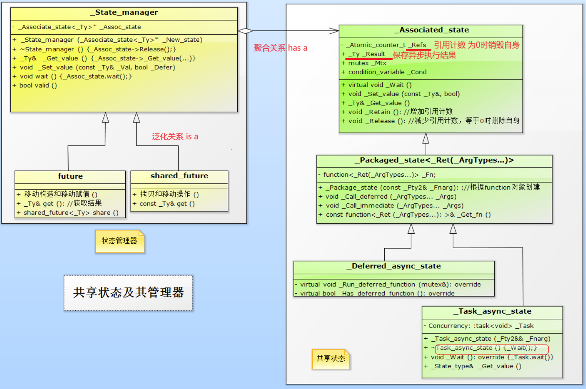
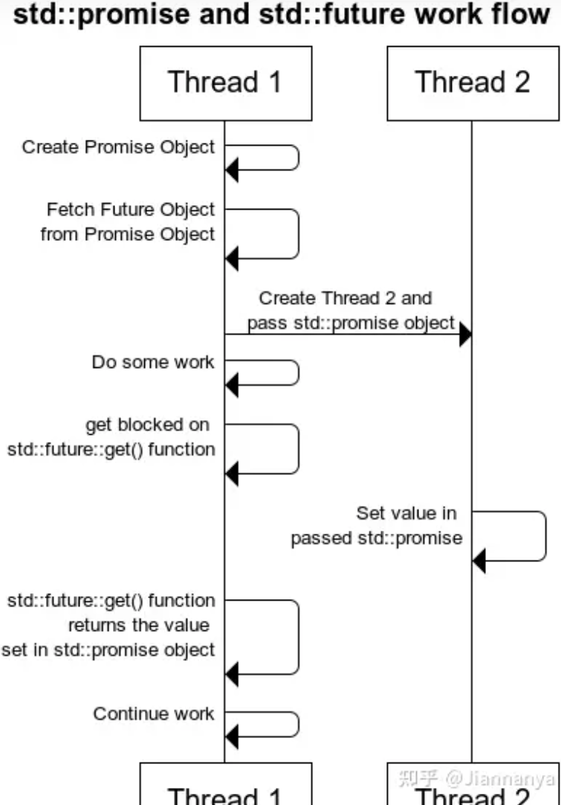
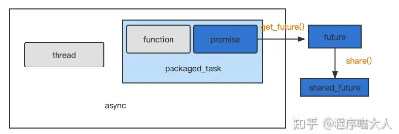

在 Linux 下,读取一个文件的数据通常需要经过以下几次数据拷贝,并涉及到几个硬件设备:

1. **从磁盘到内核缓冲区**:
   - 当应用程序发起文件读取请求时,内核会将数据从磁盘(或 SSD)读取到内核缓冲区中。
   - 这个过程需要经过磁盘驱动程序和 DMA (Direct Memory Access) 控制器。
2. **从内核缓冲区到用户缓冲区**:
   - 内核将数据从内核缓冲区拷贝到应用程序的用户缓冲区中。
   - 这个过程需要 CPU 参与,将数据从内核空间拷贝到用户空间。

因此,在典型的文件读取过程中,数据需要被拷贝 2 次:

1. 从磁盘设备到内核缓冲区
2. 从内核缓冲区到用户缓冲区

涉及到的硬件设备有:

1. 磁盘驱动器(或 SSD)
2. DMA 控制器
3. CPU

需要注意的是,现代操作系统还提供了各种优化机制,如 zero-copy 技术,可以减少数据拷贝的次数。比如在某些情况下,数据可以直接从内核缓冲区映射到用户空间,从而避免了第二次拷贝。


异步IO的读写操作总是立即返回，不论IO是否阻塞的。因为真正的读写操作已经由内核接管。

同步IO模型要求用户代码自行执行IO操作（将数据从内核缓冲区拷贝到用户缓冲区），而异步IO机制则由内核来执行IO操作（数据在内核缓冲区和用户缓冲区之间的移动是由内核在后台完成的）。

可以认为，同步IO向应用程序通知的是IO就绪事件，而同步IO向应用程序通知的是IO完成事件。

# 异步


# thread

https://www.cnblogs.com/5iedu/p/11633683.html

## 传递参数

在 `std::bind` 和 `std::thread` 中可能会遇到引用失效的问题，传递的参数在什么时候被访问是不确定的，也许在该对象消亡之后，也许该对象还存在。

传递参数分为两步：

1. 向std::thread 构造函数传参：所有参数（含第1个参数可调用对象）均**按值**并**以副本的形式保存**在std::thread对象中的tuple里。**该tuple由调用线程（一般是主线程）在堆上创建，并交由子线程管理，在子线程结束时同时被释放**。如果**要达到按引用传参的效果，可使用std::ref来传递**。
2. 向线程函数的传参：由于std::thread对象里保存的是参数的副本，为了效率同时兼顾一些只移动类型的对象，**所有的副本均被std::move到线程函数，即以右值的形式传入**。

注意事项：

1. **如果线程函数的形参为T、const T&或T&&类型时**，std::thread的构造函数可以接受左值或右值实参。因为不管是左值还是右值，在std::thread中均是以副本形式被保存，并在第2次向线程函数传参时以右值方式传入，而以上三种形参均可接受右值。
2. **如果线程函数的形参为T&时**，**不管是左值还是右值的T类型实参，都是无法直接经std::thread传递给形参为T&的线程函数**，因为该实参数的副本会被std::move成右值并传递线程函数，但T&无法接受右值类型。**因此，需要以std::ref形式传入**

```c++
#include <iostream>
#include <thread>
#include <chrono>

using namespace std;
using namespace std::chrono;   //for std::chrono::seconds

class Widget 
{
public:
    mutable int mutableInt = 0;

    //Widget() :mutableInt(0) {}
    Widget() : mutableInt(0) { cout << "Widget(), thread id = "<< std::this_thread::get_id() << endl;}

    //类型转换构造函数
    Widget(int i):mutableInt(i){ cout << "Widget(int i), thread id = " << std::this_thread::get_id() << endl; }

    Widget(const Widget& w):mutableInt(w.mutableInt) { cout << "Widget(const Widget& w), thread id = " << std::this_thread::get_id() << endl; }
    Widget(Widget&& w)  noexcept  //移动构造
    { 
        mutableInt = w.mutableInt; 
        cout << "Widget(Widget && w), thread id = " << std::this_thread::get_id() << endl;
    }

    void func(const string& s) { cout <<"void func(string& s),  thread id = " << std::this_thread::get_id() << endl; }
};

void updateWidget_implicit(const Widget& w)
{
    cout << "invoke updateWidget_implicit, thread id =" << std::this_thread::get_id() << endl;
}

void updateWidget_ref(Widget& w)
{
    cout << "invoke updateWidget_ref, thread id =" << std::this_thread::get_id() << endl;
}

void updateWidget_cref(const Widget& w)
{
    cout << "invoke updateWidget_cref, thread id =" << std::this_thread::get_id() << endl;
}

void test_ctor(const Widget& w) //注意这里的w是按引用方式传入（引用的是std::thread中保存的参数副本）
{
    cout << "thread begin...(id = " << std::this_thread::get_id() << ")" << endl;
    cout << "w.matableInt = " << ++w.mutableInt << endl;//注意，当std::thread按值传参时，此处修改的是std::thread中
                                                        //保存的参数副本，而不是main中的w。
                                                        //而当向std::thread按std::ref传参时，先会创建一个std::ref临时对象，
                                                        //其中保存着main中w引用。然后这个std::ref再以副本的形式保存在
                                                        //std::thread中。随后这个副本被move到线程函数，由于std::ref重载了
                                                        //operator T&(),因此会隐式转换为Widget&类型（main中的w），因此起到
                                                        //的效果就好象main中的w直接被按引用传递到线程函数中来。

    cout << "thread end.(id = " << std::this_thread::get_id() << ")" << endl;
}

int main()
{
    //1. 向std::thread构造函数传参
    cout << "main thread begin...(id = "<<std::this_thread::get_id()<<")"<< endl;
    Widget w;
    cout << "-----------test std::thread constructor----------------------- "<< endl;
    //1.1 std::thread默认的按值传参方式：所有的实参都是被拷贝到std::thread对象的tuple中，即以副本形式被保存起来。
    std::thread t1(test_ctor, w); //注意，w是按值保存到std::thread中的，会调用其拷贝构造函数。
    t1.join();
    cout << "w.mutableInt = " << w.mutableInt << endl; //0，外部的w没受影响。mutableInf仍为0。

    cout << endl;

    //1.2 std::thread按引用传参(std::ref) 
    std::thread t2(test_ctor, std::ref(w)); //注意，w是按引用传入到std::thread中的，不会调用其拷贝构造函数。
    t2.join();
    cout << "w.mutableInt = " << w.mutableInt << endl; //1，由于w按引用传递，mutableInf被修改为1。

    cout << "------------------test thread function------------------------ " << endl;
    //2. 向线程函数传递参数
    //2.1 线程函数的参数为引用时
    //2.1.1 线程函数形参为T&
    //std::thread t3(updateWidget_ref, w); //编译失败，因为std::thread内部是以右值形式向线程函数updateWidget_ref(Widget&)传
                                           //参的，而右值无法用来初始化Widget&引用。
    std::thread t3(updateWidget_ref, std::ref(w)); //ok,原因类似test_ctor函数中的分析。即当线程函数的形参为T&时，
                                                   //一般以std::ref形式传入
    t3.join();
    //2.1.2 线程函数形参为const T&
    std::thread t4(updateWidget_cref, w); //ok，但要注意w会先被拷贝构造一次，以副本形式保存在thread中。该副本再被以右值
                                          //形式传递给线程函数updateWidget_cref(const Widget&)，而const T&可接受右值。
    t4.join();

    //2.2 隐式类型转换及临时对象
    const char* name = "Santa Claus";
    //注意：
    //（1）当向std::thread传入类成员函数时，必须用&才能转换为函数指针类型
    //（2）类成员函数的第1个参数是隐含的this指针，这里传入&w。
    //（3）本例会发生隐式类型转换，首先name在主线程中以const char*类型作为副本被保存在thread中，当向线程函数
    //     Widget::func(const string&)传参时，会先将之前的name副本隐式转换为string临时对象再传入，因此线程函数的形参中
    //     需要加const修饰。同时要注意，这个隐式转换发生在子线程调用时，即在子线程中创建这个临时对象。这就需要确保主线
    //     程的生命周期长于子线程，否则name副本就会变成野指针，从而无法正确构造出string对象。
    std::thread t5(&Widget::func, &w, name); //ok。
    t5.join();  //如果这里改成t5.detach,并且如果主线程生命期在这行结束时，就可能发生野指针现象。

    std::thread t6(&Widget::func, &w, string(name)); //为了避免上述的隐式转换可以带来的bug。可以在主线程先构造好这个
                                                     //string临时对象，再传入thread中。（如左）
    t6.join();

    //以下证明隐式转换发生在子线程中
    cout << endl;
    std::thread t7(updateWidget_implicit, 1); //会将1隐式转换为Widget,这个隐式转换发生在子线程。因为1会先以int型的副本
                                              //保存在t7中，当向线程函数传参时，才将int通过Widget的类型转换构造转成Widget。
    t7.join();

    cout << "main thread end.(id = " << std::this_thread::get_id() << ")" << endl;

    return 0;
}
/*输出结果：
main thread begin...(id = 8944)
Widget(), thread id = 8944
-----------test std::thread constructor-----------------------
Widget(const Widget& w), thread id = 8944 //w被按值保存std::thread中。会调用拷贝构造函数
thread begin...(id = 17328)
w.matableInt = 1       //只是修改std::thread中w副本的值。
thread end.(id = 17328)
w.mutableInt = 0       //main中的w没被修改

thread begin...(id = 5476)
w.matableInt = 1         //按std::ref传递既修改std::thread中w副本的值，也修改了main中w的值。
thread end.(id = 5476)
w.mutableInt = 1
------------------test thread function------------------------
invoke updateWidget_ref, thread id =17828
Widget(const Widget& w), thread id = 8944
invoke updateWidget_cref, thread id =2552
void func(string& s),  thread id = 11332
void func(string& s),  thread id = 17504

Widget(int i), thread id = 8996 //隐式转换发生在子线程8996中
invoke updateWidget_implicit, thread id =8996
main thread end.(id = 8944)
*/
```

# C++ 异步编程

参考：

[C++11 并发编程系列(四)：异步操作(future)](https://murphypei.github.io/blog/2019/04/cpp-concurrent-4) 

https://zhuanlan.zhihu.com/p/665854241

## future

**`future` 封装的是一种访问异步操作的机制**。当在一个线程（creator）中创建（通过`std::async`，`std::packaged_task` 或者 `std::promise`）了一个异步操作（asynchronous operations，通常就是创建了一个新的线程，执行操作）的时候，这个异步操作会返回一个 `future` 对象给当前的线程，供其访问异步操作的状态，结果等等。

`future` 某种意义上表示的是一个异步操作，通过其成员函数我们能够获悉异步操作处于什么样的情况。可以通过 `get` 来等待异步操作结束并返回结果，是一个阻塞过程。`wait` 等待异步操作结束，也是一个阻塞过程。`wait_for` 是超时等待返回结果，`wait_util` 类似。

future对象是有"**共享状态**"这一概念的。共享状态必须依靠上面提到的三者对应的方法:`promise::get_future()`、`package_task::get_future()`、`async()`获取。否则**单纯的创建一个future对象, 它的共享状态是无效的**！当然通过 `std::future` 的 `move` 赋值后该 `std::future` 对象也可以变为 valid。`future` 对象可以通过 `valid()` 函数查询其共享状态是否有效 ，一般来说，只有当 `valid()` 返回 `true`的时候才调用 `get()` 去获取结果。

还有一点需要特别注意， **`get()` 调用会改变其共享状态，不再可用，也就是说 `get()` 只能被调用一次，多次调用会触发异常。如果想要在多个线程中多次获取产出值需要使用 `shared_future`。**

### 成员函数

```c++
//包含于<future>头文件
template <class T>  future;
template <class R&> future<R&>;     // specialization : T is a reference type (R&)
template <>         future<void>;   // specialization : T is void
//---------------------------------------------------
//构造函数
future() noexcept;					//(1) default
future (const future&) = delete;	//(2) copy [deleted]
future (future&& x) noexcept;		//(3) move

//赋值
future& operator=(future&& other) noexcept;
future& operator=(const future& other) = delete;
```

- std::future::valid()

  检查 future 对象是否拥有共享状态，参照构造函数只有两种可用，由默认构造函数创建的 future 对象显然不具有共享状态，即`valid()=false`，除非它被 move 赋值过；而移动构造函数创建的 future 对象往往拥有共享状态，只不过是否可以立即调用 get() 访问还需要确认共享状态标志是否已被设置为 ready。

- std::future::get()

  阻塞式获得共享状态的值，如果 future 对象调用 get() 时，共享状态标志尚未被设置为 ready，那么本线程将阻塞至其变为 ready。

- `std::future::wait()`

  等待共享状态标志变为 ready，在此之前线程将会一直阻塞。

- `std::future::wait_for()`

  与 wait() 不同，wait_for() 只会允许为此等待一段时间 _Rel_time，耗尽这个时间共享状态标志仍不为 ready，wait_for() 一样会返回。

- `std::future::wait_until()`

  与 wait_for() 类似的逻辑，只不过 wait_until() 参考的是绝对时间点。到达时间点 _Abs_time 的时候，wait_until() 就会返回，如果没等到 ready 的话，wait_until 一样会返回。

- `std::future::share()`

  返回一个 std::shred_future 对象，调用该函数之后，future 对象不和任何共享状态关联，也就不再是 valid 的了。

### 关于共享状态

https://www.cnblogs.com/5iedu/p/11743514.html



共享状态`_Associated_state`类：

1. 用于保存线程函数及其参数、返回值以及新线程状态等信息。该对象**通常创建在堆上**，由std::async、std::promise和std::package_task等提供（**Provider**），并交由future/shared_future管理。
2. Provider将计算结果写入“共享状态”对象，而future/shared_future通过get()函数来读取该结果。**“共享状态”作为异步结果的传输通道，future可以从中方便地获取线程函数的返回值。**
3. 共享状态内部保存着一个引用计数，当引用计数为0时会通过delete this来销毁自身**。


## share_future

`std::shared_future` 与 `std::future` 类似，但是 `std::shared_future` 可以拷贝、多个 `std::shared_future` 可以共享某个共享状态的最终结果(即共享状态的某个值或者异常)。如果想要多个线程多个实例拿到结果，就可以使用shared_future。**`shared_future` 可以通过某个 `std::future` 对象隐式转换（参见 `std::shared_future` 的构造函数），或者通过 `std::future::share()` 显示转换，无论哪种转换，被转换的那个 std::future 对象都会变为 not-valid**。

## promise

```c++
//包含于<future>头文件
template <class T>  promise;
template <class R&> promise<R&>;  // specialization : T is a reference type (R&)
template <>         promise<void>;// specialization : T is void

//构造函数
promise();								//(1)
promise(promise&& other) noexcept;		//(2) 移动构造
promise(const promise& other) = delete;	//(3) 禁止拷贝构造

//赋值
promise& operator= (promise&& rhs) noexcept; //允许移动赋值
promise& operator= (const promise&) = delete;//禁止拷贝赋值
```

promise是一个协助线程赋值的类，**在promise类的内部管理着一个future对象**。因此它能够提供一些将数据和future对象绑定起来的接口。**需要搭配`std::thread`来使用**。

- get_future()

  get_future()会返回一个future对象, 此时如果去接收它的返回值则会触发移动赋值, 将资源转移。

- set_value()

  设置future对象的值，并**立即设置future对象的共享状态为`ready`**。

- set_value_at_thread_exit()

  设置future对象的值，但是**不会立刻让future对象的共享状态为`ready`**。在子线程退出时，子线程资源被销毁，再令共享状态为`ready`。

### 基本使用方法



**子线程** **`set_value`—> 给主线程**

1. 在主线程中创建`promise`对象
2. 将这个`promise`对象通过引用传递的方式传给子线程的任务函数(`ref`)
3. **子线程**在**合适的时候**调用`set_value()`方法, 设置future对象的值以及状态(ready)
4. 主线程通过调用`promise`对象中的`get_future()`方法获取到future对象 (这里是移动构造了)
5. 主线程调用`future`对象中的`get()`方法获取到子线程`set_value()`所设置的值。

代码：

```c++
void func(promise<int>& pr)
{
    cout << "Child Thread Working~~~" << endl;
    cout << "Child Thread: Waiting 3 seconds!" << endl;
    this_thread::sleep_for(chrono::seconds(3));
    
    pr.set_value(3);	// 同时设置状态为ready
    this_thread::sleep_for(chrono::seconds(1));
    cout << "Child Exit" << endl;
}

int main()
{
    promise<int> pr;
    thread t(func, ref(pr));
    auto f = pr.get_future();
    this_thread::sleep_for(chrono::seconds(1));
    cout << "Get Future: " << f.get() << endl;
    t.join();
    return 0;
}
```

**主线程`set_value`–> 给子线程**

1. 在主线程中创建`promise`对象
2. 将这个`promise`对象通过引用传递的方式传给子线程的任务函数(`ref`)
3. **主线程**在**合适的时候**调用`set_value()`方法, 设置future对象的值以及状态(ready)
4. 在编码子线程时，设置依`future`对象的值的判断条件，当`future`的共享状态或者值满足条件时，执行某一任务(或终止)

```c++
void func2(promise<int>& pr)
{
    int i = 0;
    auto val = pr.get_future().get();
    if(val == 1){
        cout << "Get Value: " << val << endl;
        //do something
    }
    else{
        cout << "Get Value: " << val << endl;
        //do something
    }
}

int main()
{
    promise<int> pr;
    thread t(func2, ref(pr));
    cout << "Main Thread: Waiting 3 seconds!" << endl;
    this_thread::sleep_for(chrono::seconds(3));
    pr.set_value(1);
    t.join();
}
```

## package_task

```c++
//包含于<future>头文件
template <class T> packaged_task;     // undefined
template <class Ret, class... Args> class packaged_task<Ret(Args...)>;

//构造函数
packaged_task() noexcept;						//default (1)
template <class Fn>
  explicit packaged_task (Fn&& fn);				//initialization (2)
packaged_task (const packaged_task&) = delete;	//copy [deleted] (3)
packaged_task (packaged_task&& x) noexcept;		//move (4)

//赋值
packaged_task& operator=(packaged_task&& rhs) noexcept; //move (1)
packaged_task& operator=(const packaged_task&) = delete;//copy [deleted] (2)
```

package_task包装了一个函数对象。package_task可以将内部包装的函数和future绑定到一起，以便于进行后续的异步调用。**需要配合`std::thread`来使用**。

但package_task相比于promise有个缺点，它里面包装了函数，而**该函数的返回值就是future对象的值**。它无法像使用promise那样灵活。

### 基本使用方法

将package_task作为线程的启动函数传过去，传参方式必须是**引用传递 ref()**。

```c++
int main()
{
    packaged_task<int(int, int)> pt_Add([](int x, int y)
    {
        cout << "Running~~~~~~~~~~" << endl;
        this_thread::sleep_for(chrono::seconds(3));
        return x + y;
    });

    future<int> fi = pt_Add.get_future();

    cout << "Start Thread!" << endl;
    thread t(ref(pt_Add), 10, 20);

    cout << "before get" << endl;
    int val = fi.get();
    cout << "val: " << val << endl;
    t.join();
    return 0;
}
```

## async

```c++
//构造函数
// (1)
template<class Fn, class... Args>
future<typename result_of<Fn(Args...)>::type>
    async (Fn&& fn, Args&&... args);

// (2)
template<class Fn, class... Args>
future<typename result_of<Fn(Args...)>::type>
    async (launch policy, Fn&& fn, Args&&... args);	//policy是启动策略
```

async是一个函数，它相比于前面的promise和package_task要高级一些。async可以直接启动一个子线程，然后让这个子线程执行对应的任务函数，任务函数的返回值就会被存储到future对象当中。主线程只需要接收asnyc的返回值，然后调用get()方法即可获取到future对象中保存的值。

 更高级并不代表更好用，只是它的集成度更高一些，省去了我们要自己创建线程的步骤。async仍然有package_task的缺点，它无法像promise那样自由控制future在何时赋值。

### 启动策略

- `std::launch::async`，调用async函数时会创建新的线程，让该线程执行任务函数
- `std::launch::deferred`，调用async函数时不会创建新的线程，也不会去执行该任务函数。只有调用了async返回的future的get()方法或者wait()方法时才会去执行任务。(**执行该任务的是主线程**)。

### 基本使用

调用async创建子线程, 并让该线程去执行任务

```c++
int main()
{
   future<int> f = async([](int x, int y)
   {
       cout << "Child Thread: Waiting 3 seconds!" << endl;
       this_thread::sleep_for(chrono::seconds(3));
       return x + y;
   }, 10, 20);

   this_thread::sleep_for(chrono::seconds(1));
   cout << "Get Value: " << f.get() << endl;
   return 0;
}
```

使用deferred启动策略 — 调用async不创建子线程

```c++
int main()
{
    future<int> f = async(launch::deferred, [](int x, int y)
    { 
        cout << "Child Thread "<< this_thread::get_id() << ": Waiting 3 seconds!" << endl;
        this_thread::sleep_for(chrono::seconds(3));
        return x + y;
    }, 10, 20);

    cout << "Main Thread "<< this_thread::get_id() <<": Working!!!" << endl;
    auto val = f.get();
    cout << "Get Value: " << val << endl;
	return 0;
}
```

## 对比

1. promise类的使用相对灵活，但是需要自己创建线程，并且需要自己写一个函数对象。
2. package_task类受限于只能使用函数返回值作为future对象的值。使用它也需要自己创建线程，但不需要额外写函数对象，直接将package_task当做函数对象去使用即可。
3. async类集合度较高，它也受限于只能使用函数返回值作为future对象的值。但是async定义时可以自动创建线程，并让线程执行async中的任务函数。async的使用最简单，但是自由度较低。

## 它们之间的关系

https://www.zhihu.com/question/547132461



从这张图可以看出：

- packaged_task ≈ promise + function
- async ≈ thread + packaged_task
- 通过promise的get_future()可拿到future
- 通过future的share()可拿到shared futurea

**promise和future是线程之间的同步通道**，类似于[条件变量](https://www.zhihu.com/search?q=条件变量&search_source=Entity&hybrid_search_source=Entity&hybrid_search_extra={"sourceType"%3A"answer"%2C"sourceId"%3A2657296340})的封装。

一般都是要异步执行task，并阻塞拿到结果时、或者异步执行小task时，会使用`async`。(在有的项目中会使用`thread_pool`来达到`async`的效果)
但多数时候业务上都是新起一个线程执行一个长期循环类的任务，这种情况我会用`std::thread`，因为可拿到`thread_handle`，可以设置线程名，可以设置线程亲和性，拿到的thread id对调试也更有帮助。

##  附

[std::future和std::promise详解(原理、应用、源码)](https://zhuanlan.zhihu.com/p/672327290) 