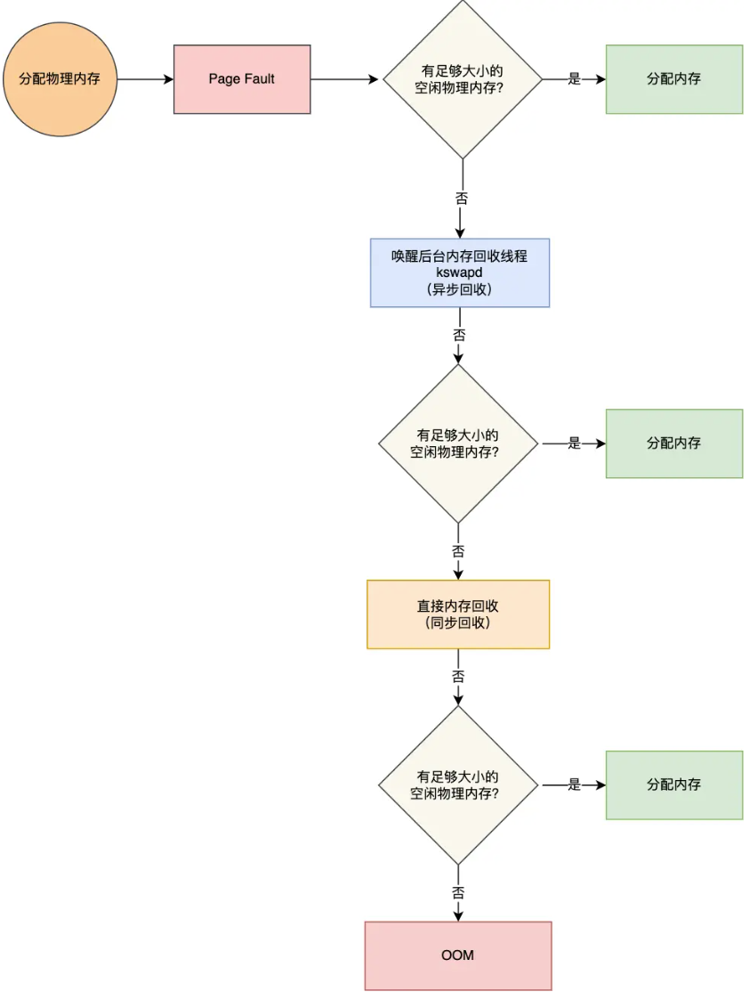

## 分段

一个应用程序可以对应多个段。

段的大小可以不一样，所以会产生外碎片，但不会产生内碎片。

可以通过内存交换解决外碎片。

内存交换就是进程所占的内存块拷贝到硬盘，然后再拷贝到新的内存空间里，效率非常低。

## 分页

没有外碎片，但会有一些内碎片

如果内存不够，可以把其他正在运行的进程的【最近没被使用】的内存页面交换到硬盘上。但需要的时候再写回内存。

进一步，在加载程序的时候，不需要一次性都把程序加载到物理内存中。**只有在程序运行中，需要用到对应虚拟内存页里面的指令和数据时，再加载到物理内存里面去。**

### 单级分页

在32位系统中，虚拟地址空间共有 4	GB，假设一个页的大小是 4KB（2^12），那么就需要大约 100 万 （2^20） 个页，每个「页表项」需要 4 个字节大小来存储，那么整个 4GB 空间的映射就需要有 `4MB` 的内存来存储页表。

程序不一定会占用全部的4G虚拟内存，能不能只把用到的物理页存储在页表中呢？

不可以，如果是存储{页号->物理页号}的映射，则在查询时时间复杂度是O(n)。所以为了能够使用下标在O(1)的时间复杂度内查询，必须存储所有页表，即使某些页表项是空的。

### 多级分页

以二级分页为例，一级页表就可以覆盖整个 4GB 虚拟地址空间，但**如果某个一级页表的页表项没有被用到，也就不需要创建这个页表项对应的二级页表了，即可以在需要时才创建二级页表**。

结合程序的局部性原理，只有1024个一级页表和少量的二级页表在内存中，大大减少了页表所占的内存空间。

四级页表

### TLB

多级页表虽然解决了空间上的问题，但是虚拟地址到物理地址的转换就多了几道转换的工序，这显然就降低了这俩地址转换的速度。

进一步利用程序的时间局部性和空间局部性，把最常访问的几个页表项存储到访问速度更快的硬件。即在CPU芯片中，加入了一个专门存放程序最常访问的页表项的 Cache，这个 Cache 就是 TLB，通常称为页表缓存、转址旁路缓存、快表等。

MMU是在CPU芯片里面的，它用来完成地址转换和 TLB 的访问与交互。

## 段页式内存管理

段页式内存管理实现的方式：

- 先将程序划分为多个有逻辑意义的段，也就是前面提到的分段机制；
- 接着再把每个段划分为多个页，也就是对分段划分出来的连续空间，再划分固定大小的页；

# malloc

linux进程虚拟内存地址空间分布：

虽然每个进程都各自有独立的虚拟内存，但是**每个虚拟内存中的内核地址，其实关联的都是相同的物理内存**。这样，进程切换到内核态后，就可以很方便地访问内核空间内存。

## malloc是如何分配内存的？

malloc是C的库函数。

malloc 申请内存的时候，会有两种方式向操作系统申请堆内存。

- 方式一：通过 brk() 系统调用从堆分配内存
- 方式二：通过 mmap() 系统调用在文件映射区域分配内存；

方式一实现的方式很简单，就是通过 brk() 函数将「堆顶」指针向高地址移动，获得新的内存空间。如下图：

方式二通过 mmap() 系统调用中「私有匿名映射」的方式，在文件映射区分配一块内存，也就是从文件映射区“偷”了一块内存。如下图：

malloc() 源码里默认定义了一个阈值（不同glibc版本定义的不一样）：

- 如果用户分配的内存小于 128 KB，则通过 brk() 申请内存；
- 如果用户分配的内存大于 128 KB，则通过 mmap() 申请内存；

malloc分配的是虚拟内存。如果分配后的虚拟内存没有被访问的话，虚拟内存是不会映射到物理内存的，这样就不会占用物理内存了。

只有在访问已分配的虚拟地址空间的时候，操作系统通过查找页表，发现虚拟内存对应的页没有在物理内存中，就会触发缺页中断，然后操作系统会建立虚拟内存和物理内存之间的映射关系。

## malloc(1)会分配多大的虚拟内存？

malloc() 在分配内存的时候，并不是老老实实按用户预期申请的字节数来分配内存空间大小，而是**会预分配更大的空间作为内存池**。

具体会预分配多大的空间，跟 malloc 使用的内存管理器有关系，我们就以 malloc 默认的内存管理器（Ptmalloc2）来分析。

# 内存满了 会发生什么

## 虚拟内存有什么用？

1. 虚拟内存使得进程可以得到远大于物理内存的内存容量。根据程序的时间局部性和空间局部性原理，把经常用到的页面放到内存中，同时还可以把他的页表项放入快表中（TLB）加速
2. 每个进程都有自己单独的页表，并且各个进程的虚拟内存空间独立（用户空间），内核空间共享。进程没有办法访问其他进程的页表，解决了多进程地址空间冲突的问题。
3. 页表里的页表项中除了物理地址之外，还有一些标志位，例如读写权限，是否在内存中等信息。

## 内存分配过程

程序通过malloc来申请的是虚拟内存，此时并不会分配物理内存。在真正访问时，会产生缺页中断，进程切换到内核态，然后将缺页中断交给内核的Page Fault Handler （缺页中断函数）处理。如果有物理内存，那就直接分配，建立映射。

如果没有空闲物理内存，那么内核就开始进行回收工作。回收主要有两种方式：

1. 后台内存回收（kswapd）：在物理内存紧张时，会唤醒kswapd内核线程来回收内存，**异步**执行。
2. 直接内存回收（direct reclaim）：如果后台异步回收跟不上进程内存申请的速度，会直接开始回收，是**同步**的，会阻塞进程的执行。

如果直接内存回收后，物理内存还是不够。那么就会触发OOM机制（Out of Memory）。

OOM Killer 机制会根据算法选择一个占用物理内存较高的进程，然后将其杀死，以便释放内存资源，如果物理内存依然不足，OOM Killer 会继续杀死占用物理内存较高的进程，直到释放足够的内存位置。

## 哪些内存可以被收回？

1. 文件页（File-backed Page）：内核缓存的磁盘数据（Buffer）和内核缓存的文件数据（Cache）都叫做文件页。回收干净页的方式是直接释放内存，回收脏页的方式是先写回磁盘后再释放内存。
2. 匿名页（Anonymous Page）：这部分内存没有实际载体（例如硬盘），所以不能直接释放。通过linux的swap机制，把不长访问的内存先写入磁盘中，再释放。等再次访问时，从磁盘读入就可以了。

文件页和匿名页的回收都是基于LRU算法的。实际上维护了两个双向链表：

- **active_list** 活跃内存页链表，这里存放的是最近被访问过（活跃）的内存页；
- **inactive_list** 不活跃内存页链表，这里存放的是很少被访问（非活跃）的内存页；

越接近链表尾部，就表示内存页越不常访问。根据活跃程度优先回收不活跃的内存。

## 回收内存带来的性能影响

​	

# 在4GB物理内存机器申请8G内存

## 32位系统

在32 位操作系统，进程最多只能申请 3 GB 大小的虚拟内存空间，所以进程申请 8GB 内存的话，在申请虚拟内存阶段就会失败。

## 64位系统