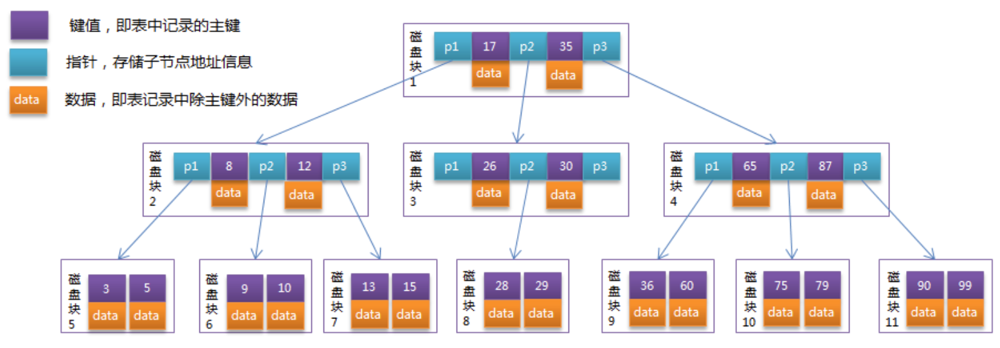
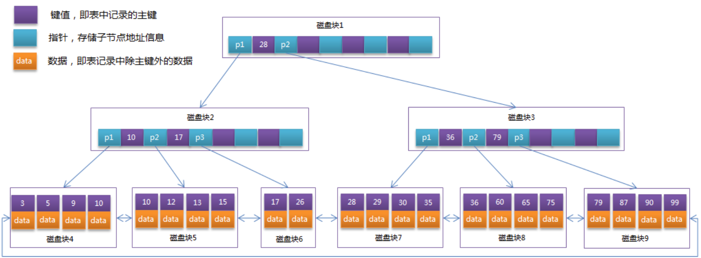

# 二叉搜索树

## 特点

排序二叉树要么是一棵空二叉树，要么是具有下列性质的二叉树：

- 若它的左子树不空，则左子树上所有节点的值均小于它的根节点的值；
- 若它的右子树不空，则右子树上所有节点的值均大于它的根节点的值；
- 它的左、右子树也分别为排序二叉树。
- **没有键值相等的节点**。

**按中序遍历排序二叉树可以得到由小到大的有序序列。**

## 缺点

最坏的情况 —— 如果插入的节点集本身就是有序的(从小到大排列或从大到小排列)，在这种情况下，排序二叉树就退化成了普通链表，其检索效率就会很差。

# 平衡树

为了保证不退化成线性查找，就要维持树的平衡。这个平衡条件要容易保持，从而保证树的深度为O(logN)

## 1.AVL树

AVL树得名于它的发明者 G.M. Adelson-Velsky 和 E.M. Landis，是最早被发明的一种平衡树。**平衡二叉树本质上还是一颗二叉查找树，只是带上了平衡条件**

一棵平衡二叉树是每个节点的**左子树和右子树的高度最多差1**的二叉查找树。

在插入时，检查新节点的插入点所在的最低子树的根。如果它的子节点的高度相差大于1，则会破坏原有的平衡性，因此需要进行旋转操作以达到再次平衡，此时会执行一次或两次旋转使他们的高度相等。然后算法向上移动，检查上面的节点，必要时均衡高度。这个检测检查所有路径一直向上，直到根为止。

### 缺点

左子树和右子树的高度差不大于1，这种规定过于严格，导致在做插入或删除操作时需要自底向上逐层检查节点的平衡性(高度差)。所以插入(或删除)一个节点时需要扫描两趟树，一次向下查找插入点，一次向上平衡树，效率较低

## 2.红黑树

红黑树在每一次插入或删除节点之后都会花O(log N)的时间来对树的结构作修改，以保持树的平衡。

红黑树的查找方法与二叉搜索树完全一样；插入和删除节点的方法前半部分与二叉搜索树完全一样，而后半部分添加了一些修改树的结构的操作。

# 平衡多路查找树

BST、AVL、红黑树都是典型的**二叉**查找树结构，**其查找的时间复杂度与树高相关**。那么**降低树高自然对查找效率是有所帮助的**。

另外还有一个比较实际的问题：就是**在大量数据存储中实现查询的场景下，平衡二叉树由于树深度过大而造成磁盘IO读写过于频繁**，进而导致效率低下。

那么如何**减少树的深度**（当然不能减少查询数据量），一个基本的想法就是：

1. **每个节点存储多个元素** （但元素数量不能无限多，否则查找就退化成了节点内部的线性查找了）。
2. **摒弃二叉树结构而采用多分支(多叉)树**（由于节点内元素数量不能无限多，自然子树的数量也就不会无限多了）。

这样我们就提出了一个新的查找树结构 ——**多路查找树**。 根据AVL给我们的启发，一颗平衡多路查找树(B树)自然可以使得数据的查找效率保证在O(logN)这样的对数级别上。

## 1.B树（平衡多路查找树）

B树是为磁盘或其他直接存储的辅助设备而设计的一种平衡搜索树。B树与红黑树不同之处在于

1. B树的节点可以有多个孩子
2. 含有N个节点的B树的高度为O(lgN)。
3. 降低磁盘I/O操作次数

每个节点占用一个盘块的磁盘空间，一个节点上有两个升序排序的关键字和三个指向子树根节点的指针，指针存储的是子节点所在磁盘块的地址。



### 缺点

从上面的B-Tree结构图中可以看到**每个节点中不仅包含数据的key值，还有data值**。而每一个页的存储空间是有限的，如果data数据较大时将会导致每个节点（即一个页）能存储的key的数量很小，当存储的数据量很大时同样会导致B-Tree的深度较大，增大查询时的磁盘I/O次数，进而影响查询效率。

### 代码

```c++
#include <iostream>
#include <vector>

// B树的阶数
const int ORDER = 3;

// B树节点
class BTreeNode {
    bool is_leaf_;  // 是否为叶子节点
    std::vector<int> keys_;  // 存储的关键字
    std::vector<BTreeNode*> children_;  // 子节点指针

public:
    BTreeNode(bool is_leaf) : is_leaf_(is_leaf) {}

    // 在节点中查找关键字的索引
    int FindKeyIndex(int key) {
        int index = 0;
        while (index < keys_.size() && keys_[index] < key) {
            index++;
        }
        return index;
    }

    // 在节点中插入关键字
    void InsertKey(int key) {
        int index = FindKeyIndex(key);
        keys_.insert(keys_.begin() + index, key);
    }

    // 在节点中插入子节点
    void InsertChild(int index, BTreeNode* child) {
        children_.insert(children_.begin() + index, child);
    }

    // 获取节点中的关键字数量
    int GetKeyCount() {
        return keys_.size();
    }

    // 获取节点中的子节点数量
    int GetChildCount() {
        return children_.size();
    }

    // 判断节点是否已满
    bool IsFull() {
        return keys_.size() >= ORDER - 1;
    }

    // 判断节点是否是叶子节点
    bool IsLeaf() {
        return is_leaf_;
    }

    // 获取节点的关键字
    std::vector<int> GetKeys() {
        return keys_;
    }

    // 获取节点的子节点
    std::vector<BTreeNode*> GetChildren() {
        return children_;
    }
};

// B树
class BTree {
    BTreeNode* root_;

public:
    BTree() : root_(nullptr) {}

    // 在B树中搜索关键字
    BTreeNode* Search(int key) {
        return SearchHelper(root_, key);
    }

    // 在B树中插入关键字
    void Insert(int key) {
        if (root_ == nullptr) {
            root_ = new BTreeNode(true);
            root_->InsertKey(key);
        } else {
            if (root_->IsFull()) {
                BTreeNode* new_root = new BTreeNode(false);
                new_root->InsertChild(0, root_);
                SplitChild(new_root, 0);
                root_ = new_root;
            }
            InsertNonFull(root_, key);
        }
    }

private:
    // 在节点中搜索关键字（递归）
    BTreeNode* SearchHelper(BTreeNode* node, int key) {
        int index = node->FindKeyIndex(key);

        if (index < node->GetKeyCount() && node->GetKeys()[index] == key) {
            return node;
        }

        if (node->IsLeaf()) {
            return nullptr;
        }

        return SearchHelper(node->GetChildren()[index], key);
    }

    // 在节点中插入关键字（非满节点）
    void InsertNonFull(BTreeNode* node, int key) {
        int index = node->FindKeyIndex(key);

        if (node->IsLeaf()) {
            node->InsertKey(key);
        } else {
            BTreeNode* child = node->GetChildren()[index];
            if (child->IsFull()) {
                SplitChild(node, index);
                if (key > node->GetKeys()[index]) {
                    index++;
                }
            }
            InsertNonFull(node->GetChildren()[index], key);
        }
    }

    // 分裂节点的子节点
    void SplitChild(BTreeNode* parent, int child_index) {
        BTreeNode* child = parent->GetChildren()[child_index];
        BTreeNode* new_child = new BTreeNode(child->IsLeaf());

        // 将子节点的右半部分移动到新的子节点
        for (int i = ORDER / 2; i < child->GetKeyCount(); i++) {
            new_child->InsertKey(child->GetKeys()[i]);
        }

        if (!child->IsLeaf()) {
            // 将子节点的右半部分的子节点移动到新的子节点
            for (int i = ORDER / 2; i < child->GetChildCount(); i++)```cpp
            {
                new_child->InsertChild(i - ORDER / 2, child->GetChildren()[i]);
            }

            // 删除子节点的右半部分
            child->keys_.erase(child->keys_.begin() + ORDER / 2, child->keys_.end());
            child->children_.erase(child->children_.begin() + ORDER / 2, child->children_.end());
        }

        // 在父节点中插入新的子节点和关键字
        parent->InsertChild(child_index + 1, new_child);
        parent->InsertKey(child->GetKeys()[ORDER / 2]);

        // 删除子节点的右半部分的关键字
        child->keys_.erase(child->keys_.begin() + ORDER / 2);
    }
};

// 测试B树的代码
int main() {
    BTree btree;

    // 插入关键字
    btree.Insert(10);
    btree.Insert(20);
    btree.Insert(5);
    btree.Insert(15);
    btree.Insert(30);

    // 搜索关键字
    BTreeNode* found_node = btree.Search(15);
    if (found_node != nullptr) {
        std::cout << "Key 15 found in B-tree!" << std::endl;
    } else {
        std::cout << "Key 15 not found in B-tree." << std::endl;
    }

    return 0;
}
```


## 2.B+树

B+树是B树的一种变种和优化，使其更适合实现外存储索引结构。

B+树的特点是能够保持数据稳定有序，其插入与修改拥有较稳定的对数时间复杂度。B+树元素自底向上插入，这与二叉树恰好相反。

在B+Tree中，**所有数据记录节点**都是按照键值大小顺序**存放在同一层的叶子节点上**，而非叶子节点上只存储key值信息，这样可以大大加大每个节点存储的key值数量，降低B+Tree的高度。

总结一下B树和B+树的不同点：

1. **节点存储的信息不同**，B+树的分支结点仅仅存储着关键字信息和儿子的指针（这里的指针指的是磁盘块的偏移量），也就是说内部结点仅仅包含着索引信息。
2. **数据存储的位置不同**，B+树中的数据都存储在叶子结点上，也就是其所有叶子结点的数据组合起来就是完整的数据。但B树的数据存储在每一个结点中，并不仅仅存储在叶子结点上。
3. **查找路径不同**，B+树的所有叶子节点都通过指针相连，每次查找都通过内部节点找到对应的叶子节点，从而获取到数据。顺序查找和**区间查找**也是这样，从内部节点定位到叶子节点，再在叶子节点中顺序查找。



通常在B+Tree上有两个头指针，一个指向根节点，另一个指向关键字最小的叶子节点，而且所有叶子节点（即数据节点）之间是一种链式环结构。因此可以对B+Tree进行两种查找运算：一种是对于主键的范围查找和分页查找，另一种是从根节点开始，进行随机查找（`什么意思`？？？）。

### 代码


## 3.B*树

B*树是B+树的变体，在B+Tree的非根和非叶子结点再增加指向兄弟的指针；

# MySQL中的B+树

## MySQL索引中B+树通的高度通常为2~4层，为什么？

InnoDB存储引擎中页的大小为16KB，一般表的主键类型为INT（占用4个字节）或BIGINT（占用8个字节），指针类型也一般为4或8个字节，也就是说一个页（B+Tree中的一个节点）中大概存储16KB/(8B+8B)=1K个键值（因为是估值，为方便计算，这里的K取值为〖10〗^3）。也就是说一个深度为3的B+Tree索引可以维护10^3 * 10^3 * 10^3 = 10亿 条记录。实际情况中每个节点可能不会填充满，因此在数据库中，B+Tree的高度一般都在2~4层。

MySQL的InnoDB存储引擎在设计时是将根节点常驻内存的(少了一次磁盘IO)，也就是说查找某一键值的行记录时最多只需要1~3次磁盘I/O操作。所以B+树适合用来实现文件索引。

参考：https://www.cnblogs.com/rouqinglangzi/p/6906230.html#_label1