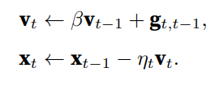
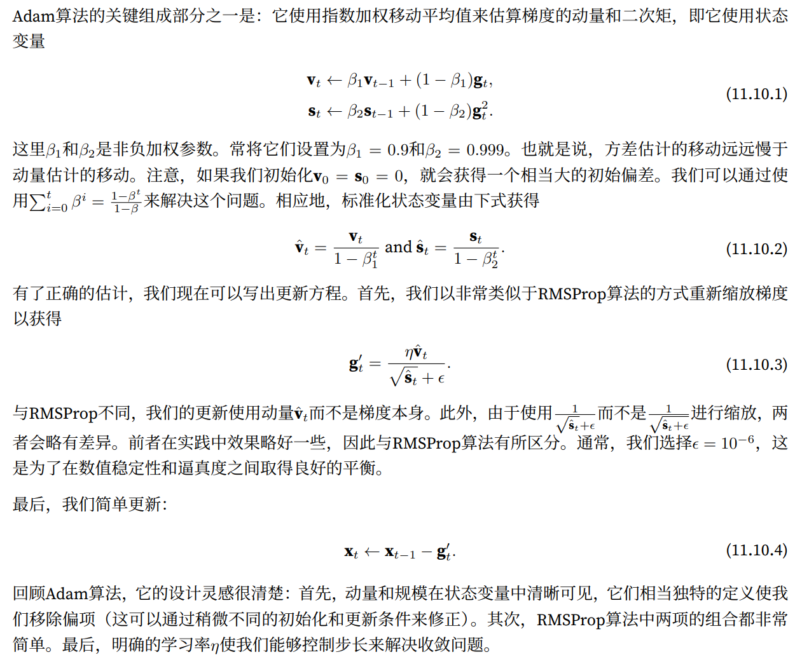

# 小批量梯度下降

## 背景


## 算法


# 动量法

## 背景


## 算法


上述推理构成了“加速”梯度方法的基础，例如具有动量的梯度。在优化问题条件不佳的情况下（例如，有 些方向的进展比其他方向慢得多，类似狭窄的峡谷），“加速”梯度还额外享受更有效的好处。此外，它们允 许我们对随后的梯度计算平均值，以获得更稳定的下降方向。诚然，即使是对于无噪声凸问题，加速度这方 面也是动量如此起效的关键原因之一。



# AdaGrad

## 背景


## 算法


## 小结


# RMSProp

## 背景


## 算法


## 小结


# Adam

## 背景


## 算法



## 小结


# 学习率调度器


## 算法


## 小结


# AdamW

https://zhuanlan.zhihu.com/p/38945390

AdamW = Adam + Weight Decay

在向损失函数中添加L2正则化和在更新梯度时使用权重衰减是等价的。

```python
# 向损失函数中添加L2正则化 wd控制惩罚力度
final_loss = loss + wd * all_weights.pow(2).sum() / 2
# 此时的梯度更新公式
w = w - lr * w.grad - lr * wd * w

# 权重衰减
w = w - lr * w.grad - lr * wd * w	# 每一次更新都会减去一小部分权重，这也就是「衰减」的来源。
```

在实践中，几乎都是向梯度更新公式中加入wd*w来实现的，而不是真正改变损失函数。因为我们并不希望增加额外的计算量来修正损失，尤其是还有其它简单方法的时候。

既然它们是同一种表达，那么我们为什么需要区分这两种概念呢？原因在于它们只对于原版 SGD 是等价的，而当我们添加动量或使用如 Adam 那样复杂的最优化方法，L2 正则化（第一个方程）和权重衰减（第二个方程）就会存在很大的不同。

例如，在带动量的 SGD 中，L2 正则化与权重衰减是不等价的。

L2 正则化会将 wd*w 添加到梯度中，权重更新并不是直接减去梯度。首先我们需要计算动量，然后更新权重。

```python
moving_avg = alpha * moving_avg + (1-alpha) * (w.grad + wd*w)
w = w - lr * moving_avg
```

而权重衰减更新表示为：

```python
moving_avg = alpha * moving_avg + (1-alpha) * w.grad 
w = w - lr * moving_avg - lr * wd * w
```

我们可以观察到，从 w 中减去有关正则化的部分在两种方法中是不同的。当我们使用 Adam 优化器时，权重衰减的部分可能相差更大。因为 Adam 中的 L2 正则化需要添加 wd*w 到梯度中，并分别计算梯度及其平方的移动均值，然后再能更新权重。然而权重衰减方法只是简单地更新权重，并每次从权重中减去一点。

显然这是两种不同的方法，在进行了实验后，Ilya Loshchilov 和 Frank Hutter 建议我们应该在 Adam 算法中使用权重衰减方法，而不是像经典深度学习库中实现的 L2 正则化。

作者通过做实验，结论是：权重衰减总是比 Adam 的 L2 正则化更好


总的来讲，AdamW将Weight Decay应用在优化算法最后一步参数更新，Adam和AdamW区别如下：


紫色表示原始Adam应用Weight Decay的地方，等价于加入L2惩罚项，在计算梯度时多了紫色一部分。

绿色表示AdamW应用Weight Decay的地方

https://pytorch.org/docs/stable/generated/torch.optim.Adam.html#adam

https://pytorch.org/docs/stable/generated/torch.optim.AdamW.html#adamw