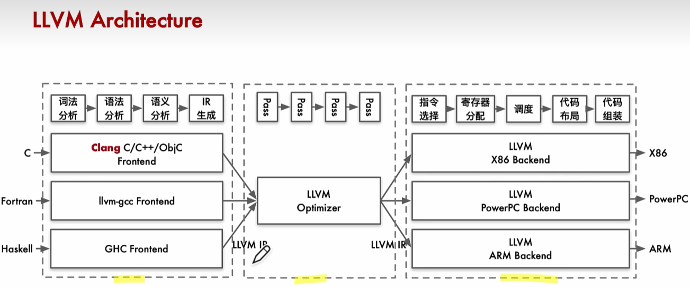
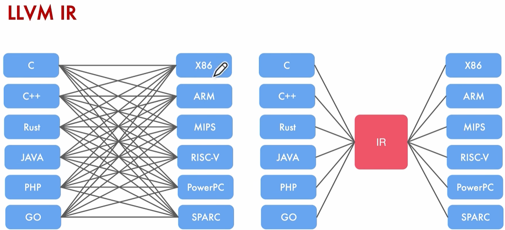
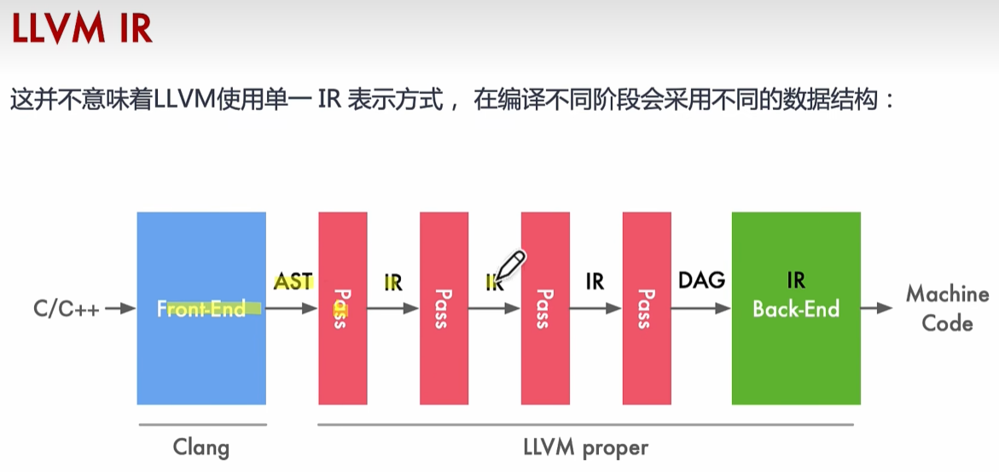
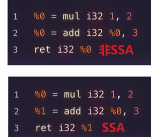
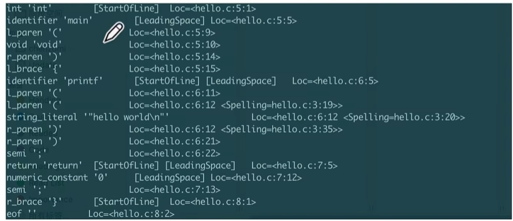
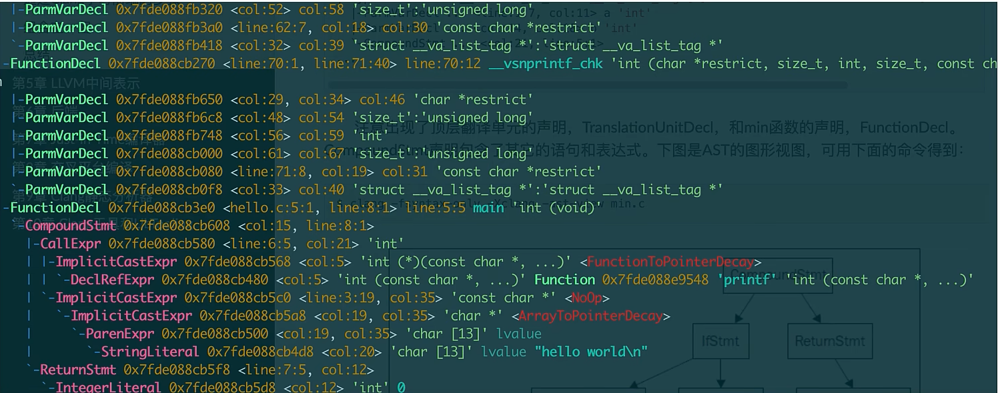
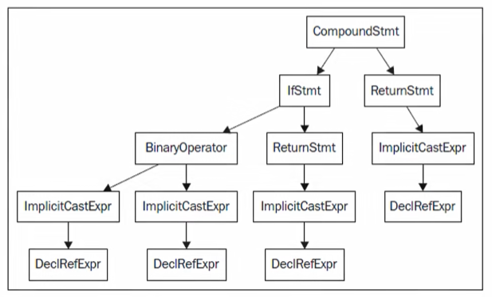
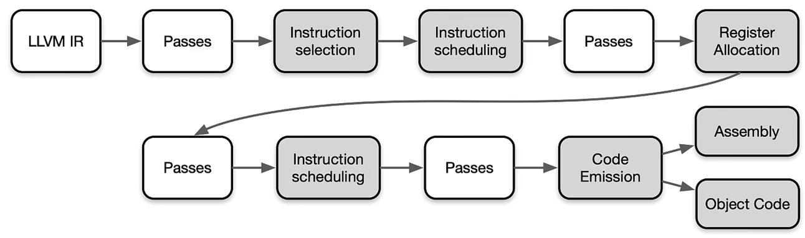

# LLVM




# LLVM IR

LLVM通过IR将编译器的前端和后端分开，结构十分清晰。

左侧为GCC，右侧为LLVM架构。



LLVM中间会有多种IR，IR就是一种独特的表示源码（因为编译器的输入就是源码）的数据结构。例如前端处理完会得到抽象语法树AST，而在中间优化之后会得到DAG有向无环图，因为DAG图能够有效表示硬件的指令顺序。



## LLVM IR基本语法


## IR例子


## LLVM的两个基本原则

1. 采用单静态赋值(Static Single Assignment)的形式。代码组织为三地址指令序列和采用无限寄存器假设让优化快速执行
2. 整个程序的IR存储到磁盘，让链接时优化易于实现。

## 无限寄存器

每一种硬件寄存器的数量都不同，而IR只是一种中间表达，不希望和后端硬件绑定。 

## 单静态赋值SSA

程序中每个变量有且只有一个赋值语句。LLVM IR中，每个变量在使用前都必须先定义，而且每个变量只能被赋值一次。以`1*2+3`为例：



好处：

1. 每个值只赋值（赋值的同时也定义）了一次。每次用到一个值的时候，可以立刻向后追溯到给出其定义的唯一指令。
2. 极大简化优化。因为SSA建立了平凡的use-def链，也就是一个值到达使用之处的定义的列表。可以方便追溯每个值对应的指令。

# LLVM front end

词法分析，语法分析，语义分析

以下面源代码为示例：

```c
#include <stdio.h>

#define HELLOWORLD ("hello world\n")

int main(void){
	printf(HELLOWORLD);
	return 0;
}
```

## 词法分析

将源码分解为一组单词和标记。除去空白，注释，制表符（预处理）。

```bash
clang -cc1 -dump-tokens hello.c
```




## 语法分析

```bash
clang -fsyntax-only -Xclang -ast-dump hello.c
```

1. 分组标记以形成表达式，语句，函数体等

2. 检查每组标记是否有意义，考虑代码物理布局，考虑代码是否正确，不分析代码意思（类似分析句子主谓宾是否缺失）。

   ```c
   // 语法分析不报错 语义分析报错 类型不匹配无法相乘
   int arr[2],b;
   b = arr * 10; 
   ```

3. 输出语法树AST。



各种表达式，语句结构。例如隐式类型转换Expr，If语句，Return语句

树形结构如下：



## 语义分析

借助符号表检查代码有没有违背语法。符号表存储标识符和其各自类型之间的映射，以及它的内容（值）。

# LLVM 中间层优化

目标无关优化， 实际上就是IR在pass流水线中被修改的过程。这些pass通常分为分析pass和转换pass。

详见`https://llvm.org/docs/Passes.html`

# LLVM back end

后端由一套分析和转化pass组成，它们的任务是代码生成CodeGen，即将LLVM IR变换为目标代码（或者汇编代码）。

灰色的是必须Pass，即Super Pass，白色的是非必要pass。



逐个介绍上面5个Super Pass：

## Instruction Selection 指令选择

内存中LLVM IR变换为目标特定SelectionDAG节点。

- 每个DAG能够表示单一基本块的计算
- 节点表示指令，而边表示指令间的数据流依赖

## Instruction Scheduling 指令调度

