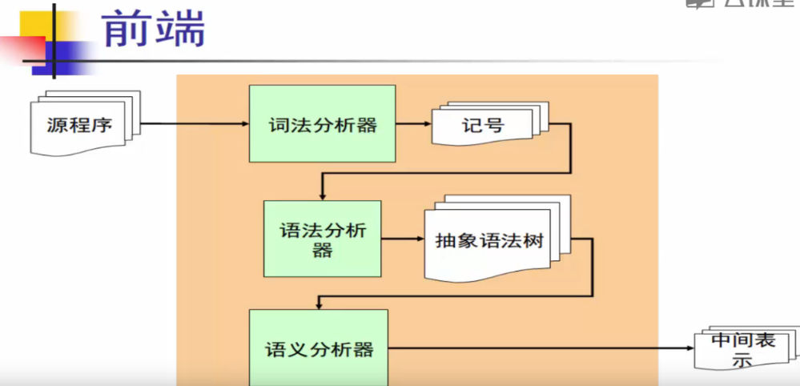
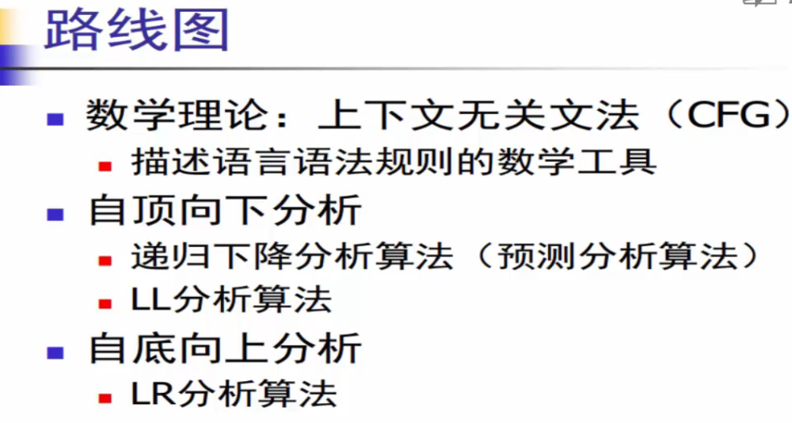

# 中科大-华保健

视频课程地址：https://www.bilibili.com/video/BV17W41187gL/?spm_id_from=333.337.search-card.all.click&vd_source=b9f75d9bc23add3c1afdb0c760a8431b

# 编译器基础

前端

# 词法分析

# 语法分析

记号流 --> `语法分析器` --> 语法树

## 语法分析路线图

## 上下文无关文法