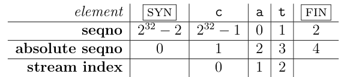
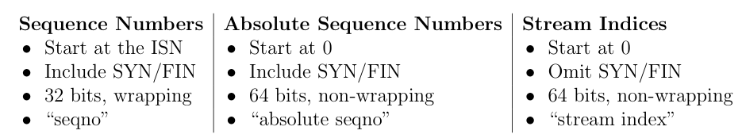
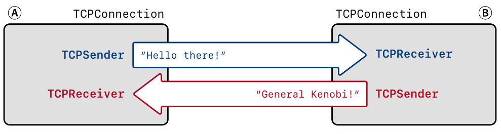

笔记：https://lrl52.top/998/cs144-lablab2/

# lab2  TCPReceiver

The `TCPReceiver` receives TCP segments (the payloads of datagrams carried over the Internet) from the Internet and turns them into calls to your `StreamReassembler`, which eventually writes to the incoming `ByteStream`. Applications read from this `ByteStream`

TCPReceiver is responsible for telling the sender two things: 

1. the index of the “first unassembled” byte (`ackno`), This is the first byte that the receiver needs from the sender.
2. the distance between the “first unassembled” index and the “first unacceptable” index.
   This is called the “`window size`”.

Together, the ackno and window size describe describes the receiver’s window: a range of indexes that the TCP sender is allowed to send. Using the window, the receiver can control the flow of incoming data, making the sender limit how much it sends until the receiver is ready for more.

TCPReceiver responsible for receiving TCP segments (the actual datagram payloads), reassembling the byte stream (including its ending, when that occurs), and determining that signals that should be sent back to the sender for `acknowledgment` and `flow control`.

1. `Acknowledgment` means, “What’s the index of the next byte that the receiver needs so it can reassemble more of the ByteStream?” This tells the sender what bytes it needs to send or resend.
2. `Flow control` means, “What range of indices is the receiver interested and willing to receive?”This tells the sender how much it’s allowed to send.

## 将64bit index转换到32bit seqno

tcp数据包的index是64bit，但实际tcp header中seqno是32bit

In the TCP headers, however, space is precious, and each byte’s index in the stream is represented not with a 64-bit index but with a 32-bit “sequence number,” or “seqno.” This adds three complexities:

1. Your implementation needs to plan for 32-bit integers to wrap around.
2. TCP sequence numbers start at a random value (not zero) (to improve security and avoid getting confused by old segments belonging to earlier connections between the same endpoints). The first sequence number in the stream is a random 32-bit number called the Initial Sequence Number (ISN). This is the sequence number that represents the SYN (beginning of stream).
3. The logical beginning and ending each occupy one sequence number. In TCP the SYN (beginning-of-stream) and FIN (end-of-stream) control flags are assigned sequence numbers. Each of these occupies one sequence number.

为了更好来理解下标和构建代码，此处引入了两个概念：

1. `absolute sequence number`, which always starts at zero and doesn’t wrap
2. `stream index`, what you’ve already been using with your StreamReassembler:
   an index for each byte in the stream, starting at zero.

for example, the string 'cat':

The figure shows the three different types of indexing involved in TCP:

Unfortunately, converting between sequence numbers and absolute sequence
numbers is a bit harder, and confusing the two can produce tricky bugs.

此处使用了一个`wrapper type`的类`WrappingInt32`,  a type that contains an inner type (in this case uint32_t) but provides a different set of functions/operators.

## Implementing TCP receiver	

`TCPReceiver` will:

1.  receive segments from its peer
2. reassemble the ByteStream using your StreamReassembler
3. calculate the acknowledgment number (ackno) and the window size. The ackno and
   window size will eventually be transmitted back to the peer in an outgoing segment.

# lab3

`TCPSender` is responsibility to:

1. 追踪receiver的ackno和window size
2. 从ByteStream读取数据，创建TCPSegment并发送，尽可能填充window，直到填满window或数据已经读完
3. 追踪已经发出的Segment但是未被receiver接收(ackno)
4. 对于已发出但没被receiver收到的Segment，如果发出的时刻到现在已经超过了既定时间(retransmission timeout RTO)需要重新发送（超时重传）

还需要记录连续的重传的个数，如果过多TCPConnection需要停止此次链接。

TCPSender关心ack和window_size

# lab4

TCP reliably conveys a pair of flow-controlled byte streams, one in each direction.

Here are the basic rules the TCPConnection has to follow:

**接收Segment** 

- 如果设置了RST，发送流和接收流出现了错误，需要杀死连接。
- TCPReceiver查看Segment的seqno，SYN，payload，FIN
- 如果设置了ACK，TCPSender需要查看ackno和window_size
- 如果传入的段有一个seqno，那么至少发送一个段作为回复，反应ack和window size
- 需要回复keep-alive Segment，这种Segment中seqno可能是非法的

**发送Segment**

1. 把TCPSender放到outgoing queue中的Segment发出去
2. 在发送之前，询问TCPReceiver ackno和window size，如果有，将Segment的ACK设置为true

**计时**

1. 告诉TCPSender时间信息
2. 如果consecutive retransmissions超过TCPConfig::MAX RETX ATTEMPTS，中断连接，发送RESET Segment给对方

