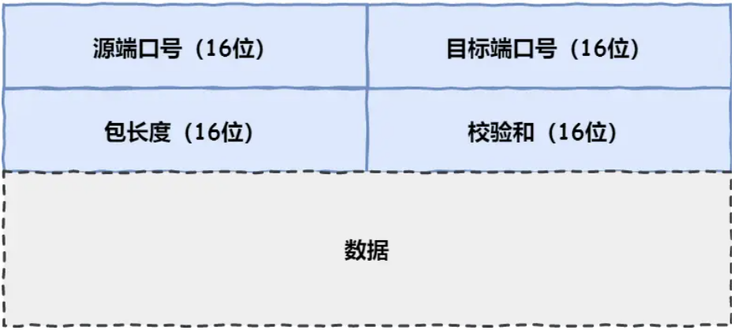

## ------ TCP基本认识

## 什么是TCP

TCP 是**面向连接的、可靠的、基于字节流**的传输层通信协议。

- **面向连接**：一定是「一对一」才能连接，不能像 UDP 协议可以一个主机同时向多个主机发送消息，也就是一对多是无法做到的；
- **可靠的**：对数据包进行校验，有确认重传机制。TCP报头有序列号，确认应答号，校验和，确保接收端接收的网络包是**无损坏、无间隔、非冗余和按序的。**`IP` 层是「不可靠」的，它不保证网络包的交付、不保证网络包的按序交付、也不保证网络包中的数据的完整性。
- **字节流**：用户消息通过 TCP 协议传输时，消息可能会被操作系统「分组」成多个的 TCP 报文。接收方的程序需要知道「消息的边界」。

## 什么是TCP连接

**用于保证可靠性和流量控制维护的某些状态信息，这些信息的组合，包括 Socket、序列号和窗口大小称为连接。**

所以我们可以知道，建立一个 TCP 连接是需要客户端与服务端达成上述三个信息的共识。

- **Socket**：由 IP 地址和端口号组成
- **序列号**：用来解决乱序问题等
- **窗口大小**：用来做流量控制

## 如何确定一个TCP连接  

TCP 四元组可以唯一的确定一个连接，【源地址，源端口，目的地址，目的端口】

有一个 IP 的服务端监听了一个端口，它的 TCP 的最大连接数是多少？

服务端通常固定在某个本地端口上监听，等待客户端的连接请求。因此，客户端 IP 和端口是可变的。理论值计算公式如下：

`最大TCP连接数 = 客户端IP数 * 客户端端口数`

## UDP 和 TCP 有什么区                                                                                                                                                                                                                                                                                                                                                                                                                                                                                                                                                                                                                                                                                                                                                                                                                        别呢？分别的应用场景是？

UDP 的头部格式如下：

- 校验和：校验和是为了提供可靠的 UDP 首部和数据而设计，防止收到在网络传输中受损的 UDP 包。

### TCP/UDP区别

- 连接。TCP 是面向连接的传输层协议，传输数据前先要建立连接。UDP 是不需要连接，即刻传输数据。

- 服务对象。TCP 是一对一的两点服务，即一条连接只有两个端点。UDP 支持一对一、一对多、多对多的交互通信

- 可靠性。TCP 是可靠交付数据的，数据可以无差错、不丢失、不重复、按序到达。UDP 是尽最大努力交付，不保证可靠交付数据

- 拥塞控制。TCP 有拥塞控制和流量控制机制，保证数据传输的安全性。UDP 则没有，即使网络非常拥堵了，也不会影响 UDP 的发送速率。
- 首部开销。TCP首部较长，20个字节，使用【选项】字段会更长。UDP头部始终为8个字节

- 传输方式。TCP 是流式传输，没有边界，但保证顺序和可靠。UDP 是一个包一个包的发送，是有边界的，但可能会丢包和乱序。
- 分片不同。TCP 的数据大小如果大于 MSS 大小，则会在传输层进行分片，目标主机收到后，也同样在传输层组装 TCP 数据包，如果中途丢失了一个分片，只需要传输丢失的这个分片。UDP 的数据大小如果大于 MTU 大小，则会在 IP 层进行分片，目标主机收到后，在 IP 层组装完数据，接着再传给传输层。

### 应用场景

 TCP 是面向连接，能保证数据的可靠性交付，因此经常用于`FTP文件传输，HTTP/HTTPS`

 UDP 面向无连接，它可以随时发送数据，再加上 UDP 本身的处理既简单又高效，因此经常用于`DNS/视频音频多媒体通信/广播通信`

为什么TCP 头部则没有「包长度」字段呢?

`TCP数据长度 = IP总长度 - IP首部长度 - TCP首部长度`

## TCP 和 UDP 可以使用同一个端口吗？

可以的.

传输层有两个传输协议分别是 TCP 和 UDP，在内核中是两个完全独立的软件模块。

当主机收到数据包后，可以**在 IP 包头的「协议号」字段知道该数据包是 TCP/UDP**，所以可以根据这个信息确定送给哪个模块（TCP/UDP）处理，送给 TCP/UDP 模块的报文根据「端口号」确定送给哪个应用程序处理。

因此，TCP/UDP 各自的端口号也相互独立，如 TCP 有一个 80 号端口，UDP 也可以有一个 80 号端口，二者并不冲突。

## ------ TCP建立过程

## 三次握手

1. 客户端随机初始化序号client_isn作为序列号,SYN置为1,不携带数据,然后发送给服务端
2. 服务端收到后,随机初始化server_isn作为序列号,收到的client_isn+1作为确认应答号,ACK置为1,SYN置为1,不携带数据,发送给客户端
3. 客户端收到之后,收到的server_isn+1作为确认应答号,ACK置为1,可以携带数据.

## 为什么是三次,而不是两次,四次?