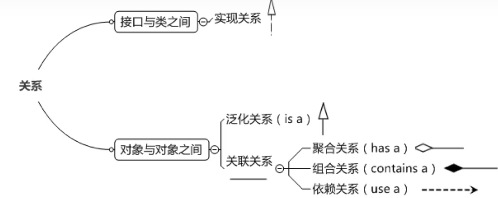

# 类图

**关系强度**: 组合关系最强,聚合关系次之,依赖关系最弱。

1. **依赖关系(Dependency)**:

   - 定义: 一个类需要另一个类的方法或属性来完成自己的功能。
   - 生命周期: 被依赖的类的生命周期独立于依赖它的类。

2. **聚合关系(Aggregation)**:

   - 定义: 一个类包含另一个类作为它的一部分。
   - 生命周期: 部分对象的生命周期通常依赖于整体对象。

3. **组合关系(Composition)**:

   - 定义: 一个类包含另一个类作为它的一部分,并拥有对部分对象的所有权和控制权。

     - 生命周期: 部分对象的生命周期完全依赖于整体对象,当整体对象被销毁时,部分对象也会被销毁。

     