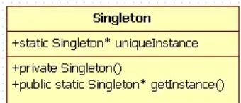
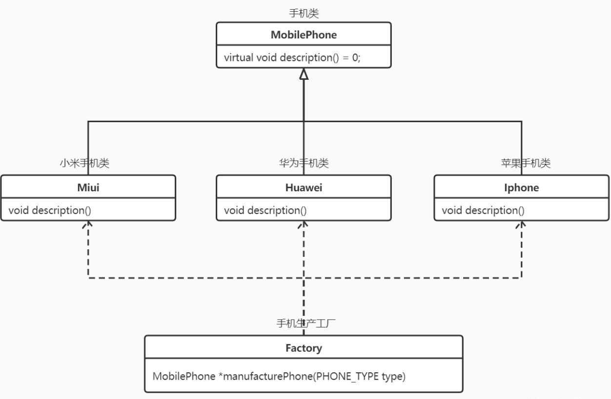
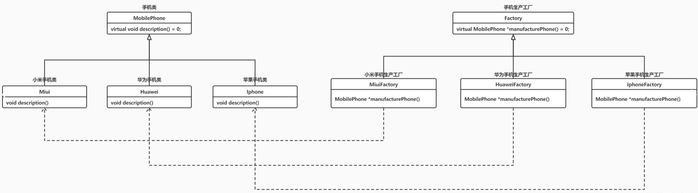
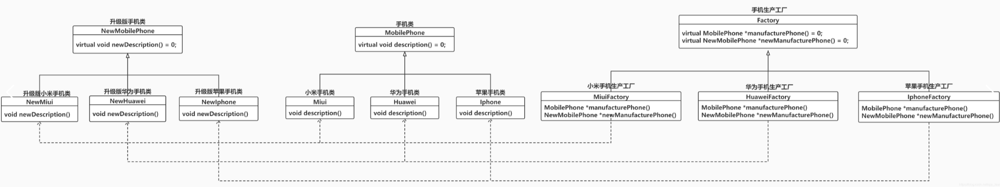

# C++中常见的设计模式

- 单例模式。单例模式确保一个类只能创建一个对象，并提供全局访问。
- 观察者模式。
- 工厂模式。工厂模式通过定义一个公共接口来创建对象，并由子类决定实例化哪个具体类。
- 策略模式
- 模板方法模式

# 单例模式

[wanfengcxz/DesignPattern: DesignPattern by c++ (github.com)](https://github.com/wanfengcxz/DesignPattern)https://www.cnblogs.com/xuwendong/p/9633985.html

https://zhuanlan.zhihu.com/p/37469260

https://cloud.tencent.com/developer/article/2318669

[C++ and the Perils of Double-Checked Locking: Part II | Dr Dobb's (drdobbs.com)](https://www.drdobbs.com/cpp/c-and-the-perils-of-double-checked-locki/184405772)

## 定义

单例模式是一种常用的软件设计模式，其定义是单例对象的类只能允许一个实例存在，并提供一个访问它的全局访问点，该实例被所有程序模块共享。

## 背景

许多时候整个系统只需要拥有一个的全局对象，这样有利于我们协调系统整体的行为。比如在某个服务器程序中，该服务器的配置信息存放在一个文件中，这些配置数据由一个单例对象统一读取，然后服务进程中的其他对象再通过这个单例对象获取这些配置信息。这种方式简化了在复杂环境下的配置管理。

## 构成

C++中定义一个单例类：



1. 私有化它的构造函数，以防止外界创建单例类的对象；
2. 使用类的私有静态指针变量指向类的唯一实例；
3. 使用一个公有的静态方法获取该实例。

将该类的构造方法定义为私有方法，这样其他处的代码就无法通过调用该类的构造方法来实例化该类的对象，只有通过该类提供的静态方法来得到该类的唯一实例；

在该类内提供一个静态方法，当我们调用这个方法时，如果类持有的引用不为空就返回这个引用，如果类保持的引用为空就创建该类的实例并将实例的引用赋予该类保持的引用。

多线程的线程池的设计一般也是采用单例模式，这是由于线程池需要方便对池中的线程进行控制。同样，对于一些应用程序的日志应用，或者web开发中读取配置文件都适合使用单例模式，如HttpApplication 就是单例的典型应用。

## 适用场景

单例模式适用于以下场景：

- 需要频繁创建和销毁的对象，例如缓存、线程池、注册表等。
- 需要控制资源的访问，例如文件操作、数据库连接等。
- 需要保证对象的唯一性和一致性，例如配置信息、全局变量等。

Good Situations to use Singletons (not many):

- Logging frameworks
- Thread recycling pools

## 优缺点

**优点**：

- 在内存中只有一个对象，节省内存空间。避免频繁的创建销毁对象，可以提高性能；
- 避免对共享资源的多重占用，简化访问；
- 为整个系统提供一个全局访问点。可以保证对象的唯一性和一致性。

**缺点**：

-  不适用于变化频繁的对象；
- 不支持继承和多态，违反了单一职责原则，一个类应该只关心内部逻辑，而不关心外部如何实例化。
- 不易扩展，如果需要创建多个实例，就需要修改代码，违反了开闭原则，一个类应该对扩展开放，对修改关闭。
- 不支持有参数的构造函数，如果需要传递参数，就需要修改方法或者定义其他方法。

## 代码-实现

### private的析构函数

当我们将析构函数声明为私有时，就意味着析构函数只能在类域中被调用，无法被外界（包括自己的对象）调用。 表现为：

1. 禁止用户对此类型的变量进行定义，即禁止在栈内存空间内创建此类型的对象（原因是C++是一个静态绑定的语言。在编译过程中，所有的非虚函数调用都必须分析完成。即使是虚函数，也需检查可访问性。此时编译器会注意到析构函数不可访问）。要创建对象，只能用 new 在堆上进行。

2. 禁止用户在程序中使用 delete 删除此类型对象。对象的删除只能在类内实现，也就是说只有类的实现者才有可能实现对对象的 delete，用户不能随便删除对象。一般类会提供特定的静态成员函数或友元函数来进行对象的创建和销毁。

### Lazy Singleton

单例实例在第一次被使用时才进行初始化，这叫做延迟初始化。

```c++
// version 1.0
class Singleton
{
private:
	static Singleton* instance;
private:
	Singleton() {};
    ~Singleton() {};	// 防止程序随意释放这个内存 别人无法调用delete了
	Singleton(const Singleton&);
	Singleton& operator=(const Singleton&);
public:
	static Singleton* getInstance() 
        {
		if(instance == NULL) 
			instance = new Singleton();
		return instance;
	}
};

// init static member
Singleton* Singleton::instance = NULL;
```

此代码存在一些问题：

1. **内存泄漏风险**。由于析构函数是private，所以不能直接使用 `delete` 删除对象，如果忘记通过特定的成员函数或友元函数来释放内存，可能会导致内存泄漏。

2. **继承问题**。如果一个类有私有析构函数，那么它不能被继承，除非子类也定义了自己的析构函数并能够访问父类的析构函数。否则，编译器将无法销毁子类对象。

   ```c++
   class Base {
   private:
       ~Base() {}
   };
   class Derived : public Base { // 编译错误：Base的析构函数是私有的
   };
   ```

3. 由于析构函数是私有的，标准的智能指针（如 `std::shared_ptr` 或 `std::unique_ptr`）无法用于管理这种对象的生命周期。

   ```c++
   std::unique_ptr<MyClass> ptr(new MyClass()); // 编译错误：因为析构函数是私有的
   ```

4. 为了能够销毁对象，通常需要声明友元函数或使用嵌套类。

   ```
   class MyClass {
   private:
       ~MyClass() {}
       friend void destructMyClass(MyClass* obj);
   };
   void destructMyClass(MyClass* obj) {
       delete obj;
   }
   ```

于是做出改进：

```c++
// version 1.1
class Singleton
{
private:
	static Singleton* instance;
private:
	Singleton() { };
	~Singleton() { };
	Singleton(const Singleton&);
	Singleton& operator=(const Singleton&);
private:
	class Deletor {
	public:
		~Deletor() {
			if(Singleton::instance != NULL)
				delete Singleton::instance;
		}
	};
	static Deletor deletor;
public:
	static Singleton* getInstance() {
		if(instance == NULL) {
			instance = new Singleton();
		}
		return instance;
	}
};

// init static member
Singleton* Singleton::instance = NULL;
Singleton::Deletor Singleton::deletor;
```

程序运行结束时，静态变量也会被销毁，由于instance是一个指针，因此只会回收这个指针所占用的内存，指针指向的对象并不会自动回收。有了deletor之后，由于deletor是一个对象，那么会调用它的析构函数，该析构函数会删除单例的唯一实例。

使用这种方法释放单例对象有以下特征：

- 在单例类内部定义专有的嵌套类。
- 在单例类内定义私有的专门用于释放的静态成员。
- 利用程序在结束时析构全局变量的特性，选择最终的释放时机。

在单例类内再定义一个嵌套类，总是感觉很麻烦。

其次，version1.0和1.1都不是线程安全的。首先想到的是利用同步机制来正确的保护我们的shared data。可以使用双检测锁模式（DCL: Double-Checked Locking Pattern）：

```c++
static Singleton* getInstance() {
	if(instance == NULL) {	// 2
		Lock lock;  // 基于作用域的加锁，超出作用域，自动调用析构函数解锁
		if(instance == NULL) {
			instance = new Singleton();	// 5
		}
	}
	return instance;
}
```

注意，线程安全问题仅出现在第一次初始化（new）过程中，而在后面获取该实例的时候并不会遇到，也就没有必要再使用lock。双检测锁很好地解决了这个问题，它通过加锁前检测是否已经初始化，避免了每次获取实例时都要首先获取锁资源。（如果实现是先加锁，再判断是否为空，即单检测，那么每次获取实例时都需要锁，效率很低）

DCL的问题：[C++ and The Perils of Double-Checked Locking: Part I | Dr Dobb's (drdobbs.com)](https://www.drdobbs.com/cpp/c-and-the-perils-of-double-checked-locki/184405726)

Consider again `pInstance = new Singleton;`, the line that initializes `pInstance`. This statement causes three things to happen:

- Step 1. Allocate memory to hold a `Singleton` object.
- Step 2. Construct a `Singleton` object in the allocated memory.
- Step 3. Make `pInstance` point to the allocated memory.

Of critical importance is the observation that compilers are not constrained to perform these steps in this order! 

关于memory model。在某些内存模型中（虽然不常见）或者是由于编译器的优化以及运行时优化等等原因，会出现new返回了地址赋值给instance变量而Singleton此时还没有构造完全，当另一个线程随后运行到第2行时将不会进入if，从而返回了不完全的实例对象给用户使用，造成了严重的错误。即instance虽然已经不是nullptr但是其所指对象还没有完成构造。

在C++11没有出来的时候，只能靠插入两个memory barrier（内存屏障）来解决这个错误，但是C++11引进了memory model，提供了Atomic实现内存的同步访问，即不同线程总是获取对象修改前或修改后的值，无法在对象修改期间获得该对象。

因此，在有了C++11后就可以正确的跨平台的实现DCL模式了，利用atomic，代码如下：

```c++

atomic<Singleton*> Singleton::instance{nullptr};
static Singleton* getInstance() {
	if(instance == NULL) {	// 2
		lock_guard<mutex> lock{ mutW };
		if(instance == NULL) {
			instance = new Singleton();	// 5
		}
	}
	return instance;
}
```

C++11中的atomic类的默认memory_order_seq_cst保证了3、5行代码的正确同步，但由于instance变成了atomic类型，所以在if判断时，会损失一些性能。可以进行优化：

```
atomic<Singleton*> Singleton::instance{nullptr};
static Singleton* getInstance() {
	Singleton *p = instance;
	if(p == NULL) {	// 2
		lock_guard<mutex> lock{ mutW };
		if((p = instance) == nullptr) {
			p = instance = new Singleton();	// 5
		}
	}
	return instance;
}
```

### Meyers Singleton

C++11规定了**local static**在多线程条件下的初始化行为，要求编译器保证了内部静态变量的线程安全性。所以在C++11标准下，《Effective C++》提出了一种更优雅的单例模式实现，使用**函数内的 local static 对象**。这样，只有当第一次访问`getInstance()`方法时才创建实例。

```c++
// version 1.2
class Singleton
{
private:
	Singleton() { };
public:
    Singleton(const Singleton&) = delete;
	Singleton& operator=(const Singleton&) = delete;
	static Singleton& getInstance() 
        {
		static Singleton instance;
		return instance;	// 返回引用最好，返回指针可能被人调用delete
	}
};
```

### Eager Singleton

指单例实例在程序运行时被立即执行初始化。

```c++
// version 1.3
class Singleton
{
private:
	static Singleton instance;
private:
	Singleton();
	~Singleton();
	Singleton(const Singleton&);
	Singleton& operator=(const Singleton&);
public:
	static Singleton& getInstance() {
		return instance;
	}
}

// initialize defaultly
Singleton Singleton::instance;
```

由于在main函数之前初始化，所以没有线程安全的问题。但是潜在问题在于non-local static对象（函数外的static对象）在不同编译单元中的初始化顺序是未定义的。也即，static Singleton instance;和static Singleton& getInstance()二者的初始化顺序不确定，如果在初始化完成之前调用 getInstance() 方法会返回一个未定义的实例。

举个例子，另一个cpp文件中有一个non-local static对象a要使用instance，由于instance是private的，所以需要通过getInstance函数来访问，但是当访问时，instance可能并没有初始化，即在a之后初始化。

总结：

- Eager Singleton 虽然是线程安全的，但存在潜在问题；
- Lazy Singleton通常需要加锁来保证线程安全，但局部静态变量版本在C++11后是线程安全的；
- 局部静态变量版本（Meyers Singleton）最优雅。

# 工厂模式

属于创建型模式，它提供了一种创建对象的最佳方式。
在工厂模式中，我们在创建对象时不会对客户端暴露创建逻辑，并且是通过使用一个共同的接口来指向新创建的对象。

工厂模式的实现方式可分别**简单工厂模式**、**工厂方法模式**、**抽象工厂模式**，每个实现方式都存在优和劣

## 简单工厂

通过指定PHONE_TYPE type来生产不同的手机。

如果增加新的手机，就要修改Factory，违反了开闭原则。



## 工厂方法

让类的实例化推迟到子类中进行。



## 抽象工厂

不仅限于生产手机，还可以生产电脑，音响等。



