# 计算机网络

## HTTPS RSA握手

HTTP明文传输，存在三种风险：

1. 窃听风险。盗号
2. 篡改风险。植入垃圾广告
3. 冒充风险。被骗钱

### TLS握手过程

TLS位于HTTP和TCP之间。TLS三大功能：

1. 信息加密，无法被窃取了。
2. 校验机制，检测信息是否被篡改。
3. 身份证书，服务端无法被冒充了

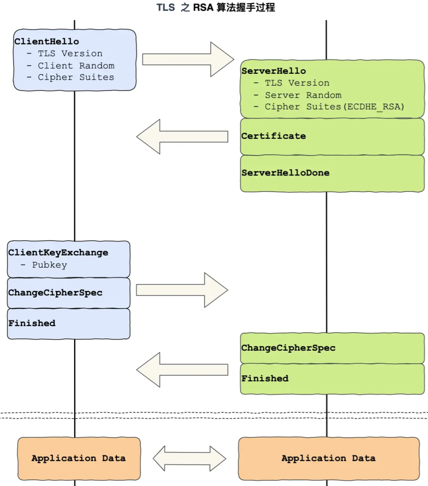

每个框都是一个记录（类似TCP的Segment），多个记录可以组合为一个TCP包发送，所以通常经过四个消息就可以完成TLS握手，也就是2个RTT时延。然后就可以在安全的环境中发送HTTP报文，实现HTTPS协议。

HTTPS是应用层协议，先建立TCP连接，再TLS握手。通过非对称加密来传输密钥，然后通过对称加密来传输数据。

不同的密钥交换算法，TLS的握手过程会有一些区别。

### RSA握手过程

四次握手

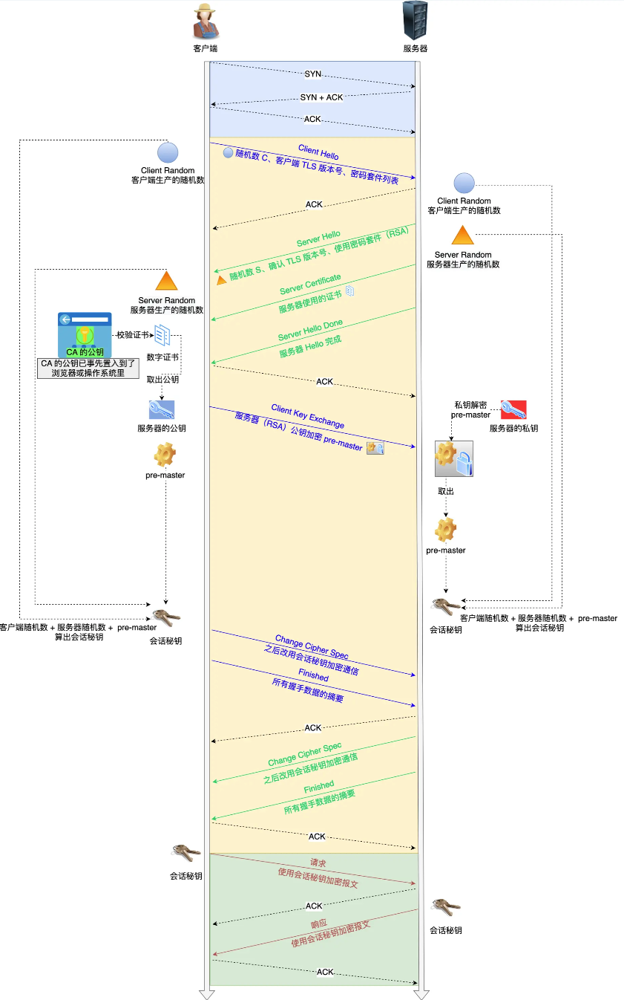

1. 第一次客户端发送Client Hello，消息包含了客户端TLS版本，支持的密码套件，生成的随机数（Client Random）。
2. 服务端收到之后，会确认TLS版本号，也给出随机数（Server Random），从客户端密码套件中选择一个合适的。（两个随机数是之后生成对称密钥的材料之一）
3. 然后客户端发送数字证书给客户端证明自己的身份，随后发送Server Hello Done
4. 客户端拿到证书之后，使用OS/浏览器内置的CA公钥来对数字签名解密，判断是否合法（1-4保证获得服务器的RSA公钥，不会被别人替换）
5. 接着，客户端会生成一个新的随机数pre-master，用服务器的RSA公钥来加密，发送Client Key Exchange给服务端
6. 服务端收到后，使用RSA私钥解密，得到pre-master，双方通过Client Random+Server Random+pre-master生成会话密钥。
7. 客户端再发送一个Change Cipher Spec，告诉服务端开始使用加密方式发送消息。
8. 客户端再发一个「Encrypted Handshake Message（Finishd）」消息，把之前所有发送的数据做个**摘要**，再用会话密钥（master secret）加密一下，让服务器做个验证。
9. 服务器也是同样的操作，发「Change Cipher Spec」和「Encrypted Handshake Message」消息，如果双方都验证加密和解密没问题，那么握手正式完成。
10. 最后，就用「会话密钥」加解密 HTTP 请求和响应了。

但是RSA密钥协商不支持**前向保密**，即一旦服务端的私钥泄漏了，那么会话密钥就会被破解出来，所有信息都会被破解。

## 数字证书

数字证书一般包含

1. 公钥
2. 持有者信息
3. 证书认证机构CA的信息
4. CA对这份文件的数字签名及使用的算法
5. 证书有效期

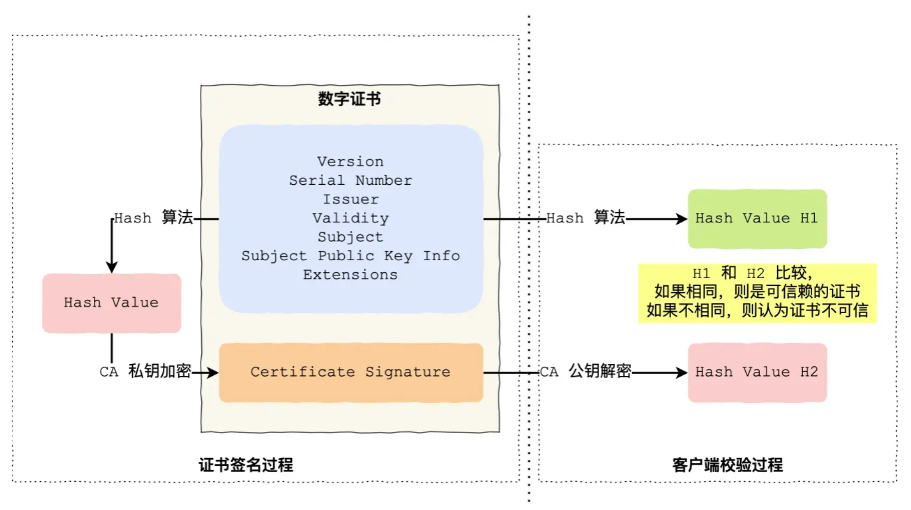

## HTTPS ECDHE握手

ECDHE前向安全，被广泛使用

### 离散对数

离散对数是在对数运算的基础上加了「模运算」，也就说取余数。

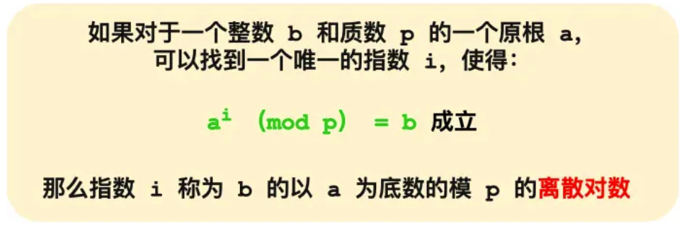

a是底数，i是对数，b是真数。

a和p是公开的。知道了对数i，就可以用上面的公式计算出真数b。但反过来，知道真数b却很难推算出对数i。

**特别是当模数 p 是一个很大的质数，即使知道底数 a 和真数 b ，在现有的计算机的计算水平是几乎无法算出离散对数的，这就是 DH 算法的数学基础。**

### DH算法

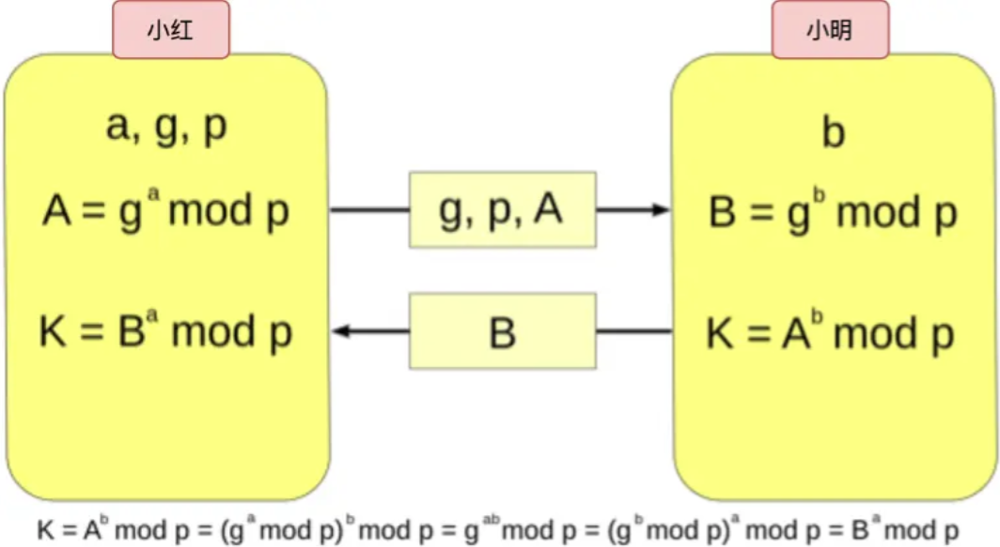

### DHE算法

DH有两种实现：

- static DH算法 已废弃。有一方的私钥是静态的，一般是服务器方固定，客户端的私钥则是随机生成的。时间久了，固定的私钥可能被暴力破解，所以不具备前向安全性。
- DHE 现在常用。双方的私钥在每次密钥交换通信时，都是随机生成的、临时的。E 全称是 ephemeral（临时性的）。

### ECDHE算法

DHE算法需要做大量乘法，计算性能不佳。

ECDHE现在使用更广泛，在DHE基础上利用了ECC椭圆曲线特性，更少计算量得出公钥和会话密钥。


## HTTPS如何优化

HTTPS相比HTTP协议多一个TLS协议握手（协商密钥花费2个RTT），

## RPC和HTTP

TCP是基于字节流的，字节流就是01串，01串之间是没有边界的，这就是所谓的粘包问题。所以纯裸的TCP是不能直接拿来用的，需要加入一些自定义的规则，用于区分消息边界。

于是我们会把每条发送的数据封装一下，加入消息头，消息头包含了整个包的长度。

这里消息头可以放各种东西，比如消息体是否被压缩过，消息体格式之类，只要双方约定好就可以了，这就是所谓的协议。

每个使用 TCP 的项目都可能会定义一套类似这样的协议解析标准，他们可能**有区别，但原理都类似**。**于是基于 TCP，就衍生了非常多的协议，比如 HTTP 和 RPC。**

基于 TCP 造出来的 HTTP 和**各类** RPC 协议，它们都只是定义了不同消息格式的**应用层协议**而已。

RPC（**R**emote **P**rocedure **C**all）远程过程调用，它本身并不是一个具体的协议，而是一种调用方法的方式。

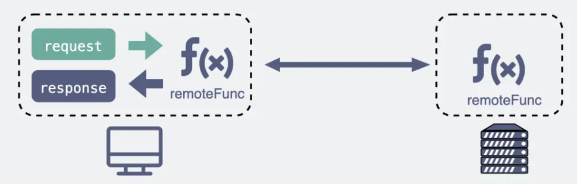

TCP-70年代，RPC-80年代，HTTP-90年代。

电脑上各种联网软件，xx管家/卫士，都是CS架构，会使用应用层协议进行通信，一般都是用自家造的RPC协议，因为只连接自己公司的服务器就可以了。

然而，对于浏览器，不仅能访问自家公司的服务器，还需要访问其他公司的网站服务器，于是就有了统一标准HTTP（Browser/Server架构）。

如今，很多软件同时支持多端，B/S和C/S都在慢慢融合，如果都有HTTP通信，那服务器就用一套就可以了。所以RPC退居幕后，一般用于公司内部集群中各个微服务之间的通讯。

### 区别

**传输的内容**

基于TCP传输消息，无非都是header和body。Header中标记一些特殊信息，最重要的是消息体长度。在消息体中，字符串和数字都可以直接转成01串，而结构体不能直接转，现成的序列化方案有Json，Protobuf。对于主流的Http/1.1，设计之初主要用于网页文本传输，以字符串为主，所以对于body采用Json来序列化结构体数据。但是Header中的内容十分冗余，如果约定了第几个字节是Content-Type，那就不需要把这些字段传过来。

而RPC，定制化程度更高，采用体积小的Protobuf等来序列化结构体，也不需要像HTTP那样考虑各种浏览器行为（302重定向），性能会更好些，**这也是在公司内部微服务中抛弃 HTTP，选择使用 RPC 的最主要原因。**

## HTTP和WebSocket

服务器主动发消息给客户的场景是如何做到的？用户不做任何操作，网页也能收到消息并发生更正？

### 使用HTTP不断轮询

在网页的前端代码里不断定时发HTTP请求到服务器，服务器收到请求后给客户端响应消息。

这是一种伪服务器推的形式。比如扫描二维码，网页展示二维码之后，每隔1s询问服务器用户是否已经扫码

问题在于：不断发送HTTP请求消耗带宽，增加服务器的负担

### 长轮询

将HTTP的超时时间设置的很大，比如30s，只要服务器在这期间收到了扫码请求，就发给客户端。这样减少HTTP请求个数，响应也会比较及时。

### WebSocket

不断轮询和长轮询本质都是客户端主动去取数据。

TCP是全双工，而HTTP/1.1是半双工（因为设计之初考虑的是看网页文本的场景，不需要双向通信）。为了更好支持像网页游戏这种，CS之间都要相互主动发送大量数据，就设计了WebSocket。

### WebSocket建立连接

为了兼容网页，浏览器在TCP三次握手建立连接之后，统一使用HTTP协议先进行一次通信，此时HTTP请求里会带上一些特殊的Header：

```http
Connection: Upgrade
Upgrade: WebSocket
Sec-WebSocket-Key: T2a6wZlAwhgQNqruZ2YUyg==\r\n
```

表示要升级协议为WebSocket，同时有一段随机生成的base64码。服务器正好支持的话，就会走握手流程，使用某个公开算法将base64码变成另外一段字符串，放在Header中，带上状态码101（表示协议切换）发给浏览器。浏览器也用同样的公开算法把base64码变成一段字符串，与收到的字符串进行对比。一来一回WebSocket就建立好了。

```http
HTTP/1.1 101 Switching Protocols\r\n
Sec-WebSocket-Accept: iBJKv/ALIW2DobfoA4dmr3JHBCY=\r\n
Upgrade: WebSocket\r\n
Connection: Upgrade\r\n
```

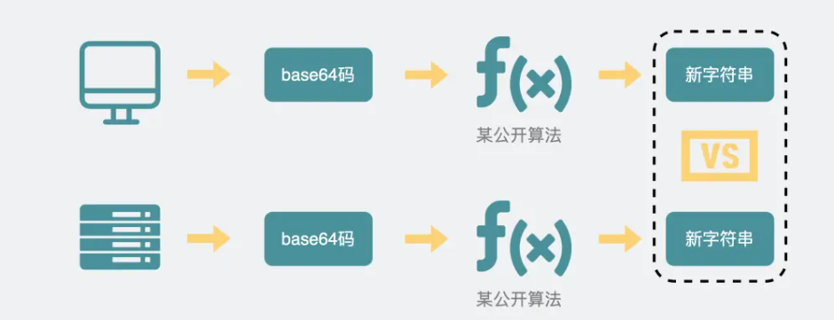

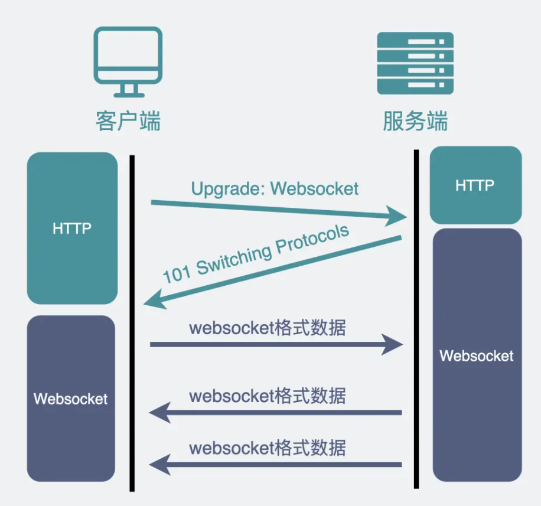

## WebSock消息格式


## TCP头部格式

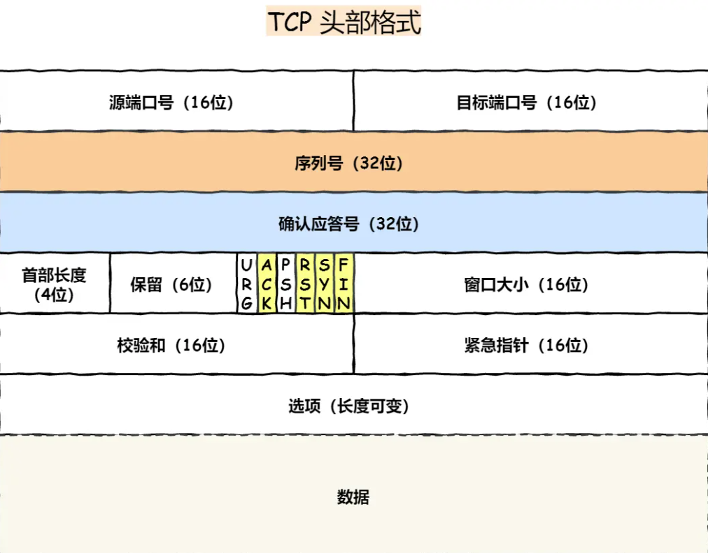

seqno：防止报文乱序，重复（isn是随机生成）。

ackno：ackno-1的报文都已收到，期待收到seqno=ackno的报文，防止丢包。

控制位：TCP规定除了第一次发送syn包之外，ack都必须设置为1。rst连接出现异常，必须断开。syn发起连接请求。fin希望断开连接。

## 什么是TCP

TCP 是**面向连接的、可靠的、基于字节流**的传输层通信协议。

- **面向连接**：一定是「一对一」才能连接，不能像 UDP 协议可以一个主机同时向多个主机发送消息，也就是一对多是无法做到的；
- **可靠的**：对数据包进行校验，有确认重传机制。TCP报头有序列号，确认应答号，校验和，确保接收端接收的网络包是**无损坏、无间隔、非冗余和按序的。**`IP` 层是「不可靠」的，它不保证网络包的交付、不保证网络包的按序交付、也不保证网络包中的数据的完整性。
- **字节流**：用户消息通过 TCP 协议传输时，消息可能会被操作系统「分组」成多个的 TCP 报文。接收方的程序需要知道「消息的边界」。

## TCP三次握手

1. 客户端随机初始化序号client_isn作为序列号,SYN置为1,不携带数据,然后发送给服务端
2. 服务端收到后,随机初始化server_isn作为序列号,收到的client_isn+1作为确认应答号,ACK置为1,SYN置为1,不携带数据,发送给客户端
3. 客户端收到之后,收到的server_isn+1作为确认应答号,ACK置为1,可以携带数据.

注意，前两次连接，syn被置为1，且不可以携带数据。第三次连接可以携带数据。

## 为什么是3次？

确实可以设置为4次，把服务端发送isn和ack分开来，但实际上他们可以合并为步骤2。

但两次肯定不行。原因如下：

- 三次握手才能阻止重复历史连接的初始化。如果两次，客户端发送syn,isn=500后，由于重启，又重新发起连接syn,isn=600，此时服务器如果收到了旧的连接请求，那么就会回复ack=501，并且进入ESTABLISHED，按照客户端的window_size发送数据，但是客户端收到ack=501发现异常，会主动断开连接rst。在客户端发送rst之前，服务端已经发送了部分数据，浪费了服务器的资源。
- 三次握手才能同步双方的isn
- 避免资源浪费。如果客户端发送syn时由于拥堵，重传了好几个，服务器每接受一个syn就建立连接发送数据，浪费了服务器资源。

## 序列号为什么要随机初始化？

1. 避免接收历史报文。随机产生序列号，就有大概率历史报文的序列号不在对方的window_size之内。 
2. 随机初始化的seqno有一定的安全性。

当然不能完全避免接收历史报文。实际上使用TCP时间戳来解决的。

## IP层会分片，那为什么TCP层还需要MSS

- `MTU`：一个网络包的最大长度，以太网中一般为 `1500` 字节；
- `MSS`：除去 IP 和 TCP 头部之后，一个网络包所能容纳的 TCP 数据的最大长度；

假如有一个很大的TCP报文，如果交给IP层分片，那么一旦其中一个包丢失了，整个TCP报文就无法被IP组装，也就无法给到TCP层，那么接收端就无法发出ack，由于IP层没有确认重传机制，需要TCP发送端重传整个报文，效率很低。

所以，为了达到最佳的传输效能 TCP 协议在**建立连接的时候通常要协商双方的 MSS 值**，当 TCP 层发现数据超过 MSS 时，则就先会进行分片，当然由它形成的 IP 包的长度也就不会大于 MTU ，自然也就不用 IP 分片了。

## syn攻击（syn泛洪）

TCP握手时，Linux内核会维护两个队列：

- 半连接队列，也叫SYN队列
- 全连接队列，也叫ACCEPT队列。

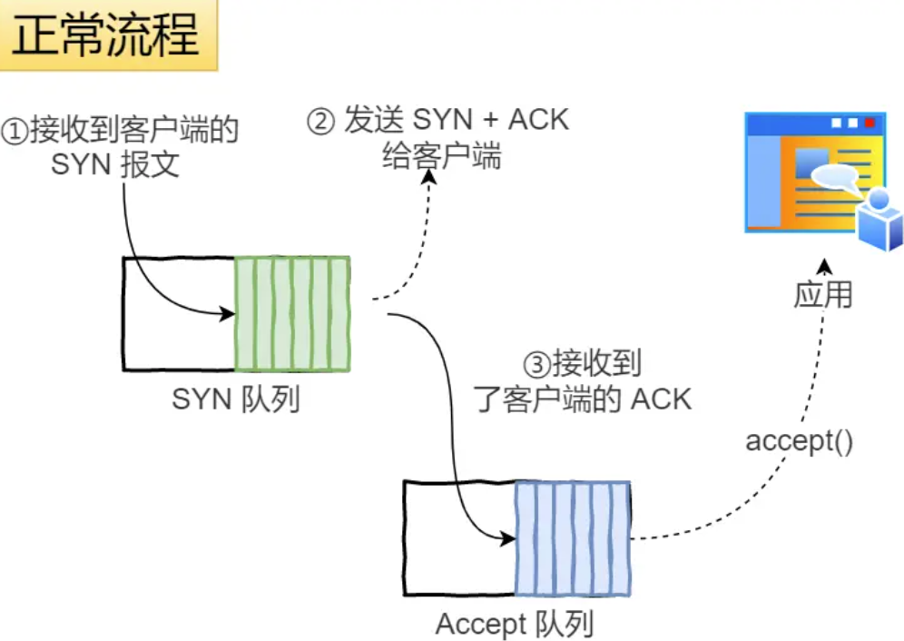

攻击者短时间伪造不同IP地址的SYN报文，服务端每接收到一个SYN报文，就进入SYN_RCVD状态，但是无法进入ESTABLISHED状态，久而久之会占满服务端的半连接队列，使得服务端无法正常为用户服务。

避免方法：


## 四次挥手

双方都可以主动断开连接。客户端主动断开连接如下：

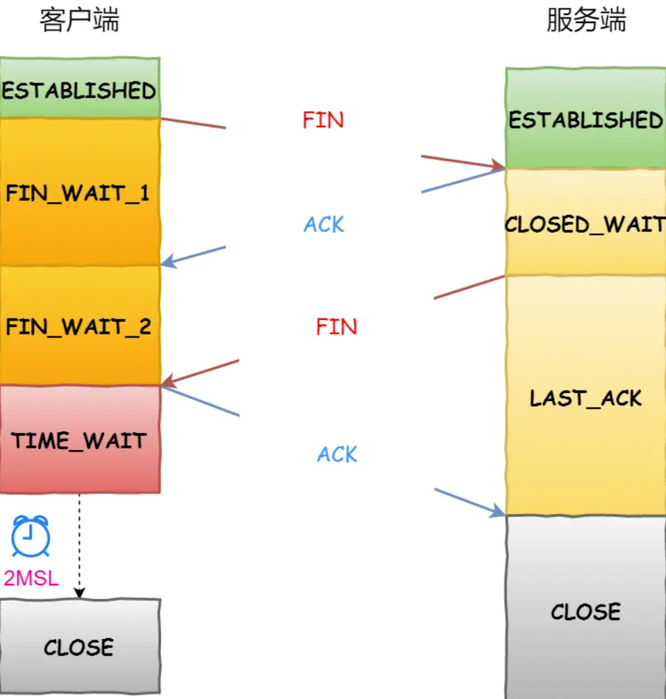

每个方向都需要发送一个FIN和ACK，所以称为四次挥手。

主动关闭连接的一方才有TIME_WAIT状态。

## 为什么是四次？

由于TCP是全双工通信，双发都可以互相发送数据。当断开连接时，客户端发送FIN，并且收到了ACK，此时代表客户端不再发送数据了，但是服务器还可以继续发送数据。等到服务器不在发送数据时，才发送FIN给客户端。所以断开连接的两次FIN一般是分开发送的，所以是四次。

特定情况下可以变为四次。

## 第一次挥手丢失怎么办？

客户端主动发出FIN后，如果没有收到ACK会触发超时重传机制，重发次数由 `tcp_orphan_retries` 参数控制。

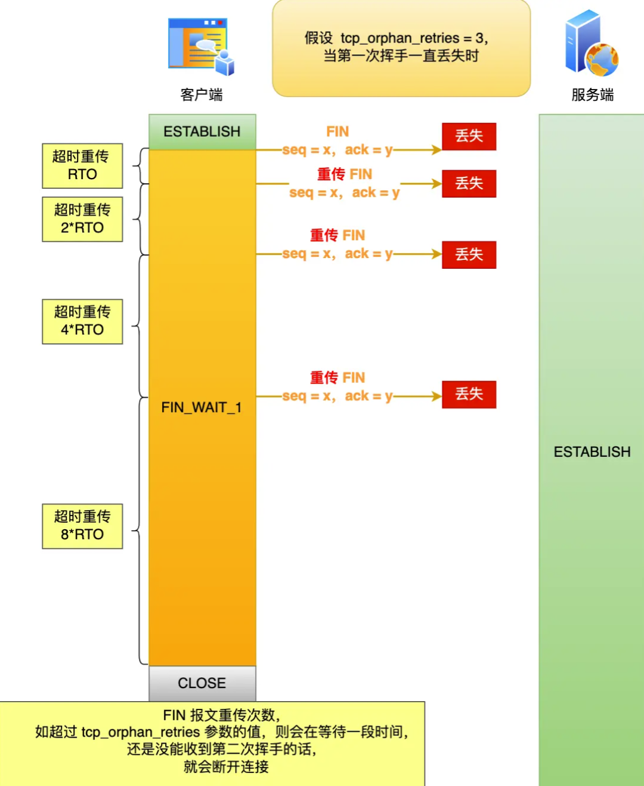

当客户端超时重传 3 次 FIN 报文后，由于 tcp_orphan_retries 为 3，已达到最大重传次数，于是再等待一段时间（时间为上一次超时时间的 2 倍），如果还是没能收到服务端的第二次挥手（ACK报文），那么客户端就会断开连接。

## 为什么会有TIME_WAIT？

主动发起连接的一方才有TIME_WAIT状态。需要TIME_WAIT状态有两个原因：

1. 防止历史连接中被延迟的数据，被后面相同的四元组的连接错误接收。TIME_WAIT 状态会持续 `2MSL` 时长，这个时间**足以让两个方向上的数据包都被丢弃，使得原来连接的数据包在网络中都自然消失，再出现的数据包一定都是新建立连接所产生的。**
2. 保证被动关闭的一方能够正确的关闭。TIME-WAIT 作用是**等待足够的时间以确保最后的 ACK 能让被动关闭方接收，从而帮助其正常关闭。**

## TCP重传机制

通过序列号seqno和确认号ackno来实现。

### 超时重传

以时间为驱动，在发送数据时，启动一个定时器。当超过指定的时间后，没有收到对方的ACK报文，就会重发该数据。

RTT（Round-Trip Time 往返时延）是数据发送时刻到接收到ACK时刻的差值，也就是包的往返时间。

超时重传时间（RTO）的时间应该略大于RTT的值。

在Linux下，TCP通过采样RTT时间，然后进行加权平均，得到一个平滑RTT值。而且这个值还是在不断变化的，因为网络状况不断地变化。

每当遇到一次超时重传时，都会将下一次超时时间间隔设置为先前的两倍。

### 快速重传

以数据为驱动，当收到三个相同的ACK报文时，会在定时器过期之前，重传丢失的报文。但是重传一个还是所有的？于是有了SACK方法。

### SACK

选择性确认（Selective Acknowledgment）。在TCP头部选项字段中加一个SACK的东西，它把接收方缓冲区的情况发送给发送方，这样发送方就知道哪些数据收到/没收到了，这样就可以只重传丢失的数据。

## 滑动窗口

略

## 流量控制

流量控制是避免发送方的数据填满接收方的缓存（[first_unassembled, first_unacceptable]）

发送方不能无脑发送数据给接收方，要考虑接收方的处理能力（接收方缓冲区的大小/机器的性能）。否则可能导致重发机制，从而导致网络流量的浪费。

在接收端会根据自己的接受能力，再回复ack是附带上window_size，表示当前能接受的数据窗口大小，这个值是动态变化的，来控制流量大小。如果接收端一直无法接收数据，则window_size会变成0，就发生了窗口关闭。当窗口变为0时，发送方实际会定时发送窗口探测报文，来查看窗口是否变化。

## 拥塞控制

避免发送方的数据填满整个网络。

发送方通过拥塞窗口cwnd调节所要发送数据的量。拥塞窗口是根据网络的拥塞程度动态变化的。发送窗口swnd=min(cwnd, rwnd)，发送窗口取拥塞窗口和接收窗口的最小值。

只要发送方没有在规定时间内接收到ACK应答报文，即发生了超时重传机制，就会认为网络出现了拥堵。

### 慢启动

cwnd从1开始，每接收到一个ack，就翻倍，一点一点的提高发送数据包的数量。

有一个叫慢启动门限ssthresh（slow start threshold）的状态变量。

- 当 `cwnd` < `ssthresh` 时，使用慢启动算法。
- 当 `cwnd` >= `ssthresh` 时，就会使用「拥塞避免算法」。

### 拥塞避免

每经过一个往返时间RTT（接收一个ACK）就把发送方的拥塞窗口cwnd加1，而不是加倍。

### 拥塞发生

当出现丢包现象时，


## UDP头部格式

​	

## UDP和TCP的区别

1. TCP是面向连接的，端到端（一对一），提供可靠数据传输，无差错，不丢失，不重复，不乱序；UDP不需要连接，可以一对多，多对多通信，尽最大努力交付数据。
2. TCP有流量控制和拥塞控制。UDP没有，即使网络拥堵，也不会影响UPD发送速率
3. TCP首部20个字节，还有选项字段。UDP只有8个字节，固定不变。
4. 分片不同。TCP报文超过MSS时就在传输层分片，而UDP在IP层分片。

## IP包头部

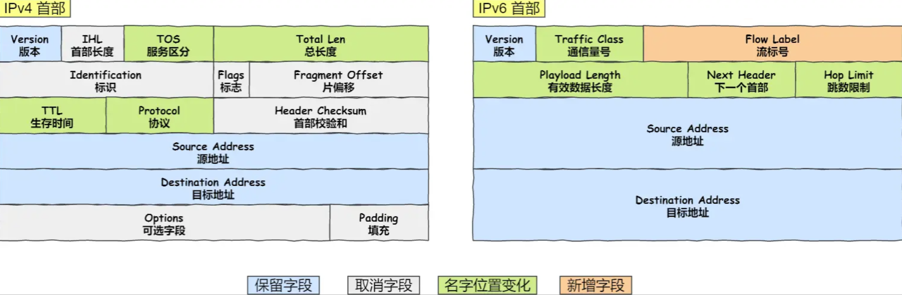


# 操作系统

## 中断处理过程

操作系统

中断是系统用来响应硬件设备请求的一种机制，操作系统收到硬件的中断请求，会打断正在执行的进程，保存当前进程的寄存器信息，然后调用内核中的中断处理程序来处理中断。保护现场的时候还会关中断/开中断。

## 软中断

中断处理程序在响应中断时，可能还会临时关闭中断。这意味着，在当前中断程序没有执行完之前，系统中其他中断请求都无法响应，所以中断处理程序必须要短而快，否则会丢失中断。

Linux系统为了解决中断处理程序执行过长和中断丢失的问题，将中断分为两个阶段。

1. 快速处理中断，关中断，负责处理和硬件密切相关的事情
2. 处理上半部分未完成的工作，一般以内核线程的方式运行。

例如，网卡收到数据包后，通过DMA方式将数据写入内存，接着通过硬件中断告诉内核有新的数据到了，内核先禁止网卡中断，然后触发一个软中断，把处理复杂耗时的工作交给软中断处理程序：从内存中找到网络数据，再按照网络协议栈，对网络数据进行逐层解析和处理，最后把数据送给应用程序。

## 并发和并行

一段时间内执行多个任务（多个任务交替执行）

多个任务同时进行

## 进程与线程的区别

1. 调度。进程是资源分配的基本单位，而线程是CPU调度的基本单位
2. 状态。线程同样具有就绪，阻塞，执行三种基本状态。同样具有状态之间的转换关系。
3. 独立性。每个进程拥有独立的地址空间和资源，而线程共享他们所属进程的地址空间和资源。
4. 系统开销。线程能够减少并发执行的时间和空间开销

线程比进程能减少开销，体现在：

1. 线程创建不涉及资源管理信息，直接共享进程的。
2. 同一个进程内线程切换比进程快。线程共享虚拟内存空间，同一个进程内的线程都共享同一个页表，切换线程不需要切换页表。而进程切换需要。
3. 同一进程内各线程共享内存和文件资源，线程之间传递数据效率十分高，不需要经过内核了。

## **死锁**

在并发编程中，多个进程/线程因竞争资源而造成的一种互相等待的僵局，若无外力作用，这些进程都无法向前推进。 

## 产生死锁的条件

死锁的四个必要条件：

- 互斥条件
- 拥有并等待
- 不可剥夺条件
- 环路等待条件

## 如何实现死锁检测

​																																																																																																																																																																			

## 如何避免死锁

破坏死锁的四个必要条件之一即可。最常见的并且可行的就是**资源有序分配法，来破坏环路等待条件**。


# 数据库

## MySql B+树

## 数据库三大泛式

三大范式的作用是为了控制数据库的冗余，是对空间的节省，实际上，一般互联网公司的设计都是反范式的，通过冗余一些数据，避免跨表跨库，利用空间换时间，提高性能。

### 1NF

表中字段的数据，不可以再拆分。例如用户表，用户地址还可以拆分成国家、省份、市，这样才是符合第一范式的。

### 2NF

在第一范式的基础上，非主键列完全依赖于主键，而不能是依赖于主键的一部分，**消除了部分依赖**。

再通俗点讲就是，**一个表只能描述一件事情**。

| 学号 | 姓名 | 年龄 | 课程名称 | 成绩 | 学分 |
| ---- | ---- | ---- | -------- | ---- | ---- |
| 001  | 小张 | 28   | 语文     | 90   | 3    |
| 001  | 小张 | 28   | 数学     | 90   | 2    |
| 002  | 小黄 | 25   | 语文     | 90   | 3    |
| 002  | 小黄 | 25   | 语文     | 90   | 3    |
| 003  | 小高 | 22   | 数学     | 90   | 2    |

假设学号是表中的唯一主键，那由学号就可以确定姓名和年龄了，但是却不能确定课程名称和成绩。

一张学生表应该只存储学生信息就够了，不要再存储课程信息，交给课程表和成绩表来存储。

### 3NF

在满足第二范式的基础上，表中的非主键只依赖于主键，而不依赖于其他非主键。**消除了传递依赖**。

| 学号 | 姓名 | 班级          | 班主任 |
| ---- | ---- | ------------- | ------ |
| 001  | 小黄 | 一年级（1）班 | 高老师 |

这个表中，学号是主键，它可以唯一确定姓名、班级、班主任，符合了第二范式。但是在非主键中，也可以通过班级推断出班主任。


# 测试

## 软件开发中的测试流程

1. 需求分析和测试计划。在开始测试之前，测试团队需要仔细分析软件的需求文档，并制定测试计划。测试计划确定测试的范围，测试目标，测试策略，测试资源，测试时间表。
2. 单元测试。针对软件中最小的可测单元（方法/函数）。编写单测用例，选择合适的测试框架来执行这些测例。
3. 集成测试。将多个单元/组件/模块/子系统组合在一起进行测试，验证他们在集成时的交互和协作是否正常。
4. 系统测试。整个软件系统作为一个整体来测试，会执行一系列功能测试，性能测试，安全性测试，兼容性测试等，以确保软件系统满足预期的需求和质量标准。
5. 用户验收测试。有客户/用户执行，验证软件是否符合需求和期望。

